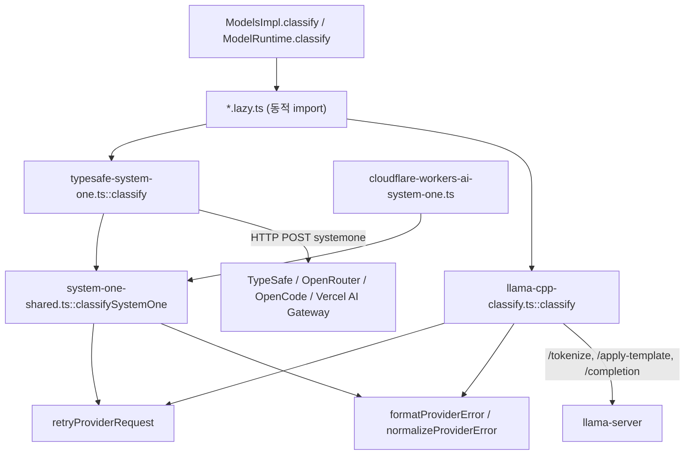
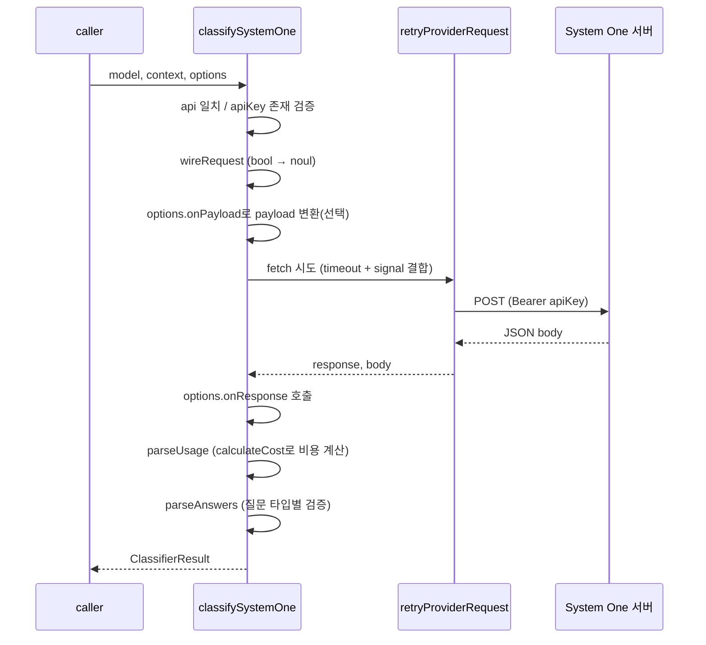
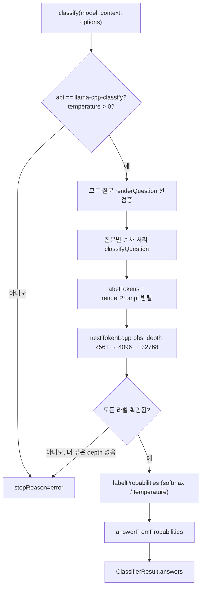

# classifier_apis 모듈

`classifier_apis`는 `packages/ai`의 **분류(classification) 전용 API 구현체** 두 개를 묶은 모듈이다. 채팅 완성(`complete`/`stream`)과 달리, 주어진 `state`(JSON)에 대해 `choice`/`score`/`bool` 질문의 답과 확률을 구조화된 `ClassifierResult`로 돌려준다.

| API ID | 파일 | 방식 |
|---|---|---|
| `typesafe-system-one` | `packages/ai/src/api/typesafe-system-one.ts` | TypeSafe System One 원격 프로토콜 호출 (OpenRouter 등도 동일 프로토콜) |
| `llama-cpp-classify` | `packages/ai/src/api/llama-cpp-classify.ts` | 로컬 `llama-server`의 다음 토큰 log-probability를 읽어 답 계산 |

두 구현 모두 `ClassifierFunction<ClassifierOptions>` 시그니처의 `classify(model, context, options)`를 `export`하며, 예외를 던지지 않고 `ClassifierResult.stopReason`(`"stop" | "error" | "aborted"`)과 `errorMessage`로 실패를 보고한다.

관련 모듈: 모델 조회/호출 진입점은 [model_registry](model_registry.md)(`ModelsImpl.classify`), 내장 provider 등록은 [builtin_providers_and_compat](builtin_providers_and_compat.md), 같은 계열의 Cloudflare 구현은 [cloudflare_and_pi_gateway_apis](cloudflare_and_pi_gateway_apis.md), 공용 유틸은 [ai_runtime_utils](ai_runtime_utils.md)를 참고한다.

---

## 1. 아키텍처

- `*.lazy.ts`(`typesafe-system-one.lazy.ts`, `llama-cpp-classify.lazy.ts`)가 `await import()`로 구현을 지연 로드한다 (코드 확인).
- `typesafe-system-one`은 `providers/typesafe.ts`, `openrouter.ts`, `opencode.ts`, `vercel-ai-gateway.ts`의 `classifiers` 맵에 등록된다 (코드 확인, grep).
- `KnownClassifierApi`(`packages/ai/src/types.ts`)는 `"typesafe-system-one" | "cloudflare-workers-ai-system-one" | "llama-cpp-classify"` 이다.

---

## 2. `typesafe-system-one` — `classify`

`typesafe-system-one.ts`는 `SystemOneTransport` 객체 하나만 정의하고 `classifySystemOne(transport, ...)`에 위임하는 얇은 어댑터다. 실제 로직은 `system-one-shared.ts`에 있으며 Cloudflare 구현과 공유된다.

| 필드 | 값 |
|---|---|
| `api` | `"typesafe-system-one"` |
| `label` | `"System One API"` (에러 메시지용) |
| `url` | `new URL("systemone", baseUrl + "/")` (끝 `/` 정규화) |
| `payload` | `{ model: model.id, ...request }` |
| `output` | 응답이 객체인지만 검증 후 그대로 반환 |

### `classifySystemOne` 처리 흐름

핵심 동작 (모두 코드 확인):

- **API 키 필수**: `options.apiKey`가 없으면 `No API key for provider: ...` 오류.
- **bool ↔ noul 매핑**: 공개 타입 `bool`은 전송 시 `noul`로 바뀌고, 응답의 `answer.noul` 값이 `{ type: "bool", probability }`가 된다.
- **응답 검증**: `choice`는 `choice`/`probabilities`/`confidence`, `score`는 `score`/`confidence`를 숫자 유한성까지 검사한다. 질문마다 답이 없으면 오류.
- **사용량**: `{ input_tokens, output_tokens }`를 `Usage`로 만들고 `calculateCost`로 가격을 계산한다. usage가 없거나 형식이 틀려도 결과는 실패하지 않는다. 답 파싱 전에 설정하므로 잘못된 답이 와도 과금 정보는 남는다.
- **타임아웃/재시도**: `options.timeoutMs`는 `AbortSignal.timeout`으로, 사용자 `signal`과 `AbortSignal.any`로 결합한다. 타임아웃은 `TimeoutError`로 변환되며 `maxRetries` 기본값은 2이다.

---

## 3. `llama-cpp-classify` — `classify`

모델이 텍스트를 **생성하지 않고**, 각 질문을 한 번의 채팅 프롬프트로 만든 뒤 다음 토큰 후보의 log-probability에서 정답 라벨 토큰만 골라 softmax를 계산한다.

### 라벨 규칙

| 질문 타입 | 라벨 | 개수 제한 | 결과 |
|---|---|---|---|
| `choice` | `A-Za-z0-9` (62개) | 2~62 | `choice`, `probabilities`, `confidence` |
| `score` | `0`~`9` | 2~10 | 확률 가중 평균 `score`, `confidence` |
| `bool` | `Yes`/`No` | 고정 | `probability` = P(Yes) |

개수 범위를 벗어나면 `questionLabels`가 오류를 던진다. `classify`는 **첫 요청 전에 모든 질문을 `renderQuestion`으로 선검증**한다.

### 서버 엔드포인트

- `/tokenize`: 라벨의 토큰 ID 조회. 개행 뒤에 라벨을 붙여 토크나이즈하여 선행 공백 마커 문제를 피하고, 실패하면 라벨 단독으로 재시도한다. 단일 토큰이 아니면 오류. 결과는 `labelTokenCache`(서버 root + 모델 ID + 라벨 키)에 Promise로 캐시하며 실패 시 제거한다.
- `/apply-template`: 모델 자체 채팅 템플릿 적용 (`enable_thinking: false`). 프롬프트가 `<think>`로 끝나면 `</think>`를 붙여 빈 추론 블록으로 닫는다.
- `/completion`: `n_predict: 1`, `n_probs: depth`, `post_sampling_probs: false`, `cache_prompt: true`, `temperature: 0`.

### 처리 흐름

### 설계 포인트 (코드 확인)

- **프롬프트 구성**: `state` → 전체 질문 개요 → `state` 재삽입 → 현재 질문(라벨 포함). 인과 모델이 질문을 알고 두 번째 state를 읽도록 하는 prompt repetition이다. 마지막 질문 전까지 내용이 동일하므로 서버 prompt cache가 한 번만 평가한다. 그래서 질문을 병렬이 아닌 **순차** 처리한다.
- **프롬프트 주입 방어**: `SYSTEM_PROMPT`가 state 안의 지시를 따르지 말고 데이터로만 판단하라고 지시한다.
- **depth 확대**: 첫 `n_probs`는 `max(256, 16 × 라벨수)`. 라벨이 top 목록에 없으면 4096, 32768로 재시도하고, 그래도 없으면 오류.
- **언더플로**: 모든 logprob이 `-1e30` 이하이면 오류 (`UNDERFLOW_LOGPROB`).
- **확률/신뢰도**: `labelProbabilities`는 `logprob / temperature`의 softmax(기본 temperature 1). `peakConfidence`는 `(n·peak − 1)/(n − 1)`을 [0, 1]로 clamp한다 (TypeSafe 문서화된 choice confidence 식).
- **URL**: `llamaServerRoot`가 base URL의 끝 `/`와 `/v1`을 제거한다. router 모드에서는 모든 요청 본문에 `model` ID를 실어 보낸다.
- **인증**: `options.apiKey`가 있으면 Bearer 헤더를 붙이지만 필수는 아니다(로컬 서버). System One 구현과 대비된다.
- **훅**: `onPayload`/`onResponse`는 `/completion` 요청에만 적용된다 (`observe = true`). `/tokenize`, `/apply-template`은 제외.
- **usage 없음**: 이 구현은 `ClassifierResult.usage`를 채우지 않는다.

---

## 4. 두 구현 비교

| 항목 | `typesafe-system-one` | `llama-cpp-classify` |
|---|---|---|
| 확률 출처 | 서버가 계산해 반환 | 클라이언트가 logprob에서 계산 |
| 요청 수 | 요청당 1회 | 질문당 `/apply-template` + `/completion` + 토큰화 |
| API 키 | 필수 | 선택 |
| usage/비용 | 파싱 후 `calculateCost` | 없음 |
| 공유 코드 | `system-one-shared.ts` | 자체 구현 (`httpError`, `timeoutError`, `post` 중복) |
| 질문 상한 | 서버 정의 | choice 62, score 10 |

공통 에러 규약: 두 구현 모두 `HttpError`(status, headers, body)를 만들어 `retryProviderRequest`가 재시도 여부를 판단하게 하며, 최종 오류는 `formatProviderError(normalizeProviderError(error), ...)`로 정리한다.

---

## 5. 테스트/빌드 참고

`packages/ai/vitest.config.ts`는 `packages/ai` 테스트 설정이다. 이 모듈 전용 설정은 별도로 확인하지 못했다 (미확인).

## 검증 수준

| 내용 | 수준 |
|---|---|
| 위 모든 동작 서술 (제공된 두 파일 + `system-one-shared.ts`) | 코드 확인 |
| provider 등록 위치, `.lazy.ts` 구조 | 코드 확인 (grep 결과; `.lazy.ts`는 한 줄 단위로만 확인) |
| 실제 서버와의 동작, 실행 | 미확인 |
