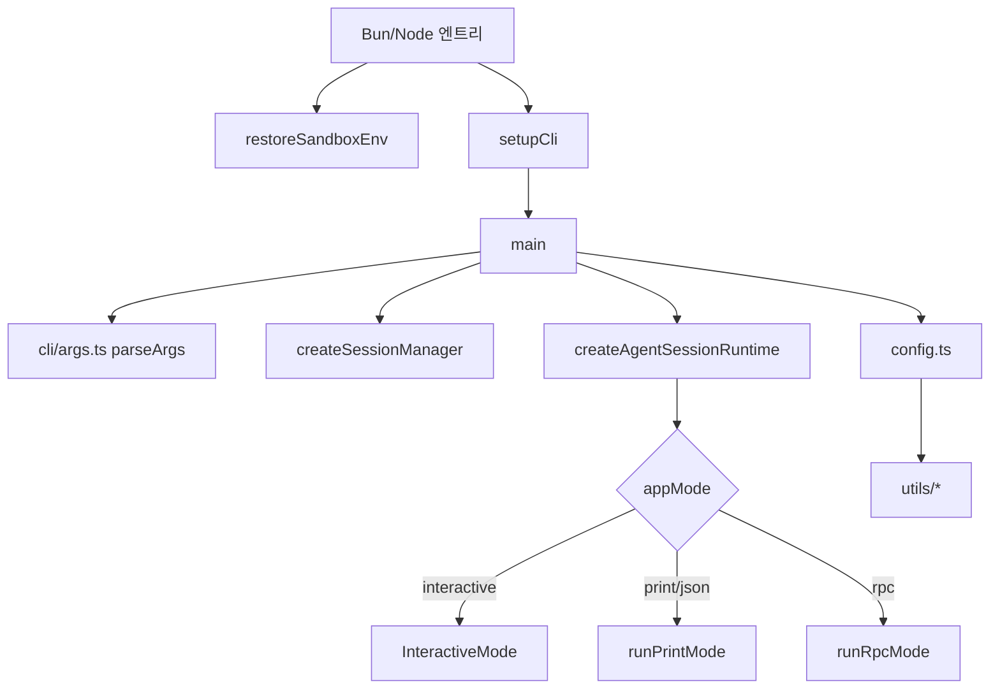
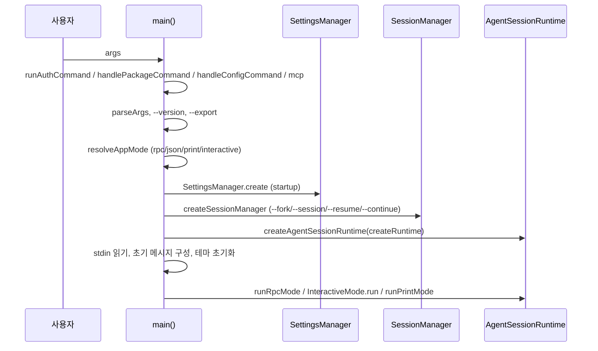

# cli_entry_and_config

## 개요

`packages/coding-agent`의 CLI 진입점과 설정/경로/런타임 유틸리티를 담당하는 모듈이다. 인자를 파싱해 실행 모드(interactive / print / json / rpc)를 결정하고, 세션·설정·모델 런타임을 조립해 해당 모드로 넘긴다. 실제 무거운 작업은 하위 코어(`agent_session_core` 등)가 수행한다.

검증 수준: 제공된 소스 코드 기준 `코드 확인`. 이 문서에 나오지 않은 호출 관계는 `미확인`.

## 구성 요소

| 파일 | 핵심 심볼 | 역할 |
|---|---|---|
| `packages/coding-agent/src/main.ts` | `main` | CLI 전체 오케스트레이션 |
| `packages/coding-agent/src/cli/setup.ts` | `setupCli` | 프로세스 초기화 (`process.title`, `PI_CODING_AGENT`, `AI_AGENT`, undici 설정) |
| `packages/coding-agent/src/bun/restore-sandbox-env.ts` | `restoreSandboxEnv` | Bun 샌드박스에서 비어 있는 `process.env`를 `/proc/self/environ`으로 복구 |
| `packages/coding-agent/src/config.ts` | `getModelsPath`, `getPackageJsonPath`, `getPromptsDir`, `getToolsDir`, `getUpdateInstruction`, `setEmbeddedQuickJSWasmPath`, `PackageJson` | 설치 방식 감지, 패키지 에셋 경로, `~/.pi/agent/*` 사용자 경로, 앱 이름/버전 |
| `packages/coding-agent/src/utils/version-check.ts` | `getLatestPiVersion` | `https://pi.dev/api/latest-version` 조회 및 semver 비교 |
| `packages/coding-agent/src/utils/pi-user-agent.ts` | `getPiUserAgent` | `pi/<version> (<platform>; <runtime>; <arch>)` 문자열 |
| `packages/coding-agent/src/utils/tools-manager.ts` | `ToolConfig` | `fd`, `rg` 탐색 및 GitHub release 다운로드 |
| `packages/coding-agent/src/utils/shell.ts` | `getPowerShellConfig` | 셸 탐색(bash/PowerShell), 프로세스 트리 종료 |
| `packages/coding-agent/src/utils/paths.ts` | `canonicalizePath` | 경로 정규화(`~`, `@`, `file://`, Windows 셸 경로) |
| `packages/coding-agent/src/utils/abort.ts` | `operationSignal`, `raceWithAbortSignal` | AbortSignal 유틸 |
| `packages/coding-agent/src/utils/image-convert.ts` | `convertToPng` | 터미널 표시용 PNG 변환 (Photon) |
| `packages/coding-agent/src/utils/image-resize.ts`, `image-resize-worker.ts` | `ResizeImageWorkerRequest`, `ResizeImageWorkerResponse`, `isResizeImageWorkerRequest` | 워커 스레드 이미지 리사이즈, 실패 시 in-process 폴백 |
| `packages/coding-agent/vitest.config.ts` | — | 테스트 설정 (`PI_OFFLINE=1`, 워크스페이스 alias) |

## 아키텍처

## `main` 실행 흐름

주요 동작:

- **모드 결정** (`resolveAppMode`): `--mode rpc|json` 우선, `--print` 또는 stdin/stdout이 TTY가 아니면 `print`, 그 외 `interactive`. 파이프 stdin이 있으면 interactive도 `print`로 전환된다. 비-interactive 모드는 `takeOverStdout()`로 stdout을 점유한다.
- **서브커맨드**: `auth`(`runAuthCommand`), 패키지/설정 명령, `mcp`는 일반 파싱 전에 처리된다.
- **세션 선택** (`createSessionManager`): `--no-session`, `--fork`, `--session`(ID 접두사 또는 경로, 다른 프로젝트면 fork 확인), `--resume`(선택 UI), `--continue`, `--session-id`. `--fork`와 `--session/--continue/--resume/--no-session` 충돌은 `validateForkFlags`가 막는다.
- **프로젝트 신뢰**: `createRuntime` 팩토리가 cwd별로 신뢰 여부를 결정(`ProjectTrustStore`, `resolveProjectTrusted`)한 뒤 `SettingsManager`와 서비스를 생성한다. 세션 cwd가 정해진 뒤에야 프로젝트 로컬 설정이 해석된다.
- **모델/도구 옵션** (`buildSessionOptions`): `--provider/--model`, `--model pattern:thinking`, scoped models, `--thinking`, `--no-tools`/`--tools`/`--exclude-tools`, `--api-key`(런타임 한정 키).
- **오프라인**: `--offline` 또는 `PI_OFFLINE`이면 `PI_SKIP_VERSION_CHECK`도 설정한다.

## config.ts

- **설치 방식 감지** `detectInstallMethod()`: `bun-binary | npm | pnpm | yarn | bun | unknown`. `getSelfUpdateCommand`/`getUpdateInstruction`이 방식별 업데이트 명령을 만든다(전역 패키지 관리자 소유이고 쓰기 가능할 때만).
- **에셋 경로**: `getPackageDir`(`PI_PACKAGE_DIR` 우선), `getThemesDir`, `getExportTemplateDir`, `getInteractiveAssetsDir` 등은 Bun 바이너리/Node `dist`/소스 `src`를 구분한다. `setEmbeddedQuickJSWasmPath`는 Bun 엔트리가 주입하는 임베디드 QuickJS wasm 경로다.
- **앱 설정**: `package.json`의 `piConfig`에서 `APP_NAME`, `CONFIG_DIR_NAME`, `VERSION`을 읽는다. 환경 변수 이름은 `${APP_NAME.toUpperCase()}_CODING_AGENT_DIR` 형태(`ENV_AGENT_DIR`, `ENV_SESSION_DIR`).
- **사용자 경로**: `getAgentDir()`(기본 `~/.pi/agent`) 아래 `models.json`, `auth.json`, `settings.json`, `tools/`, `bin/`, `prompts/`, `sessions/`, `themes/`.

## 유틸리티 요약

- **버전 확인**: `getLatestPiRelease`가 `PI_OFFLINE`이면 건너뛰고, `checkForNewPiVersion`은 `PI_SKIP_VERSION_CHECK`도 존중하며 오류를 삼킨다.
- **tools-manager**: `getToolPath` 순서는 `bin/` 디렉터리 → 시스템 PATH → (`ensureTool`) 다운로드. 오프라인/Android(Termux)에서는 다운로드하지 않고 안내만 한다. 최신 버전은 API 쿼터를 피하려고 `releases/latest` 리다이렉트로 해석한다.
- **shell**: `getShellConfig` 순서는 사용자 `shellPath` → (Windows) Git Bash → PATH의 bash → (Unix) `/bin/bash` → `sh`. `getPowerShellConfig`는 Windows 전용(`pwsh.exe` 우선).
- **이미지**: `resizeImage`는 워커 스레드(Photon WASM)로 TUI 이벤트 루프 블로킹을 피하고, 로딩 실패 시 `resizeImageInProcess`로 폴백한다. `convertToPng`는 Kitty 그래픽 프로토콜용 PNG 변환.
- **abort**: `raceWithAbortSignal`은 abort 시 대기를 중단하되 버려진 작업의 rejection을 흡수한다.

## 테스트 설정

`packages/coding-agent/vitest.config.ts`는 `globals`, `environment: "node"`, `testTimeout: 30000`, `env: { PI_OFFLINE: "1" }`을 설정하고 `@earendil-works/pi-ai` 등을 워크스페이스 소스로 alias한다. 네트워크가 필요한 테스트는 `allowNetwork()`로 옵트인한다.

## 관련 모듈

이 모듈은 상위 `coding_agent_session_and_configuration`의 하위 모듈이다. 형제 모듈 문서는 별도로 생성되며, 이 문서에서 상세 내용을 중복하지 않는다.

- `agent_session_core`: `AgentSessionRuntime`, `AgentSession`
- `session_persistence_and_compaction`: `SessionManager`
- `settings_and_keybindings`: `SettingsManager`
- `model_and_auth_management`: `ModelRuntime`, `AuthStorage`
- `user_interface_modes`: `InteractiveMode`, `runPrintMode`, `runRpcMode`
- `extensibility_and_tooling`: 확장, MCP, 내장 도구

하위 모듈 분리는 하지 않았다. 파일들이 한 흐름(`main` + 유틸)이며 이 문서 하나로 충분하다.
