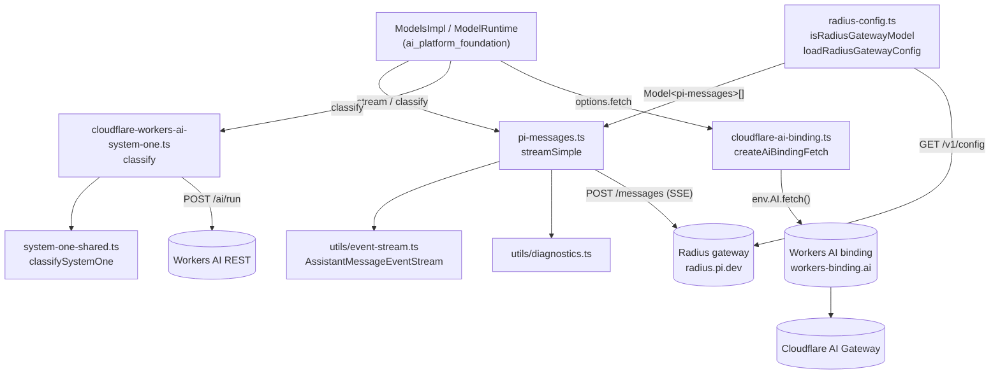
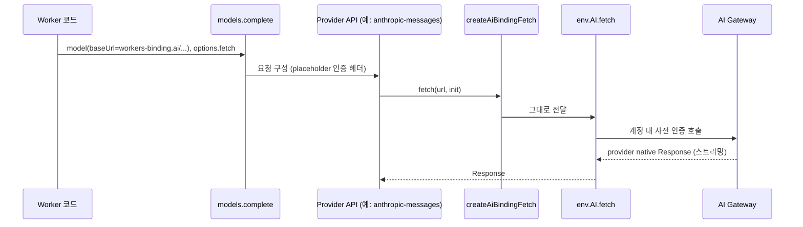
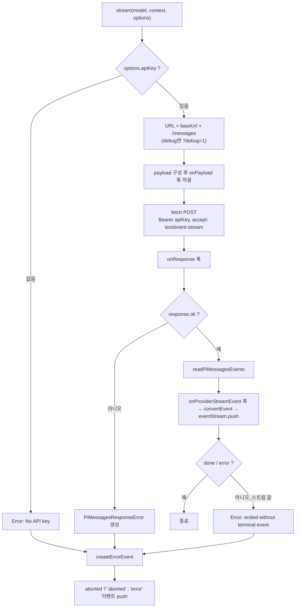
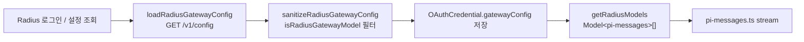

# cloudflare_and_pi_gateway_apis 모듈

## 개요

`cloudflare_and_pi_gateway_apis`는 [llm_provider_adapters](llm_provider_adapters.md)의 하위 모듈로, 두 종류의 "게이트웨이형" 백엔드를 다룬다.

1. **Cloudflare** 계열: Workers AI 바인딩(`env.AI.fetch()`)을 통한 AI Gateway 전송, Workers AI REST 엔드포인트를 통한 System One 분류.
2. **pi 자체 게이트웨이** 계열: `pi-messages` 프로토콜(Radius 게이트웨이가 사용하는 wire protocol)과 Radius 게이트웨이 모델 설정.

| 파일 | 핵심 컴포넌트 | 역할 |
|---|---|---|
| `packages/ai/src/api/cloudflare-ai-binding.ts` | `createAiBindingFetch` | Workers AI 바인딩을 `FetchFunction`으로 감싸는 어댑터 |
| `packages/ai/src/api/cloudflare-workers-ai-system-one.ts` | `cloudflareErrorMessage` | Workers AI REST 응답의 오류 메시지 정리 (System One 분류 transport) |
| `packages/ai/src/api/pi-messages.ts` | `streamSimple` | `pi-messages` SSE 스트리밍 API 구현 |
| `packages/ai/src/providers/radius-config.ts` | `isRadiusGatewayModel` | Radius 게이트웨이 `/v1/config` 응답의 모델 항목 검증 |

## 아키텍처



다른 어댑터(예: [anthropic_provider_api](anthropic_provider_api.md), [openai_provider_apis](openai_provider_apis.md))는 provider SDK에 의존하지만, 이 모듈은 SDK 없이 `fetch`와 표준 `Response`만 사용한다. 분류 API 공통 로직은 [classifier_apis](classifier_apis.md)와 같은 `system-one-shared.ts`를 공유한다.

## 컴포넌트 상세

### 1. `createAiBindingFetch` (`cloudflare-ai-binding.ts`)

**문제**: HTTPS 게이트웨이(`gateway.ai.cloudflare.com/v1/{account}/{gateway}/{provider}/...`)는 같은 계정의 Worker에서도 Cloudflare API 토큰을 요구한다.

**해법**: Worker는 `env.AI.fetch()`로 `https://workers-binding.ai/ai-gateway/gateways/{gateway}/{provider}/{endpoint...}` 경로를 호출한다. 이 경로는 HTTPS URL에서 account id만 빠진 동일 형태이며, 바인딩 채널이 신원을 보증한다. 따라서 요청을 재작성·버퍼링·재인코딩할 필요가 없다.

- `AiBinding`: `@cloudflare/workers-types`에 의존하지 않는 구조적 타입. `fetch`가 선택(optional)인 이유는 공개된 `Ai` 타입에 아직 선언돼 있지 않기 때문이다. `aiGatewayLogId`는 `AiGateway`나 임의의 `{ fetch }` 객체가 통과하지 못하게 하는 식별용 멤버다.
- `createAiBindingFetch(binding)`:
  - `binding.fetch`가 함수가 아니면 즉시 `TypeError`를 던진다(첫 추론 요청에서 늦게 실패하는 것을 방지).
  - `binding.fetch.bind(binding)`를 즉시 바인딩해 `(input, init) => bindingFetch(input, init)` 클로저를 반환한다. 메서드, 헤더, 쿼리, 바디 스트림이 그대로 전달된다.
- `CLOUDFLARE_GATEWAY_BINDING_AUTH_SENTINEL` (`"cloudflare-gateway-binding"`): API 구현체가 요구하는 인증 헤더 검사를 통과시키는 자리표시자 값이다. 게이트웨이는 바인딩 경로에서 `cf-aig-authorization`을 무시·제거한다. SDK의 기본 `Authorization`/`x-api-key`는 `null`로 지워야 한다. 그렇지 않으면 게이트웨이가 이를 BYOK 키로 취급해 저장된 키를 덮어쓴다.



사용 예(소스 주석 기준):

```ts
await models.complete(model, context, {
  headers: {
    "cf-aig-authorization": `Bearer ${CLOUDFLARE_GATEWAY_BINDING_AUTH_SENTINEL}`,
    Authorization: null,
    "x-api-key": null,
  },
  fetch: createAiBindingFetch(env.AI),
});
```

### 2. `cloudflareErrorMessage` (`cloudflare-workers-ai-system-one.ts`)

Workers AI REST(`POST /accounts/{account}/ai/run`, 바디 `{ model, input }`)용 System One 분류 transport를 정의한다. 모듈은 `classify`(`classifySystemOne(transport, ...)` 위임)를 export한다.

- `url`: `baseUrl` 끝의 `/`를 정리하고 `run`을 붙인다.
- `payload`: `{ model: model.id, input: request }`.
- `output`: Cloudflare API envelope 검증.
  - body가 객체가 아니면 `returned an unexpected response`.
  - `success === false`이면 `cloudflareErrorMessage(body.errors)`로 예외.
  - `result.state !== "Completed"`이면 `run did not complete (state: ...)`.
  - 성공 시 `result.result`(`{ answers, usage }`)를 반환.
- `cloudflareErrorMessage(errors)`: `errors` 배열에서 문자열 `message`만 추출해 `"Cloudflare Workers AI error: a; b"`로 합치고, 추출할 것이 없으면 `"Cloudflare Workers AI request failed"`를 반환한다.

### 3. `streamSimple` / `stream` (`pi-messages.ts`)

pi 자체 메시지 프로토콜 구현이다. 요청은 `<baseUrl>/messages`로 가는 단일 POST(`{ model, context, options }`)이고, 응답은 직렬화된 assistant-message 이벤트의 SSE 스트림이며 `done`/`error` 종료 이벤트로 끝난다. Radius 게이트웨이의 프로토콜이지만, `models.json` 커스텀 provider에서 `"api": "pi-messages"`로 지정하면 어떤 백엔드든 쓸 수 있다.

**주요 요소**

| 요소 | 설명 |
|---|---|
| `PiMessagesOptions` | `StreamOptions` + `reasoning`, `toolChoice`, `debug` |
| `PiMessagesEvent` | `start`, `text_*`, `thinking_*`, `toolcall_*`, `done`, `error` 유니온 |
| `PiMessagesRewriteImpact` | 서버측 메시지 재작성(게이트웨이 정책) 영향 요약 |
| `PiMessagesResponseError` | HTTP 오류 응답용 에러. `code`와 `diagnosticDetails` 보유 |
| `createEventConverter` | wire 이벤트를 누적 `partial: AssistantMessage`에 반영하며 `AssistantMessageEvent`로 변환 |
| `readPiMessagesEvents` | `ReadableStream`을 `\n\n` 경계로 잘라 `data:` 줄을 JSON 파싱하는 async generator |
| `resolveCacheRetention` | 옵션 값 우선, 없으면 `PI_CACHE_RETENTION=long` 환경값만 매핑 |

**처리 흐름**



**동작 세부**

- `stream`은 `AssistantMessageEventStream`을 즉시 반환하고, 비동기 IIFE에서 이벤트를 push한다. 예외는 던지지 않고 항상 `error` 이벤트로 변환된다. `signal.aborted`이면 `stopReason`은 `"aborted"`다.
- `toolcall_delta`는 JSON 조각을 `toolJson` 맵에 누적하고 `parseStreamingJson`으로 부분 파싱해 `arguments`를 점진 갱신한다. `toolcall_end`에서 최종 `toolCall`로 덮어쓰고 맵 항목을 삭제한다.
- `done`/`error`의 `providerThinkingLevel`, `rewrite`는 메시지에 반영된다. `rewrite`가 있으면 `pi_messages_rewrite` 진단이 추가된다.
- HTTP 오류: 본문이 `{ error: { message, code } }` 형태면 `"<status> <statusText>: <message> (<code>)"`로 포맷한다. 아니면 본문(최대 8192자 절삭)을 진단에 담고, `pi_messages_response_failure` 진단을 첨부한다.
- 헤더: `authorization: Bearer <apiKey>` 뒤에 `providerHeadersToRecord(options.headers)`가 병합되므로 호출자가 덮어쓸 수 있다. 전송 함수는 `options.fetch ?? globalThis.fetch`이며, 위 `createAiBindingFetch`와 조합 가능하다.
- `streamSimple`은 `SimpleStreamOptions`를 받아 `reasoning`, `toolChoice`, `debug`만 명시적으로 `stream`에 전달하는 얇은 래퍼다. (`debug`는 `SimpleStreamOptions`에 없어 형변환으로 읽는다.)

### 4. `isRadiusGatewayModel` (`radius-config.ts`)

Radius 게이트웨이(`DEFAULT_RADIUS_GATEWAY = "https://radius.pi.dev"`)의 `GET /v1/config` 응답과 OAuth 자격증명에 저장된 `gatewayConfig`를 정리한다. `isRadiusGatewayModel`은 type guard로, 다음을 모두 만족해야 한다: `id`/`name` 문자열, `reasoning` 불리언, `input` 배열, `cost`가 배열이 아닌 객체, `contextWindow`/`maxTokens` 숫자.

관련 함수(동일 파일, 문서 대상 컴포넌트는 아니지만 흐름 이해에 필요):

- `sanitizeRadiusGatewayConfig`: `baseUrl`(문자열)과 `models`(배열)를 확인하고 `isRadiusGatewayModel`로 유효 모델만 복사한다. 잘못된 항목은 조용히 제외된다.
- `normalizeRadiusGatewayUrl`: 스킴이 없으면 `https://`를 붙이고 끝의 `/`를 제거한다.
- `getRadiusCredentialConfig` / `getRadiusModels` / `getRadiusModelsFromConfig`: OAuth 자격증명의 `gatewayConfig`에서 `Model<"pi-messages">[]`(`api: "pi-messages"`, `provider`, `baseUrl` 주입)를 만든다.
- `loadRadiusGatewayConfig(gateway, apiKey?, signal?)`: `/v1/config`를 조회한다. 실패 시 상태와 512자 절삭 본문을 담은 에러를 던지고, 형식이 잘못되면 `Invalid Radius config`를 던진다.



## 모듈 간 관계

- 상위: [llm_provider_adapters](llm_provider_adapters.md) — provider API 구현 모음.
- 모델 레지스트리/요청 변환: [model_registry](model_registry.md)가 `Model<"pi-messages">`를 포함한 모델을 해석해 이 모듈의 `streamSimple`을 호출한다.
- 인증: Radius OAuth 자격증명 저장은 [auth_core](auth_core.md), [oauth_flows](oauth_flows.md) 참고. 코딩 에이전트 쪽 Radius 릴레이는 [experimental_radius_relay](experimental_radius_relay.md)에서 같은 게이트웨이 개념을 사용한다.
- 이벤트 스트림/진단 유틸: [ai_runtime_utils](ai_runtime_utils.md).
- 분류 공통 구현: [classifier_apis](classifier_apis.md).

## 유의사항

- 바인딩 경로를 쓸 때 `Authorization: null`, `x-api-key: null`을 빠뜨리면 SDK의 placeholder 키가 BYOK로 오인되어 게이트웨이 저장 키를 덮어쓴다.
- `pi-messages`는 `apiKey`가 없으면 요청 전에 실패한다. 바인딩 같은 사전 인증 환경에서는 자리표시자 키가 필요하다(`apiKey` 자체의 sentinel 규약은 소스에서 직접 확인되지 않음 — 미확인).
- `AiBinding.fetch`의 optional 표기와 런타임 검사는 `@cloudflare/workers-types`가 `fetch`를 선언하면 제거될 예정이다(소스 주석).
- `cloudflare-workers-ai-system-one.ts`의 `classify`는 공개 `bool` 값을 wire-level `noul`로 매핑한다고 주석에 적혀 있으며, 실제 매핑은 `system-one-shared.ts`에서 이뤄진다(해당 파일은 본 문서 범위 밖, 미확인).
