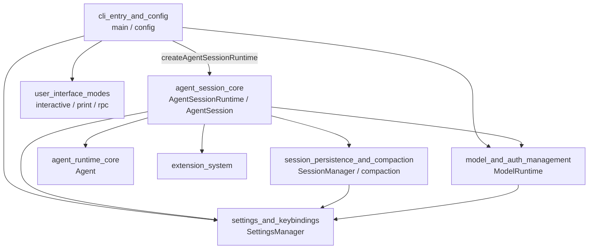
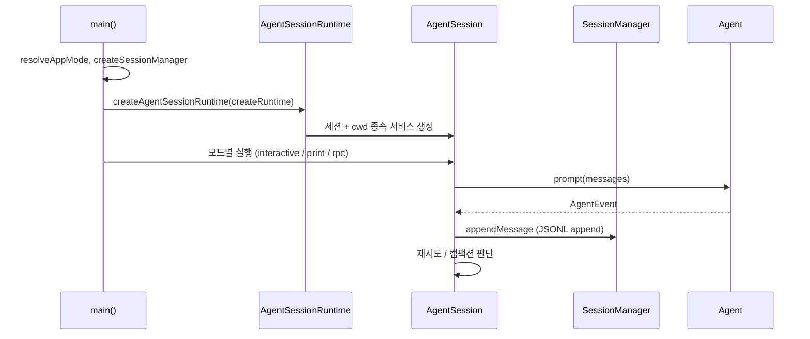

# coding_agent_session_and_configuration 모듈 개요

## 1. 목적

`packages/coding-agent/src` 아래에서 **CLI 진입점부터 세션 생명주기, 영속화·컴팩션, 설정·키 바인딩, 모델·인증 관리까지**를 담당하는 코어 모듈이다. 인자를 파싱해 실행 모드(interactive / print / json / rpc)를 정하고, 세션과 설정, 모델 런타임을 조립한다. 이후 저수준 `Agent`(`packages/agent`)를 감싼 `AgentSession`이 프롬프트, 재시도, 컴팩션, 도구 로드아웃을 조율한다. 각 UI 모드는 이 코어 위에 입출력 계층만 얹는다.

검증 수준: 하위 문서 5개를 읽고 정리했다(`코드 확인`은 각 문서의 기록을 따름). 하위 문서에 없는 호출 관계는 `미확인`이다.

## 2. 하위 모듈 구성

| 하위 모듈 | 경로 | 역할 |
|---|---|---|
| `cli_entry_and_config` | `src/main.ts`, `src/config.ts`, `src/cli/`, `src/utils/` | 모드 결정, 세션 선택, 프로젝트 신뢰, 설치 방식·에셋 경로, 셸·이미지·경로 유틸 |
| `agent_session_core` | `src/core/agent-session.ts` 외 | `AgentSession`, `AgentSessionRuntime`, `CacheWarmer`, 시스템 프롬프트, 중첩 도구 호출 |
| `session_persistence_and_compaction` | `src/core/session-manager.ts`, `src/core/compaction/` | append-only 트리 JSONL 세션, 컨텍스트 투영, 컴팩션, 브랜치 요약 |
| `settings_and_keybindings` | `src/core/settings-manager.ts`, `keybindings.ts` 외 | 전역/프로젝트 2계층 설정, 키 바인딩, 슬래시 명령, 스킬 로딩, 설정값 해석 |
| `model_and_auth_management` | `src/core/` (`model-runtime.ts`, `auth-storage.ts` 등) | 모델 카탈로그, 프로바이더 합성, 자격 증명 저장, 모델 선택, HTTP dispatcher |

## 3. 아키텍처

### 3.1 모듈 의존 관계

### 3.2 시작부터 프롬프트 처리까지

## 4. 핵심 설계 요점

- **모드 결정**: `--mode rpc|json`이 우선이다. `--print`나 TTY가 아닌 입출력이면 `print`, 그 외는 `interactive`다.
- **세션 교체**: `AgentSessionRuntime`의 `switchSession`, `newSession`, `fork`, `importFromJsonl`은 모두 같은 순서를 따른다. `session_before_*` 이벤트(취소 가능), teardown, 저장된 `createRuntime` 팩토리로 새 런타임 생성, 재바인딩 순이다.
- **append-only 세션 트리**: 모델에 보내는 컨텍스트는 leaf에서 root까지의 경로를 투영해 만든다. 컴팩션 후에도 원본 엔트리는 파일에 남는다.
- **신뢰 기반 설정**: 프로젝트 설정(`<cwd>/.pi/settings.json`)은 신뢰된 경우에만 로드된다. 전역 설정과는 `deepMergeSettings`로 병합하며, 프로젝트 값이 우선한다.
- **프로바이더 3계층 합성**: `composeModelProvider`가 빌트인, `models.json`, 확장 `ProviderConfigInput` 순으로 합친다. 자격 증명은 `auth.json`(파일 락)과 메모리 오버레이(`RuntimeCredentials`)로 분리한다.

## 5. 핵심 컴포넌트 문서

- [cli_entry_and_config](cli_entry_and_config.md): `main`, `setupCli`, `config.ts`와 CLI 유틸
- [agent_session_core](agent_session_core.md): `AgentSession`, `AgentSessionRuntime`, `CacheWarmer`
- [session_persistence_and_compaction](session_persistence_and_compaction.md): `SessionManager`, `compaction.ts`, `branch-summarization.ts`
- [settings_and_keybindings](settings_and_keybindings.md): `SettingsManager`, `KeybindingsManager`, 스킬, 설정값 해석
- [model_and_auth_management](model_and_auth_management.md): `ModelRuntime`, `AuthStorage`, `ModelRegistry`, `model-resolver`

연관 모듈: `agent_runtime_core`(저수준 `Agent`), `extensibility_and_tooling`(확장·도구), `user_interface_modes`(interactive / rpc), `ai_platform_foundation`(`model_registry`, `auth_core`, `oauth_flows`).