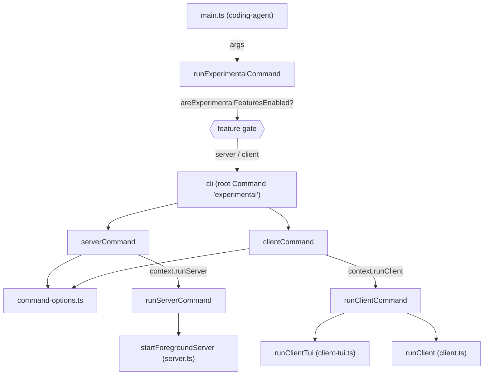
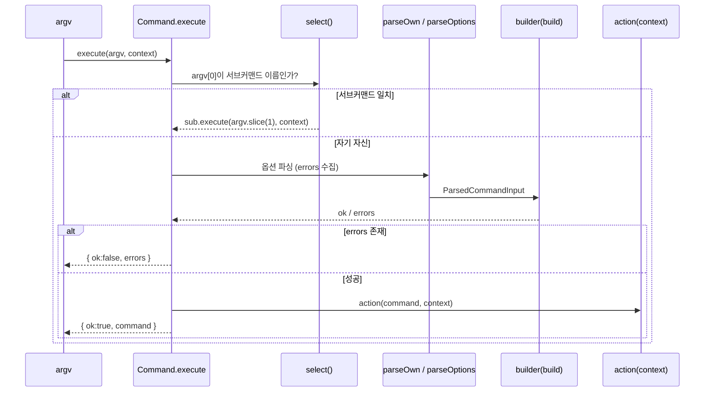
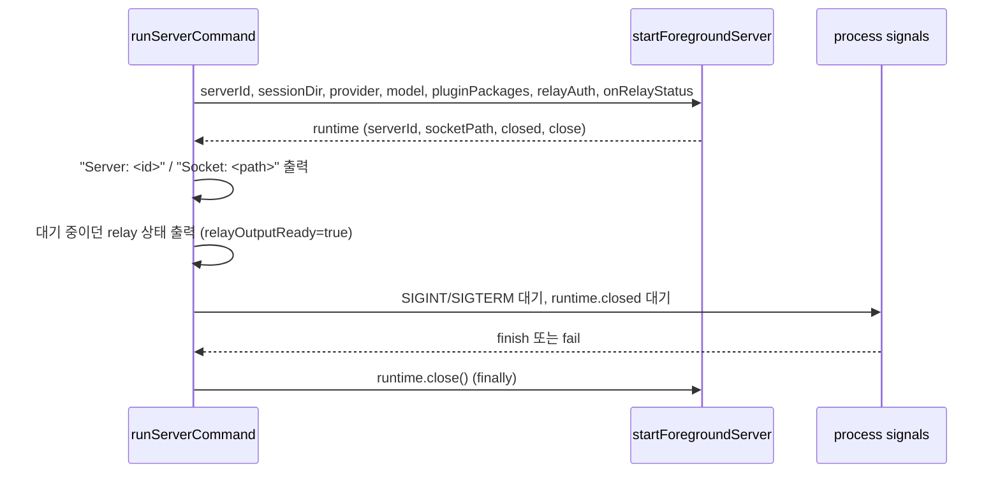
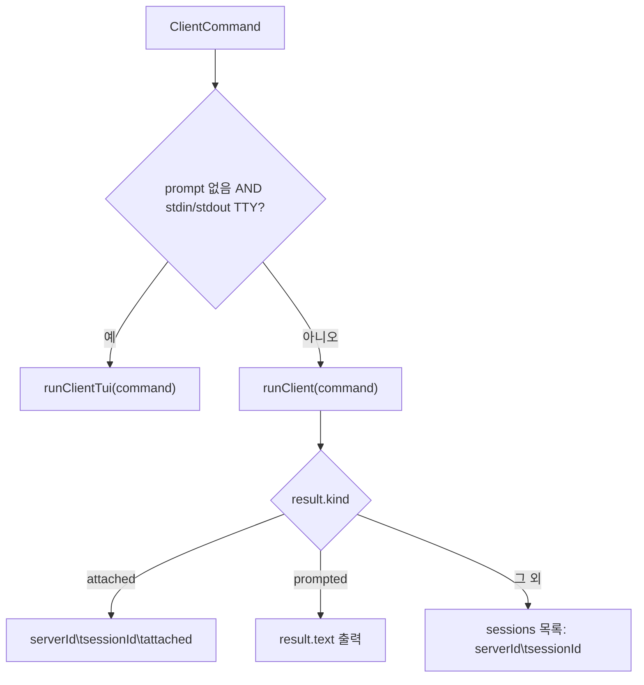

# experimental_cli 모듈

`experimental_cli`는 `pi`의 개발 전용 `server` / `client` 서브커맨드를 위한 **명령줄 파싱·디스패치 계층**이다. 작은 자체 구현 커맨드 프레임워크(`Command`)로 인자를 타입 안전하게 파싱하고, 파싱 결과를 실제 런타임(서버 프로세스, 클라이언트 TUI)에 연결한다.

- 소스 위치: `packages/coding-agent/src/cli/experimental/*`, `packages/coding-agent/src/experimental/commands.ts`
- 상위 모듈: `experimental_distributed_runtime`
- 게이트: `areExperimentalFeaturesEnabled()`가 true일 때만 동작하며, 발행(published) 엔트리포인트는 `commands.ts`를 import하면 안 된다(주석: "Development-only command dispatch").

## 1. 구성 요소

| 파일 | 역할 |
|---|---|
| `cli/experimental/command.ts` | 범용 `Command` 클래스, `CommandOption`, `stringOption` / `flagOption` / `valueOption` |
| `cli/experimental/command-options.ts` | 공용 옵션: `--connect`, `--auth-token`, `--auth-token-file`; `parseAuth`, `parseTransportAddress`, `unsupportedOptions` |
| `cli/experimental/commands/server.ts` | `server` 서브커맨드 정의, `ServerCommand` / `ServerCommandContext` |
| `cli/experimental/commands/client.ts` | `client` 서브커맨드 정의, `ClientCommand` / `ClientCommandContext` |
| `cli/experimental/cli.ts` | 루트 `experimental` 커맨드 + 두 서브커맨드를 조합한 `cli`, `CliContext` |
| `experimental/commands.ts` | `runExperimentalCommand`(진입점), `runServerCommand`, `runClientCommand` |

## 2. 아키텍처

런타임 측 상세는 다음 문서를 참고한다.
- 서버/코디네이터/세션 워커: [experimental_server_and_coordination](experimental_server_and_coordination.md)
- Radius 릴레이 및 인증: [experimental_radius_relay](experimental_radius_relay.md)
- 클라이언트 TUI 및 서비스: [experimental_services_and_client](experimental_services_and_client.md)
- 상위 모듈 개요: [experimental_distributed_runtime](experimental_distributed_runtime.md)

## 3. `Command` 프레임워크 (`command.ts`)

제네릭 `Command<TOwnInvocation, TContext, TInvocation>`는 다음 세 가지 타입 파라미터를 가진다.
- `TOwnInvocation`: 이 커맨드 자신이 만들어내는 호출 객체(`{ command: string, ... }`)
- `TContext`: `action`이 받는 실행 컨텍스트(의존성 주입용 인터페이스)
- `TInvocation`: 하위 커맨드까지 합친 호출 객체의 유니온

`.command(sub)`는 컨텍스트를 `TContext & TSubcommandContext`로, 호출 유니온을 `TInvocation | TSubcommandInvocation`으로 확장한다. 그래서 `CliContext = ServerCommandContext & ClientCommandContext`가 된다.

### 빌더 API

| 메서드 | 설명 |
|---|---|
| `option(opt)` | 옵션 등록. 중복 이름이면 `Error` |
| `build(fn)` | `ParsedCommandInput` → `{ ok, command }` 또는 `{ ok: false, errors }` |
| `action(fn)` | 파싱 성공 후 `(command, context)`로 실행 |
| `command(sub)` | 하위 커맨드 등록(중복 시 `Error`) |
| `parse(argv)` | 실행 없이 파싱만 |
| `execute(argv, context)` | 파싱 + `action` 호출 |

### 옵션 파싱 규칙 (`parseOptions`)

- 인자를 앞에서부터 읽다가 **등록되지 않은 인자를 만나면 그 지점부터 전부 `remainingArgs`로 넘기고 중단**한다. `--`도 동일하게 그 이후(`--` 포함)를 `remainingArgs`로 보낸다.
- `--name=value`와 `--name value` 두 형태를 지원한다. 다음 토큰이 `-`로 시작하면 값으로 쓰지 않으므로 `requires a value` 오류가 된다.
- 플래그 옵션(`flagOption`)에 `=value`를 주면 `does not take a value` 오류.
- `repeatable`이 아닌 옵션을 두 번 쓰면 `may only be specified once`.
- 오류는 즉시 던지지 않고 `errors` 배열에 모아, 빌더 오류와 합쳐 한 번에 반환한다.

주의: `parseOwn`은 `builder`가 없으면, `execute`는 `action`이 없으면 `Error`를 던진다(구성 오류이지 사용자 입력 오류가 아님).

## 4. 공용 옵션 (`command-options.ts`)

### `--connect` 주소 (`parseTransportAddress`)

`TransportAddress = UnixTransportAddress | RadiusTransportAddress`.

| 형태 | 결과 | 검증 |
|---|---|---|
| `unix:///abs/path` | `{ transport: "unix", path }` | authority 금지, `unix:////` 금지, query/fragment 금지, `url.href === value`, `decodeURIComponent` 후 NUL 불가, 절대 경로 필수 |
| `radius://<serverId>` | `{ transport: "radius", serverId }` | username/password/port/path/query/hash 금지, `isServerId`(소문자 UUIDv4) |
| 그 외 | 오류 | `Unsupported --connect transport` |

### 인증 (`parseAuth`)

`--auth-token`과 `--auth-token-file`은 상호 배타적이며 `AuthInput`(`{type:"token"}` 또는 `{type:"file"}`)으로 변환된다. 둘 다 없으면 `auth`는 `undefined`.

### `unsupportedOptions`

`remainingArgs`가 남아 있으면 "기존 CLI 옵션을 아직 지원하지 않는다"는 오류를 반환한다. 즉 experimental 커맨드는 기존 `pi` CLI 플래그와 호환되지 않는다.

## 5. 서브커맨드

### `server` (`ServerCommand`)

| 옵션 | 비고 |
|---|---|
| `--server-id` | 소문자 UUIDv4만 허용 |
| `--session-dir` | 세션 저장 디렉터리 |
| `--provider`, `--model` | `--provider`는 `--model` 필요 |
| `-e` (반복) | `pluginPackages` |
| `--auth-token` / `--auth-token-file` | Radius 릴레이 인증 |

남은 인자가 있으면 무조건 오류(`unsupportedOptions("server", ...)`).

### `client` (`ClientCommand`)

| 옵션 | 비고 |
|---|---|
| `--connect` | `TransportAddress` |
| `--session-id`, `--continue`/`-c`, `--resume`/`-r` | **셋 중 최대 하나** |
| `--provider`, `--model` | `--provider`는 `--model` 필요 |
| `-e` (반복) | `pluginPackages` |
| `--auth-token` / `--auth-token-file` | |
| 위치 인자 1개 | `prompt`. `--` 뒤이거나 `-`로 시작하지 않는 비어 있지 않은 단일 인자만 인정 |

위치 인자가 prompt로 인정되지 않는데 `remainingArgs`가 남아 있으면 `unsupportedOptions("client", ...)` 오류가 난다.

두 빌더 모두 정의된 값만 스프레드(`...(x === undefined ? {} : { x })`)하여 선택 필드를 생략한다.

## 6. 루트 `cli`와 디스패치

`cli.ts`의 루트 `experimental` 커맨드는 자체 빌더가 항상 `Expected experimental command: server or client` 오류를 반환한다. 따라서 `server`/`client`로 시작하지 않는 인자는 이 오류로 귀결된다. (단, 아래 `runExperimentalCommand`가 먼저 걸러낸다.)

### `runExperimentalCommand(args)` (`commands.ts`)

1. `areExperimentalFeaturesEnabled()`가 false이거나 `args[0]`이 `server`/`client`가 아니면 **`false` 반환**(호출자가 일반 CLI 경로로 진행).
2. 그렇지 않으면 `cli.execute(args, { runServer, runClient })` 실행.
3. 파싱 오류는 `Error: ...`(빨간색)로 출력하고 `process.exitCode = 1`. 예외도 동일하게 처리.
4. 처리했으므로 `true` 반환.

### `runServerCommand`

- Relay 상태 메시지는 헤더(`Server:`, `Socket:`) 출력 전에 도착하면 `pendingRelayStatus`에 보관했다가 헤더 이후에 출력한다. 상태 문구: `connected`, `not connected; local only`(`not_authenticated`), `reconnecting: <error>`(`retrying`). `connecting`과 직전과 같은 문구는 출력하지 않는다.
- 종료 조건: SIGINT/SIGTERM, 또는 `runtime.closed` settle. 시그널 리스너는 항상 정리하고 `finally`에서 `runtime.close()`를 호출한다.

### `runClientCommand`

TTY가 아니거나 prompt가 있으면 비대화형 경로로, 결과를 탭 구분 텍스트로 stdout에 출력해 스크립트에서 쓰기 쉽게 한다.

## 7. 설계 포인트

- **컨텍스트 주입**: 커맨드 정의(`server.ts`, `client.ts`)는 `runServer`/`runClient` 인터페이스에만 의존하고, 실제 구현은 `commands.ts`가 주입한다. 파서는 런타임(TUI, 서버)을 import하지 않으므로 단독 테스트가 가능하다.
- **오류 수집**: 파서와 빌더의 모든 검증 오류를 한 번에 사용자에게 보여준다.
- **좁은 문법**: 알 수 없는 옵션은 조용히 무시하지 않고 `remainingArgs`를 통해 명시적 오류가 된다(단, client의 단일 prompt는 예외).
- **개발 전용 격리**: 기능 플래그 확인 후에만 디스패치하며 발행 엔트리가 이 모듈에 의존하지 않는 것이 규약이다.

## 8. 테스트·빌드 참고

`packages/coding-agent/vitest.config.ts`가 이 패키지의 테스트 설정이다(상세 내용은 이 문서에서 확인하지 않았다 — 미확인). 프로젝트 규칙상 전체 vitest는 직접 실행하지 말고 루트의 `./test.sh`를 사용한다.
