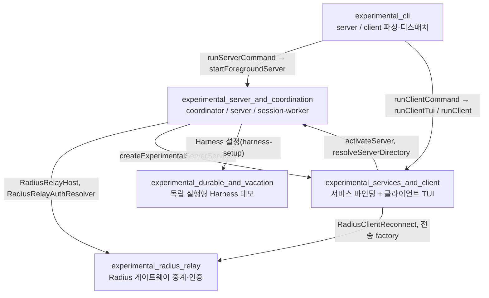
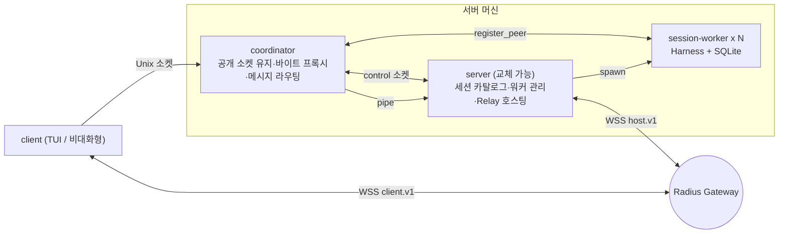
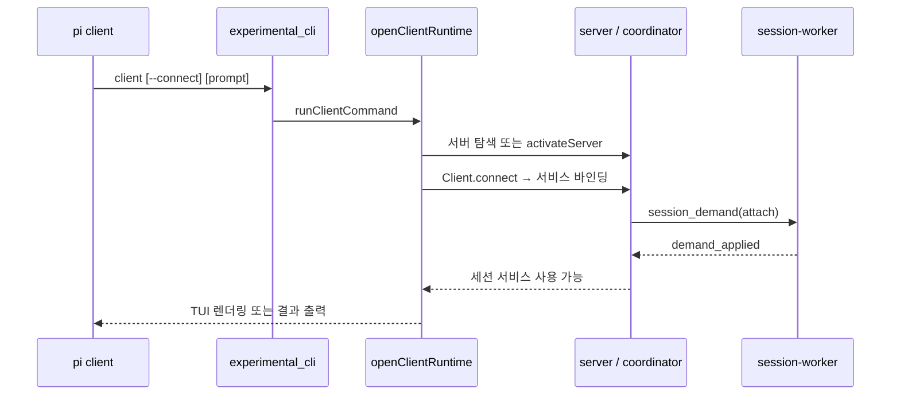

# experimental_distributed_runtime 개요

## 1. 목적

`experimental_distributed_runtime`은 `packages/coding-agent`의 **실험적 분산 에이전트 런타임**이다. 에이전트 실행(서버·세션 워커)과 UI(클라이언트 TUI)를 별도 프로세스로 나누고, 같은 머신의 Unix 소켓이나 Radius 게이트웨이를 통한 원격 연결로 이어 준다.

- 실험 기능이다. `areExperimentalFeaturesEnabled()`가 true일 때만 `pi server` / `pi client` 서브커맨드가 동작한다. 프로토콜과 프레임 형식은 바뀔 수 있다.
- 서버는 무중단에 가깝게 교체할 수 있다. 세션 워커는 서버보다 오래 살아남고, 새 서버가 워커를 재발견한다.
- 세션 상태는 `pi-durable` `Harness`와 SQLite에 영속되므로, 중단된 작업을 `--continue`로 재개할 수 있다.
- `durable`과 `vacation`은 같은 `Harness` 위에서 동작하는 독립 실행형 데모 TUI다.

검증 수준: 아래 내용은 하위 문서(CodeWiki 산출물)를 읽고 정리한 것이다. 하위 문서는 소스 코드 확인을 기준으로 작성되었으나, 이 개요 작성 시 소스를 다시 열어 검증하지는 않았다(`미확인`). 외부 패키지(`chord`, `pi-client`, `pi-server`) 내부 동작도 `미확인`이다.

## 2. 아키텍처

### 2.1 하위 모듈 관계

### 2.2 런타임 프로세스 토폴로지

### 2.3 대표 흐름: client 실행

## 3. 하위 모듈 요약

| 모듈 | 소스 위치 | 핵심 역할 | 문서 |
|---|---|---|---|
| `experimental_cli` | `cli/experimental/*`, `experimental/commands.ts` | 자체 `Command` 프레임워크, `--connect`/인증 옵션 파싱, `runExperimentalCommand` 디스패치 | [experimental_cli](experimental_cli.md) |
| `experimental_server_and_coordination` | `experimental/` (`coordinator.ts`, `server.ts`, `session-worker.ts`, `session-worker-manager.ts`, `session-catalog.ts`, `process.ts`) | 3종 프로세스 역할, 서버 교체, 워커 수명 정책, 세션 카탈로그 | [experimental_server_and_coordination](experimental_server_and_coordination.md) |
| `experimental_radius_relay` | `experimental/radius-auth.ts`, `radius-relay.ts` | `RadiusRelayHost`(다중화), 클라이언트 전송·재연결, `OrderedWebSocketWriter`, 토큰 해석 | [experimental_radius_relay](experimental_radius_relay.md) |
| `experimental_services_and_client` | `experimental/client-runtime.ts`, `client-tui*.ts`, `services/*` | 서비스 소스(서버/세션 범위), 슬래시 명령, `ExperimentalClientTui`, `ExperimentalChatView` | [experimental_services_and_client](experimental_services_and_client.md) |
| `experimental_durable_and_vacation` | `experimental/durable/`, `experimental/vacation/` | `Harness` 기반 독립 데모 TUI(코딩 에이전트 / 휴가 플래너), View/Controller 분리 | [experimental_durable_and_vacation](experimental_durable_and_vacation.md) |

## 4. 핵심 설계 포인트

- **공개 엔드포인트와 구현의 분리**: 클라이언트는 항상 고정된 공개 소켓에 접속한다. coordinator가 현재 server로 연결을 프록시하므로, 새 server가 `register_server`하면 이전 server는 `server_replaced`를 받고 물러난다.
- **워커 수명 정책**: `WorkerLifecycle`은 demand가 없고 task graph가 비면 스스로 퇴역한다. `ServerLifetime`은 연결 0과 워커 0이 1초간 지속되면 서버를 종료한다.
- **보안**: 소켓은 `0600`, server 디렉터리는 `0700`과 소유자 검증을 적용한다. 워커 응답에는 1회성 `token`과 `sessionKey`를 검증한다. 락(`launcher-<id>`, `activation-<id>`, 세션 디렉터리 락)으로 경쟁을 막는다.
- **Radius 중계**: 서버는 게이트웨이에 host WebSocket을 하나만 유지하고 `connection_id`로 논리 연결을 다중화한다. 인증 토큰은 캐시하지 않고 재연결마다 새로 해석한다. 재시도는 1초에서 최대 30초까지 지수 백오프를 쓴다.
- **컨텍스트 주입**: CLI 파서는 런타임을 import하지 않고 `runServer`/`runClient`를 주입받으므로 단독 테스트가 가능하다.
- **알려진 제약**: `durable`과 `vacation`은 코드가 거의 복제본이어서 한쪽을 고치면 다른 쪽도 맞춰야 한다. `ensurePrivateServerDirectory`는 POSIX 전용이라 Windows에서 실패한다.

## 5. 읽는 순서 제안

1. [experimental_cli](experimental_cli.md): 진입점과 옵션
2. [experimental_server_and_coordination](experimental_server_and_coordination.md): 프로세스 토폴로지
3. [experimental_services_and_client](experimental_services_and_client.md): 클라이언트 측 서비스와 TUI
4. [experimental_radius_relay](experimental_radius_relay.md): 원격 연결
5. [experimental_durable_and_vacation](experimental_durable_and_vacation.md): `Harness` 데모 앱

## 6. 관련 모듈

- [agent_session_core](agent_session_core.md), [model_and_auth_management](model_and_auth_management.md): 워커가 쓰는 `ModelRuntime`, `SettingsManager`
- [interactive_components](interactive_components.md), [settings_and_keybindings](settings_and_keybindings.md): 클라이언트 TUI가 재사용하는 컴포넌트와 키바인딩
- [cloudflare_and_pi_gateway_apis](cloudflare_and_pi_gateway_apis.md), [auth_core](auth_core.md): Radius 게이트웨이 설정과 인증 저장소