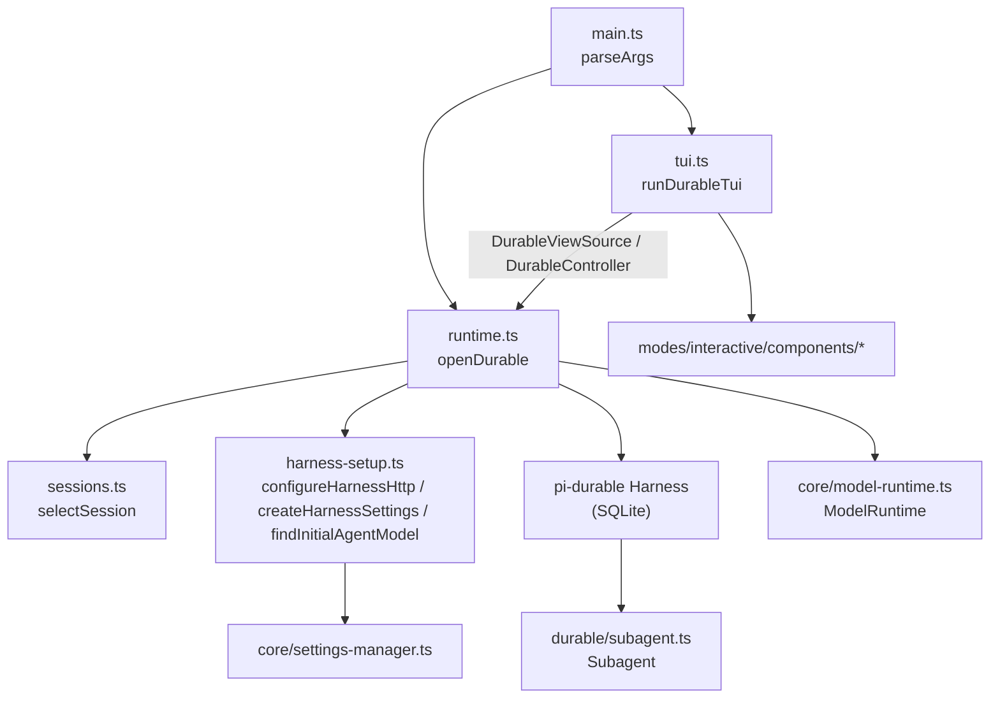
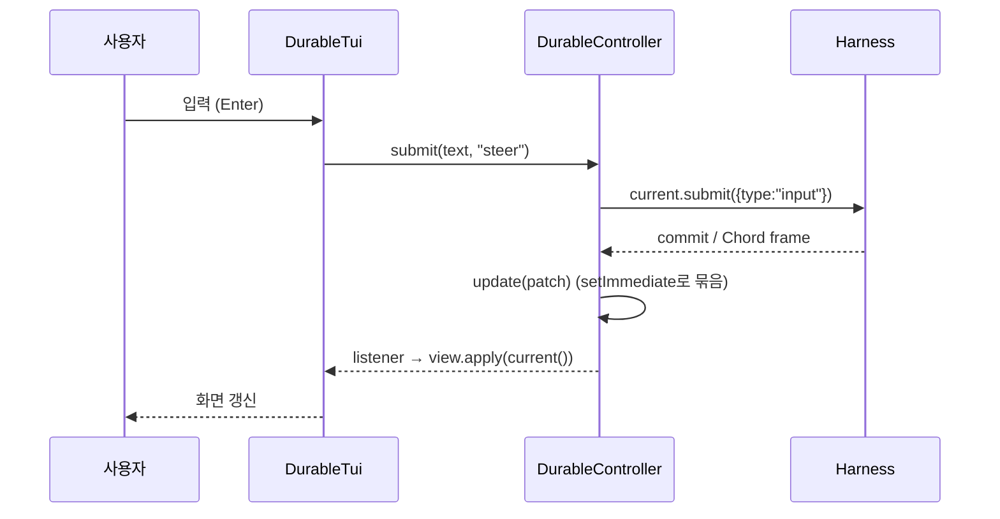

# experimental_durable_and_vacation

## 개요

`packages/coding-agent/src/experimental/durable/`와 `packages/coding-agent/src/experimental/vacation/` 두 디렉터리로 구성된 **실험적 데모 앱** 모듈이다. 둘 다 `@earendil-works/pi-durable`의 `Harness`(SQLite에 영속되는 대화/태스크 런타임) 위에서 동작하는 독립 실행형 TUI 에이전트다.

- **durable**: pi의 코딩 도구 레지스트리(`createCodingRegistry`)와 `Subagent` 확장을 쓰는 코딩 에이전트.
- **vacation**: 코딩 도구 없이 `Vacation`(휴가 플래너)과 `Search` 확장만 설치한 레지스트리를 쓰는 에이전트.

두 구현은 거의 동일한 코드를 공유하며(복제), 차이는 레지스트리 구성, 세션 저장 경로, 실행 환경(`ExecutionEnvs`) 사용 여부뿐이다.

> 참고: 컴포넌트 목록의 `vacation/harness-setup.ts`는 `./vacation.ts`(`Vacation`, `Search`)를 import하며, `durable/runtime.ts`는 `./harness-setup.ts`에서 `createCodingRegistry`, `ExecutionEnvs`를 가져온다. 해당 파일 본문은 제공되지 않았으므로 이 부분은 import 선언에 근거한 설명이다(미확인).

## 구성 요소

| 파일 | 역할 |
|---|---|
| `{durable,vacation}/main.ts` | 진입점. `parseArgs`가 `--continue`/`-c`만 허용하고, 그 외 인자는 `Unknown argument` 오류. `openDurable` → `runDurableTui` → `close()` |
| `{durable,vacation}/runtime.ts` | `openDurable`: 세션 선택, `Harness.open`, 뷰 상태/컨트롤러 생성 |
| `{durable,vacation}/sessions.ts` | `selectSession`: 세션 디렉터리 선택 및 `proper-lockfile` 잠금 |
| `{durable,vacation}/tui.ts` | `runDurableTui`, `DurableTui`, `ListSelector`: 터미널 UI |
| `durable/subagent.ts` | `Subagent` 확장 및 `answerText` |
| `vacation/harness-setup.ts` | `configureHarnessHttp`, `createHarnessSettings`, `createVacationRegistry`, `findInitialAgentModel` |

## 아키텍처

### 핵심 경계: View / Controller

`runtime.ts`는 TUI와 Harness 사이를 **일반 값**으로만 분리한다.

- `DurableViewSource`: `current()`로 `DurableView` 스냅샷을 읽고 `subscribe()`로 변경을 구독.
- `DurableController`: `submit`, `compact`, `abort`, `cycleThinking`, `setModel`, `toggleTasks`, `switchConversation`.
- `DurableView`: `session`, `conversation`, `conversations`, `models`, `notices`, `tasks`.

## 동작 상세

### 세션 선택 (`selectSession`)
- 경로: `getAgentDir()/experimental/{durable|vacation}-sessions/<sha256(cwd) 앞 24자>/<13자리 타임스탬프>-<uuid>`.
- `--continue`면 이름 정규식(`^\d{13}-[0-9a-f-]{36}$`)에 맞는 가장 최신 디렉터리, 없으면 오류.
- `proper-lockfile`로 잠금(재시도 12회, 1초 간격; 크래시된 잠금은 10초 후 stale). 실패 시 `Session is already open in another process`.
- 데이터베이스는 디렉터리 내 `session.sqlite`.

### `openDurable` 흐름
1. `selectSession` → `ModelRuntime.create()` → `SettingsManager.create(cwd)` → `configureHarnessHttp`.
2. 레지스트리 구성(durable: 코딩 레지스트리 + `Subagent` 설치, vacation: `createVacationRegistry`).
3. `Harness.open(openNodeSqliteStorage(...))`, 새 세션이면 `findInitialAgentModel`로 초기 모델/thinking level 결정 후 `harness.root(...)`.
4. 대화 목록(`scanConversations`)과 첫 사용자 입력(제목) 수집, `viewState` 구독.
5. `subscribeCommits`로 서브에이전트 대화 생성/제목 갱신 추적(리스너는 기록만 수행).
6. 태스크 패널을 기본으로 열고(`toggleTasks`), `harness.resume()`으로 중단된 작업 재개.
7. `close()`는 결과를 기록하지 않으므로 실행 중이던 턴은 `--continue`로 재개된다.

모든 컨트롤러 명령은 `command()`의 Promise 큐로 직렬화된다(`abort`만 큐를 거치지 않음). 오류는 `notice("error", ...)`로 표시된다.

### 서브에이전트 (durable 전용)
`Subagent` 확장의 `subagent` 도구는 호출 태스크가 소유하는 자식 대화를 만들고(`ownership: {kind:"task"}`), 자식에서 `Subagent` 확장을 제거해 재위임을 막은 뒤 `task`를 입력으로 제출하여 답변을 반환한다. `replay: "safe"`이므로 크래시 후 재실행 시 기존 자식 대화와 `requestId: subagent:<taskId>` 제출을 재사용한다(멱등). 자식 대화는 호출 후에도 남아 `/agents`로 전환 가능하다.

### TUI (`DurableTui`)
- 레이아웃: `ScrollView` 트랜스크립트 + 하단 dock(`tasks`, `queue`, `notices`, `editor`, `footer`)의 `VStack`.
- `apply(view)`가 트랜스크립트 증분 동기화(`#syncTranscript`), 스트리밍 메시지, 도구 카드, 태스크 트리, 큐, 알림, 상태 표시줄, 푸터(토큰/비용/컨텍스트 %)를 갱신. 컴팩션/리셋으로 앞부분 엔트리가 바뀌면 `#rebuild`.
- 슬래시 명령: `/model`, `/tasks`, `/agents`, `/compact [지시]`. 그 외 입력은 `steer`, follow-up 키는 `followUp`으로 제출.
- `ListSelector`: `Input` + `SelectList` 조합의 퍼지 필터 선택기(`focused`, `handleInput`). 이동/확인/취소 키는 목록으로 전달하고 나머지는 입력창으로 전달.
- 테마/키바인딩/도구 렌더러는 `modes/interactive`와 `core`의 기존 구현을 재사용([user_interface_modes](user_interface_modes.md), [extensibility_and_tooling](extensibility_and_tooling.md) 참고).

## durable vs vacation 차이

| 항목 | durable | vacation |
|---|---|---|
| 레지스트리 | `createCodingRegistry` + `Subagent` | `createVacationRegistry` (`Vacation`, `Search`) |
| 루트 에이전트 | `cwd` 지정 | `extensions: [Vacation]` |
| 실행 환경 | `ExecutionEnvs`(`env` 전달, `close` 시 `cleanup`) | 없음 |
| 세션 경로 | `durable-sessions` | `vacation-sessions` |
| 오류 메시지 | `No durable session exists` | `No vacation session exists` |

## 관련 모듈

- [experimental_distributed_runtime](experimental_distributed_runtime.md): 상위 모듈(서버/코디네이터/릴레이 기반 분산 실험 런타임)
- [coding_agent_session_and_configuration](coding_agent_session_and_configuration.md): `SettingsManager`, `ModelRuntime`, 키바인딩
- [user_interface_modes](user_interface_modes.md): 재사용되는 인터랙티브 컴포넌트와 테마
- [ai_platform_foundation](ai_platform_foundation.md): `pi-ai` 모델/Thinking level 기반

## 테스트 설정

`packages/coding-agent/vitest.config.ts`가 이 패키지의 테스트 설정이다. 이 모듈 전용 테스트 구성은 확인하지 않았다(미확인).

## 유지보수 메모

- `durable`과 `vacation`의 `main.ts`, `sessions.ts`, `tui.ts`, `runtime.ts`는 거의 동일한 복제본이다. 한쪽을 수정하면 다른 쪽도 맞춰야 한다(추론: 실험 단계라 공통화하지 않은 것으로 보임).
- 서브 모듈로 나눌 만큼 독립적이지 않아 별도 하위 문서는 만들지 않았다.
