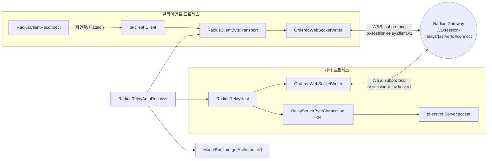
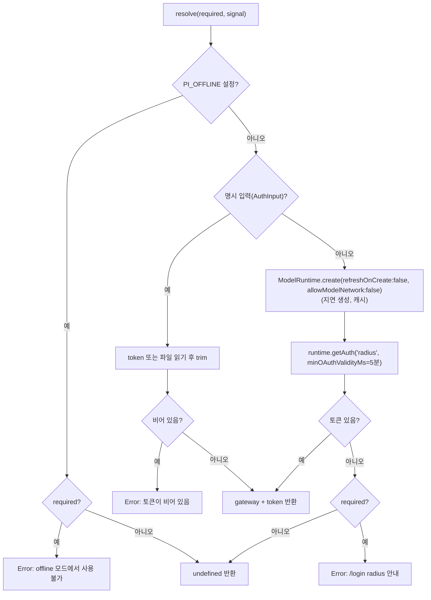
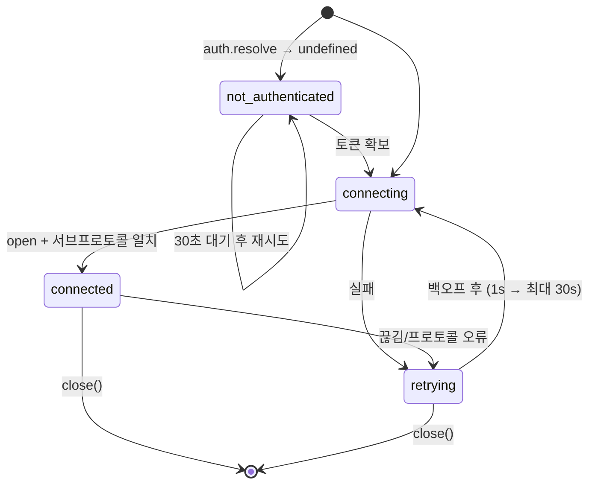
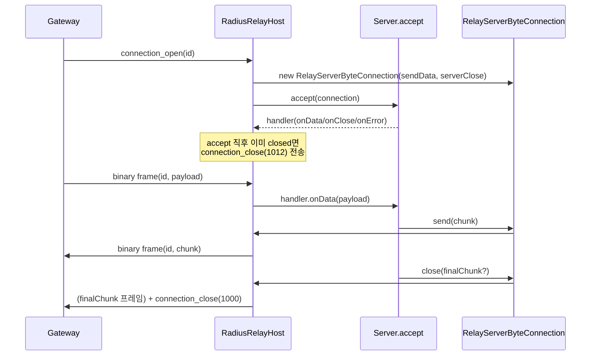
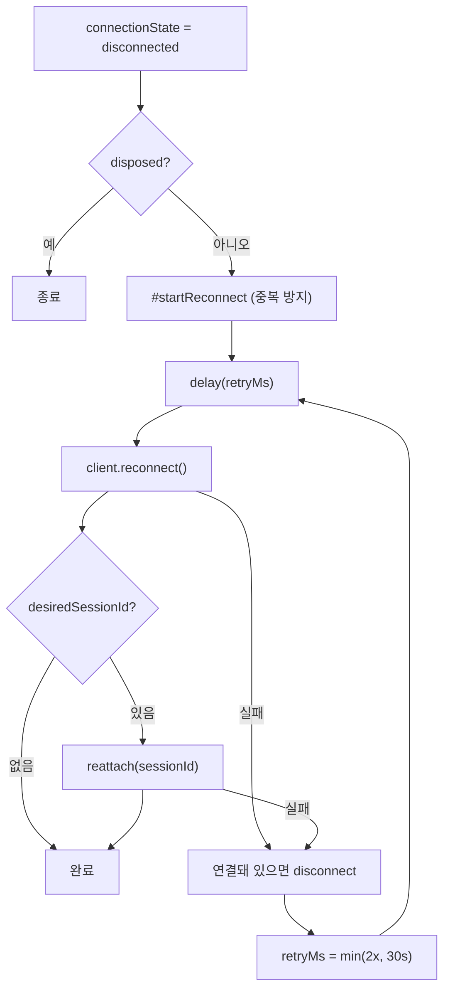
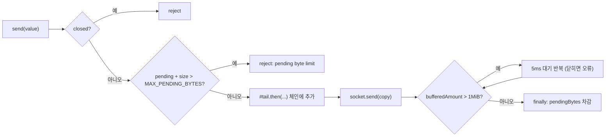
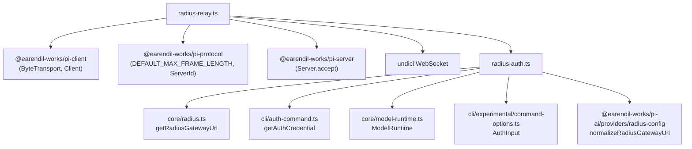

# experimental_radius_relay

`experimental_radius_relay`는 Pi 실험용 분산 런타임에서 **클라이언트와 서버가 직접 연결되지 못할 때 Radius 게이트웨이를 통해 통신하도록 중계(relay)하는 계층**이다. 인증 정보를 매 연결 시도마다 새로 해석하는 `RadiusRelayAuthResolver`와, WebSocket 위에서 다중화(multiplexing)된 바이트 스트림을 제공하는 `radius-relay.ts`로 구성된다.

- `packages/coding-agent/src/experimental/radius-auth.ts`
- `packages/coding-agent/src/experimental/radius-relay.ts`

상위 맥락은 [experimental_server_and_coordination](experimental_server_and_coordination.md), [experimental_cli](experimental_cli.md), [experimental_services_and_client](experimental_services_and_client.md)를 참고한다. Radius 게이트웨이 설정(`isRadiusGatewayModel`, `normalizeRadiusGatewayUrl`)은 [cloudflare_and_pi_gateway_apis](cloudflare_and_pi_gateway_apis.md), 모델·인증 저장소(`ModelRuntime`)는 [model_and_auth_management](model_and_auth_management.md)와 [auth_core](auth_core.md)를 참고한다.

---

## 1. 역할 요약

| 역할 | 구성 요소 | 설명 |
|---|---|---|
| 인증 해석 | `RadiusRelayAuthResolver` | 명시 토큰/토큰 파일 또는 저장된 `radius` 자격증명에서 Bearer 토큰을 얻음 |
| 서버 측(host) 중계 | `RadiusRelayHost` | 게이트웨이에 host 연결 1개를 유지하고, 클라이언트별 논리 연결(`connection_id`)을 다중화 |
| 클라이언트 측 전송 | `createRadiusClientTransportFactory`, `RadiusClientByteTransport` | `pi-client`의 `ByteTransport` 구현. 게이트웨이에 client 연결을 하나 염 |
| 클라이언트 재연결 | `RadiusClientReconnect` | 끊어진 `Client`를 지수 백오프로 재연결하고 마지막 Session에 다시 attach |
| 쓰기 순서 보장 | `OrderedWebSocketWriter` | 전송 순서, 대기 바이트 상한, 백프레셔(drain) 처리 |
| 서버 측 논리 연결 | `RelayServerByteConnection` | `Server.accept()`에 넘기는 연결 객체 |

---

## 2. 아키텍처



서버는 게이트웨이에 **단일 host WebSocket**만 유지한다. 여러 클라이언트가 접속하면 게이트웨이가 `connection_open` 제어 메시지를 보내고, 이후 바이너리 프레임의 헤더에 담긴 `connection_id`로 각 논리 연결을 구분한다. 클라이언트 쪽은 연결마다 별도 WebSocket을 사용하므로 다중화가 필요 없고 payload가 그대로 오간다.

---

## 3. 인증: `RadiusRelayAuthResolver`

`resolve({ required, signal })`는 relay 연결 시도마다 호출되며 다음 순서로 동작한다.



핵심 포인트:

- `gateway`는 생성자에서 `normalizeRadiusGatewayUrl(gateway)`로 정규화된다. 기본값은 `getRadiusGatewayUrl()`(환경 변수 `ENV_RADIUS_GATEWAY`를 re-export).
- `required: false`(host)는 토큰이 없으면 `undefined`를 반환해 호스트가 "not_authenticated" 상태로 대기하게 한다. `required: true`(client)는 즉시 오류를 던진다.
- 저장된 OAuth 토큰은 만료까지 5분 이상 남도록 `minOAuthValidityMs`를 요구하므로, 필요 시 갱신된 토큰을 얻는다.
- `ModelRuntime` Promise는 `#modelRuntime`에 캐시되지만 **토큰 자체는 캐시하지 않는다**. 재연결 때마다 최신 자격증명을 읽는다.

---

## 4. 와이어 프로토콜

### 4.1 연결

- URL: `new URL('/v1/session-relays/${serverId}/connect', gateway)`. `https:`는 `wss:`, `http:`는 `ws:`로 바꾸고 그 외 프로토콜은 오류.
- 헤더: `authorization: Bearer <token>`.
- 서브프로토콜: host `pi-session-relay.host.v1`, client `pi-session-relay.client.v1`. `open` 시점에 `socket.protocol`이 요청과 다르면 연결 실패 처리한다.
- `binaryType = "arraybuffer"`.
- 기본 구현 `defaultWebSocketFactory`는 `undici`의 `WebSocket`을 사용하며, 테스트에서는 `webSocketFactory` 옵션으로 대체할 수 있다.

### 4.2 Host 제어 메시지 (텍스트 JSON, `version: 1`)

| 방향 | `type` | 필드 | 처리 |
|---|---|---|---|
| 게이트웨이 → host | `ping` | - | `pong` 응답 |
| 게이트웨이 → host | `pong` | - | 무시 |
| 게이트웨이 → host | `connection_open` | `connection_id` | `Server.accept()` 호출로 논리 연결 생성 |
| 게이트웨이 → host | `connection_close` | `connection_id`, `code?` | 논리 연결 종료, handler `onClose()` |
| host → 게이트웨이 | `pong` | - | ping 응답 |
| host → 게이트웨이 | `connection_close` | `connection_id`, `code?` | 서버가 연결을 닫을 때, 모르는 연결의 데이터가 왔을 때(1000), accept 직후 닫혔을 때(1012) |

`connection_id`는 UUID v4 정규식(`CONNECTION_ID_PATTERN`)을 통과해야 하고, `code`는 1000~4999 정수여야 한다. 검증 실패는 프로토콜 오류다.

### 4.3 데이터 프레임 (바이너리, host 전용)

```text
offset  0      1      2 ................ 17   18 ...
       +------+------+--------------------+----------+
       | ver  | type | connection_id(16B) | payload  |
       |  1   |  1   |   UUID 바이너리    |          |
       +------+------+--------------------+----------+
```

`encodeRelayDataFrame(connectionId, payload)`와 `parseRelayDataFrame(frame)`가 변환을 담당한다. 헤더 18바이트, 버전/타입 불일치나 UUID 형식 오류는 `undefined`를 반환하고 host는 이를 프로토콜 오류로 취급한다. 클라이언트 연결은 프레임 헤더 없이 payload를 그대로 바이너리 메시지로 보낸다.

---

## 5. `RadiusRelayHost`

### 5.1 수명 주기



`start()`는 한 번만 `#run()` 루프를 시작한다(`#loop`로 중복 방지). 루프는 `onStatus` 콜백으로 `not_authenticated | connecting | connected | retrying(error)`를 알린다. 연결에 성공하면 백오프는 1초로 초기화되고, 실패마다 2배(최대 30초)로 증가한다. 대기용 `delay`는 `unref`된 타이머와 `AbortSignal`을 사용하므로 대기 중에도 프로세스 종료를 막지 않고 `close()`로 즉시 깨울 수 있다.

### 5.2 논리 연결 처리



- 같은 `connection_id` 재사용은 프로토콜 오류로 간주해 소켓을 코드 `4000`으로 닫는다.
- 알 수 없는 `connection_id`의 데이터 프레임이 오면 `connection_close(1000)`을 응답한다.
- 소켓이 끊기면 `#dropConnections(error)`가 모든 논리 연결을 `markClosed()`하고 handler에 `onError`(오류 종료) 또는 `onClose`(정상 종료)를 전달한다.
- `close()`는 abort → writer 닫기 → 코드 1000으로 소켓 종료 → 연결 정리 → 루프 종료 대기 순서로 진행하며 멱등이다.

### 5.3 닫기 코드

`undici`의 WebSocket은 브라우저 API를 따르므로 `close()`에 1000 또는 3000~4999만 넘길 수 있다. 그래서 로컬 오류는 다음 코드를 사용한다(`closeWebSocket`은 핸드셰이크 중 `close()`가 던지는 예외를 무시한다).

| 상수 | 값 | 사용처 |
|---|---|---|
| `LOCAL_PROTOCOL_ERROR_CLOSE_CODE` | 4000 | 잘못된 제어/데이터 프레임 |
| `LOCAL_TRANSPORT_ERROR_CLOSE_CODE` | 4001 | 전송 실패, 클라이언트의 비바이너리 메시지 |

---

## 6. 클라이언트 측

### 6.1 `createRadiusClientTransportFactory`

`ByteTransportFactory`를 반환한다. 호출될 때마다 `auth.resolve({ required: true })`로 토큰을 새로 받아 client 서브프로토콜로 연결하고 `RadiusClientByteTransport`를 돌려준다. 수신은 `ArrayBuffer`만 허용하며 텍스트 메시지를 받으면 `#fail`로 코드 4001 종료 + `handlers.onError`를 호출한다. 정상 `close()`는 코드 1000을 사용한다. `send()`는 `Uint8Array`만 받고 복사본을 전송한다.

### 6.2 `RadiusClientReconnect`



- 생성 시 `client.attachment?.sessionId`를 기억하고, `onAttachmentChange`로 최근 선택 Session을 추적한다. 연결된 상태에서 attachment가 해제되면 목표 Session도 비운다(끊김으로 인한 해제는 유지).
- `dispose()`는 리스너 제거, abort, 연결 중이면 `disconnect("Radius reconnect stopped")`, 진행 중인 재연결 대기 순으로 정리한다.
- 재연결은 `reconnect()` 때문에 `RadiusClientByteTransport`의 factory가 다시 호출되어 토큰이 새로 해석된다.

---

## 7. `OrderedWebSocketWriter`

비동기 `send`가 겹쳐도 전송 순서를 유지하고 메모리를 제한하는 작은 큐다.



- 입력은 복사(`slice(0)`)해 호출자가 버퍼를 재사용해도 안전하다.
- 상한 `MAX_PENDING_BYTES = DEFAULT_MAX_FRAME_LENGTH * 4`(`@earendil-works/pi-protocol`), 백프레셔 임계값 `DRAIN_THRESHOLD_BYTES = 1 MiB`.
- 한 전송이 실패해도 `#tail`은 `catch`로 이어져 이후 전송이 막히지 않지만, 반환된 Promise는 실패를 호출자에게 전달한다.
- `close()`는 이후 전송을 거부하기만 하며 소켓은 닫지 않는다.

---

## 8. 의존성 및 통합 지점



- `AuthInput`(`type: "token"` 또는 파일 경로)은 [experimental_cli](experimental_cli.md)의 `parseAuth`가 생성한다.
- 서버 측 `RadiusRelayHost`는 서버 프로세스([experimental_server_and_coordination](experimental_server_and_coordination.md))가 `Server`와 `serverId`를 넘겨 시작하고, 클라이언트 측 factory와 `RadiusClientReconnect`는 client 명령 경로([experimental_services_and_client](experimental_services_and_client.md))에서 사용된다. 정확한 호출 위치는 이 모듈 소스 범위 밖이므로 해당 문서에서 확인한다.
- `packages/coding-agent/vitest.config.ts`가 테스트 설정이며, 모듈이 `webSocketFactory`를 주입받을 수 있게 설계되어 실제 네트워크 없이 테스트하기 쉽다.

---

## 9. 운영 시 유의사항

- **오프라인**: `PI_OFFLINE`이 설정되면 host는 인증 없음으로 대기하고 client는 오류를 낸다.
- **토큰 없음(host)**: 30초(`MISSING_AUTH_RETRY_MS`)마다 재확인하므로 `/login radius` 이후 자동으로 연결된다.
- **재시도 간격**: host와 client 모두 1초에서 시작해 최대 30초.
- **오류 전파**: 비정상 종료 코드는 `Radius relay host closed (code: reason)` 오류로 handler `onError`에 전달되고, 코드 1000은 정상 `onClose`다.
- 이 모듈은 `experimental` 영역이므로 프로토콜(`v1` 서브프로토콜, 프레임 헤더)이 바뀔 수 있다.
