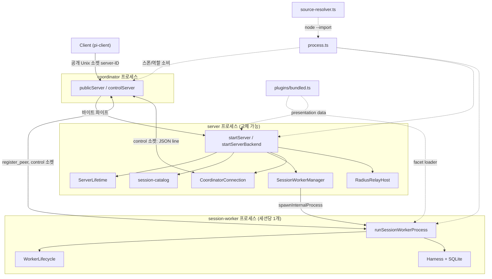
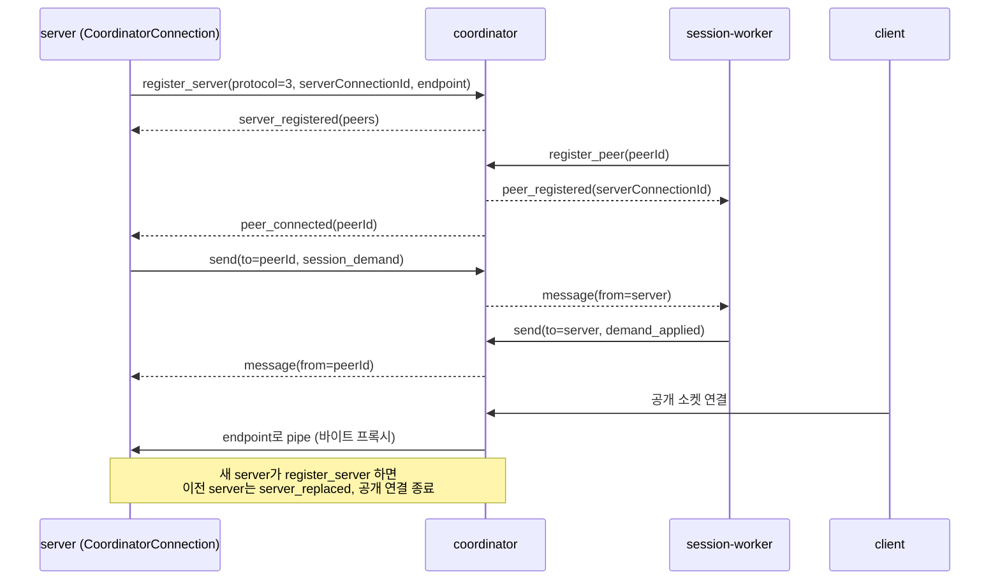
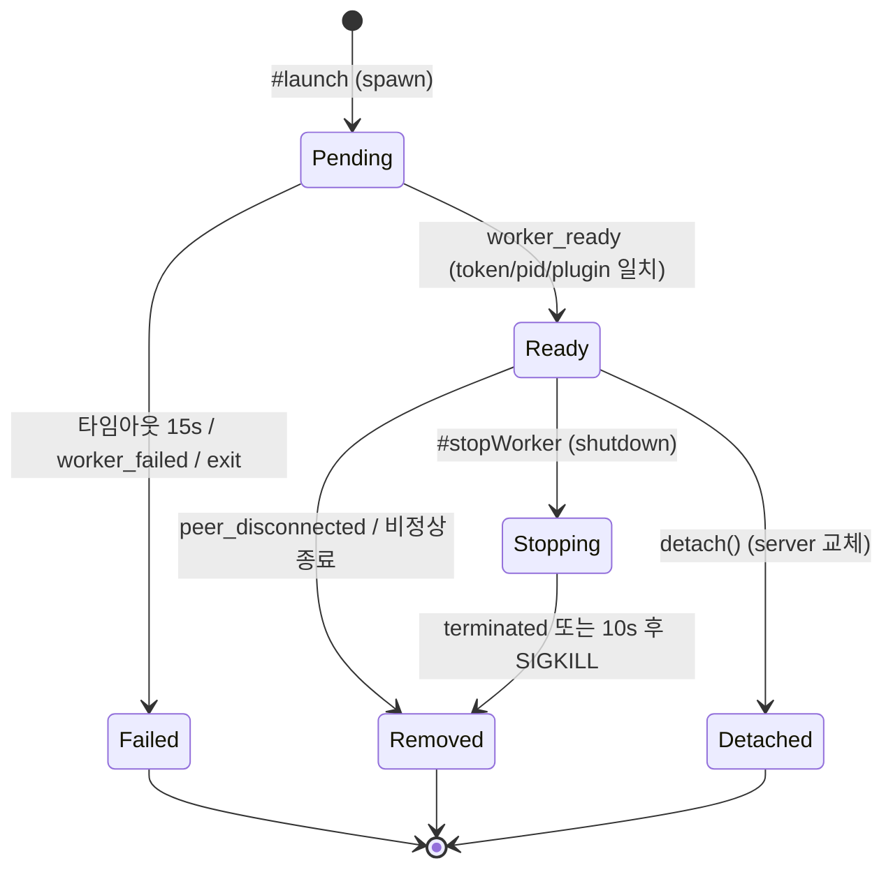
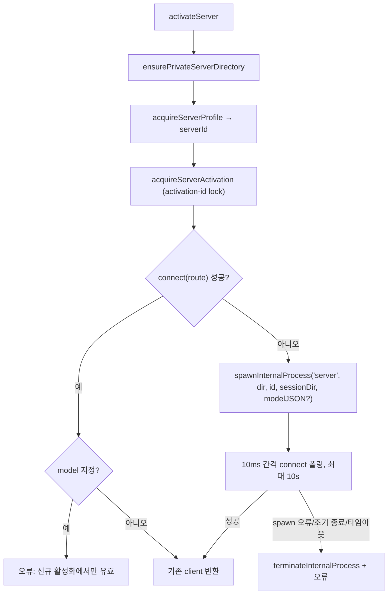

# experimental_server_and_coordination

## 소개

`experimental_server_and_coordination`은 `packages/coding-agent/src/experimental/` 아래에서 **실험적 분산 런타임의 서버 측 프로세스 토폴로지**를 구성하는 모듈이다. 한 대의 머신에서 다음 세 종류의 Pi 소유 프로세스를 띄우고 서로 연결한다.

| 역할 (`InternalProcessRole`) | 진입점 | 책임 |
|---|---|---|
| `coordinator` | `coordinator.ts` (`runCoordinatorProcess`) | 안정적인 공개 Unix 소켓을 유지하고, 현재 server로 바이트를 프록시하며, server/worker 사이의 불투명 메시지를 라우팅 |
| `server` | `server.ts` (`runServerProcess`) | 교체 가능한 server 세대. 세션 카탈로그, 플러그인 선택, worker 관리, Radius relay 호스팅 |
| `session-worker` | `session-worker.ts` (`runSessionWorkerProcess`) | 세션 하나의 Harness(durable SQLite)를 소유하고 서비스 호출을 실행 |

CLI 명령 파싱은 [experimental_cli](experimental_cli.md), 원격 relay는 [experimental_radius_relay](experimental_radius_relay.md), 클라이언트/서비스 계층은 [experimental_services_and_client](experimental_services_and_client.md), Harness 설정(`durable/harness-setup`)은 [experimental_durable_and_vacation](experimental_durable_and_vacation.md)을 참고한다. 상위 모듈은 `experimental_distributed_runtime`이다.

> 검증 수준: 아래 내용은 제공된 소스 코드를 직접 읽고 정리한 것(코드 확인)이다. 개발자 의도 서술은 `추론`으로 표시했다.

---

## 1. 아키텍처 개요

핵심 설계 포인트:

- **공개 엔드포인트와 server 구현의 분리.** 클라이언트는 항상 `getUnixSocketPath(serverId, directory)`의 공개 소켓에 접속한다. coordinator가 이를 `server-<id>-<nonce>.sock`(현재 server)로 파이프한다. 새 server가 `register_server`하면 이전 server는 `server_replaced`를 받고 공개 연결이 모두 닫힌다. 즉 server는 **무중단에 가깝게 교체**할 수 있고 worker는 살아남는다(`detach()`).
- **coordinator는 transport shim.** 주석상 Node 내장 모듈에만 의존하며 Pi/세션/worker 페이로드를 해석하지 않는다.
- **worker는 server보다 오래 산다.** server가 교체되면 새 server가 `discover_workers` 브로드캐스트로 기존 worker를 재발견한다.

---

## 2. 컴포넌트별 설명

### 2.1 `process.ts` — 내부 프로세스 공통 유틸

| 심볼 | 설명 |
|---|---|
| `INTERNAL_PROCESS_ENV` (`__PI_INTERNAL_SPAWN`) | 역할 전달용 환경 변수 |
| `isDirectInternalProcessEntry(moduleUrl)` | Bun 바이너리/번들 Node가 아니고 `argv[1]`이 해당 모듈일 때 true. 각 파일 하단의 직접 실행 가드에 사용 |
| `consumeInternalProcessRole()` | 역할을 읽고 검증한 뒤 env에서 **삭제**해 자손 프로세스가 상속하지 않게 함 |
| `spawnInternalProcess(role, args, options)` | `detached` + `stdio: "ignore"`로 스폰 후 `unref()`. 소스 실행 시 `--import source-resolver.ts` 추가. Bun 바이너리/번들 Node/소스(.ts/.js)별 진입 URL을 `defaultEntryUrl`로 결정 |
| `terminateInternalProcess(child)` | `SIGKILL` 후 `exit`/`error`를 기다림 |
| `encodeControlLine(message)` / `MAX_CONTROL_LINE_BYTES` | JSON + `\n` 인코딩, 128 MiB 초과 시 오류 |

### 2.2 `source-resolver.ts` — 소스 실행 시 alias 해석

Node는 TS를 strip하지만 `tsconfig.json`의 `paths` alias는 적용하지 않는다. 이 모듈은 `registerHooks({ resolve })`로 `@earendil-works/*` alias를 workspace 소스로 해석해 **오래된 `dist`로 폴백하지 않게** 한다. 가장 긴 패턴부터 매칭하며, 매치되었으나 해석 실패 시 예외를 던진다. `spawnInternalProcess`가 소스 실행(`import.meta.url`이 `.ts`)일 때만 `--import`로 선행 로드한다. (`TsConfig`는 이 파일의 내부 타입.)

### 2.3 `coordinator.ts` — 라우터 + 서버 측 연결 클라이언트

한 파일에 **두 역할**이 공존한다.

**(a) `CoordinatorConnection` (server 측 클라이언트)**

- 프로토콜 버전 `COORDINATOR_PROTOCOL_VERSION = 3`.
- `connect()`: control 소켓 연결 → `register_server`(protocol, `serverConnectionId`, `endpoint`) 전송 → `server_registered` 응답 대기. 응답의 `peers`로 `peerIds`를 초기화.
- 수신 메시지는 TypeBox `CoordinatorMessageSchema`로 검증(`server_registered`, `server_replaced`, `peer_connected`, `peer_disconnected`, `message`). 위반 시 소켓 파괴.
- `send(peerId, payload)`, `broadcast(payload)`: 등록 완료 전/종료 후에는 예외.
- `replaced: Promise<void>` / `wasReplaced`: `server_replaced` 수신 **또는 비정상 연결 종료** 시 resolve → server가 스스로 정리하도록 하는 신호.
- `onEvent(listener)`: `peer_connected`, `peer_disconnected`, `message` 이벤트 구독, 해제 함수 반환.
- `close()`: 소켓 파괴, `peerIds` 비움, 대기 중 등록 reject.

**(b) 라우터 프로세스 (`runCoordinatorProcess`)**

- 인자: `[publicPath, controlPath]`. 모듈 전역 상태(`peers`, `controlConnections`, `publicConnections`, `currentServer`)를 사용하므로 프로세스당 1회만 실행(`running` 가드).
- 시작: `removeStaleSocket`(활성 소켓이면 오류, 죽은 소켓이면 unlink) → control, public 순으로 listen → `chmod 0600`(non-win32) → `EMPTY_STARTUP_GRACE_MS`(30s) 빈 상태 종료 타이머.
- `acceptControlConnection(socket)`: 첫 메시지가 역할을 결정.
  - `register_server`: 프로토콜/ID/endpoint 검증, `currentServer` 교체. 이전 server가 있으면 `closePublicConnections()`, peers에 `server_disconnected` 통지, 이전 server에 `server_replaced` 전송. 이후 peers에 `server_connected` 통지.
  - `register_peer`: `peerId`가 `"server"`이거나 중복이면 거부. `peer_registered`(현재 `serverConnectionId` 포함)를 응답하고 server에 `peer_connected` 통지.
  - 이후 `send`(to `server` 또는 peerId)와 `broadcast`(**현재 server만** 가능) 라우팅. 현재 server가 아닌 이전 server의 메시지는 무시.
- `acceptPublicConnection(client)`: server가 없거나 종료 중이면 즉시 파괴. 아니면 `currentServer.endpoint`로 `createConnection` 후 양방향 `pipe`.
- 빈 상태 감시(`checkEmpty`): server·peer·공개·control 연결이 모두 없으면 250 ms 후 `shutdownCoordinator()`(소켓 정리 후 `process.exit(0)`).
- `ensureCoordinator(publicPath, controlPath)`: 기존 control 소켓에 접속 가능하면 재사용, 아니면 `spawnInternalProcess("coordinator", ...)` 후 10 ms 간격으로 최대 10 s 폴링. 반환되는 `CoordinatorStartupLease`는 **연결을 붙잡아 두어 coordinator가 startup grace 중 종료되지 않게** 한다.

### 2.4 `session-catalog.ts` — 디스크 기반 세션 카탈로그

세션 = 디렉터리 하나: `meta.json`(`createdAt`, `cwd`) + worker 소유의 `session.sqlite`.

| 함수 | 동작 |
|---|---|
| `isSessionId(id)` | `^[A-Za-z0-9][A-Za-z0-9._-]{0,127}$` (경로 탈출 방지) |
| `listSessions(dir)` | 디렉터리가 없으면 `[]`, 유효 메타데이터가 없는 항목은 건너뜀 |
| `readSession(dir, id)` | 유효하지 않으면 `undefined` |
| `createSession(dir, {id?, cwd})` | `randomUUID()` 기본값, `mkdir`로 존재 시 `Session <id> already exists`. 스토리지는 worker가 첫 오픈 시 생성 |
| `deleteSession(meta)` | `rm -rf`. worker를 먼저 닫아야 함 |
| `sessionStoragePath(meta)` | `<path>/session.sqlite` |

### 2.5 `session-worker-manager.ts` — worker 생명주기/라우팅

`SessionWorkerManager`는 server 프로세스 하나가 소유하는 worker 장부이다.

- 상태: `#workersBySession`(키는 `metadata.path`), `#workersByPeer`, `#pending`(기동 중), `#pendingDemand`, `#pendingOperations`, `#serviceSubscriptions`, `workerPids`.
- `trackedSessions`: 현재 추적 중인 worker의 메타데이터 목록. server의 세션 목록 병합에 사용(`startServerBackend.listSessions`).
- `openSession(metadata, context, pluginManifestPaths)`: 기존 worker 재사용 → pending이면 await → 아니면 `#launch`. 플러그인 manifest 선택이 기존/기동 중 worker와 다르면 `SessionPluginSelectionConflictError`.
- `#launch`: `spawnInternalProcess("session-worker", [JSON(options)], { env })`. env로 control 주소, 1회성 `token`, base64url 세션 키, `peerId`(`worker-<uuid>`)를 전달. 15 s 시작 타임아웃, `worker_ready`가 오면 `WorkerRecord` 등록.
- `RoutedSessionHandle.attachClient`: `session_demand(attached=true)`를 보내 `demand_applied`를 기다림(5 s, 타임아웃 시 보상 `attached=false` 시도 후 실패하면 worker 종료). `invokeService`는 `operation` 메시지를 보내고 `operation_response`로 settle. 구독은 `scope + subscriptionId` 키로 추적하며 `service_update`를 직렬 전달(`deliveryTail`).
- 보안: 응답은 `peerId`, `token`, `sessionKey`, scope가 모두 일치해야 수락(불일치 시 reject).
- 종료: `#stopWorker`는 `shutdown` 전송 후 10 s 안에 종료되지 않으면 `SIGKILL`. `shutdown()`은 pending 포함 전체 정리, `detach()`는 **worker를 죽이지 않고** 장부만 폐기(server 교체 시).
- `discover(peerIds)`: 재발견 대상 peer에게 `discover_workers`를 브로드캐스트하고 최대 5 s 대기.

### 2.5.1 worker 기동 상태

### 2.6 `session-worker.ts` — worker 프로세스

- 입력: argv[0]에 JSON `SessionWorkerOptions`(TypeBox `StrictObject`로 검증, 경로는 절대경로 필수) + 4개의 env.
- 프로토콜 스키마(`SessionWorkerCommandSchema`, `SessionWorkerEventSchema`)를 정의: 명령 `shutdown`, `discover_workers`, `session_demand`, `operation`, `operation_cancel` / 이벤트 `worker_ready`, `worker_failed`, `demand_applied`, `demand_rejected`, `operation_response`, `service_update`.
- `run()` 순서: coordinator `register_peer` → 세션 디렉터리 `proper-lockfile` 락(`stale 2s`, 최대 8 s 대기) → `createHarness`(기본 `createCodingAgentHarness`) → `harness.taskGraph` → `createSessionWorkerServices` → `WorkerLifecycle` 생성 → `harness.resume()` → 명령 루프 → `worker_ready` 전송.
- `createCodingAgentHarness`: `ModelRuntime.create()`, `SettingsManager.create(cwd)`, `Harness.open(openNodeSqliteStorage(databasePath), ...)`. 초기 모델은 **루트 conversation이 처음 생성될 때만** 적용된다.
- 오류 시 `worker_failed`를 server에 보내고 `AggregateError`로 정리 오류를 병합.

**`WorkerLifecycle`** — worker의 자가 종료 정책. 다음이 **모두** 만족되면 `onRetire`:

1. 초기 demand 유예(기본 10 s, env `__PI_SESSION_WORKER_INITIAL_DEMAND_GRACE_MS`) 경과 또는 demand 수신
2. 활성 demand(attachment) 0개
3. 진행 중 요청/demand 처리 hold 0개(`holdRetirement`, `beginRequest`)
4. Harness task graph가 비어 있음(`setHarnessActive`)

server가 사라지면(`serverDisconnected`) 해당 세대 demand에 orphan 유예(기본 30 s)를 걸고, 새 server가 같은 `serverConnectionId`로 돌아오면(`serverConnected`) 타이머를 해제한다. 오래된 세대의 요청은 `stale server generation` 오류로 거부된다.

### 2.7 `server.ts` — server 프로세스

**디렉터리/프로필**

- `resolveServerDirectory`: 인자 → `PI_SERVER_DIR` → `~/.pi/server`. `ensurePrivateServerDirectory`가 `0700`, 소유자 uid를 강제.
- `resolveSessionDirectory`: 인자 → `<agentDir>/experimental/sessions`.
- `acquireServerProfile`: serverId 결정(명시값 또는 `default-server-id` 파일, `wx`로 경쟁 안전 생성) 후 `launcher-<id>` 락 획득.

**자동 활성화 (`activateServer`)**

`connect()`는 `DisconnectedError`, `version` 서버 오류, `ENOENT/ECONNREFUSED/ECONNRESET/EPIPE/ETIMEDOUT`(cause 체인 포함)을 "아직 없음"으로 간주하고 `undefined`를 반환한다.

**`ServerLifetime`** — 자동 활성화 server의 수명 정책: `keepAlive`면 영구 유지. 아니면 시작 후 10 s 동안 hold, 연결이 생기면 해제. 연결 수 0 **그리고** worker 수 0이 1 s 지속되면 `retire()`.

**`startServer(options)`** 순서:

1. `acquireServerProfile` 락, `ensurePrivateServerDirectory`
2. 플러그인 패키지 프로필 복원(`restoreServerPluginPackageProfile`)과 기본 선택 빌드
3. `ensureCoordinator(socketPath, controlPath)` → `CoordinatorConnection` 생성(endpoint: `server-<id>-<nonce>.sock`)
4. `SessionWorkerManager` 생성, `startServerBackend`(`createUnixServer` 모드 `0600`)
5. `coordinator.connect()` → startup lease 해제 → `workers.discover(peerIds)` → `refreshSessions()`
6. `RadiusRelayHost` 시작(`RadiusRelayAuthResolver`)
7. `coordinator.replaced` 구독: 교체되면 `lifetime.stop()`, `workers.detach()`, relay/backend 종료
8. 프로필 락 해제 후 `RunningServer` 반환

실패 시 모든 자원을 `Promise.allSettled`로 정리하고 오류를 `AggregateError`로 묶는다. `close()`는 교체 여부에 따라 worker를 `detach()`(교체됨) 또는 `shutdown()`한다.

`startForegroundServer`는 운영자가 직접 띄우는 경로로, 활성화 락을 잡아 자동 cold activation과 직렬화하고 `keepAlive: true`로 시작한다.

**`runServerProcess(args)`** (본 모듈 핵심 컴포넌트): 내부 자동 활성화 진입점.

- 인자 `[directory, serverId, sessionDir, serializedModel?]` 검증(절대경로, 정규 serverId, 인자 4개 초과 금지, 모델 JSON은 `provider?`/`model`만 허용).
- `startServer({ keepAlive: false, ... })` 후 `SIGINT`/`SIGTERM`에서 `close()`, `runtime.closed`를 기다린 뒤 최종 `close()`.

**세션 서비스 연결.** `createExperimentalServerServices`에 `list/create/remove/prepareSessionPlugins/reloadPresentationPlugins`를 주입한다. `remove`는 `closeSession` → `deleteSession` → 플러그인 프로필 삭제 순서. 플러그인 선택 충돌은 `RoutedServerError("service_invalid_value")`로 변환된다.

### 2.8 `plugins/bundled.ts` — 플러그인 facet 로딩

| 심볼 | 설명 |
|---|---|
| `createSessionPluginFacetLoader(manifestPaths)` | 비어 있으면 `undefined`, 아니면 `combineFacetLoaders` |
| `createOptionalSessionFacetLoader(manifestPath)` | manifest에 `session` entry가 없으면 빈 facet 반환 |
| `createPresentationFacetData(artifacts)` | server → client 전송용 JSON(`presentationFacetBundles`) |
| `createPresentationFacetLoaders(data)` | client가 server가 보낸 artifact에서만 로더 생성 |
| `resolvePluginExternal(specifier)` | `@earendil-works/pi-coding-agent/experimental/plugin`만 로컬 `plugin.(ts|js)`로 해석 |

---

## 3. 프로세스 수명과 종료 규칙 요약

| 대상 | 종료 조건 |
|---|---|
| coordinator | 시작 후 30 s 내 접속 없음, 또는 server/peer/연결이 모두 사라진 뒤 250 ms, 또는 `SIGINT/SIGTERM` |
| server (자동) | `ServerLifetime`: 연결 0 + worker 0이 1 s 지속, 또는 coordinator에 의해 교체됨 |
| server (foreground) | 명시적 `close()` / 시그널 |
| session-worker | `WorkerLifecycle` 퇴역 조건, `shutdown` 명령, control 소켓 종료, 시그널 |

## 4. 보안 및 견고성 관련 관찰

- 모든 소켓은 `0600`, server 디렉터리는 `0700`+소유자 검증(코드 확인).
- worker ↔ server 메시지에 1회성 `token`과 `sessionKey`를 사용해 다른 peer의 위조 응답을 거부(코드 확인).
- control 라인 크기 상한 128 MiB, 잘못된 JSON/스키마는 소켓 파괴.
- `consumeInternalProcessRole`로 역할 env 상속 차단.
- 락 기반 경쟁 방지: `launcher-<id>`, `activation-<id>`, 세션 디렉터리 락(`proper-lockfile`).
- Windows에서는 소켓 파일 `chmod`/`unlink`를 생략한다. server 디렉터리의 uid 검증은 POSIX 전용(`process.getuid` 없으면 오류) — 따라서 `ensurePrivateServerDirectory` 경로는 Windows에서 실패한다(코드 확인).
- coordinator가 control 연결에 인증을 하지 않고 파일 권한에만 의존하는 점은 의도로 보이나 `추론`이다.

## 5. 테스트/빌드 참고

`packages/coding-agent/vitest.config.ts`가 이 패키지의 테스트 설정이다(내용은 직접 확인하지 않음, `미확인`). 저장소 지침상 비-e2e 테스트는 루트의 `./test.sh`로 실행한다.

## 6. 관련 문서

- [experimental_cli](experimental_cli.md): `server`/`client` 명령이 `startForegroundServer`, `activateServer`를 호출
- [experimental_radius_relay](experimental_radius_relay.md): `RadiusRelayHost`, `RadiusRelayAuthResolver`
- [experimental_services_and_client](experimental_services_and_client.md): `createExperimentalServerServices`, 클라이언트 서비스 소스
- [experimental_durable_and_vacation](experimental_durable_and_vacation.md): `Harness` 설정(`harness-setup`)
- [agent_session_core](agent_session_core.md), [model_and_auth_management](model_and_auth_management.md): worker가 사용하는 `ModelRuntime`, `SettingsManager`
