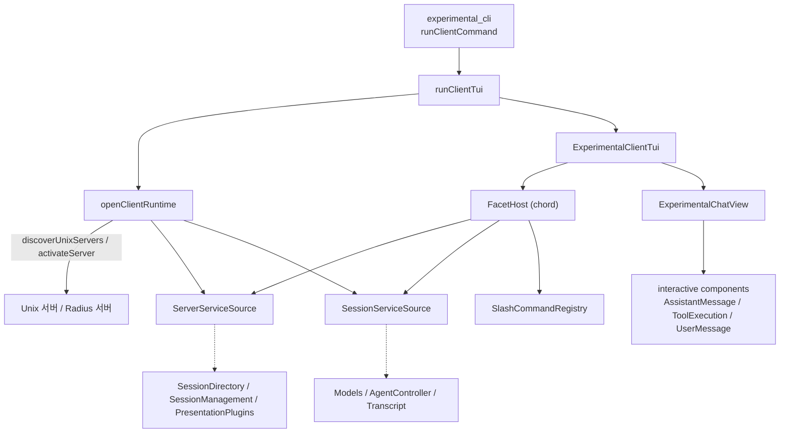
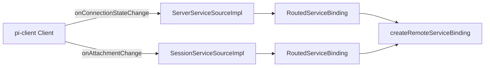
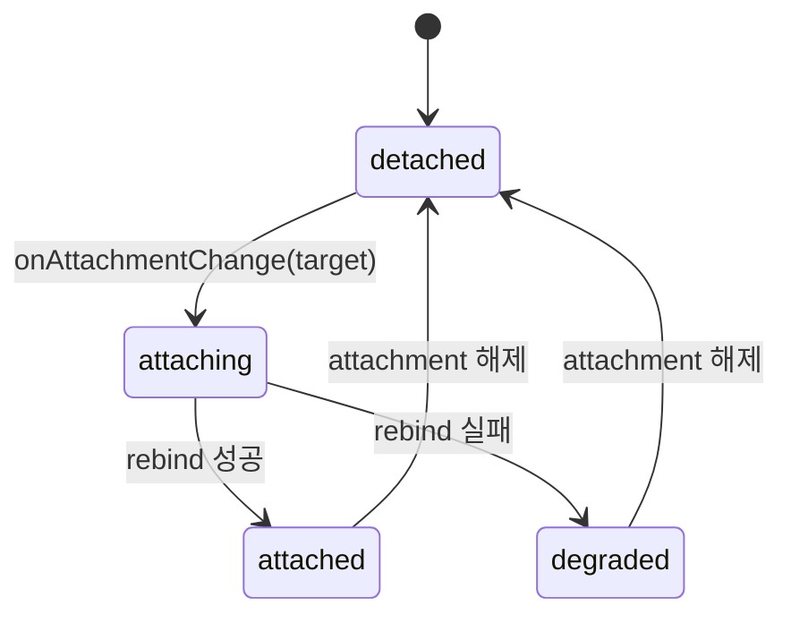
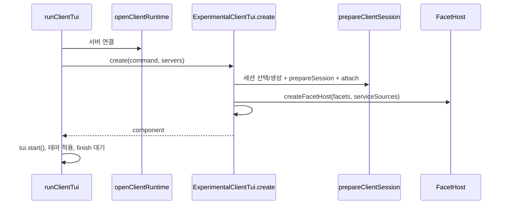
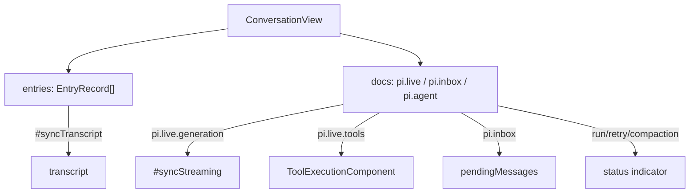

# experimental_services_and_client

`experimental_services_and_client`는 `pi` 실험적 분산 런타임에서 **클라이언트 쪽(presentation)** 을 담당하는 모듈이다. 서버/세션 워커가 노출하는 원격 서비스(`SessionDirectory`, `SessionManagement`, `PresentationPlugins`, `Models`, `AgentController`, `Transcript`)를 `@earendil-works/chord` 서비스 바인딩으로 연결하고, 그 위에서 서비스만으로 동작하는 전체화면 TUI(`ExperimentalClientTui`)를 구동한다.

핵심 구성:

| 영역 | 파일 | 역할 |
|---|---|---|
| 런타임 연결 | `packages/coding-agent/src/experimental/client-runtime.ts` | 서버 탐색/활성화, `Client` 연결, 서비스 소스 생성, 정리(dispose) |
| 서비스 소스 | `packages/coding-agent/src/experimental/services/connection.ts` | `ServerServiceSource`, `SessionServiceSource` 구현 (연결/attachment 상태 복제) |
| 서비스 계약 | `services/agent-controller.ts`, `services/sessions.ts`, `services/presentation-ui.ts` | `defineService`로 정의된 인터페이스 |
| 슬래시 명령 | `services/slash-commands-provider.ts` | `SlashCommandRegistry`, 내장 `/model` `/thinking` `/compact` `/reload` |
| TUI | `client-tui.ts`, `client-tui-chat.ts` | 화면 구성, 입력 처리, 대화 뷰 렌더링 |

관련 모듈: CLI 진입은 [experimental_cli](experimental_cli.md), 서버/코디네이터/세션 워커는 [experimental_server_and_coordination](experimental_server_and_coordination.md), Radius 중계는 [experimental_radius_relay](experimental_radius_relay.md), 대화형 컴포넌트 재사용은 [interactive_components](interactive_components.md), 테마·키바인딩은 [interactive_mode](interactive_mode.md)·[settings_and_keybindings](settings_and_keybindings.md) 참조.

---

## 1. 아키텍처

두 개의 서비스 소스로 범위가 나뉜다.

- **서버 범위** (`ServerServiceSource`): 세션 목록, 세션 생성/삭제/attach/detach, presentation 플러그인. 연결 상태는 `connection: ReplicatedState<ServerConnectionState>`.
- **세션 범위** (`SessionServiceSource`): 현재 attach된 세션의 모델, 에이전트 제어, 트랜스크립트. 상태는 `attachment: ReplicatedState<SessionAttachmentState>`.

## 2. client-runtime.ts

### `openClientRuntime(command, options)`
1. 옵션 검증: `auth`는 Radius 전용, `provider`는 `model` 필요, `--connect`와 `model` 동시 지정 불가, Radius에는 `pluginPackages` 불가.
2. 경로(route) 결정
   - `--connect` 지정: Radius는 `serverId`, Unix는 `<uuidv4-server-id>.sock` 경로(`routeFromExplicitPath`).
   - 미지정: `discoverUnixServers({ directory })`. 없으면 `activateServer`로 새 서버를 띄운다 (`PI_SERVER_DIR` 또는 `~/.pi/server`).
3. 각 route마다 `Client.connect`. Unix 서버가 `ServerError`(`code === "version"`)를 내면(자동 탐색 시에만) 서버를 새로 활성화한다.
4. Radius route는 `RadiusClientReconnect`를 붙여 재연결 시 `SessionManagement.attach(sessionId)`로 자동 재attach.
5. `dispose()`는 reconnector → 서비스 소스 → client 순으로 `Promise.allSettled` 정리하고 오류를 `AggregateError`로 모은다. 시작 중 실패해도 같은 정리를 수행한다.

### `activateBuiltinClientServices(server)`
비대화형 클라이언트용. 서버 서비스 3종과 세션 서비스 3종을 열고 `ready`를 기다린 뒤 `ActivatedClientRuntimeServer`를 반환한다. `management`는 래퍼로, `attach`/`remove`/`detach` 뒤에 `whenAttached`/`whenDetached`를 기다려 서비스가 실제로 전환된 이후에만 호출자에게 반환한다.

## 3. services/connection.ts

- `RoutedServiceBinding`: `createRemoteServiceBinding`을 `bound: false`로 만들고, 첫 `ready()`에서 `rebind(getBound())`. 이후 `updateBound(bound)`로 연결/attach 상태 변화에 따라 재바인딩한다. `onActivate`는 한 번만 실행된다.
- `ServerServiceSourceImpl`
  - 연결 상태 변화마다 `connection` 상태를 교체 발행하고 모든 binding을 `#transition` 체인으로 직렬 재바인딩.
  - `acceptsUnavailableServices = false`: 서버가 연결되지 않은 동안 서비스를 요청하면 허용하지 않는다.
  - `catalogue()`는 `client.serviceCatalogue({ serverId })`.
- `SessionServiceSourceImpl`
  - attachment 변경에 `revision`을 붙여 오래된 전환의 결과를 무시(`sameAttachment` 검사). 상태: `detached → attaching → attached | degraded`.
  - `acceptsUnavailableServices`는 attach도 없고 catalogue도 캐시되지 않았을 때만 `true`.
  - `whenAttached(sessionId)`: 현재 attachment가 아니면 오류. 모든 binding의 `serviceReady`를 기다린다. `whenDetached()`도 대칭.
- `dispose()`는 listener 제거 → 진행 중 전환 대기 → binding 일괄 dispose, 실패는 `throwFailures`로 집계.

### 세션 상태 머신

## 4. 서비스 계약

- `AgentController` (`pi.agent-controller`): `prompt`(실행 중이면 `busy` 거절), `steer`, `followUp`, `cancelQueued`, `abort`, `compact`(`AgentCompactionRequest.customInstructions`), `waitForPrompt`. 응답은 `accepted` 판별 유니온(`AgentOperationResponse`, `AgentQueueResponse`).
- `SessionDirectory` (`pi.session-directory`): `state: ReplicatedState<SessionDirectoryState>` (`revision`, `sessions[]`).
- `SessionManagement` (`pi.session-management`): `create/remove/attach/detach`.
- `PresentationUI` (`pi.local.presentation-ui`, `local: true`): 프로세스 로컬 전용. `select`, `showStatus`. `PresentationSelectItem`은 `value/label/description`.

## 5. 슬래시 명령 (`slash-commands-provider.ts`)

`SlashCommandRegistry`
- `register`: 중복 이름이면 오류. 이름은 `/^[a-z0-9][a-z0-9:-]*$/u`.
- `replace`: 같은 이름 항목을 스택처럼 쌓고, 맨 앞 항목이 활성. 해제 함수는 닫힌 항목을 정리.
- `subscribe`: 등록 즉시 현재 목록으로 한 번 호출되고, 이후 변경 시 통지.

facet 두 개:
- `createSlashCommandsRuntimeFacet`: `SlashCommands` 서비스로 레지스트리를 제공.
- `createBuiltInSlashCommandsFacet`: `onActivate`에서 `/model`, `/thinking`, `/compact`, `/reload`를 `replace`로 등록. `/reload`는 `presentationPlugins.reload` → `sessionPlugins.reload` → TUI의 `reloadPresentationPlugins` 순.

## 6. client-tui.ts

### 시작 흐름

`prepareClientSession` 세션 선택 규칙: `--session-id`가 있으면 모든 서버에서 일치 검색(2개 이상이면 오류, 없으면 Radius는 오류, Unix는 단일 서버에 새로 생성) → `--continue/--resume`이면 `createdAt` 최신순 → 그 외 새 세션 생성. 이후 `PresentationPlugins.prepareSession`, `attach`, `whenAttached`. 임시로 연 서비스는 `finally`에서 dispose.

### 구조
- `presentationBridgeFacet`(`@pi/presentation-bridge`): `PresentationUI`(select/showStatus)를 TUI에 제공하고, `SlashCommands`/`AgentController`/`Transcript`를 `onActivate`에서 TUI 필드에 연결. Radius이면 연결/attachment 상태를 구독한다.
- facet 로딩 순서: 슬래시 런타임 → 브리지 → 내장 슬래시 → 공유 facet → presentation 플러그인 facet.
- 플러그인 reload는 `#facetReloadTail`로 직렬화. 실패 시 후보 generation을 dispose하고, 성공 시 이전 generation을 폐기.

### 입력 처리
- `#runPrompt`: `/`로 시작하면 슬래시 명령, 아니면 `#submitPrompt`.
- `#submitPrompt`: 실행 중(`liveOf(view).run`)이면 `steer`, 아니면 `prompt`.
- `app.message.followUp` → `followUp`, Esc → `#interrupt`(`abort`), `app.model.select` → `/model`.
- `#busy`일 때는 종료 키만 처리.
- `#screen`이 `select`이면 `SelectList`가 입력을 받는다 (`#select`는 동시에 하나만 허용).

### Radius 복구
`#handleConnectionState`: 끊기면 `#busy`로 두고 `#closeLane`을 `#queueRecovery`로 직렬 실행. `#handleAttachmentState`: 같은 세션이 `attached`가 되면 `#openLane` 재실행 후 busy 해제.

### 종료
`close()`는 멱등. selection 취소 → recovery 대기 → lane 닫기 → facet reload 꼬리 대기 → `facetHost.dispose` → facet generation dispose. 오류는 하나면 그대로, 여럿이면 `AggregateError`.

## 7. client-tui-chat.ts — `ExperimentalChatView`

`transcript`, `pendingMessages`, `status` 세 `Container`를 관리하며 `Transcript` 서비스의 `ConversationView`(`pi-durable`)로 렌더링한다.

- `apply(view)`: 이미 렌더한 entry id와 앞부분이 다르면(compaction/reset) `#rebuild`, 새 entry만 `#addEntry`. 스트리밍 partial이 사라졌으면(retry 등) 재구성.
- entry kind별 렌더: `pi.user`, `pi.assistant`, `pi.tool-result`, `pi.compaction`(`[compaction]`), `pi.reset`(`[new context]`).
- tool 카드: `#tools`(call ID별 최신 카드)와 `#cards`(전부)를 분리. provider call ID가 턴 사이에 재사용될 수 있기 때문이다. `stopReason !== "toolUse"`인 응답의 스트리밍되지 않은 호출은 카드를 만들지 않고, 스트리밍된 것은 "Not run: the answer was interrupted."로 마감.
- 상태 문구 우선순위: retry → deferred → compaction → 실행 중 tool → run.
- `refreshTheme(view)`: indicator 폐기 후 전체 재구성. `dispose()`: 모든 카드를 최종 결과로 닫아 bash 타이머를 정리.

## 8. 의존 관계 요약

- 외부: `@earendil-works/chord`(facet/service/replicated state), `@earendil-works/pi-client`, `@earendil-works/pi-protocol`, `@earendil-works/pi-durable`, `@earendil-works/pi-tui`.
- 내부: [experimental_server_and_coordination](experimental_server_and_coordination.md)의 `activateServer`/`resolveServerDirectory`, [experimental_radius_relay](experimental_radius_relay.md)의 `RadiusRelayAuthResolver`/`RadiusClientReconnect`, [interactive_components](interactive_components.md)의 렌더 컴포넌트, [settings_and_keybindings](settings_and_keybindings.md)의 `SettingsManager`/`KeybindingsManager`.

## 9. 유의점

- 검증 수준: 위 내용은 제공된 소스 코드 확인 기준이며, 외부 패키지(`chord`, `pi-client`) 내부 동작은 미확인이다.
- `ExperimentalClientTui`는 `Component`를 구현하며 `render`는 단순 연결, 실제 레이아웃은 `createChatViewport`의 `layoutRoot`가 담당한다.
- `acceptAccess`/`onError` 콜백은 이 클라이언트에서 모두 빈 함수로 넘긴다. 즉 서비스 오류는 서비스 소스 쪽 `onError`가 아닌 호출 결과(예외)로만 드러난다.
- 테스트 설정은 `packages/coding-agent/vitest.config.ts`를 참조.
