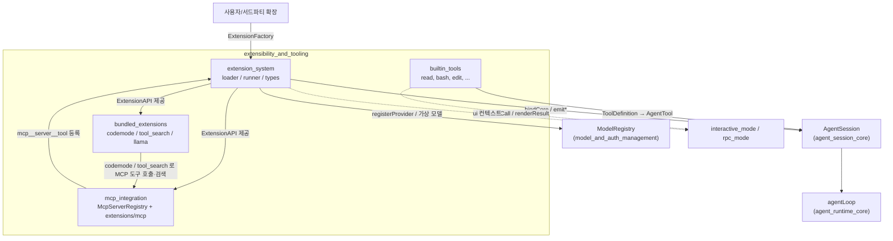
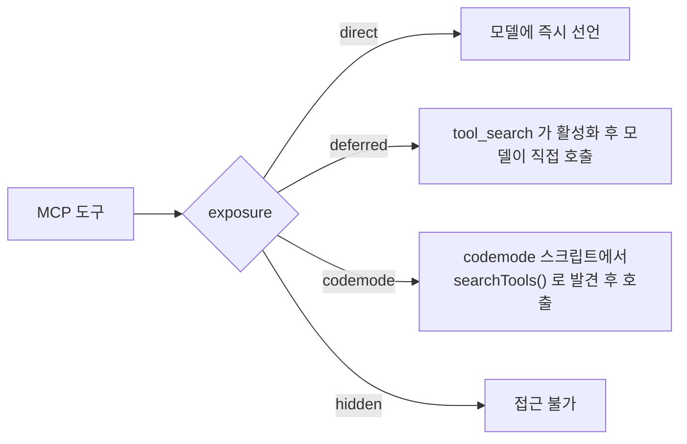

# extensibility_and_tooling 모듈 개요

## 1. 목적

`extensibility_and_tooling`은 `packages/coding-agent/src` 아래에서 **에이전트가 할 수 있는 일을 정의하고 넓히는 계층**입니다. 크게 세 가지를 담당합니다.

- **도구 제공**: 파일시스템과 셸에 접근하는 내장 도구 8개(`read`, `bash`, `powershell`, `edit`, `write`, `grep`, `find`, `ls`)와 TUI 렌더러를 제공합니다.
- **확장 인프라**: 사용자나 서드파티의 TypeScript/JavaScript 확장을 로드합니다. 확장은 이벤트 훅, 도구, 명령, 단축키, 플래그, 프로바이더, MCP 서버, 가상 모델을 등록할 수 있습니다.
- **번들 확장**: 같은 확장 API 위에서 codemode, tool-search, llama, MCP 확장이 구현되어 있습니다.

핵심 설계는 두 가지입니다.

1. 내장 도구, 확장 도구, MCP 도구가 모두 같은 `ToolDefinition` 형태를 공유합니다. 그래서 `tool_call`/`tool_result` 훅과 권한 검사가 어느 도구에든 똑같이 적용됩니다.
2. 확장 로드는 등록 단계와 실행 단계로 나뉩니다. 로드 중 실패한 확장은 `discard()`로 버려지므로 런타임이 오염되지 않습니다.

## 2. 하위 모듈

| 모듈 | 경로 | 역할 |
|---|---|---|
| `extension_system` | `packages/coding-agent/src/core/extensions` | 확장 탐색·로드(`loader.ts`), 이벤트 디스패치와 충돌 해소(`runner.ts`), 공개 계약(`types.ts`) |
| `builtin_tools` | `packages/coding-agent/src/core/tools` | 내장 도구 8종, `wrapToolDefinition`, `edit` 퍼지 매칭/diff, 렌더러 |
| `bundled_extensions` | `packages/coding-agent/src/extensions` | `codemode`(QuickJS 샌드박스), `tool_search`(BM25), `llama`(`/llama` 명령) |
| `mcp_integration` | `packages/coding-agent/src/extensions/mcp` (+ `core/mcp-servers.ts`) | MCP 서버 연결, MCP 도구·resource를 pi 도구로 변환, `/mcp` 관리 UI |

## 3. 아키텍처

### 3.1 모듈 관계



### 3.2 도구 호출 한 번의 흐름

```mermaid
sequenceDiagram
    participant LLM
    participant Loop as agentLoop
    participant Run as ExtensionRunner
    participant Tool as ToolDefinition.execute
    participant Sub as 중첩 호출 (codemode 등)

    LLM->>Loop: tool call
    Loop->>Run: emitToolCall (순차)
    alt block 반환
        Run-->>Loop: 차단
    else 통과
        Loop->>Tool: execute(..., ExtensionToolContext)
        opt 도구가 다른 도구를 호출
            Tool->>Sub: ctx.executeTool()
            Sub->>Run: 검증/훅/권한 동일 적용
        end
        Tool-->>Loop: result
        Loop->>Run: emitToolResult (누적 병합)
    end
    Loop-->>LLM: 결과
```

### 3.3 도구 노출(exposure)과 탐색 경로

MCP 도구는 기본값이 `codemode`라서 모델 선언을 차지하지 않습니다. 모델은 아래 경로로 도구를 찾아 씁니다.



## 4. 모듈별 요약

### extension_system

- 탐색 우선순위는 프로젝트 `.pi/extensions`, 전역 `agentDir/extensions`, 명시 경로 순이며 jiti로 로드합니다.
- `createExtensionAPI`는 `{ api, commit, discard }`를 반환합니다. 로드 중 프로바이더·MCP·가상 모델 등록은 보류되고, 성공하면 `commit()`으로 한꺼번에 반영됩니다.
- `ExtensionRunner`는 `bindCore`, `bindCommandContext`, `setUIContext` 순으로 바인딩합니다. 세션이 교체되거나 `reload`되면 `invalidate()`로 stale 상태가 됩니다.
- 이벤트 디스패치는 대부분 핸들러 예외를 `ExtensionError`로 격리합니다. 예외는 `emitToolCall`(오류 미격리)과 `emitUserBash`(재던짐)입니다.

### builtin_tools

- 도구는 `createXxxToolDefinition`으로 정의를 만들고 `wrapToolDefinition`으로 `AgentTool`로 변환합니다.
- `edit`은 모든 edit을 원본에 대해 매칭하고, 겹치거나 중복이면 거부합니다. 정확 일치가 실패하면 퍼지 매칭을 하되, 변경이 닿지 않는 줄은 원본 그대로 유지합니다.
- 각 도구는 `*Operations`/`*ToolOptions`로 I/O를 교체할 수 있어, 원격 실행이나 샌드박스에 쓸 수 있습니다.
- 렌더러는 구현과 별도 파일(`renderers/*.ts`)로 분리되어 있습니다.

### bundled_extensions

- `codemode`는 모델이 쓴 JavaScript를 QuickJS 샌드박스(메모리 한도 256 MiB)에서 실행합니다. 중첩 도구 호출도 `ctx.executeTool`을 거칩니다.
- `tool_search`는 Okapi BM25로 비활성 도구를 검색하고 `setActiveTools`로 활성화합니다.
- `llama`는 llama.cpp router 서버의 모델을 `/llama` 명령으로 load/unload/download 합니다. interactive 모드 전용입니다.

### mcp_integration

- core의 `McpServerRegistry`는 설정 검증과 등록 서버 저장만 하고, 연결은 `extensions/mcp`가 담당합니다.
- MCP 클라이언트(`runtime.ts`)는 서버가 설정된 경우에만 지연 로드됩니다.
- MCP 도구는 `mcp__<server>__<tool>` 이름의 `ToolDefinition`으로 변환됩니다. 결과가 20KB를 넘으면 가운데를 절단하고 전체는 `0o600` 임시 파일에 저장합니다.
- resource 조회 도구 3종(`list_mcp_resources`, `list_mcp_resource_templates`, `read_mcp_resource`)과 `/mcp` 관리 UI를 제공합니다.
- 인증은 OAuth 또는 pi provider 토큰(`auth.provider`)을 쓰며, 로그인이 필요하면 `needs-auth` 상태가 됩니다.

## 5. 핵심 컴포넌트 문서

| 문서 | 다루는 내용 |
|---|---|
| [extension_system](extension_system.md) | `ExtensionAPI`, 로더, `ExtensionRunner`, 이벤트 의미론, 충돌 해소, `ToolDefinition`과 exposure |
| [builtin_tools](builtin_tools.md) | 도구 팩토리, `wrapToolDefinition`, `edit`/`edit-diff.ts`, `path-utils.ts`, 렌더러 |
| [bundled_extensions](bundled_extensions.md) | `codemode`, `tool_search`, `llama` |
| [mcp_integration](mcp_integration.md) | `McpServerRegistry`, `McpServerConnection`, 도구·resource 변환, `/mcp` UI |

## 6. 인접 모듈

- [agent_session_core](agent_session_core.md): 도구와 `ExtensionRunner`를 소유하고 실행합니다.
- [agent_loop_and_state](agent_loop_and_state.md): `AgentTool`을 실제로 호출합니다.
- [model_and_auth_management](model_and_auth_management.md): 확장이 등록한 프로바이더와 가상 모델을 받습니다.
- [settings_and_keybindings](settings_and_keybindings.md): 확장 단축키의 예약 키 규칙과 연결됩니다.
- [interactive_mode](interactive_mode.md), [rpc_mode](rpc_mode.md): 확장의 UI 컨텍스트와 도구 렌더링을 구현합니다.

## 7. 검증 수준

위 내용은 하위 모듈 문서(코드 확인 수준)를 종합한 것입니다. 호출 측(`AgentSession`, 각 mode)이 `bindCore`/`emit*`를 어떻게 부르는지와 `config.ts`, `huggingface.ts`, `provider.ts`의 세부는 **미확인**입니다.