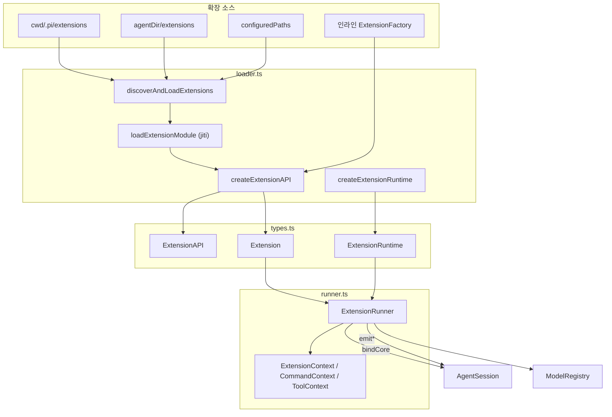
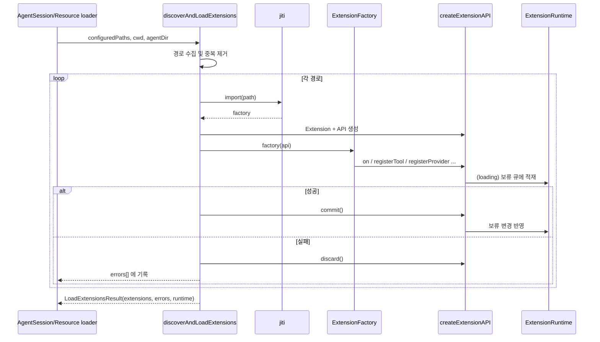
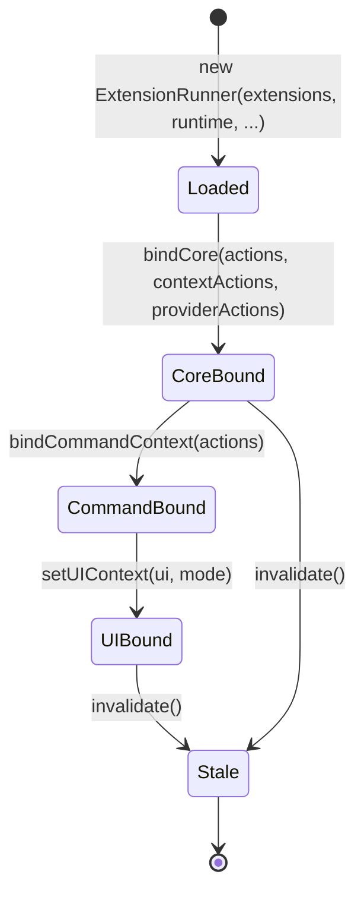
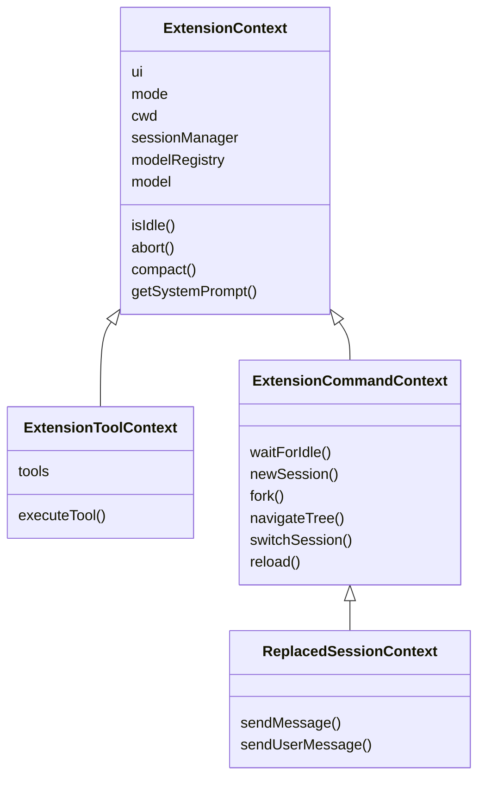
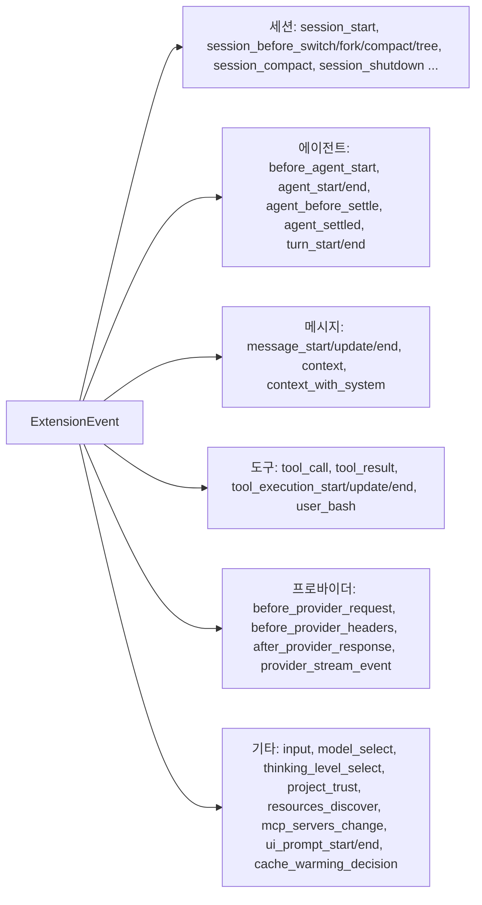
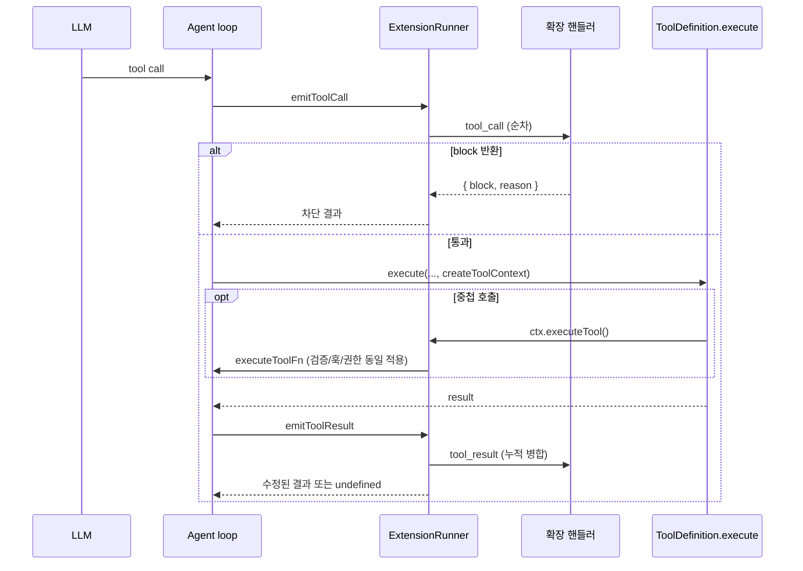

# extension_system 모듈

`extension_system`은 `packages/coding-agent`의 확장(Extension) 인프라입니다. 사용자 또는 서드파티가 작성한 TypeScript/JavaScript 모듈을 로드하고, 에이전트 라이프사이클 이벤트에 훅을 걸고, 도구·명령·단축키·CLI 플래그·프로바이더·MCP 서버·가상 모델을 등록할 수 있게 합니다.

구성 파일은 세 개입니다.

| 파일 | 역할 |
|---|---|
| `packages/coding-agent/src/core/extensions/types.ts` | 공개 계약: `ExtensionAPI`, `ExtensionContext`, 이벤트/결과 타입, `ToolDefinition`, `defineTool`, 타입 가드 |
| `packages/coding-agent/src/core/extensions/loader.ts` | 탐색(`discoverAndLoadExtensions`), jiti 로딩, `ExtensionAPI` 생성, 공유 `ExtensionRuntime` 생성 |
| `packages/coding-agent/src/core/extensions/runner.ts` | `ExtensionRunner`: 이벤트 디스패치, 컨텍스트 생성, 충돌 해소, stale 무효화, 바인딩 |

관련 모듈: 내장 도구는 [builtin_tools](builtin_tools.md), 번들 확장은 [bundled_extensions](bundled_extensions.md), MCP는 [mcp_integration](mcp_integration.md), 이를 소유하는 세션은 [agent_session_core](agent_session_core.md), 설정은 [settings_and_keybindings](settings_and_keybindings.md), 모델 레지스트리는 [model_and_auth_management](model_and_auth_management.md), UI 구현은 [interactive_mode](interactive_mode.md) / [rpc_mode](rpc_mode.md)를 참고하세요.

---

## 1. 아키텍처

핵심 설계는 **등록 단계와 실행 단계의 분리**입니다.

- 로드 시점에는 확장 팩토리가 `ExtensionAPI`를 받아 `Extension` 객체(handlers/tools/commands/flags/shortcuts/renderers)에 **등록만** 합니다.
- 액션 메서드(`sendMessage`, `setModel` 등)는 로드 중에는 예외를 던지는 stub이며, `ExtensionRunner.bindCore()`가 실제 구현으로 교체합니다.

---

## 2. 로더 (`loader.ts`)

### 2.1 탐색 규칙: `discoverAndLoadExtensions`

우선순위 순으로 경로를 모으고, `path.resolve` 기준으로 중복을 제거합니다.

1. 프로젝트 로컬: `cwd/${CONFIG_DIR_NAME}/extensions/`
2. 전역: `agentDir/extensions/` (기본 `getAgentDir()`)
3. 명시 지정 경로(`configuredPaths`): 디렉터리면 `package.json`의 `pi.extensions`(`readPiManifest`) 또는 `index.ts|js`를 우선 사용하고, 없으면 디렉터리 내부를 탐색합니다. 파일이면 그대로 추가합니다.

디렉터리 탐색(`discoverExtensionsInDir`)은 한 단계까지만 내려갑니다.

- `*.ts` / `*.js` 파일 직접 로드
- 하위 디렉터리의 `index.ts|js` 또는 `package.json`의 `pi` 매니페스트

### 2.2 모듈 로딩

`loadExtensionModule`은 jiti로 확장을 import하고 default export가 함수(`ExtensionFactory`)인지 확인합니다. 실행 환경별로 모듈 해석 방식이 다릅니다.

| 환경 | 해석 방식 |
|---|---|
| Bun 바이너리 / Node SEA / bundled Node (`usesEmbeddedModules`) | `VIRTUAL_MODULES` + `tryNative: false`, `jiti-static-loader` |
| TypeScript 소스 실행 | `VIRTUAL_MODULES` + `tsconfigPaths: true` |
| 빌드된 일반 Node | `getAliases()`의 dist 별칭 |

`getAliases()`는 `@earendil-works/pi-*`와 구 이름 `@mariozechner/pi-*`, `typebox`, `@sinclair/typebox`를 같은 엔트리로 매핑합니다. `@earendil-works/pi-ai` 루트는 compat 엔트리로 해석되어 구 전역 API를 쓰는 기존 확장도 계속 동작합니다.

`loadExtensionsCached`는 `extensionCache`(경로 → 팩토리)를 사용합니다. cwd가 바뀌거나 `clearExtensionCache()`가 호출되면 generation이 증가해 캐시가 무효화됩니다. 캐시에는 팩토리만 저장하며, 팩토리 실행은 매번 새로 이루어집니다.

### 2.3 트랜잭션형 로드: `createExtensionAPI`

반환값은 `{ api, commit, discard }`입니다. 상태는 `loading → active | failed`로 전이합니다.

- `loading` 중 프로바이더/MCP/가상 모델 등록, 플래그 기본값, 이벤트 버스 구독은 `pendingRuntimeChanges` 등에 **보류**됩니다.
- 팩토리가 성공하면 `commit()`이 한꺼번에 반영하고, 실패하면 `discard()`가 보류분과 구독을 버립니다. 따라서 중간에 실패한 확장이 런타임을 오염시키지 않습니다. 이후 해당 API 사용은 `failed` 오류를 던집니다.
- `registerTool`은 `parameters`가 객체 스키마가 아니면 예외를 던집니다. `registerCommand`는 이름과 `handler`를 검증합니다. `registerFlag`는 `default`의 타입이 `type`과 일치하는지 검증합니다.
- `registerMcpServer`는 `validateMcpServerConfig`로 검증합니다. 다른 확장이 소유한 이름과의 충돌, `-`/`_`만 다른 네임스페이스(`mcpNamespace`) 충돌도 거부합니다.
- `registerVirtualModel`은 `route`를 감싸 요청마다 `runtime.createContext()`를 주입합니다.

### 2.4 로드 시퀀스

한 확장이 실패해도 `errors`에 기록하고 다음 확장으로 계속 진행합니다.

---

## 3. 런타임 상태와 stale 방지

`ExtensionRuntime = ExtensionRuntimeState + ExtensionActions`입니다.

- **State**: `flagValues`, `pendingProviderRegistrations`, `pendingNativeProviderRegistrations`, `pendingVirtualModelRegistrations`, `mcpServers`, `createContext`, `assertActive`, `invalidate`, `trackEventBusSubscription`.
- **Actions**: 로드 중에는 stub이며 `bindCore()`에서 교체됩니다. 예외로 `refreshTools`는 로드 중 no-op이고, `setModel`은 reject합니다.

세션 교체(`newSession`/`fork`/`switchSession`)나 `reload` 후에는 `ExtensionRunner.invalidate()`가 `staleMessage`를 설정하고 런타임을 무효화하며 이벤트 버스 구독을 모두 해제합니다. 이후 캡처된 `pi`나 `ctx`를 쓰면 안내 메시지와 함께 예외가 발생합니다. 새 세션에서 작업하려면 `withSession` 콜백으로 받은 `ReplacedSessionContext`를 사용해야 합니다.

---

## 4. `ExtensionRunner` (`runner.ts`)

### 4.1 바인딩 단계

- `bindCore`: 액션을 런타임에 복사하고, MCP 변경 리스너를 연결하며, 로드 중 쌓인 프로바이더/네이티브 프로바이더/가상 모델 등록을 플러시합니다. 실패는 `emitError`로 보고합니다. 이후 `registerProvider` 등은 `/reload` 없이 즉시 `ModelRegistry`에 반영됩니다.
- `bindCommandContext`: `waitForIdle`, `newSession`, `fork`, `navigateTree`, `switchSession`, `reload` 핸들러를 연결합니다. 인자가 없으면 no-op 기본값을 사용합니다.
- `setUIContext`: UI를 `wrapUIPromptContext`로 감싸서 `select`/`confirm`/`input`/`editor`/`custom` 호출 시 `ui_prompt_start`/`ui_prompt_end` 이벤트를 냅니다. 중첩은 `uiPromptDepth`로 합산하여 최외곽 프롬프트만 이벤트를 냅니다. UI가 없으면 `noOpUIContext`를 쓰고 `hasUI()`는 false입니다.

### 4.2 컨텍스트 계층

모든 컨텍스트 getter는 호출 시점에 `assertActive()`를 거치는 지연 평가입니다. `createCommandContext`가 객체 spread 대신 `Object.getOwnPropertyDescriptors`를 쓰는 이유는, spread가 getter를 즉시 평가해 stale 검사를 우회하는 값 고정을 일으키기 때문입니다. `createToolContext(toolCallId, signal)`가 만드는 `executeTool`은 도구 실패를 reject하지 않고 `isError: true` 결과로 돌려줍니다.

### 4.3 이벤트 디스패치 의미론

모든 디스패치는 `snapshotEventHandlers`로 핸들러 배열을 복사한 뒤 확장 등록 순서대로 순차 실행합니다. 실행 중 핸들러가 해제되어도 안전합니다.

| 메서드 | 이벤트 | 결합 규칙 |
|---|---|---|
| `emit` | 일반 이벤트, `session_before_*` | 오류는 `emitError`로 격리. `session_before_*`는 마지막 결과 반환, `cancel`이면 즉시 중단 |
| `emitToolCall` | `tool_call` | `block`이 나오면 즉시 반환. `event.input`은 변경 가능(재검증 없음). **오류를 격리하지 않음** |
| `emitToolResult` | `tool_result` | 필드별로 누적 병합. `content`만 교체하면 `structuredContent` 삭제 |
| `emitUserBash` | `user_bash` | 첫 non-undefined 결과 반환. 형식 검증(`operations` 또는 `result` 중 정확히 하나). 오류 시 재던짐 |
| `emitContext` | `context`, `context_with_system` | 2단계 변환 (아래 참조) |
| `emitBeforeProviderRequest` | `before_provider_request` | 반환값으로 payload 교체 |
| `emitBeforeProviderHeaders` | `before_provider_headers` | `headers`를 제자리 수정, 반환값 무시 |
| `emitBeforeAgentStart` | `before_agent_start` | 메시지를 수집하고 `systemPrompt` 오버라이드를 `forceSystemPrompt`에 누적 |
| `emitMessageEnd` | `message_end` | 교체 메시지는 role이 같아야 함 |
| `emitInput` | `input` | `transform`은 체이닝, `handled`는 단락 |
| `emitResourcesDiscover` | `resources_discover` | skill/prompt/theme 경로를 확장 경로와 함께 수집 |
| `emitCacheWarmingDecision` | `cache_warming_decision` | 마지막 오버라이드가 우선 |
| `emitBoundary` | `turn_end`, `agent_before_settle` | `entries`/`continue` 갱신 후 매번 컨텍스트 미리보기를 재구성. 검증 실패 시 `valid: false`로 전체 폐기 |
| `emitProjectTrustEvent` (함수) | `project_trust` | 첫 `yes`/`no`가 우선, `undecided`는 다음으로 |

#### `context` 2단계 변환

- `context` 핸들러는 대화만 보며, 프롬프트와 도구 선언은 Pi가 복원합니다. 대화가 변경되지 않았으면 모든 system 메시지를 그대로 두어 캐시 prefix를 유지합니다. 변경되었으면 `getCurrentSystemMessage`로 얻은 선두 system 메시지를 앞에 붙입니다.
- `context_with_system` 핸들러의 출력은 그대로 사용합니다. 선두 system 메시지를 지우면 오류만 보고하고 결과는 존중합니다.

### 4.4 충돌 해소

- **도구**: `getAllRegisteredTools`와 `getToolDefinition`은 먼저 등록된 것이 우선합니다.
- **플래그**: 이름이 같으면 먼저 등록된 것이 우선합니다. `setFlagValue`는 `runtime.flagValues`에 기록합니다.
- **명령**: 동명이면 `name:1`, `name:2` 형태의 `invocationName`을 부여하고, 이미 쓰인 이름이면 접미사를 올립니다.
- **단축키** (`getShortcuts`): `RESERVED_KEYBINDINGS_FOR_EXTENSION_CONFLICTS`(예: `app.interrupt`, `app.exit`, `tui.input.submit`)에 속한 키는 확장이 덮어쓸 수 없고 경고 후 건너뜁니다. 예약되지 않은 내장 키는 확장이 덮어쓰되 경고합니다. 확장끼리 충돌하면 나중 것이 이깁니다. 진단은 `getShortcutDiagnostics()`로 조회합니다.
- **MCP**: `mcp_servers_change` 핸들러가 없으면 `reportUnhandledMcpServers`가 "등록되었지만 연결하는 확장이 없음" 오류를 한 번만 보고합니다.

### 4.5 오류 모델

대부분의 디스패치는 핸들러 예외를 잡아 `ExtensionError`(`extensionPath`, `event`, `error`, `stack`)로 변환하고 `onError` 리스너에 전달합니다. 즉 확장 하나의 실패가 에이전트를 중단시키지 않습니다. 예외는 `emitToolCall`(오류 미격리)과 `emitUserBash`(오류 재던짐)입니다. `emitToolCall`은 코드상 try/catch가 없으므로 `tool_call` 핸들러 예외는 호출자로 전파됩니다.

---

## 5. 공개 계약 (`types.ts`)

### 5.1 `ExtensionAPI`

| 범주 | 메서드 |
|---|---|
| 이벤트 | `on(event, handler)` (이벤트별 오버로드, 구독 해제 함수 반환) |
| 등록 | `registerTool`, `registerCommand`, `registerShortcut`, `registerFlag`, `getFlag` |
| 렌더링 | `registerMessageRenderer`, `registerEntryRenderer`, `registerMarkdownTransformer` |
| 세션 액션 | `sendMessage`, `sendUserMessage`, `appendEntry`, `setSessionName`, `getSessionName`, `setLabel`, `exec` |
| 도구 상태 | `getActiveTools`, `getAllTools`, `setActiveTools`, `getCommands`, `getSettings` |
| 모델 | `setModel`, `getThinkingLevel`, `setThinkingLevel` |
| 프로바이더 | `registerProvider`(네이티브 `Provider` 또는 이름+`ProviderConfig`), `unregisterProvider` |
| MCP | `registerMcpServer`, `unregisterMcpServer`, `getMcpServers` |
| 가상 모델 | `registerVirtualModel`, `unregisterVirtualModel` |
| 통신 | `events` (공유 `EventBus`) |

### 5.2 이벤트 분류

도구 이벤트는 `toolName`으로 구별되는 합집합입니다 (`BashToolCallEvent`, `ReadToolCallEvent`, `EditToolCallEvent`, `WriteToolCallEvent`, `GrepToolCallEvent`, `FindToolCallEvent`, `LsToolCallEvent`, `PowerShellToolCallEvent`, `CustomToolCallEvent` 및 대응하는 `*ToolResultEvent`). `CustomToolCallEvent.toolName`이 `string`이라 `event.toolName === "bash"`로는 좁혀지지 않으므로 `isToolCallEventType("bash", event)`와 `isBashToolResult` 등 타입 가드를 사용합니다. 다른 도구가 호출한 중첩 호출은 `parentToolCallId`가 설정되고 id가 `<parent id>/<n>` 형식입니다.

### 5.3 경계(Boundary) 이벤트

`turn_end`와 `agent_before_settle`은 `BoundaryState`(`entries`, `continue`, `context`, `outcome`)를 갖습니다. 핸들러는 `BoundaryResult`로 `SessionBoundaryDraft`(`CustomEntryDraft`, `CustomMessageEntryDraft`, `ContextEditEntryDraft`, `CompactionEntryDraft`)를 추가하거나 `continue: true`로 다음 프로바이더 요청을 한 번 더 보장할 수 있습니다.

### 5.4 `ToolDefinition`과 `defineTool`

`ToolDefinition`은 `name`, `label`, `description`, `parameters`(TypeBox), `execute(toolCallId, params, signal, onUpdate, ctx: ExtensionToolContext)`가 필수입니다. 선택 필드는 다음과 같습니다.

- 프롬프트: `promptSnippet`, `promptGuidelines`
- 인자 처리: `prepareArguments`, `outputSchema`, `constrainedSampling`
- 렌더링: `renderCall`, `renderResult`, `renderShell`
- 실행 정책: `executionMode`, `annotations`(MCP 힌트), `namespace`, `defaultActive`, `prepareLoadout`
- 노출: `exposure`

`exposure`에 따라 모델에 보이는지와 `ctx.executeTool()`로 호출 가능한지가 달라집니다.

| exposure | 모델에 선언 | 다른 도구가 호출 |
|---|---|---|
| `direct` (기본) | 활성 시 | 활성 시 |
| `model-only` | 활성 시 | 불가 |
| `codemode` | 명시 활성화 시 | 등록되면 항상 |
| `deferred` | 명시 활성화 시 | 항상 (codemode 설명엔 미표시, tool search로 발견) |
| `hidden` | 불가 | 불가 |

`defineTool`은 런타임 동작이 없는 항등 함수입니다. 배열이나 변수에 담을 때 파라미터 타입 추론이 `unknown`으로 넓어지는 것을 막습니다.

### 5.5 프로바이더 설정 타입

`ProviderConfig`는 `baseUrl`, `apiKey`, `api`, `streamSimple`, `images`, `classifiers`, `headers`, `models`, `refreshModels`, `oauth`를 가집니다. 모델 설정은 `ProviderModelConfigBase`를 공통으로 하고 `ProviderChatModelConfig`(기본, `type` 생략 가능), `ProviderImageModelConfig`(`type: "image"`), `ProviderClassifierModelConfig`(`type: "classifier"`)로 나뉩니다. 이 타입들은 `core/provider-composer.ts`에도 같은 이름이 있으므로 [model_and_auth_management](model_and_auth_management.md)와 함께 보세요.

### 5.6 `InlineExtension`

인라인 확장은 `ExtensionFactory` 또는 `{ name, factory, hidden?, replaceable?, builtin? }`입니다. `replaceable`은 다른 확장이 같은 도구/명령/플래그를 등록하면 충돌 보고 없이 빠지게 하며, 내장 MCP·codemode·tool-search가 이 방식으로 사용자 확장에 대체될 수 있습니다. `builtin`은 `builtin:<name>` 리소스로 로드되어 `pi config`와 `--no-extensions`로 제어됩니다. 자세한 내용은 [bundled_extensions](bundled_extensions.md)를 참고하세요.

---

## 6. 요청 흐름 예: 도구 호출 한 번

---

## 7. 테스트·빌드 참고

`packages/coding-agent/vitest.config.ts`가 이 패키지의 테스트 설정입니다. 저장소 규칙상 `packages/coding-agent/test/suite/`는 `harness.ts`와 faux provider를 사용하고 실제 프로바이더 API는 쓰지 않습니다. 이 문서는 해당 설정 파일을 직접 열어 확인하지 않았으므로 세부 설정은 **미확인**입니다.

---

## 8. 확장 시 주의사항

- 팩토리 안에서 액션 메서드(`sendMessage` 등)를 호출하면 "not initialized" 예외가 납니다. 이벤트 핸들러나 명령 핸들러 안에서 호출해야 합니다.
- 프로바이더/MCP/가상 모델 등록은 로드 중에는 보류되고 `commit` 뒤에 적용됩니다. 바인딩 후에는 즉시 적용됩니다.
- 세션 교체 후에는 캡처한 `pi`/`ctx`를 재사용하지 말고 `withSession`의 컨텍스트를 사용하세요.
- `tool_call`에서 인자를 바꾸려면 `event.input`을 제자리에서 수정합니다. 수정 후 스키마 재검증은 하지 않습니다.
- 확장 단축키는 예약 키를 덮어쓸 수 없습니다. 하드코딩된 키 검사 대신 키바인딩 설정을 사용하는 저장소 규칙은 [settings_and_keybindings](settings_and_keybindings.md)를 참고하세요.

---

## 검증 수준

위 내용은 제공된 `loader.ts`, `runner.ts`, `types.ts` 소스를 읽고 정리한 것으로 **코드 확인** 수준입니다. 호출 측(`AgentSession`, 각 mode)이 `bindCore`/`emit*`를 어떻게 부르는지는 이번 입력 범위 밖이라 **미확인**입니다. 개발자 의도에 대한 서술(예: getter 지연 평가의 이유)은 코드 주석에 근거한 것이며 그 외는 추론입니다.
