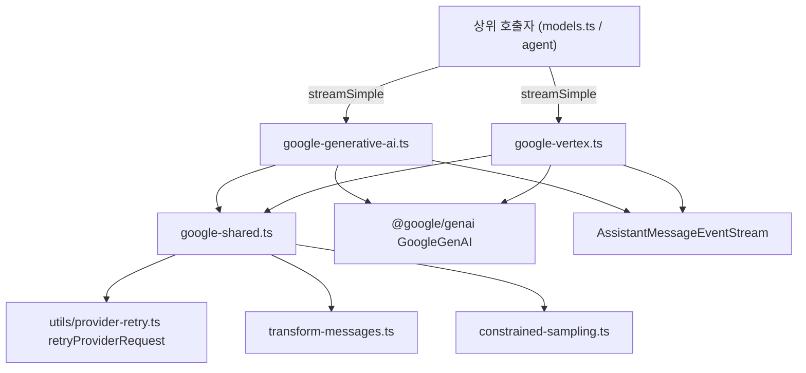
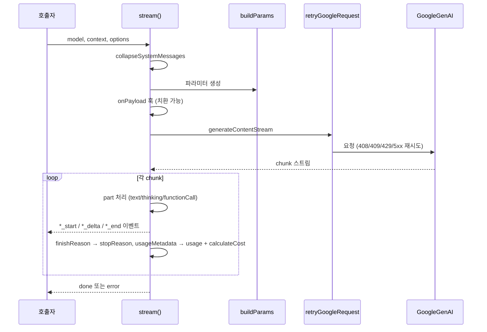

# google_provider_apis

## 개요

`google_provider_apis`는 `packages/ai`의 LLM 프로바이더 어댑터 중 **Google Gemini 계열 API** 두 가지를 담당하는 모듈이다.

| 파일 | API 식별자 | 역할 |
|---|---|---|
| `packages/ai/src/api/google-generative-ai.ts` | `"google-generative-ai"` | Gemini Developer API (API 키 기반) |
| `packages/ai/src/api/google-vertex.ts` | `"google-vertex"` | Vertex AI (ADC/프로젝트·리전 또는 Vertex API 키) |
| `packages/ai/src/api/google-shared.ts` | (공용) | 두 어댑터가 공유하는 메시지·도구·thinking·재시도 유틸 |

두 어댑터 모두 `@google/genai` SDK(`GoogleGenAI`)의 `models.generateContentStream`을 호출하고, 응답 청크를 pi 공통 이벤트 스트림(`AssistantMessageEventStream`)으로 변환한다. 상위 계층은 [llm_provider_adapters](llm_provider_adapters.md)이며, 다른 프로바이더 어댑터는 [anthropic_provider_api](anthropic_provider_api.md), [openai_provider_apis](openai_provider_apis.md), [bedrock_provider_api](bedrock_provider_api.md) 등을 참고한다. 모델 레지스트리·인증은 [ai_platform_foundation](ai_platform_foundation.md)에서 다룬다.

별도 하위 모듈로 나누지 않고 이 문서 한 장에서 설명한다. (파일 3개, 두 어댑터는 사실상 동일 구조)

## 아키텍처

### 두 어댑터의 차이

| 항목 | `google-generative-ai` | `google-vertex` |
|---|---|---|
| 인증 | `options.apiKey` 필수 (없으면 오류) | `resolveApiKey` 결과가 있으면 API 키, 없으면 ADC |
| 클라이언트 생성 | `createClient(model, apiKey, headers)` | `createClient(model, project, location, headers, env)` / `createClientWithApiKey` |
| 프로젝트/리전 | 없음 | `resolveProject`(`GOOGLE_CLOUD_PROJECT`/`GCLOUD_PROJECT`), `resolveLocation`(`GOOGLE_CLOUD_LOCATION`) |
| baseUrl | 지정 시 `apiVersion = ""` | `{location}` 템플릿 포함 시 무시, 버전 경로 포함 시 `apiVersion = ""`, `ResourceScope.COLLECTION` |
| 기본 API 버전 | SDK 기본 | `"v1"` |
| 자격 파일 | - | `GOOGLE_APPLICATION_CREDENTIALS` → `googleAuthOptions.keyFilename` |
| thinking 예산(2.5-flash-lite) | 별도 테이블 있음 | 없음 (flash 테이블에 포함) |

`resolveApiKey`는 빈 값, 마커 `gcp-vertex-credentials`, `<placeholder>` 형태 문자열을 "키 없음"으로 취급한다.

## 핵심 컴포넌트

### `streamSimple` (각 어댑터)
`SimpleStreamOptions`를 어댑터 전용 옵션(`GoogleOptions` / `GoogleVertexOptions`)으로 변환하는 진입점이다.

1. `buildBaseOptions`로 공통 옵션 생성, `toolChoice` 추가.
2. `reasoning` 없음 또는 `clampThinkingLevel` 결과가 `"off"` → `thinking: { enabled: false }`.
3. 그 외 `resolveGoogleThinkingLevel`로 레벨 해석 후:
   - `usesGoogleThinkingLevel(model)`(Gemini 3 Pro/Flash, `gemini-flash-latest`, Gemma 4) → 이산 `level` 사용.
   - 그 외 → `getGoogleBudget`으로 토큰 `budgetTokens` 계산 (사용자 지정 `thinkingBudgets` 우선, 2.5-pro/flash 등 모델별 기본값, 매칭 없으면 `-1` 동적).

### `stream` (내부 구현)
비동기 IIFE로 `AssistantMessage`를 누적하며 이벤트를 push한다.

주요 동작:
- `isThinkingPart`(`part.thought === true`)로 thinking/text 블록을 구분하고, 종류가 바뀌면 이전 블록을 `*_end`로 닫는다.
- `retainThoughtSignature`로 스트림 중 `thoughtSignature`가 `undefined`로 덮어써지지 않게 유지한다.
- `functionCall`은 한 번에 `toolcall_start/delta/end`를 낸다. ID가 없거나 중복이면 `${name}_${Date.now()}_${++toolCallCounter}`로 생성한다.
- `finishReason` → `mapStopReason`; 도구 호출이 있고 `stop`이면 `toolUse`로 승격.
- usage: `input = prompt − cachedContent`, `output = candidates + thoughts`, `cacheRead = cachedContent`, `reasoning = thoughts`.
- 종료 검증: abort 여부, `pending`(finish reason 없음), `error`/`aborted`는 예외로 처리하여 `catch`에서 `error` 이벤트로 변환 (`formatProviderError(normalizeProviderError(error))`).
- 커스텀 `fetch`는 지원하지 않으며 지정 시 오류.

### `buildParams` (각 어댑터)
`GenerateContentParameters`를 만든다: `convertMessages` → `contents`, 초기 system 메시지 → `systemInstruction`(`sanitizeSurrogates`), `temperature`/`maxOutputTokens`, 도구(`convertTools`)와 `toolConfig.functionCallingConfig.mode`, `thinkingConfig`(`includeThoughts`, `thinkingLevel` 또는 `thinkingBudget`; 비활성화 시 `getDisabledGoogleThinkingConfig`), `abortSignal`(이미 abort면 즉시 예외).

### `google-shared.ts`

| 함수 | 책임 |
|---|---|
| `convertMessages` | 내부 메시지 → Gemini `Content[]`. system 선두 메시지 제거, 도구 호출 ID 정규화(`requiresToolCallId`: claude-/gpt-oss-/Gemini 3+), 같은 provider·model일 때만 thinking/서명 유지, 아니면 평문 변환. 연속된 `functionResponse`를 단일 user 턴으로 병합. Gemini 3 미만은 이미지 결과를 별도 user 턴으로 전송 |
| `convertTools` | `Tool[]` → `functionDeclarations`. 기본 `parametersJsonSchema`, `useParameters`면 `parameters`(OpenAPI, 메타 선언 제거) |
| `isThinkingPart` | `thought === true` 판별 (서명은 판별 기준이 아님) |
| `retainThoughtSignature` | 마지막 비어있지 않은 서명 유지 |
| `mapStopReason` / `mapStopReasonString` | `FinishReason` → `StopReason` (`STOP`→stop, `MAX_TOKENS`→length, 나머지→error) |
| `retryGoogleRequest` | `retryProviderRequest`로 감싸 재시도. SDK `ApiError`에 `headers`가 없어 재시도 대상에서 빠지는 문제를 `headers = undefined`를 추가해 보정 |

보조(비핵심 export): `resolveGoogleThinkingLevel`, `usesGoogleThinkingLevel`, `toGoogleThinkingLevel`, `toGoogleSdkThinkingLevel`, `getDisabledGoogleThinkingConfig`, `supportsGoogleStrictToolSampling`(Gemini 3+), `resolveGoogleFunctionCallingMode`(strict 도구가 있으면 `VALIDATED`), `mapToolChoice`.

서명 검증: `thoughtSignature`는 base64(길이 4의 배수)여야 하고 동일 provider/model에서 온 경우에만 재전송한다. 빈 텍스트/thinking 블록도 서명이 있으면 유지한다(thought-only STOP 방지, 코드 주석 근거).

## 유지보수 시 주의점

- `google-generative-ai.ts`와 `google-vertex.ts`의 `stream` 본문은 거의 복제 구조다. 스트림 처리 로직을 수정하면 **양쪽을 함께** 수정해야 한다.
- 모델 ID 기반 정규식(`usesGoogleThinkingLevel`, `getGeminiMajorVersion`)은 신규 Gemini 버전 출시 시 갱신 지점이다.
- 테스트 설정: `packages/ai/vitest.config.ts` (프로젝트 규칙상 실제 프로바이더 호출 테스트는 faux provider 사용).

## 검증 수준

위 내용은 제공된 소스 코드를 직접 읽고 작성했다 (코드 확인). 호출자(`models.ts` 등)와의 정확한 연결 경로는 이 문서에서 확인하지 않았다 (미확인).
