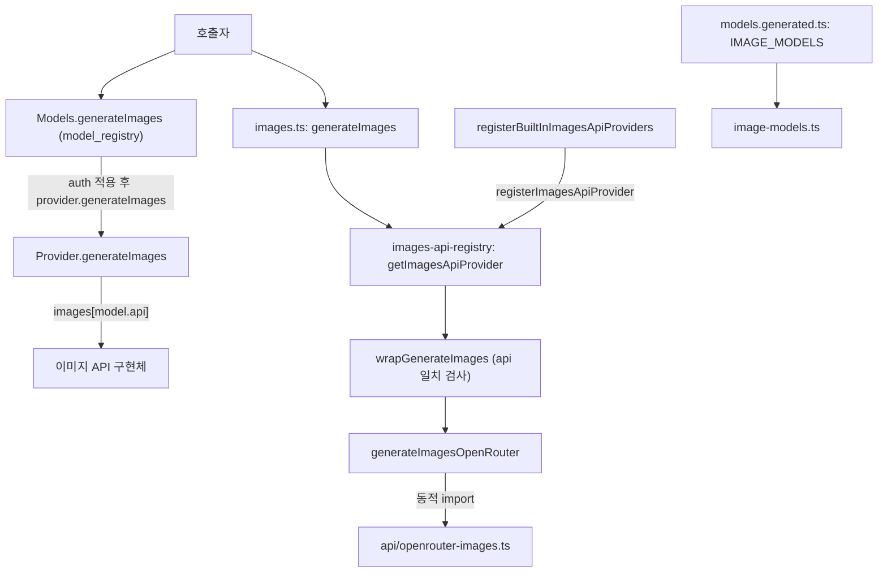
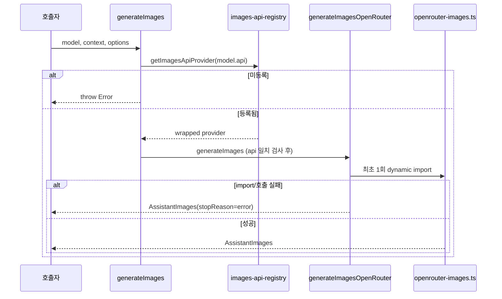

# image_generation 모듈

`packages/ai`의 이미지 생성 경로를 담당하는 모듈이다. 이미지 모델 카탈로그를 읽는 호환용 API(`image-models.ts`), `model.api` 기준으로 구현체를 찾아 호출하는 전역 디스패처(`images.ts`), 내장 provider(`openrouter-images`)를 지연 로딩으로 등록하는 코드(`providers/images/register-builtins.ts`)로 구성된다.

상위 문맥은 [llm_provider_adapters](llm_provider_adapters.md)이다. 새 코드에서 권장하는 진입점인 `Models.generateImages()`는 [model_registry](model_registry.md)에 있다. 카탈로그 생성은 [build_and_test_config](build_and_test_config.md)의 `generate-models.ts`가 맡는다.

## 1. 구성 요소

| 파일 | 식별자 | 역할 |
|---|---|---|
| `packages/ai/src/image-models.ts` | `getImageModel`, `getImageModels`, `getImageProviders` | `models.generated.ts`의 `IMAGE_MODELS`를 읽는 정적 조회. 모두 `@deprecated` |
| `packages/ai/src/images.ts` | `generateImages` | `model.api`로 provider를 찾아 위임하는 전역 함수 |
| `packages/ai/src/providers/images/register-builtins.ts` | `generateImagesOpenRouter`, `registerBuiltInImagesApiProviders` | `openrouter-images` 구현체를 lazy import로 감싸 레지스트리에 등록 |

레지스트리 자체(`registerImagesApiProvider`, `getImagesApiProvider`)는 `packages/ai/src/images-api-registry.ts`에 있으며 이 모듈의 핵심 컴포넌트는 아니지만 동작 이해에 필요하다. (코드 확인)

## 2. 아키텍처



두 경로가 공존한다.

- **전역 경로**: `generateImages()` → 레지스트리 → 구현체. 인증을 자동 해석하지 않으므로 `options.apiKey`를 직접 넘겨야 한다. 주석에서도 `Models.generateImages()`를 권장한다.
- **Models 경로**: `ModelsImpl.generateImages`가 `assertImageModel`, provider 조회, `applyAuth`를 거쳐 provider의 `generateImages`를 호출한다. 실패는 `imageErrorResult`로 변환되어 reject되지 않는다. (코드 확인, `models.ts`)

## 3. 컴포넌트 상세

### 3.1 `image-models.ts`

- 모듈 로드 시 `IMAGE_MODELS`를 순회해 `Map<provider, Map<modelId, ImageModel>>`을 만든다. 이미지 모델이 없는 provider는 제외한다.
- `getImageModel(provider, modelId)`: 없으면 `undefined`를 반환하지만 타입은 존재를 가정한다(캐스트).
- `getImageModels(provider)`: 없는 provider는 `[]`.
- `getImageProviders()`: 이미지 모델이 하나 이상 있는 provider ID 목록.
- 타입 `BuiltinImageProvider`는 카탈로그 키 중 모델이 `never`가 아닌 것만 추린다. 모델 ID와 `api`가 컴파일 타임에 추론된다.
- 대체 API: `getBuiltinImageModel`(`providers/all`), `Models.getModelOfType("image", ...)`, `Models.getModelsOfType("image")`.

### 3.2 `images.ts`

```ts
generateImages(model, context, options?) // -> Promise<AssistantImages>
```

`import "./providers/images/register-builtins.ts"`로 부작용 import를 하여 내장 provider를 보장한다. 등록되지 않은 `api`면 `No API provider registered for api: ${api}` 오류를 **throw**한다. 이 점이 reject하지 않는 `Models.generateImages()`와 다르다. (코드 확인)

### 3.3 `register-builtins.ts`

- `openRouterImagesProviderModulePromise`에 캐시하여 `api/openrouter-images.ts`를 최초 호출 시에만 동적 import한다. SDK 의존성을 시작 시점에 끌어오지 않기 위한 구조이다 (추론).
- `generateImagesOpenRouter`는 import 또는 호출 중 예외를 잡아 `createLazyLoadErrorImages`로 `stopReason: "error"`, `output: []`, `errorMessage`가 채워진 `AssistantImages`를 반환한다.
- 모듈 끝에서 `registerBuiltInImagesApiProviders()`를 즉시 호출하여 `api: "openrouter-images"`를 등록한다.
- 레지스트리의 `wrapGenerateImages`가 `model.api !== api`이면 `Mismatched api` 오류를 던진다.

## 4. 데이터 타입 (`types.ts`)

| 타입 | 내용 |
|---|---|
| `ImageModel<TApi>` | `type: "image"`, `output: ("text"\|"image")[]`. `generateImages()` 전용 |
| `ImagesContext` | `input: (TextContent \| ImageContent)[]` |
| `ImagesOptions` | `ProviderRequestOptions` 확장 + `metadata` |
| `ProviderImagesOptions` | `ImagesOptions & Record<string, unknown>` |
| `AssistantImages` | `api, provider, model, output, responseId?, usage?, stopReason("stop"\|"error"\|"aborted"), errorMessage?, timestamp` |
| `KnownImageApi` | 현재 `"openrouter-images"` 하나. `ImageApi`는 임의 문자열을 허용 |

## 5. 실행 흐름



## 6. 유의점

- `image-models.ts`는 deprecated 호환 계층이다. 신규 코드는 `Models`를 쓴다.
- 전역 `generateImages()`는 인증을 해석하지 않는다.
- 에러 처리 규약이 경로마다 다르다(전역 경로는 미등록 시 throw, 지연 로딩 실패는 error 결과 반환, `Models`는 항상 결과 반환).
- `openrouter-images.ts` 내부 구현은 이번 분석 범위에서 읽지 않았다. (미확인)
- 테스트 설정은 `packages/ai/vitest.config.ts`를 참고한다. 이 모듈 전용 테스트는 확인하지 않았다. (미확인)
