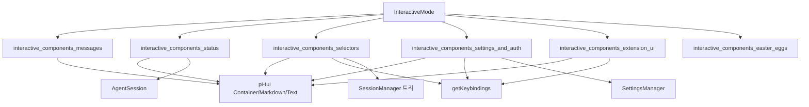

# interactive_components 모듈

`packages/coding-agent/src/modes/interactive/components/` 아래의 TUI 컴포넌트 모음이다. 대화 메시지 렌더링, 상태 표시, 각종 선택 UI, 설정/인증 대화상자, 확장(extension)용 입력 UI, 이스터에그를 담당한다. 모두 `@earendil-works/pi-tui`의 `Container`/`Component`/`Focusable` 위에 구현되며, 상위 [interactive_mode](interactive_mode.md)가 이 컴포넌트들을 생성·배치·포커스 전환한다.

검증 수준: 제공된 소스 코드 확인 (실행 확인 없음).

## 아키텍처 개요

공통 패턴:
- 생성자에서 `DynamicBorder`/`Spacer`/`Text`로 레이아웃을 구성하고, 상태 변경 시 `clear()` 후 재구성(`updateContent`/`updateList`/`rebuild`).
- 입력은 `handleInput(keyData)`에서 `getKeybindings().matches(...)`로 처리하며 키를 하드코딩하지 않는다(`tui.select.*`, `app.*`).
- IME 커서 위치를 위해 `Focusable.focused` setter가 내부 `Input`/`Editor`로 포커스를 전파한다.
- 콜백(`onSelect`/`onCancel`)으로 결과를 상위에 전달한다.

## 하위 모듈

| 모듈 | 문서 | 핵심 컴포넌트 |
|---|---|---|
| 메시지 렌더링 | [interactive_components_messages](interactive_components_messages.md) | `AssistantMessageComponent`, `UserMessageComponent`, `CustomMessageComponent`, `ToolExecutionComponent`, `BashExecutionComponent` |
| 상태/푸터/로더 | [interactive_components_status](interactive_components_status.md) | `FooterComponent`, `StatusIndicator`(+Working/Retry/Compaction/BranchSummary), `BorderedLoader` |
| 선택기 | [interactive_components_selectors](interactive_components_selectors.md) | `ModelSelectorComponent`, `ScopedModelsSelectorComponent`, `SessionSelectorComponent`, `TreeSelectorComponent`, `ThinkingSelectorComponent`, `UserMessageSelectorComponent`, `TrustSelectorComponent` |
| 설정/인증 | [interactive_components_settings_and_auth](interactive_components_settings_and_auth.md) | `SettingsSelectorComponent`, `SelectSubmenu`/`SteppedSubmenu`, `ConfigSelectorComponent`, `LoginDialogComponent`, `OAuthSelectorComponent`, `FirstTimeSetupComponent` |
| 확장 UI | [interactive_components_extension_ui](interactive_components_extension_ui.md) | `ExtensionEditorComponent`, `ExtensionInputComponent`, `ExtensionSelectorComponent` |
| 이스터에그 | [interactive_components_easter_eggs](interactive_components_easter_eggs.md) | `EasterEgg3dAnimation`, `BlockRaster`, `playEasterEgg3d`, `ArminComponent` |

## 요약

- **메시지**: 어시스턴트 메시지는 OSC 133 존 마커와 thinking 블록 토글(`MouseRegion` 클릭)을 지원한다. 도구 실행은 `renderCall`/`renderResult` 렌더러가 실패하면 fallback 텍스트로 대체한다. bash 실행은 20줄 미리보기와 확장/축소를 제공한다.
- **상태**: 푸터는 세션 엔트리 수/leaf/모델이 바뀔 때만 사용량 통계를 재계산(캐시)한다. 컨텍스트 사용률 70%/90%에서 색이 바뀐다.
- **선택기**: 퍼지 필터(`fuzzyFilter`), 스크롤 윈도, 위/아래 순환. 세션 선택기는 비동기 로드·삭제(`trash` → `unlink`)·이름 변경, 트리 선택기는 접기/필터/라벨 편집을 지원한다.
- **설정/인증**: 설정 항목을 콜백으로 `SettingsManager`에 반영하고, 로그인 대화상자는 `AbortController`로 OAuth 흐름을 취소한다.
- **확장 UI**: `CountdownTimer` 기반 타임아웃과 외부 에디터(Ctrl+G 계열 `app.editor.external`) 연동.

## 테스트 설정

`packages/coding-agent/vitest.config.ts`가 이 패키지의 테스트 설정이다(미확인: 컴포넌트별 테스트 범위).
