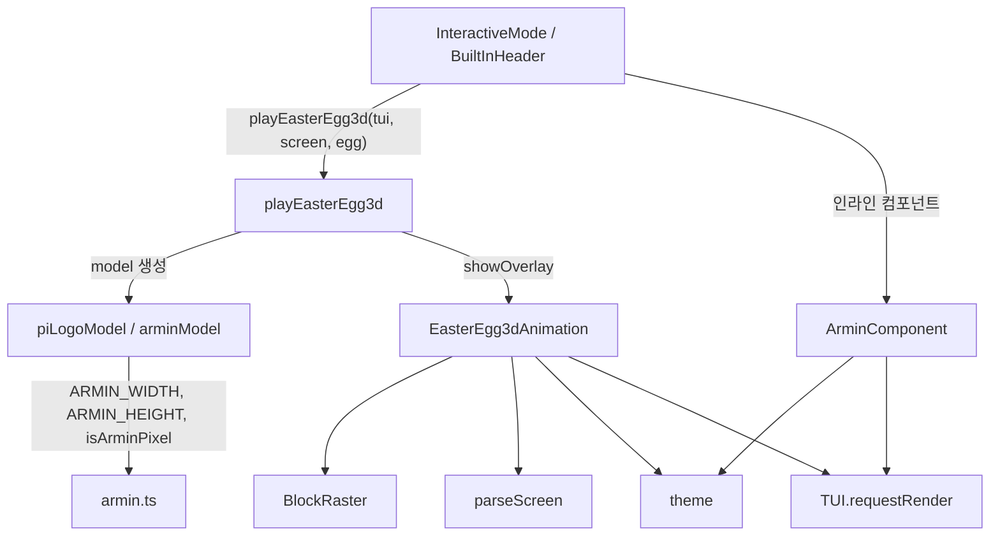
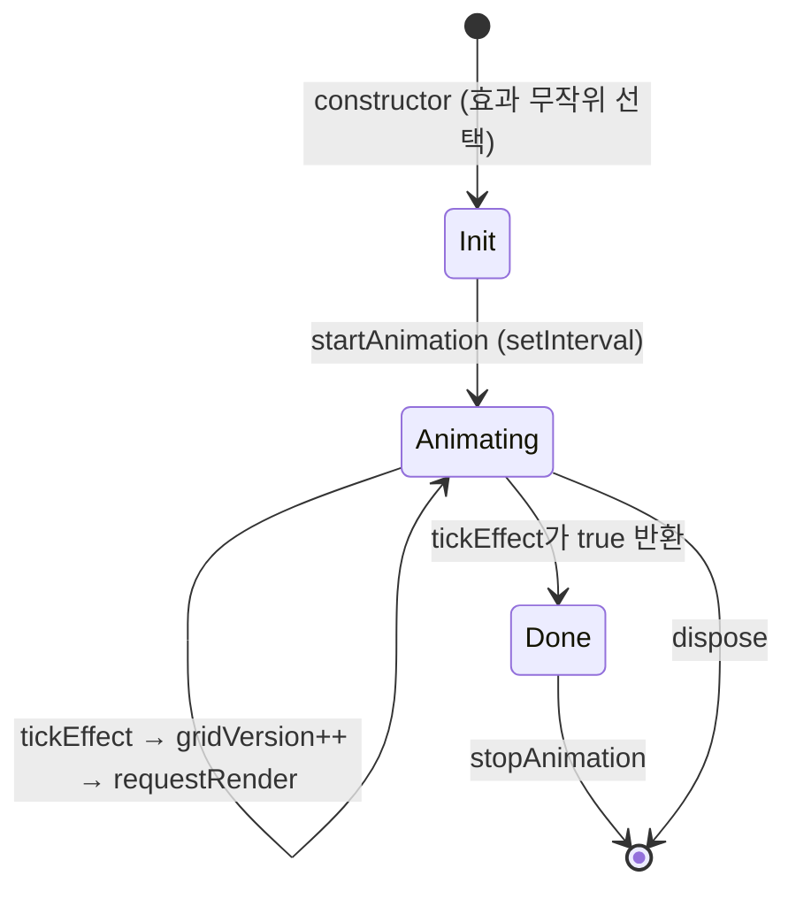
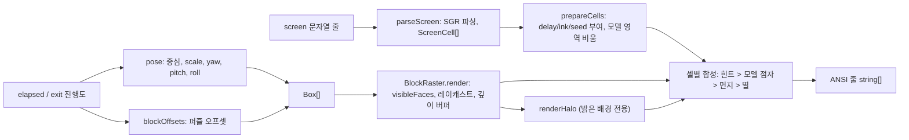
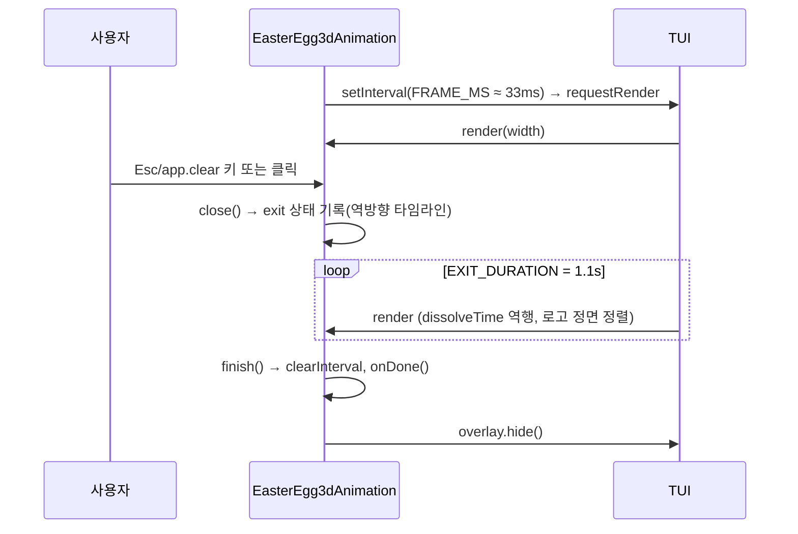

# interactive_components_easter_eggs

터미널 UI(TUI)에 숨겨진 이스터에그 두 가지를 구현하는 모듈이다. 모두 `packages/coding-agent/src/modes/interactive/components/` 아래에 있다.

| 파일 | 핵심 컴포넌트 | 역할 |
|------|---------------|------|
| `armin.ts` | `ArminComponent.render` | `/arminsayshi`에서 쓰이는 XBM 비트맵 아트를 7가지 랜덤 효과로 그려 주는 인라인 애니메이션 |
| `easter-egg-3d.ts` | `EasterEgg3dAnimation.render` | 전체 화면 오버레이. 현재 화면을 점자(braille) 먼지로 분해하고, 가운데에서 회전하는 3D 블록 모델(pi 로고 또는 Armin)을 레이캐스팅으로 렌더링 |

상위 모듈 [interactive_components](interactive_components.md)의 하위 그룹이며, 형제 문서로 [interactive_components_messages](interactive_components_messages.md), [interactive_components_status](interactive_components_status.md) 등이 있다. 호스트인 [interactive_mode](interactive_mode.md)가 헤더 로고 클릭(`BuiltInHeader.handleMouse`)이나 슬래시 커맨드에서 이 모듈을 호출한다. 테마는 `theme/theme.ts`의 `theme`를, TUI 기본 요소(`Component`, `TUI`, 색상/마우스 유틸)는 `@earendil-works/pi-tui`를 사용한다.

## 아키텍처

핵심은 `armin.ts`가 두 역할을 겸한다는 점이다. 자체 애니메이션 컴포넌트(`ArminComponent`)이면서, 3D 모델의 비트맵 데이터 소스(`isArminPixel`, `ARMIN_WIDTH=31`, `ARMIN_HEIGHT=36`)이기도 하다. `easter-egg-3d.ts`는 이를 import하여 픽셀마다 블록 하나를 만든다.

## ArminComponent (`armin.ts`)

- 31x36 XBM(LSB first, 1=배경, 0=전경) 비트맵을 half-block 문자(`█ ▀ ▄`)로 변환해 `finalGrid`(18행 x 31열)를 만든다. `isArminPixel(x, y)`가 픽셀 판정을 담당한다.
- 생성자에서 `EFFECTS` 중 하나(`typewriter`, `scanline`, `rain`, `fade`, `crt`, `glitch`, `dissolve`)를 무작위로 고르고 `initEffect()`로 상태를 준비한 뒤 `startAnimation()`으로 `setInterval`을 시작한다(`glitch`는 60fps, 나머지 30fps).
- 매 틱: `tickEffect()`가 `currentGrid`를 갱신하고 완료 여부를 반환 → `updateDisplay()`가 `gridVersion`을 올림 → `ui.requestRender()` 호출 → 완료 시 `stopAnimation()`.
- `render(width)`는 `width`와 `gridVersion`이 캐시와 같으면 `cachedLines`를 재사용한다. 각 행을 `availableWidth`로 자르고 `theme.fg("accent", ...)`로 색을 입히며, 마지막에 `ARMIN SAYS HI` 줄을 추가한다.
- `invalidate()`는 캐시 폭을 0으로 만들어 재렌더를 강제하고, `dispose()`는 타이머를 정리한다.

| 효과 | 진행 방식 |
|------|-----------|
| typewriter | 프레임당 3픽셀씩 순서대로 채움 |
| scanline | 프레임당 한 행씩 복사 |
| rain | 열마다 `▓` 방울이 떨어져 바닥부터 쌓임 |
| fade | 셔플된 위치를 프레임당 15개씩 공개 |
| crt | 중앙 행에서 위아래로 확장 |
| glitch | 8프레임 동안 행 이동/교체 후 정상 이미지 |
| dissolve | 랜덤 노이즈 문자에서 프레임당 20개씩 해소 |

## EasterEgg3dAnimation (`easter-egg-3d.ts`)

### 진입점: `playEasterEgg3d`

`EasterEgg3d = { kind: "pi-logo"; column; row } | { kind: "armin" }`. 모듈 전역 `playing` 플래그로 중복 실행을 막는다. 순서는 다음과 같다.

1. `tui.queryTerminalColors({ timeoutMs: 100 })`로 터미널 실제 기본 전경/배경색을 조회한다(실패 시 `theme.appearance`로 추정한 값 사용).
2. 이미 오버레이가 있으면 `playing=false`로 되돌리고 종료한다.
3. `piLogoModel(origin)` 또는 `arminModel(accent색)`으로 `Model`을 만든다.
4. `EasterEgg3dAnimation`을 생성하고 `tui.showOverlay(animation, { anchor: "top-left", width: "100%", maxHeight: "100%" })`로 띄운다. 종료 콜백에서 `playing=false`와 `overlay.hide()`를 수행한다.

### 모델과 퍼즐

`createModel`은 비트맵의 전경 픽셀마다 `Cell3 [열, 행, 레이어]` 블록을 만든다. 로고(4x4, 코랄/파랑/노랑)는 헤더 로고 위치에서 떠올라 중앙으로 날아가며, Armin은 중앙의 점에서 커진다. 일정 시간(`PUZZLE_START`) 후 블록들이 빈 이웃 칸으로 슬라이딩하는 퍼즐을 수행한다. `shuffleSteps(model, cycle)`은 시드 기반 해시로 결정적이며, 사이클은 `PUZZLE_STEPS=12`단계 → 모두 제자리로 복귀(깊이 방향 아치로 충돌 회피) → 짧은 정지 순서이다. 회전(`spinAngle`)은 퍼즐 사이클과 동기화되어 정지 구간 중간에 항상 정면을 본다.

### 렌더 파이프라인

- **`parseScreen`**: 렌더된 줄을 그래핀 단위 `ScreenCell`로 파싱한다. SGR(16색/256색/트루컬러, dim, inverse)을 해석하고 OSC/APC 등 다른 이스케이프는 건너뛴다. 와이드 문자는 2칸(두 번째는 `width: 0`)이 된다.
- **`prepareCells`**: 모델 시작점(`origin` 또는 화면 중앙)으로부터의 거리로 `delay`를 정해 먼지가 퍼지는 파동을 만든다. `glyphInk`가 글리프별 점자 점 개수(`ink`)를 정한다. `origin`이 있으면 해당 영역은 공백으로 비워 3D 모델이 대체하게 한다.
- **`BlockRaster`**: 점자 셀(2x4 점)당 레이캐스트한다. 카메라를 향하고 인접 블록에 가려지지 않은 면만 `visibleFaces`로 고르고, 면마다 조명(diffuse/rim/specular)을 한 번 계산한다. 면의 투영 경계 안에서 점마다 광선-평면 교차를 구해 깊이 버퍼로 가림을 처리하고, 버퍼는 프레임 간 재사용하며 이전 프레임의 dirty 영역만 지운다. 밝은 배경에서는 `renderHalo`가 분리형 텐트 필터로 로고 색을 셀 배경에 번지게 해 로고가 묻히지 않도록 한다.
- **셀 합성 우선순위** (`render`): 힌트 텍스트(`<cancel키> to return`) → 모델 점자 → 먼지/원본 글리프 → 별밭. 먼지는 `dissolveTime - cell.delay` 진행에 따라 점 개수를 줄이며 `hash` 기반으로 반짝인다. 별은 `STAR_DENSITY` 밀도의 결정적 점자 점이다.
- **ANSI 최적화**: 색은 `LOGO_COLOR_STEP`으로 양자화하고, 직전 fg/bg와 같으면 이스케이프를 생략하며, `ansiCache`로 `theme.getColorMode()`에 맞는 시퀀스를 캐시한다.

### 수명 주기와 입력

- `handleInput`은 하드코딩 대신 `getKeybindings().matches(data, "tui.select.cancel" | "app.clear")`를 사용한다(저장소 규칙: 키는 설정 가능해야 함). `handleMouse`는 클릭 시 `close()`를 호출하고 `{ handled: true, render: false }`를 반환한다.
- `close()`를 이미 종료 중에 다시 호출하면 애니메이션을 건너뛰고 `finish()`한다. 종료 시 화면은 진입 타임라인을 역으로 재생하며 재조립되고, yaw는 가장 가까운 정수 회전으로 보간된다.
- 타이머는 `unref`되며, 마지막 `render`로부터 1초 넘게 렌더되지 않으면(예: 종료 시 pi가 모든 오버레이를 숨긴 경우) 스스로 `finish()` 한다. 
- `invalidate()`는 화면 크기 캐시와 `ansiCache`를 비워 테마/크기 변경 시 셀을 다시 준비하게 한다.

## 유지보수 참고

- 이 모듈에는 상태가 파일 로컬(`playing`, 인스턴스 필드)로만 존재하며 설정/영속화 의존성이 없다. 빌드·테스트 설정(`packages/coding-agent/vitest.config.ts`)에 이 모듈 전용 항목은 없다.
- Armin 비트맵을 바꾸면 인라인 아트와 3D 모델(블록 수, `arminModel`의 `puzzleMoves`, `cameraDistance`)이 함께 영향을 받는다.
- 모델 추가 시 `createModel` 옵션(`cameraDistance`, `widthShare`, `puzzleMoves`, `origin`)과 `EasterEgg3d` 유니온을 확장하면 된다.
- 터미널 색 질의가 100ms 안에 응답하지 않으면 테마 기반 폴백 색을 쓰므로 일부 터미널에서 페이드 색이 어색할 수 있다.
