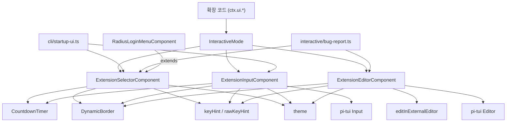
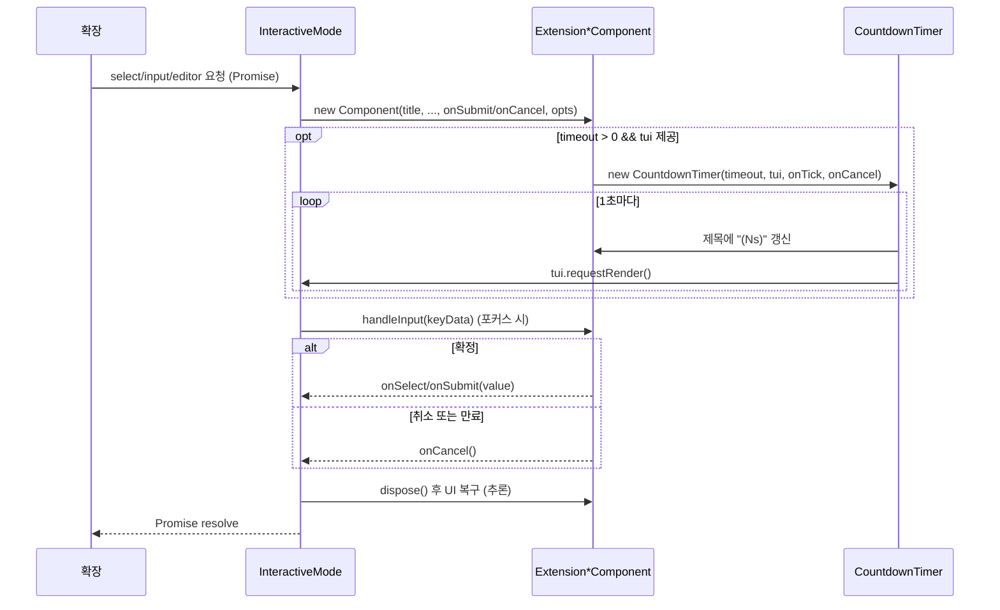

# interactive_components_extension_ui

## 개요

`interactive_components_extension_ui`는 확장(extension)이 사용자에게 값을 묻거나 선택을 요청할 때 터미널 UI(TUI)에 띄우는 **세 가지 다이얼로그 컴포넌트**를 묶은 모듈이다.

| 컴포넌트 | 파일 | 용도 |
|---|---|---|
| `ExtensionSelectorComponent` | `packages/coding-agent/src/modes/interactive/components/extension-selector.ts` | 문자열 옵션 목록에서 하나를 고르는 선택기 |
| `ExtensionInputComponent` | `packages/coding-agent/src/modes/interactive/components/extension-input.ts` | 한 줄 텍스트 입력 |
| `ExtensionEditorComponent` | `packages/coding-agent/src/modes/interactive/components/extension-editor.ts` | 여러 줄 편집기 (Ctrl+G 외부 편집기 지원) |

세 컴포넌트는 모두 `@earendil-works/pi-tui`의 `Container`를 상속하고, 공통 레이아웃(위/아래 `DynamicBorder`, 제목 `Text`, 선택적 설명, 본문, 키 힌트)을 가진다. 핵심 진입점은 각 클래스의 `handleInput(keyData)`이며, 부모 TUI가 포커스된 컴포넌트에 키 입력을 전달하면 submit/cancel 콜백으로 결과를 돌려준다.

상위 모듈 [interactive_components](interactive_components.md)의 하위 그룹이며, 형제 모듈로 [interactive_components_selectors](interactive_components_selectors.md), [interactive_components_settings_and_auth](interactive_components_settings_and_auth.md), [interactive_components_status](interactive_components_status.md) 등이 있다. 이를 호스팅하는 `InteractiveMode`는 [interactive_mode](interactive_mode.md)를, 확장 쪽 API(`ctx.ui.select/input/editor` 등)는 [extension_system](extension_system.md)을 참고한다.

> 검증 수준: 아래 내용은 제공된 세 파일의 소스와 `countdown-timer.ts`, 사용처 grep 결과로 **코드 확인**한 것이다. 사용처의 세부 호출 흐름(예: `interactive-mode.ts`의 오버레이 교체 방식)은 **미확인**이며 "추론"으로 표기한다.

## 아키텍처

사용처(코드 확인, grep):
- `interactive-mode.ts`: `extensionSelector`, `extensionInput`, `extensionEditor` 필드로 현재 열린 다이얼로그를 보관하고 각각 생성한다. 선택기는 로그인/기타 흐름에서도 사용한다.
- `cli/startup-ui.ts`: 시작 단계(TUI 본체 이전)의 선택/입력 프롬프트.
- `bug-report.ts`: 버그 리포트용 에디터와 선택기.
- `radius-login-selector.ts`: `ExtensionSelectorComponent`를 상속해 선택된 줄의 렌더링만 애니메이션으로 교체.
- `src/index.ts`와 `components/index.ts`에서 세 컴포넌트를 export (확장 작성자에게 공개).

## 컴포넌트 상세

### ExtensionSelectorComponent

- 생성자: `(title, options: string[], onSelect, onCancel, opts?)`. `opts`는 `ExtensionSelectorOptions` (`tui`, `timeout`, `onToggleToolsExpanded`, `description`).
- `updateList()`가 `listContainer`를 비우고 매번 전체를 다시 그린다. 선택 항목은 `→ ` 접두사와 `accent` 색.
- `handleInput` 분기 순서:
  1. `app.tools.expand` → `onToggleToolsExpanded?.()`
  2. `tui.select.up` 또는 `k` → 인덱스 감소(0에서 정지, 순환 없음)
  3. `tui.select.down` 또는 `j` → 인덱스 증가(끝에서 정지)
  4. `tui.select.confirm` 또는 `\n` → `onSelect(options[selectedIndex])` (선택값이 없으면 호출 안 함)
  5. `tui.select.cancel` → `onCancel()`
- `dispose()`는 카운트다운 타이머를 해제한다.

### ExtensionInputComponent

- 생성자: `(title, _placeholder, onSubmit, onCancel, opts?)`. `_placeholder`는 사용되지 않는다. `opts`: `tui`, `timeout`, `initialValue`, `description`.
- `Focusable` 구현: `focused` setter가 내부 `Input.focused`로 전파한다(IME 커서 위치 때문, 소스 주석).
- `handleInput`: confirm 또는 `\n` → `onSubmit(input.getValue())`; cancel → `onCancel()`; 그 외는 `Input.handleInput`으로 위임.
- `dispose()`로 카운트다운 해제.

### ExtensionEditorComponent

- 생성자: `(tui, keybindings: KeybindingsManager, title, prefill, onSubmit, onCancel, options?, externalEditorCommand?)`. `options`는 `EditorOptions`에 `description`을 더한 `ExtensionEditorOptions`.
- 외부 편집기 명령 결정 순서: 인자 `externalEditorCommand` → `$VISUAL` → `$EDITOR` → (win32 `notepad`, 그 외 `nano`).
- `Editor.onSubmit`에 `onSubmit`을 연결한다. Enter가 제출이며 Shift+Enter 개행은 메인 에디터와 동일(소스 주석).
- `handleInput` 분기: cancel(`tui.select.cancel`, 전역 `getKeybindings()`) → `onCancel()`; `app.editor.external`(앱 키바인딩, 주입된 `KeybindingsManager`) → 외부 편집기; 그 외 `Editor.handleInput`.
- `handleOpenExternalEditor()`: 현재 텍스트를 읽고 `tui.stop()` → `editInExternalEditor({command, content})` → 결과가 `status === "complete"`면 `setText` → `finally`에서 `tui.start()`와 `tui.requestRender(true)`. 외부 편집기가 취소되거나 실패해도 `finally`로 TUI는 반드시 복구된다.
- 이 컴포넌트에는 `dispose()`와 타임아웃이 없다.

## 데이터/제어 흐름

### 타임아웃 카운트다운

`CountdownTimer`(`countdown-timer.ts`)는 생성 즉시 `onTick(ceil(timeoutMs/1000))`을 한 번 호출하고, 1초 간격으로 남은 초를 줄이며 `tui?.requestRender()`를 부른다. 0 이하가 되면 스스로 `dispose()`한 뒤 `onExpire()`를 호출하는데, Selector/Input에서는 이것이 `onCancel`이다. 따라서 **타임아웃 = 취소**와 동일하게 처리된다. 타이머는 `timeout > 0`이고 `tui`가 주어질 때만 생성된다. `tui` 없이 `timeout`만 주면 타이머가 만들어지지 않아 타임아웃이 조용히 무시된다.

## 설계 메모와 주의점

- **키 처리 이중 구조**: `tui.select.*`는 `getKeybindings()`(pi-tui 전역), `app.editor.external`은 주입된 `KeybindingsManager`로 매칭한다. 키를 하드코딩하지 않는다는 저장소 규칙(`DEFAULT_*_KEYBINDINGS`)을 따르되, 예외로 `k`/`j`/`\n` 리터럴이 Selector/Input에 남아 있다(코드 확인).
- **자원 정리**: 카운트다운을 쓰는 Selector/Input은 호출자가 `dispose()`를 반드시 불러야 타이머 누수가 없다. 확정 직후 타이머가 살아 있으면 만료 시 `onCancel`이 뒤늦게 호출될 수 있다(추론: 호출측이 dispose 하는지는 이 모듈 밖에서 확인 필요).
- **`ExtensionSelectorComponent`는 `Focusable`이 아니다**: 입력 커서가 없으므로 포커스 전파가 불필요하다.
- **빈 옵션**: `options`가 비어 있으면 confirm은 아무 일도 하지 않는다(`selected` 가드).
- **확장성**: Selector의 `updateList()`가 `private`이고 선택 줄 생성이 내부 구현이라, `RadiusLoginMenuComponent`는 렌더링 단계에서 줄을 교체하는 방식으로 상속한다(소스 주석 기준).

## 의존성 요약

- 외부: `@earendil-works/pi-tui` (`Container`, `Editor`, `Input`, `Text`, `Spacer`, `TUI`, `Focusable`, `getKeybindings`)
- 내부: `../theme/theme.ts` (`theme`, `getEditorTheme`), `./dynamic-border.ts`, `./keybinding-hints.ts` (`keyHint`, `rawKeyHint`), `./countdown-timer.ts`, `../external-editor.ts`, `../../../core/keybindings.ts` (`KeybindingsManager` 타입)

테스트 설정은 `packages/coding-agent/vitest.config.ts`에 있으나, 이 모듈 전용 테스트 파일 유무는 **미확인**이다.
