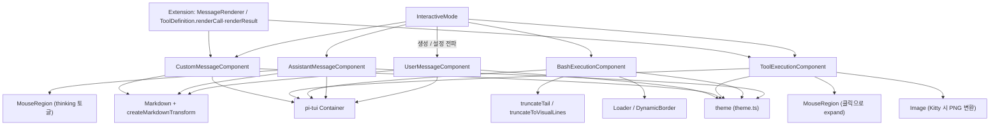
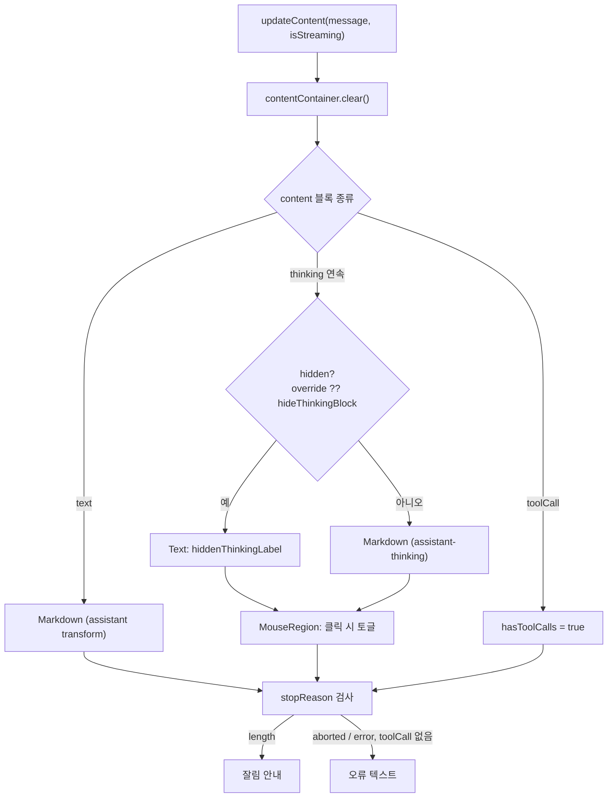
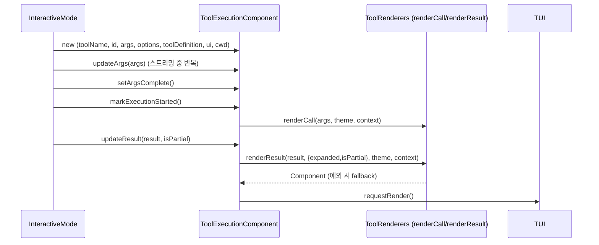
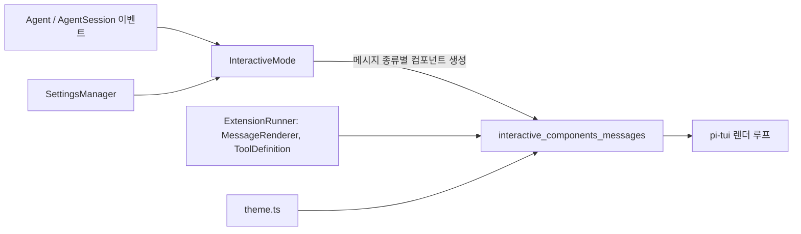

# interactive_components_messages 모듈

## 개요

`interactive_components_messages`는 pi coding-agent의 대화형(TUI) 모드에서 **대화 기록 영역(transcript)에 표시되는 메시지 단위 컴포넌트**를 모은 모듈이다. 사용자 메시지, 어시스턴트 메시지(텍스트/thinking), bash 실행 결과, 도구 실행 결과, 확장(extension)이 만든 커스텀 메시지를 각각 하나의 `Container` 서브클래스로 렌더링한다.

| 컴포넌트 | 파일 | 역할 | 핵심 노출 메서드 |
|---|---|---|---|
| `AssistantMessageComponent` | `components/assistant-message.ts` | 어시스턴트 응답(text, thinking, stopReason 오류) 렌더링 | `setHiddenThinkingLabel`, `setHideThinkingBlock`, `setOutputPad`, `updateContent` |
| `BashExecutionComponent` | `components/bash-execution.ts` | `!`/`!!` bash 명령의 스트리밍 출력 | `setExpanded`, `appendOutput`, `setComplete` |
| `ToolExecutionComponent` | `components/tool-execution.ts` | 도구 호출(call)과 결과(result) 렌더링, 이미지 표시 | `setShowImages`, `setImageWidthCells`, `setExpanded`, `updateArgs`, `updateResult` |
| `CustomMessageComponent` | `components/custom-message.ts` | 확장이 추가한 `CustomMessage` 렌더링 | `setExpanded`, `setOutputPad` |
| `UserMessageComponent` | `components/user-message.ts` | 사용자 입력 메시지 렌더링 | `setOutputPad` |

모든 컴포넌트는 `@earendil-works/pi-tui`의 `Container`를 상속하며, 설정이 바뀌면 내부 자식 트리를 `clear()` 후 다시 만드는(rebuild) 방식으로 갱신한다. 상위 모듈인 [interactive_components](interactive_components.md)와, 이 컴포넌트들을 생성·배치·구독하는 [interactive_mode](interactive_mode.md)를 함께 참고한다.

## 아키텍처

### 공통 설계 패턴

- **Rebuild 방식 갱신**: `UserMessageComponent.rebuild()`, `CustomMessageComponent.rebuild()`, `AssistantMessageComponent.updateContent()`, `BashExecutionComponent.updateDisplay()`, `ToolExecutionComponent.updateDisplay()`는 모두 상태 변경 시 자식 컴포넌트를 비우고 다시 구성한다. `invalidate()`(테마 변경 등)도 같은 경로를 호출해 색상이 갱신된다.
- **설정 setter**: `setOutputPad`, `setExpanded`, `setShowImages` 같은 setter는 값을 저장하고 즉시 재구성한다. [interactive_mode](interactive_mode.md)가 설정 변경(`SettingsManager`, 자세한 내용은 [settings_and_keybindings](settings_and_keybindings.md))을 이미 생성된 컴포넌트들에 전파할 때 사용한다.
- **OSC 133 구역 표시**: `UserMessageComponent`와 `AssistantMessageComponent`는 `render()`에서 첫 줄 앞에 `OSC133_ZONE_START`, 마지막 줄 앞에 `OSC133_ZONE_END` + `OSC133_ZONE_FINAL`을 붙여 터미널의 shell-integration이 메시지 경계를 인식하게 한다. 단, 어시스턴트 메시지는 `toolCall`이 포함되면(`hasToolCalls`) 표시를 생략한다.
- **마우스 상호작용**: `MouseRegion`으로 감싸 왼쪽 클릭 시 thinking 접기/펼치기(`AssistantMessageComponent`) 또는 도구 출력 확장/축소(`ToolExecutionComponent`)를 처리한다.

## 컴포넌트 상세

### AssistantMessageComponent

`AssistantMessage`(`@earendil-works/pi-ai`)를 받아 `content` 배열을 순서대로 렌더링한다. 스트리밍 중에는 `updateContent(message, isStreaming)`이 반복 호출된다.

- `text` 블록: `Markdown`으로 렌더링(`createMarkdownTransform("assistant", isStreaming, markdownTransformers)`).
- 연속된 `thinking` 블록: 하나의 "run"으로 묶는다. `hideThinkingBlock`이 true이면 `hiddenThinkingLabel`(기본 `"Thinking..."`)을 이탤릭으로 표시한다. run 인덱스별로 `thinkingVisibilityOverrides`에 클릭 토글 상태를 저장하며, `setHideThinkingBlock()`은 이 override를 모두 지운다.
- `setHiddenThinkingLabel(label)`: 숨김 상태에서 보일 라벨을 바꾸고 마지막 메시지를 다시 그린다. (이 모듈의 핵심 컴포넌트)
- 종료 사유 처리: `stopReason === "length"`이면 "Response was truncated before completion."을 표시한다. `toolCall`이 없을 때만 `aborted`(`errorMessage`가 기본 문구가 아니면 그 메시지, 아니면 "Operation aborted")와 `error`("Error: ...")를 표시한다. 도구 호출이 있는 경우 오류는 `ToolExecutionComponent`가 보여준다.

### UserMessageComponent

사용자 텍스트를 `Markdown` 하나로 렌더링한다. 배경(`userMessageBg`)과 패딩을 `Markdown` 자체가 처리하므로 `Box`를 쓰지 않는다(주석: 동일 출력의 중복 복사를 피하기 위함). `preserveOrderedListMarkers`, `preserveBackslashEscapes` 옵션으로 사용자가 입력한 원문 표기를 유지한다. `setOutputPad(padding)`은 패딩을 바꾸고 `rebuild()`한다.

### BashExecutionComponent

사용자가 실행한 bash 명령을 테두리(`DynamicBorder`) 안에 표시한다. `excludeFromContext`(`!!` 접두)이면 `dim`, 아니면 `bashMode` 색을 쓴다.

- `appendOutput(chunk)`: ANSI 제거, 개행 정규화 후, 마지막 줄이 미완이면 이어붙인다.
- `setComplete(exitCode, cancelled, truncationResult, fullOutputPath)`: 상태를 `complete | cancelled | error`로 정하고 로더를 멈춘다.
- `setExpanded(expanded)`: 전체 출력 vs 미리보기(`PREVIEW_LINES = 20`) 전환. 접힌 상태에서는 `truncateToVisualLines`(너비 기반 캐시)로 시각적 줄 수를 제한하고, 숨겨진 줄 수와 확장 키 힌트(`keyHint("app.tools.expand", ...)`)를 보여준다.
- 먼저 `truncateTail`(`DEFAULT_MAX_LINES`, `DEFAULT_MAX_BYTES`)로 LLM 컨텍스트 한도와 같은 기준의 절단을 적용하며, 잘린 경우 `fullOutputPath`를 안내한다.
- `getOutput()`/`getCommand()`는 `BashExecutionMessage` 생성용 원본을 돌려준다.

### ToolExecutionComponent

도구 호출 하나의 전체 수명(인자 스트리밍 → 실행 시작 → 부분/최종 결과)을 표현한다.

- **렌더러 선택**: `ToolRenderers`(또는 `ToolDefinition`)가 있으면 `renderCall`/`renderResult`를 사용하고, 없거나 예외가 나면 `createCallFallback`/`createResultFallback`(미리보기 `FALLBACK_PREVIEW_LINES = 10`)로 대체한다. 정의 자체가 없으면 `formatToolExecution()`의 일반 텍스트를 쓴다.
- **쉘 종류**: `renderShell`이 `"default"`이면 `Box`(상태별 배경 `toolPendingBg`/`toolErrorBg`/`toolSuccessBg`), `"self"`이면 도구가 자체 프레임을 그리는 `selfRenderContainer`를 쓰며, 이때 `handleMouse`가 y 좌표를 보정한다.
- **이미지**: `setShowImages(show)`, `setImageWidthCells(width)`(최소 1로 보정)가 표시 여부·폭을 제어한다. 터미널이 Kitty 그래픽이면 PNG만 지원하므로 `convertToPng`로 비동기 변환하고 `convertedImages` 캐시를 쓴다. 변환 결과는 원본 데이터가 바뀌지 않았을 때만 반영한다.
- 렌더러가 아무 내용도 만들지 않고 이미지도 없으면 `hideComponent`로 전체를 숨긴다.
- 결과 영역 클릭 시 `setExpanded(!expanded)`로 확장/축소한다.

### CustomMessageComponent

확장이 `CustomMessage`(`core/messages.ts`)로 남긴 항목을 표시한다. `customRenderer`(`MessageRenderer`)가 있으면 먼저 시도하고, 컴포넌트를 반환하면 그 컴포넌트가 자체 스타일을 책임진다. 렌더러가 없거나 `undefined`를 반환하거나 예외를 던지면 기본 렌더링(`customMessageBg` 배경의 `Box` + `[customType]` 라벨 + 텍스트 `Markdown`)으로 대체한다. `setExpanded`와 `setOutputPad`는 값이 실제로 바뀔 때만 `rebuild()`한다. 확장 시스템 자체는 [extension_system](extension_system.md)을 참조한다.

## 모듈 간 관계와 데이터 흐름

- 입력: [agent_session_core](agent_session_core.md)와 [agent_loop_and_state](agent_loop_and_state.md)가 발생시키는 메시지/도구 이벤트를 `InteractiveMode`가 받아 컴포넌트 메서드로 변환한다.
- 설정: `outputPad`, `hideThinkingBlock`, `showImages`, `imageWidthCells`는 [settings_and_keybindings](settings_and_keybindings.md)의 `SettingsManager` 값이며 setter로 전달된다.
- 도구 렌더러: 내장 도구 렌더러는 [builtin_tools](builtin_tools.md)의 `renderers/*.ts`가 제공한다.
- 같은 상위 모듈의 형제: [interactive_components_status](interactive_components_status.md), [interactive_components_selectors](interactive_components_selectors.md), [interactive_components_settings_and_auth](interactive_components_settings_and_auth.md), [interactive_components_extension_ui](interactive_components_extension_ui.md), [interactive_components_easter_eggs](interactive_components_easter_eggs.md).

## 유지보수 시 참고

- 새 설정을 메시지 컴포넌트에 전달하려면 setter를 추가하고 반드시 재구성(`updateContent`/`rebuild`/`updateDisplay`)을 호출해야 화면에 반영된다.
- 렌더러 예외는 삼켜서 fallback으로 처리하므로(`catch {}`), 확장 렌더러의 오류는 화면에 드러나지 않는다.
- 키 바인딩은 하드코딩하지 않고 `keyHint("app.tools.expand", ...)`, `keyText("tui.select.cancel")`로 참조한다(저장소 규칙: 키는 기본 키바인딩에 등록).
- 이 모듈의 테스트 설정은 `packages/coding-agent/vitest.config.ts`를 따른다.
