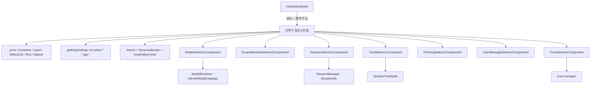
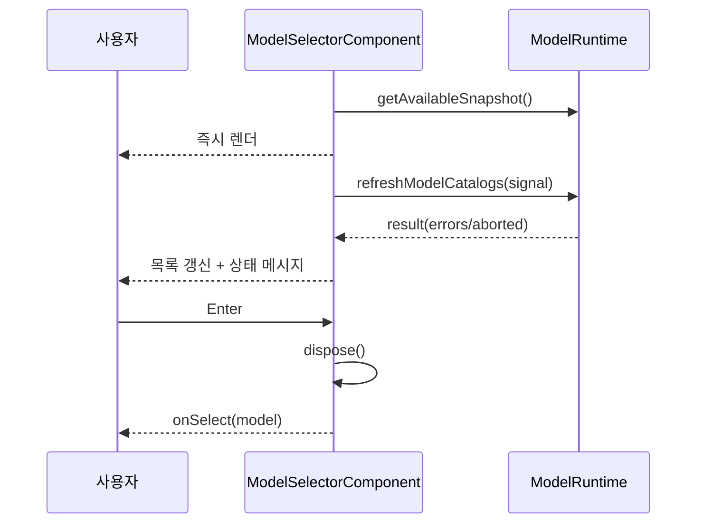
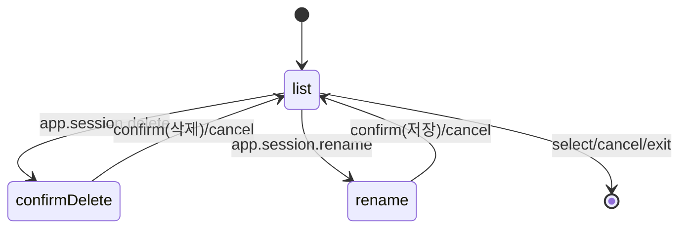

# interactive_components_selectors

## 개요

`interactive_components_selectors`는 pi 코딩 에이전트의 인터랙티브 TUI에서 사용자가 목록·트리 중 항목 하나(또는 여러 개)를 고르는 **선택기(selector) 컴포넌트** 모음이다. 모든 컴포넌트는 `@earendil-works/pi-tui`의 `Container`를 상속하고, 키 입력을 `handleInput(keyData)`로 받아 `getKeybindings().matches(...)`로 논리 키바인딩에 매핑한다. 선택 결과는 생성자에 주입된 콜백(`onSelect`, `onCancel` 등)으로 상위 [interactive_mode](interactive_mode.md)에 전달된다.

| 파일 | 클래스 | 용도 |
|---|---|---|
| `model-selector.ts` | `ModelSelectorComponent` | 모델 검색/선택, 기본 모델 저장 |
| `scoped-models-selector.ts` | `ScopedModelsSelectorComponent` | Ctrl+P 순환 대상 모델 활성화/순서 편집 |
| `session-selector.ts` | `SessionSelectorComponent` (+ `SessionList`) | 세션 재개, 이름 변경, 삭제 |
| `tree-selector.ts` | `TreeSelectorComponent` (+ `TreeList`) | 세션 트리 탐색, 필터, 접기, 라벨 편집 |
| `thinking-selector.ts` | `ThinkingSelectorComponent` | thinking level 선택 |
| `user-message-selector.ts` | `UserMessageSelectorComponent` (+ `UserMessageList`) | 포크할 사용자 메시지 선택 |
| `trust-selector.ts` | `TrustSelectorComponent` | 프로젝트 신뢰(trust) 결정 |

> 검증 수준: 아래 내용은 제공된 소스 코드를 직접 읽고 작성했다(코드 확인). 호출하는 상위 코드(`InteractiveMode`)는 이 모듈 범위 밖이라 미확인이다.

## 아키텍처

### 공통 패턴

- **레이아웃**: `DynamicBorder` → 헤더/힌트 `Text` → (선택) `Input` → 리스트 컨테이너 → 힌트 → `DynamicBorder`.
- **리스트 윈도잉**: `startIndex = max(0, min(selected - maxVisible/2, len - maxVisible))`로 선택 항목을 가운데에 두는 스크롤. 숨겨진 항목이 있으면 `(n/total)` 표시.
- **포커스 전파**: `Focusable.focused` setter가 내부 `Input`에 값을 전달해 IME 커서 위치를 맞춘다.
- **키바인딩**: 키를 하드코딩하지 않고 `tui.select.up/down/confirm/cancel`, `app.*` 같은 논리 이름을 사용(저장소 규칙 준수). 예외로 `TrustSelectorComponent`는 `j`/`k`/`\n`을 추가로 허용한다.
- **검색**: 대부분 `Input` + `fuzzyFilter`. 처리되지 않은 키는 검색 입력으로 전달 후 재필터.

## 컴포넌트별 상세

### ModelSelectorComponent.handleInput

`handleInput` 분기 순서:

1. `tui.input.tab` — scoped 모델이 있으면 `all`↔`scoped` 범위 전환(`setScope`).
2. `tui.select.up/down` — 순환(wrap) 이동 후 `updateList()`.
3. `tui.select.confirm` — `handleSelect` → `dispose()` 후 `onSelectCallback`.
4. `tui.select.cancel` — `dispose()` 후 `onCancelCallback`.
5. `app.models.save` — `onSelectAsDefaultCallback`이 있을 때만 기본 모델로 저장.
6. 그 외 — `searchInput.handleInput` 후 `filterModels`.

특징:
- 생성 즉시 `modelRuntime.getAvailableSnapshot()` 스냅샷으로 렌더링하고, 백그라운드에서 `refreshModelCatalogs`를 실행한다(15초 타임아웃, `AbortController`). 실패 시 캐시 모델을 보여주고 오류 메시지를 표시한다.
- 정렬: 현재 모델 → 기본 모델 → provider 이름순. `default` 검색어는 기본 모델을 맨 앞에 둔다.
- `dispose()`는 `closed` 플래그와 abort로 늦게 도착한 refresh 결과를 무시한다.

### ScopedModelsSelectorComponent.handleInput

Ctrl+P 순환에 쓰일 모델 집합을 편집한다. 상태는 `EnabledIds = string[] | null`이며 `null`은 "전부 활성"이다. 순수 함수 `toggle`, `enableAll`, `clearAll`, `move`, `normalizeEnabled`가 상태 전이를 담당하고, 모든 모델이 포함되면 다시 `null`로 정규화한다.

| 키바인딩 | 동작 |
|---|---|
| `tui.select.up/down` | 이동(wrap) |
| `app.models.reorderUp/Down` | 활성 모델 순서 이동 (`enabledIds`가 `null`이면 무시) |
| `tui.select.confirm` | 선택 항목 토글 |
| `app.models.enableAll` / `clearAll` | 검색 중이면 필터된 항목만, 아니면 전체 |
| `app.models.toggleProvider` | 현재 항목 provider 전체 토글 |
| `app.models.save` | `onPersist` 호출, `isDirty=false` |
| Ctrl+C | 검색어 있으면 지우고, 없으면 `onCancel` |
| Escape | `onCancel` |

변경마다 `onChange`(세션 한정)가 호출되고, 저장은 `onPersist`로 명시적일 때만 이루어진다. 사용할 수 없게 된 모델은 취소선과 `[unavailable]`로 표시한다.

### SessionSelectorComponent.handleInput

두 모드를 가진다.
- `list`: 입력을 `SessionList.handleInput`에 위임.
- `rename`: cancel이면 `exitRenameMode`, 아니면 `renameInput`에 전달.

`SessionList.handleInput` 우선순위: 삭제 확인 상태(모든 키 가로채기) → `tui.input.tab`(scope) → `app.session.toggleSort` → `toggleNamedFilter` → `togglePath` → `delete` → `rename` → `deleteNoninvasive`(검색어가 비었을 때만 삭제 시작) → 이동/페이지/confirm/cancel → 검색 입력.

핵심 동작:
- 범위 `current`/`all`을 각각 별도 `AbortController`로 비동기 로딩하며 `onProgress`로 부분 결과를 반영한다.
- 정렬 `threaded → recent → relevance`. threaded는 검색어가 없을 때 `parentSessionPath` 기반 트리(`buildSessionTree`, `flattenSessionTree`)로 보여준다.
- 현재 활성 세션은 삭제 불가(`onError`).
- 삭제는 `trash` CLI를 먼저 시도하고 실패하면 `unlink`로 폴백(`deleteSessionFile`).
- 삭제/이름 변경 뒤 `refreshSessionsAfterMutation`으로 다시 로드.

### TreeSelectorComponent.handleInput

`labelInput`이 활성이면 `LabelInput`에, 아니면 `TreeList`에 위임한다. `TreeList.handleInput`은 다음을 처리한다.

- 이동: up/down(wrap), page up/down.
- 접기: `app.tree.foldOrUp` / `unfoldOrDown` — 접을 수 있으면 접고, 아니면 브랜치 세그먼트 시작으로 점프(`findBranchSegmentStart`).
- 필터 모드: `default | no-tools | user-only | labeled-only | all`, 직접 지정/토글/순환.
- 선택(`onSelect`), 복사(`onCopy`), 라벨 편집(`onLabelEdit`), 라벨 시간 표시 토글.
- cancel: 검색어가 있으면 먼저 지우고, 없으면 `onCancel`.
- 그 외의 제어문자 없는 입력은 검색어에 누적(공백 구분 토큰 AND 매칭).

구현 포인트:
- `flattenTree`는 활성 leaf를 포함한 브랜치를 먼저 배치하고, 분기점에서만 들여쓰기를 증가시킨다. 필터 후 `recalculateVisualStructure`가 보이는 노드만으로 들여쓰기·커넥터·거터를 다시 계산하고, 숨겨진 노드의 자손은 가장 가까운 보이는 조상에 붙는다.
- `renderHorizontalViewport`는 선택 행의 anchor가 너무 오른쪽이면 본문만 수평 스크롤한다.
- 도구 호출 결과 행은 `toolCallMap`으로 호출 정보를 찾아 `[read: path]` 같은 형태로 표시한다.
- 트리가 비어 있으면 100ms 뒤 자동 `onCancel`.

### ThinkingSelectorComponent.handleInput

`SelectList`를 재사용한다. 순서: `app.thinking.save`(기본값 저장) → 이동/confirm/cancel 키는 `selectList.handleInput`으로 위임 → 나머지는 검색 입력 후 `applyFilter`로 `SelectList`를 새로 만들어 교체한다. 설명 문자열은 `LEVEL_DESCRIPTIONS`(`off`~`max`)에서 가져온다.

### UserMessageList.handleInput

`UserMessageSelectorComponent`가 포크용으로 쓰는 단순 리스트. up/down(wrap), confirm(`onSelect(id)`), cancel만 처리한다. 초기 선택은 `initialSelectedId` 또는 가장 최근 메시지이고, 비어 있으면 100ms 뒤 자동 취소한다. 검색은 없다.

### TrustSelectorComponent.handleInput

`getProjectTrustOptions(cwd)`가 주는 옵션 목록에서 하나를 고른다. 저장된 결정과 일치하는 옵션이 초기 선택(`✓`)이다. up/down은 wrap 없이 clamp, confirm 시 `{ trusted, updates }`만 `onSelect`로 전달한다. 실제 저장은 호출 측 책임이다.

## 의존성과 연계

- 상위: [interactive_mode](interactive_mode.md)가 슬래시 명령/단축키에 따라 선택기를 띄우고 콜백으로 세션·설정을 변경한다(추론).
- 같은 계열 컴포넌트: [interactive_components_messages](interactive_components_messages.md), [interactive_components_status](interactive_components_status.md), [interactive_components_settings_and_auth](interactive_components_settings_and_auth.md), [interactive_components_extension_ui](interactive_components_extension_ui.md).
- 데이터 소스: 모델은 [model_and_auth_management](model_and_auth_management.md)의 `ModelRuntime`, 세션은 [session_persistence_and_compaction](session_persistence_and_compaction.md)의 `SessionManager`(`SessionInfo`, `SessionTreeNode`), 키바인딩은 [settings_and_keybindings](settings_and_keybindings.md).
- 테스트 설정은 `packages/coding-agent/vitest.config.ts`에 있다(내용은 이 문서 작성 시 확인하지 않음, 미확인).

## 확장 시 유의점

- 새 단축키는 `DEFAULT_APP_KEYBINDINGS` 등에 추가하고 `kb.matches`로 사용한다.
- 비동기 작업(`refreshModels`, 세션 로딩)은 `dispose`/`cancelLoads`에서 반드시 취소해 늦은 결과가 닫힌 UI를 갱신하지 않게 한다.
- 선택기를 닫는 경로(select/cancel/default 저장)는 모두 정리 로직을 거쳐야 한다.
