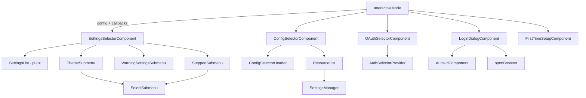
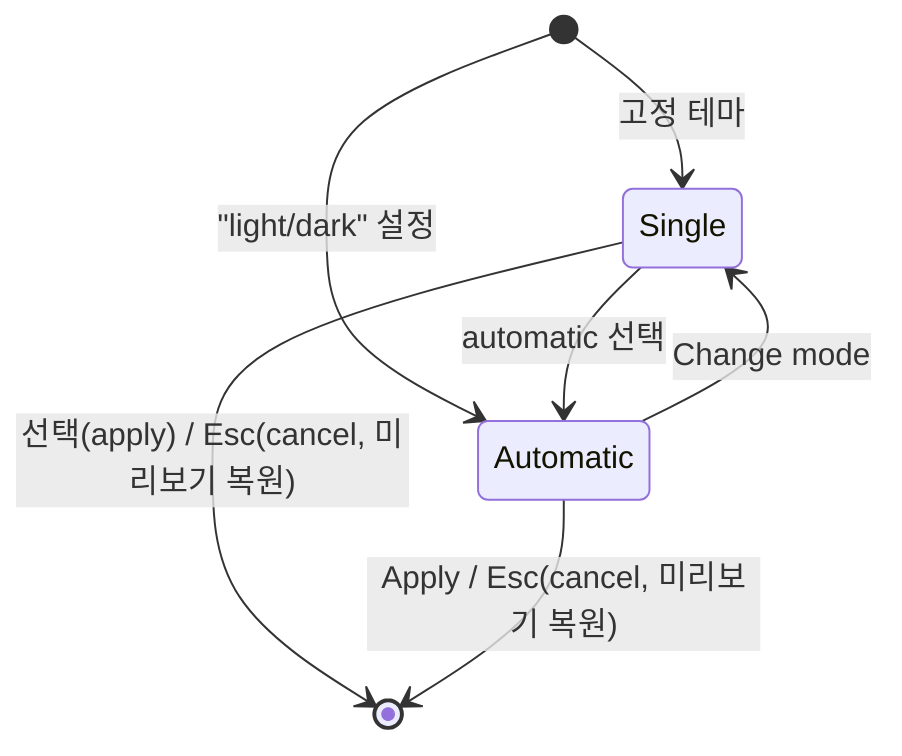
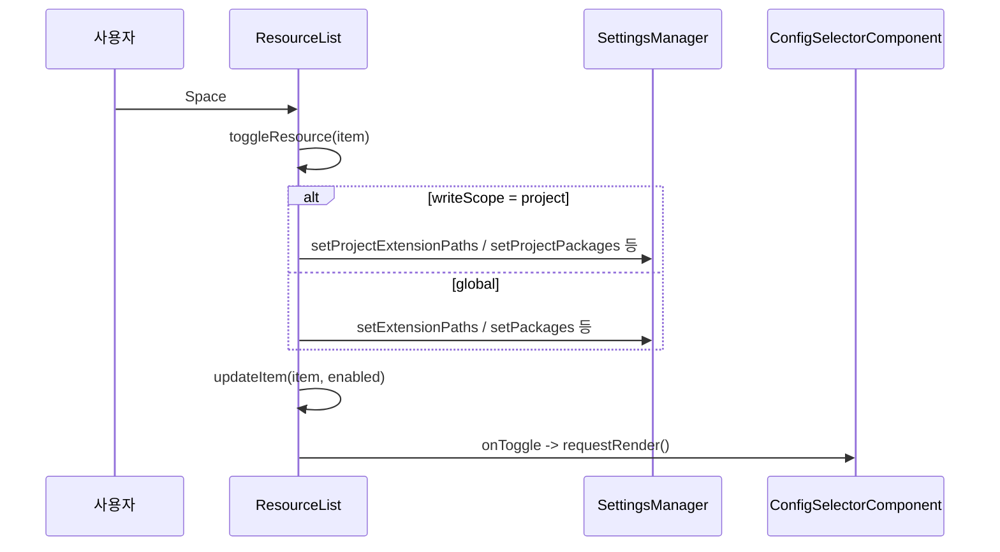
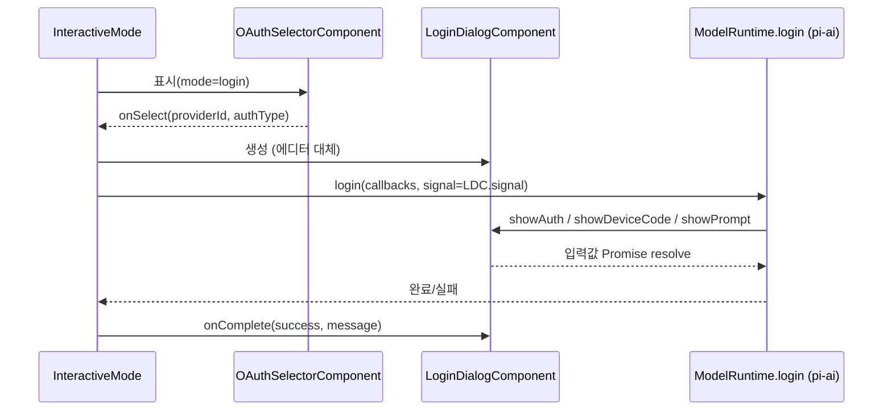
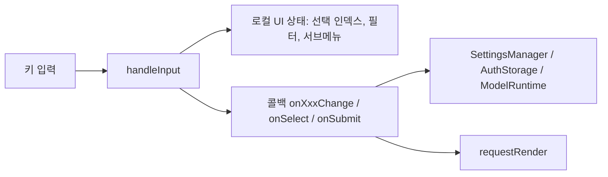

# interactive_components_settings_and_auth

`packages/coding-agent/src/modes/interactive/components/` 아래에서 **설정(Settings), 리소스 구성(Config), 인증(Login/OAuth), 최초 설정(First-time setup)** 을 담당하는 TUI 컴포넌트 모음이다. 모두 `@earendil-works/pi-tui`의 `Container`를 상속하고, `handleInput(data)`로 키 입력을 받아 콜백으로 상태 변경을 상위(`InteractiveMode`)에 알린다.

| 컴포넌트 | 파일 | 역할 |
|---|---|---|
| `SettingsSelectorComponent` / `ThemeSubmenu` | `settings-selector.ts` | `/settings` 메인 목록과 테마 서브메뉴 |
| `SelectSubmenu` / `SteppedSubmenu` | `settings-submenu.ts` | 재사용 가능한 단일/다단계 선택 서브메뉴 |
| `ConfigSelectorComponent` / `ResourceList` | `config-selector.ts` | extensions/skills/prompts/themes 활성·비활성 관리 |
| `LoginDialogComponent` | `login-dialog.ts` | OAuth/장치 코드 로그인 진행 대화상자 |
| `OAuthSelectorComponent` | `oauth-selector.ts` | 로그인/로그아웃할 provider 선택 |
| `FirstTimeSetupComponent` | `first-time-setup.ts` | 첫 실행 시 테마·익명 통계 선택 |

상위 모듈: [interactive_components](interactive_components.md), [interactive_mode](interactive_mode.md). 형제 모듈: [interactive_components_selectors](interactive_components_selectors.md), [interactive_components_extension_ui](interactive_components_extension_ui.md).

## 아키텍처

모든 컴포넌트는 `DynamicBorder`, `keyHint` 등 공용 UI 조각과 `theme`를 사용한다. 키 매칭은 하드코딩 대신 `getKeybindings().matches(data, "tui.select.*")`로 설정 가능한 키바인딩을 따른다.

## 컴포넌트 상세

### SettingsSelectorComponent와 ThemeSubmenu (`settings-selector.ts`)

- `SettingsConfig`(현재 값)와 `SettingsCallbacks`(`onXxxChange`)를 받아 `SettingItem[]`을 만들고 `SettingsList`(검색 활성, 최대 10행)에 넘긴다. 값이 바뀌면 `id`별 `switch`가 타입 변환(`"true"`→boolean, `parseInt`, label→값 매핑)을 거쳐 해당 콜백을 호출한다. 저장 자체는 콜백 쪽(`SettingsManager.setXxx`)이 수행한다.
- 터미널이 이미지를 지원할 때만(`getCapabilities().images`) `show-images`, `image-width-cells` 항목을 삽입한다.
- `warnings`는 `WarningSettingsSubmenu`, `model-thinking`은 `SteppedSubmenu`(모델 선택 → thinking level 선택, `loop: true`, `(clear override)` 지원)를 서브메뉴로 쓴다.
- **`ThemeSubmenu`**: `handleInput`은 현재 활성 화면(`inputComponent`)에 위임한다.
  - `single` 모드: system 테마 → `automatic` → 나머지 순으로 `SelectSubmenu` 표시.
  - `automatic` 모드: light/dark 테마를 각각 고르고 `Apply`로 `"light/dark"` 문자열을 저장한다 (`parseAutoThemeSetting`으로 파싱).
  - 선택 이동 시 `onThemePreview`로 즉시 미리보기하고, 취소하면 `originalThemeSetting`으로 되돌린다.

### SelectSubmenu / SteppedSubmenu (`settings-submenu.ts`)

- `SelectSubmenu`: 제목+설명+`SelectList`. `searchable: true`면 `Input`을 두고, 이동/확정/취소 키(`tui.select.up/down/confirm/cancel`)는 목록에, 나머지는 검색창에 전달한 뒤 `fuzzyFilter`로 목록을 재구성한다. `handleInput`이 이 분기를 담당한다.
- `SteppedSubmenu`: `SteppedSubmenuStep[]`을 순서대로 `SelectSubmenu`로 렌더링한다. 이전 선택은 `context`에 저장되어 다음 단계의 `title/description/options/preselect`에 전달된다. Esc는 한 단계 뒤로(0단계면 취소), 마지막 단계 완료 시 `onComplete` 호출 후 `loop`이면 0단계로 복귀한다.

### ConfigSelectorComponent와 ResourceList (`config-selector.ts`)

`/config` 화면. `ResolvedPaths`를 `buildGroups`로 (출처·스코프·소스)별 그룹 → 리소스 타입 서브그룹 → 항목 구조로 정리하고, `flatItems`로 평탄화해 스크롤/검색한다.

- `ResourceList.handleInput`: 위/아래/페이지 이동(헤더 행은 건너뜀), `cancel`→`onCancel`, `ctrl+c`→`onExit`, `Tab`→스코프 전환, `Space`/`Enter`→토글, 그 외는 검색 입력.
- **global 스코프**: 항목 토글 시 `+pattern`/`-pattern`을 `SettingsManager`의 해당 배열(`setExtensionPaths` 등) 또는 패키지 필터(`setPackages`)에 기록한다. user 스코프 항목만 토글 가능.
- **project 스코프**: 3상태(`inherit` → `load`(`[+]`) / `unload`(`[-]`))로 순환하며 전역 리소스를 프로젝트 설정(`setProject*`)에서 덮어쓴다. 상속된 항목은 dim 처리된다. 패키지 override는 필요 시 `autoload: false` 패키지 항목을 새로 만든다.

### OAuthSelectorComponent (`oauth-selector.ts`)

`mode: "login" | "logout"`에 따라 provider 목록(`AuthSelectorProvider`: `id`, `authType`, `status` 등)을 표시한다. `fuzzyFilter`로 `name/id/authType/method.name`을 검색하고, 최대 8행을 스크롤한다. `formatAuthSelectorProviderStatus`가 "not configured", "✓ configured", "✓ env: VAR" 등 상태 접미사를 만든다. `handleInput`: 위/아래 이동, confirm→`onSelect(id, authType)`, cancel→`onCancel`, 나머지는 검색창.

### LoginDialogComponent (`login-dialog.ts`)

OAuth 로그인 중 에디터를 대체하는 대화상자. 로그인 플로우([oauth_flows](oauth_flows.md))가 부르는 콜백에 대응하는 메서드를 제공한다.

| 메서드 | 용도 |
|---|---|
| `showAuth(url, instructions?)` | URL 표시 + `openBrowser` 실행 |
| `showDeviceCode(info)` | 장치 코드 URL/코드 표시 |
| `showManualInput(prompt)` / `showPrompt(message)` | 입력을 `Promise<string>`으로 대기 |
| `showWaiting` / `showProgress` / `showInfo` / `showDetails` | 상태·안내 표시 |

`signal`(`AbortSignal`)을 노출하며, `handleInput`은 cancel 키 시 `cancel()`(abort + 대기 중 Promise reject + `onComplete(false, "Login cancelled")`), `app.message.copy` 시 인증 URL 복사, 그 외는 `Input`에 전달한다.

호출 관계(`IM`이 `LDC`를 어떻게 연결하는지)는 이 모듈의 코드만으로는 확정되지 않으며, 위 다이어그램의 `InteractiveMode`/`ModelRuntime.login` 부분은 모듈 트리([model_and_auth_management](model_and_auth_management.md))에 근거한 추론이다.

### FirstTimeSetupComponent (`first-time-setup.ts`)

2단계 대화상자: `theme`(System/Dark/Light) → `analytics`(익명 사용 데이터 공유 여부). `handleInput`은 위/아래(또는 `k`/`j`)로 이동하며, theme 이동 시 `onThemePreview`를 호출한다. confirm으로 다음 단계, 마지막 단계에서 `onSubmit({ theme, shareAnalytics })`, cancel은 `onCancel`(설정 건너뛰기). 변경마다 `update()`로 전체를 다시 구성하여 테마 미리보기가 모든 텍스트에 반영되고, `invalidate()`에서도 재구성한다.

## 데이터 흐름 요약

- 컴포넌트는 상태를 **저장하지 않고** 콜백으로 위임한다(예외: `ResourceList`는 `SettingsManager`를 직접 호출).
- 관련 모듈: [settings_and_keybindings](settings_and_keybindings.md) (`SettingsManager`), [model_and_auth_management](model_and_auth_management.md) (`AuthStorage`, `ModelRegistry`), [oauth_flows](oauth_flows.md).

## 검증 수준

- 컴포넌트 동작·키 처리·스코프별 토글 로직: **코드 확인** (제공된 소스 기준).
- `InteractiveMode`와의 연결 방식, 콜백 구현 내용: **추론/미확인** (해당 소스가 제공되지 않음).
- 빌드/테스트 설정(`packages/coding-agent/vitest.config.ts`): 미확인(본 문서에서 열람하지 않음).
