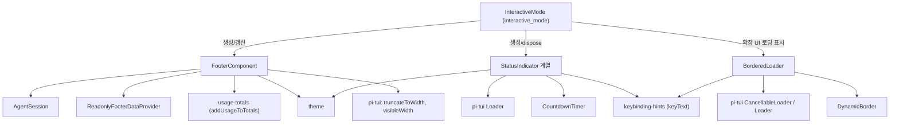
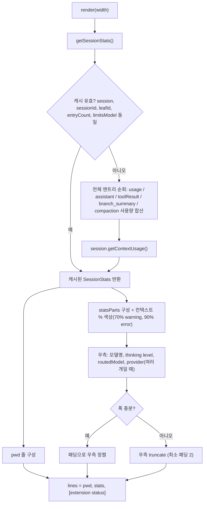
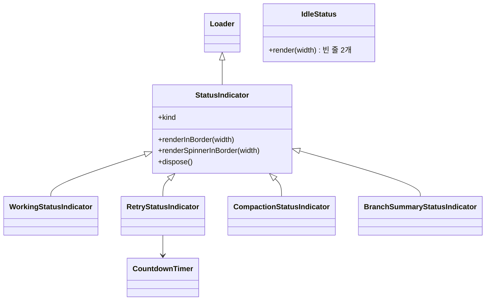
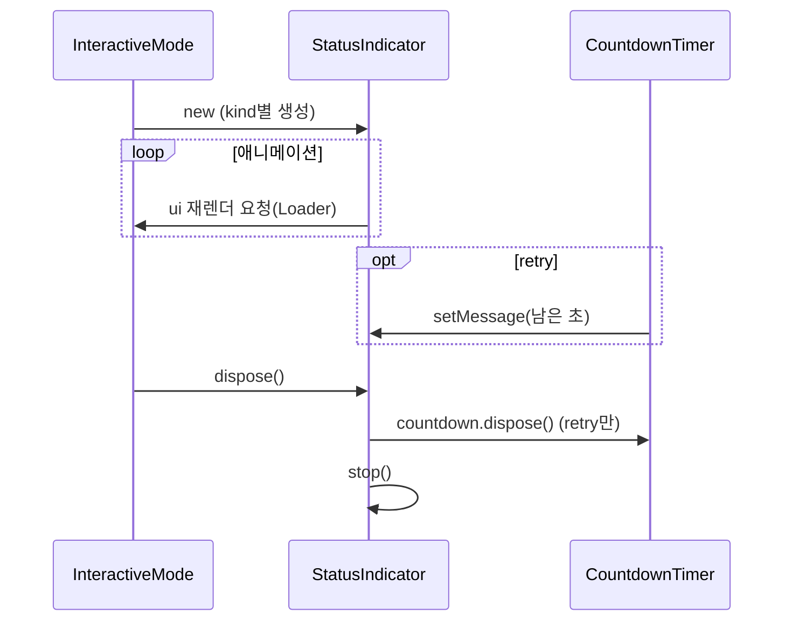
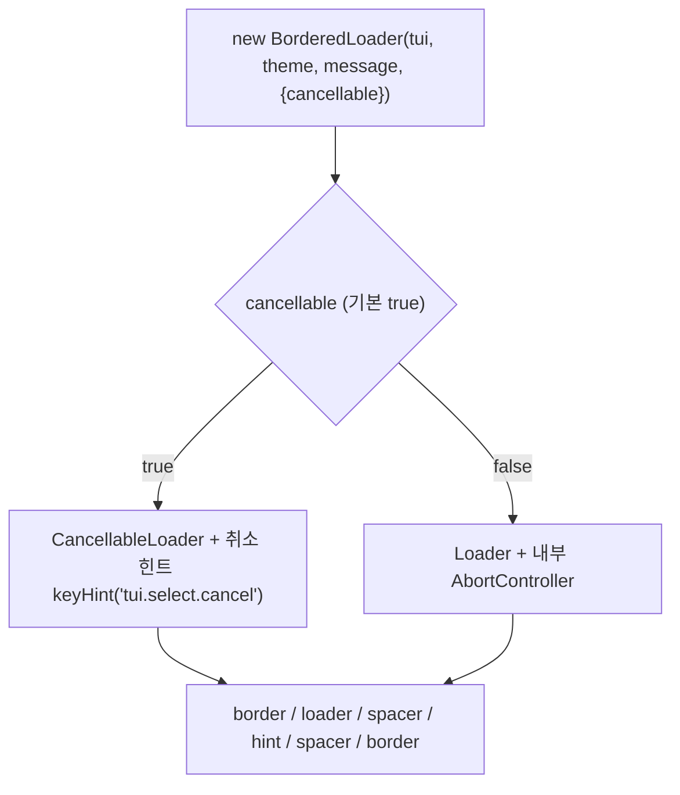

# interactive_components_status 모듈

`interactive_components_status`는 `packages/coding-agent`의 인터랙티브 TUI 모드에서 **상태를 보여주는 컴포넌트**를 모은 모듈이다. 세 가지 컴포넌트로 구성된다.

| 컴포넌트 | 파일 | 역할 |
|---|---|---|
| `FooterComponent` | `components/footer.ts` | 하단 푸터: 작업 디렉터리, git 브랜치, 토큰/비용 통계, 컨텍스트 사용률, 모델명, 확장 상태 |
| `StatusIndicator` (및 하위 클래스) | `components/status-indicator.ts` | 스피너 기반 진행 표시: working / retry / compaction / branchSummary |
| `BorderedLoader` | `components/bordered-loader.ts` | 확장 UI용 테두리 로더(취소 가능 여부 선택) |

상위 모듈은 [interactive_components](interactive_components.md)이고, 이를 사용하는 조율 계층은 [interactive_mode](interactive_mode.md)이다. 형제 모듈로는 [interactive_components_messages](interactive_components_messages.md), [interactive_components_selectors](interactive_components_selectors.md), [interactive_components_settings_and_auth](interactive_components_settings_and_auth.md), [interactive_components_extension_ui](interactive_components_extension_ui.md)가 있다.

> 검증 수준: 아래 내용은 제공된 소스(`footer.ts`, `status-indicator.ts`, `bordered-loader.ts`)를 직접 읽고 작성한 **코드 확인**이다. 호출 주체(`InteractiveMode`)의 구체적 사용 방식은 **추론/미확인**으로 표시한다.

---

## 1. 아키텍처

세 컴포넌트는 서로 직접 의존하지 않는다. 모두 `@earendil-works/pi-tui`의 `Component`/`Container`/`Loader` 계열을 기반으로 하며 `theme`으로 색을 입힌다.

---

## 2. FooterComponent

`Component`를 구현하며 `render(width): string[]`로 줄 배열을 반환한다. 데이터 출처는 두 곳이다.

- `AgentSession`: 세션 엔트리, 모델, thinking level, 컨텍스트 사용량, `routedModel`
- `ReadonlyFooterDataProvider`: git 브랜치, 확장 상태(`getExtensionStatuses`), 사용 가능 provider 수 (`FooterDataProvider`는 [interactive_mode](interactive_mode.md) 쪽)

### 출력 줄 구성

1. **pwd 줄**: `formatCwdForFooter`로 홈 디렉터리를 `~`로 치환 → `(branch)` → ` • 세션명`. `truncateToWidth`로 폭에 맞춘다.
2. **통계 줄**: 왼쪽 `↑input ↓output R(cacheRead) W(cacheWrite) CH(캐시 적중률%) $비용 컨텍스트%/윈도우 (auto) [xp]`, 오른쪽 `모델ID • thinking level → 라우팅된 모델`.
3. **확장 상태 줄**(있을 때만): 키 알파벳 순 정렬 후 `sanitizeStatusText`로 개행/탭 제거, 공백으로 연결.

### 렌더링 흐름

### 설계 포인트

- **세션 통계 캐시**: 푸터는 매 프레임 렌더링되지만 전체 세션 스캔은 비싸다. 엔트리가 append-only이고 append마다 leaf가 바뀌므로, `session`/`sessionId`/`leafId`/`entryCount`/`limitsModel`이 같으면 이전 결과를 재사용한다.
- **누적 사용량**: 컴팩션 이후 메시지만이 아니라 **모든 세션 엔트리**에서 합산한다. 컨텍스트 사용률은 `session.getContextUsage()`로 별도 계산하며, 컴팩션 직후에는 `percent`가 `null`이라 `?`로 표시된다.
- **구독 표시**: `kimi-coding` provider이거나 `modelRuntime.isUsingSubscription(provider)`이면 비용 뒤에 `(sub)`를 붙인다.
- **dim 처리 분리**: `statsLeft`의 컬러 코드가 reset을 포함해 바깥 dim을 지우므로, 왼쪽과 나머지(`padding + rightSide`)를 따로 dim한다.
- **실험 기능 표시**: `areExperimentalFeaturesEnabled()`이면 `xp` 배지를 붙인다.
- `invalidate()`/`dispose()`는 no-op이다. git 브랜치 캐시와 watcher 정리는 provider가 담당한다(기존 호출부 호환용으로 남김).
- 보조 export: `formatTokens`(1k/1.0M 단위 축약), `formatCwdForFooter`.

---

## 3. StatusIndicator 계열

`StatusIndicator`는 pi-tui `Loader`를 확장하며 `kind: StatusIndicatorKind`(`"working" | "retry" | "compaction" | "branchSummary"`)를 가진다.

| 클래스 | kind | 색 | 메시지 |
|---|---|---|---|
| `WorkingStatusIndicator` | working | accent / muted (colorFn으로 덮어쓰기 가능) | 호출자가 지정, `WorkingIndicatorOptions` 지원 |
| `RetryStatusIndicator` | retry | warning / muted | `Retrying (attempt/max) in Ns... (키 to cancel)`, `CountdownTimer`가 매초 갱신 |
| `CompactionStatusIndicator` | compaction | accent / muted | reason: `manual` / `threshold` / `overflow`에 따라 문구 분기 |
| `BranchSummaryStatusIndicator` | branchSummary | accent / muted | `Summarizing branch...` |

- `dispose()`는 `stop()`을 호출해 스피너 타이머를 정리한다(핵심 컴포넌트). `RetryStatusIndicator`는 오버라이드해 `countdown?.dispose()`를 먼저 수행한 뒤 `super.dispose()`를 호출한다.
- `renderInBorder`/`renderSpinnerInBorder`는 테두리 안에 한 줄로 그리기 위한 변형이다. 앞 공백을 제거하고 `truncateToWidth`로 자른다.
- 취소 힌트의 키 이름은 `keyText("app.interrupt")`로 얻으므로 키바인딩 설정이 반영된다.
- `IdleStatus`는 상태가 없을 때 레이아웃 높이를 유지하기 위해 빈 줄 2개를 렌더링한다(추론: 레이아웃 점프 방지 목적).

### 수명 주기

생성/교체 시점은 `InteractiveMode`가 결정한다(미확인: 정확한 호출 위치).

---

## 4. BorderedLoader

확장 UI(예: 비동기 작업 대기)를 위해 위아래 `DynamicBorder`로 감싼 로더이다. `Container`를 상속한다.

- `handleInput(data)`: 취소 가능 모드에서만 `CancellableLoader.handleInput`으로 위임한다. 취소 키가 눌리면 `signal`이 abort된다. 취소 불가 모드에서는 입력을 무시한다.
- `signal` getter: 취소 가능이면 로더의 signal, 아니면 내부 `AbortController`의 signal을 반환한다. 취소 불가 모드의 컨트롤러는 외부에서 abort되지 않는다(코드 확인). 컨트롤러가 없는 경우 새 신호를 반환한다.
- `onAbort` setter: 취소 가능 모드에서만 콜백이 연결된다.
- `dispose()`: `dispose` 또는 `stop`이 있으면 호출해 타이머를 정리한다.

---

## 5. 다른 모듈과의 관계

- 호스트: [interactive_mode](interactive_mode.md) — 푸터 갱신(`setSession`, `setAutoCompactEnabled`), 상태 표시기 생성/해제.
- 데이터: `AgentSession` ([agent_session_core](agent_session_core.md)), `FooterDataProvider` ([interactive_mode](interactive_mode.md)).
- 확장 상태 문자열은 [extension_system](extension_system.md)이 `FooterDataProvider.setExtensionStatus`로 주입한다(추론).
- 취소/키 힌트는 설정·키바인딩 ([settings_and_keybindings](settings_and_keybindings.md))에 의존한다.

## 6. 유지보수 시 주의

- 푸터 `render`는 매 프레임 호출되므로 `getSessionStats` 캐시 키에 영향을 주는 상태를 추가할 때 캐시 무효화 조건도 함께 갱신해야 한다.
- `StatusIndicator` 하위 클래스가 자체 타이머를 소유하면 `dispose()`를 오버라이드해 `super.dispose()`를 반드시 호출해야 한다(`RetryStatusIndicator` 참고).
- 키 입력 검사를 하드코딩하지 말고 키바인딩 기본값에 추가한다(레포 규칙).
- 테스트 설정은 `packages/coding-agent/vitest.config.ts`를 참고한다(내용은 이 문서에서 확인하지 않음: 미확인).
