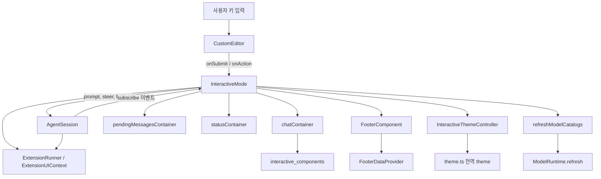
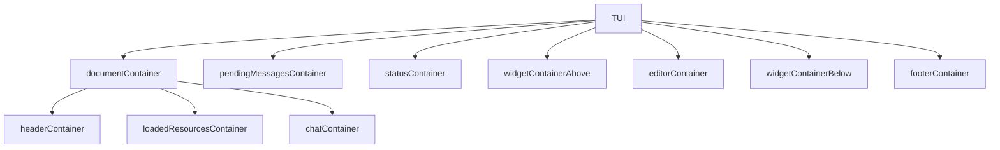
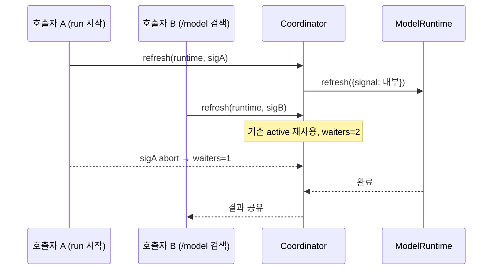
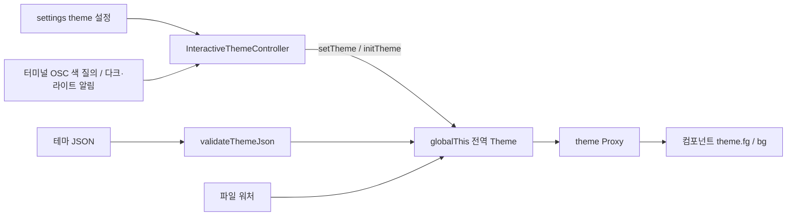
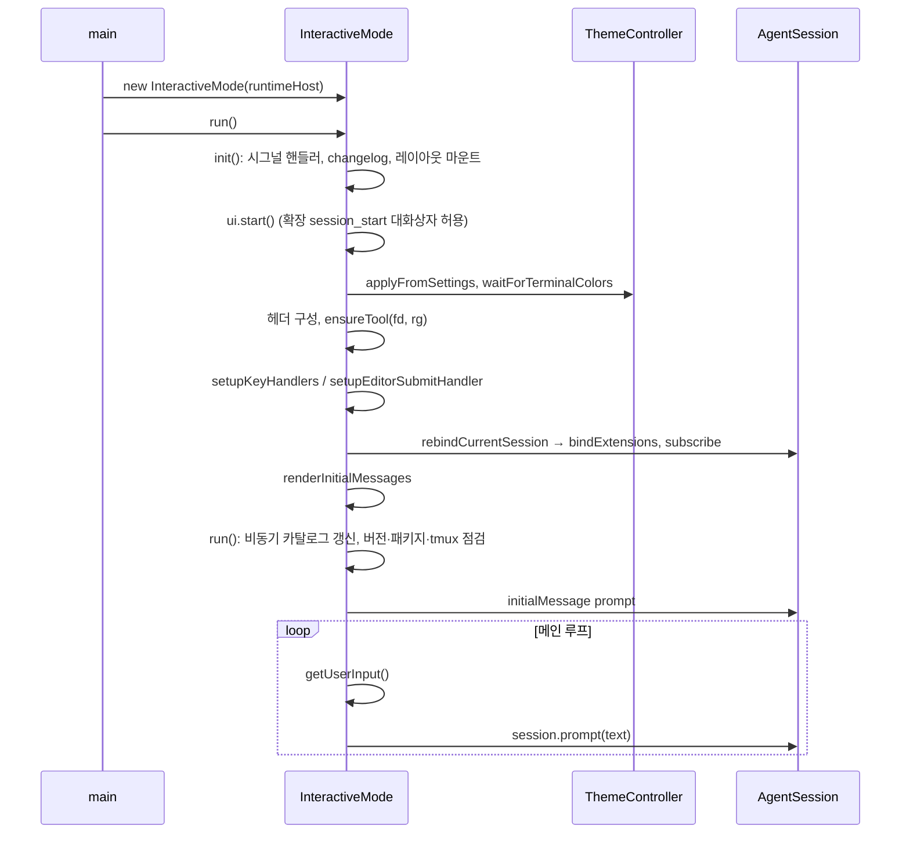
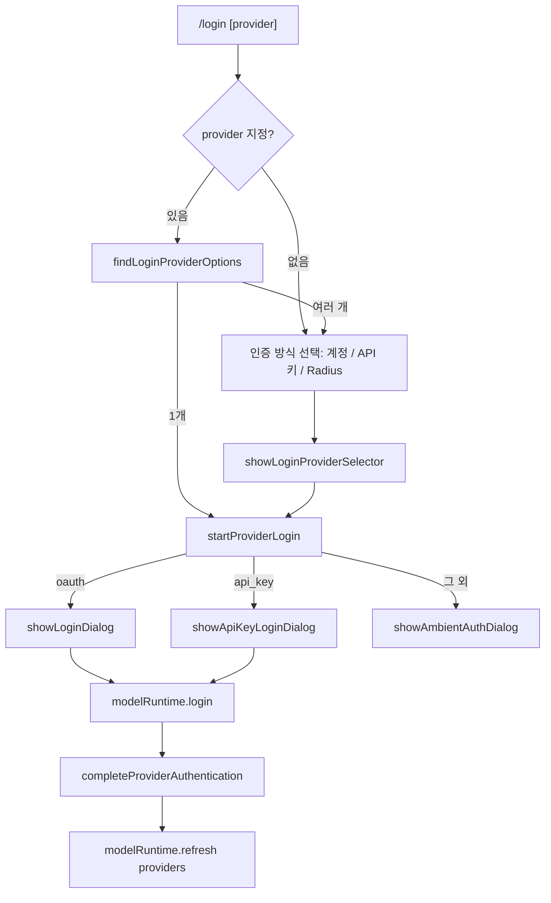

# interactive_mode

`interactive_mode`는 coding agent의 **TUI(터미널 UI) 프론트엔드**입니다. 비즈니스 로직(프롬프트 처리, 모델 호출, 압축, 세션 저장)은 [agent_session_core](agent_session_core.md)의 `AgentSession`에 위임하고, 이 모듈은 (1) 화면 구성과 렌더링, (2) 키 입력·슬래시 명령 처리, (3) `AgentSession` 이벤트를 컴포넌트로 변환하는 일만 맡습니다.

주요 파일:

| 파일 | 역할 |
|---|---|
| `packages/coding-agent/src/modes/interactive/interactive-mode.ts` | `InteractiveMode` 본체, `BuiltInHeader`, `ExpandableText`, `WorkingStatusEditor`, `getLoginProviderSearchText` |
| `.../interactive/model-catalog-refresh.ts` | `ModelCatalogRefreshCoordinator` (모델 카탈로그 갱신 중복 제거) |
| `packages/coding-agent/src/core/footer-data-provider.ts` | `FooterDataProvider` (git 브랜치, 확장 상태, provider 수) |
| `.../interactive/theme/theme.ts` | `Theme`, 전역 `theme` 프록시, 테마 로딩/감시 |
| `.../interactive/theme/theme-controller.ts` | `InteractiveThemeController` (터미널 색 질의, 자동 동기화) |
| `.../interactive/theme/theme-json.ts` | `validateThemeJson` (typebox 기반 검증, 지연 로딩 목적) |

개별 UI 컴포넌트(선택기, 로그인 대화상자, 메시지 렌더러 등)는 [interactive_components](interactive_components.md)에, 같은 `AgentSession`을 JSON-RPC로 노출하는 대안 모드는 [rpc_mode](rpc_mode.md)에 있습니다.

## 1. 아키텍처

참조: [agent_session_core](agent_session_core.md), [extension_system](extension_system.md), [settings_and_keybindings](settings_and_keybindings.md), [model_and_auth_management](model_and_auth_management.md), [session_persistence_and_compaction](session_persistence_and_compaction.md).

### 1.1 레이아웃 컨테이너

`init()`은 하나의 컴포넌트 트리를 만들고 TUI 렌더러(`TuiMainScreen` 일반 모드 또는 `TuiAltScreen` 전체화면)에 마운트합니다. `switchTuiMode()`는 같은 컴포넌트를 새 렌더러로 옮겨 붙입니다.

- `editorContainer`는 에디터 자리를 선택기·확장 입력·로그인 대화상자가 **임시로 대체**하는 슬롯입니다(`showSelector`, `showExtensionSelector`, `showExtensionCustom`).
- 확장 위젯은 `MAX_WIDGET_LINES = 10`줄로 제한됩니다.
- 헤더/푸터는 확장이 `setHeader`/`setFooter`로 교체할 수 있고, 빈 값으로 호출하면 내장 컴포넌트로 복원됩니다.

## 2. 핵심 컴포넌트

### InteractiveMode
`runtimeHost: AgentSessionRuntime`을 받아 `session`, `agent`, `sessionManager`, `settingsManager` getter로 현재 세션에 접근합니다. 세션이 교체(새 세션, fork, resume)되면 `setRebindSession` 콜백이 `rebindCurrentSession()`을 호출하여 구독과 확장을 다시 바인딩합니다. getter가 항상 `runtimeHost.session`을 읽기 때문에 세션 교체 후에도 참조가 낡지 않습니다.

주요 메서드 그룹:

- 수명주기: `init()`, `run()`, `shutdown()`, `stop()`, `registerSignalHandlers()`
- 이벤트: `subscribeToAgent()`, `handleEvent()`
- 입력: `setupKeyHandlers()`, `setupEditorSubmitHandler()`, `getUserInput()`
- 선택기: `showSelector()`와 `showSettingsSelector`, `showModelSelector`, `showTreeSelector`, `showSessionSelector` 등
- 확장 UI: `createExtensionUIContext()`, `setExtensionWidget`, `setCustomEditorComponent`
- 명령: `handleReloadCommand`, `handleExportCommand`, `handleCompactCommand`, `handleBashCommand` 등

### ExpandableText / BuiltInHeader
`ExpandableText`는 `setExpanded(bool)`로 축소/확장 텍스트를 전환하는 `ThemedText`입니다. `BuiltInHeader`는 이를 상속하여 `handleMouse`로 로고(처음 두 줄, x 1~4) 클릭 시 `onLogoClick`(이스터에그)을 호출합니다. 도구 출력 확장(`setToolsExpanded`)은 `isExpandable()` 덕 타이핑으로 header, 리소스 목록, chat의 자식에 전파됩니다.

### WorkingStatusEditor
`embedWorkingStatus === true`이고 `setWorkingStatusIndicator`를 가진 에디터를 식별하는 인터페이스입니다. 기본 `CustomEditor`가 이에 해당하며, 작업 중 표시기가 에디터 테두리에 내장됩니다. 그렇지 않은 커스텀 에디터에서는 `statusContainer`에 표시됩니다(`showStatusIndicator`).

### getLoginProviderSearchText
`/login <prefix>` 자동완성용 검색 문자열(`id name authType 라벨`)을 만들고 `fuzzyFilter`에 쓰입니다.

### ModelCatalogRefreshCoordinator
런타임(`WeakMap` 키)별로 진행 중인 `modelRuntime.refresh()`를 하나만 유지하고 여러 호출자가 공유합니다. 각 호출자의 `AbortSignal`은 독립적이며, **대기자(waiters)가 0이 되면** 실제 갱신을 abort합니다.

사용처: `run()`(15초 타임아웃, `PI_OFFLINE`이면 생략), `findExactModelMatch`, `showModelsSelector`.

### FooterDataProvider
확장이 다른 경로로 얻을 수 없는 데이터(git 브랜치, 확장 상태, provider 수)를 제공합니다.

- 브랜치: `.git/HEAD`가 있는 **디렉터리**를 `watchWithErrorHandler`로 감시합니다(git은 임시 파일 rename으로 HEAD를 쓰므로 파일 감시는 inode가 바뀌면 끊김). reftable 저장소는 `reftable/`과 `tables.list`도 감시합니다. WSL의 Windows 마운트 경로(`/mnt/c/...`)는 `watchFile` 폴링을 추가합니다.
- 500ms 디바운스, 진행 중 갱신이 있으면 `refreshPending`으로 합칩니다. 감시 오류 시 재시도 타이머로 복구합니다.
- `setExtensionStatus(key, text)`: `undefined`면 삭제. `dispose()`는 타이머/워처/콜백을 정리합니다.
- 확장에는 `ReadonlyFooterDataProvider`(getter와 `onBranchChange`만)가 전달됩니다.

### Theme 시스템

- `Theme`: 토큰(`ThemeColor`, `ThemeBg`)을 생성 시점에 ANSI 시퀀스로 미리 계산하여 `fg()/bg()`를 조회+문자열 결합으로 처리합니다. `colors`는 `""`(터미널 기본) 토큰을 터미널이 보고한 기본 색 또는 `appearance` 추정값으로 채우며, 터미널 색 객체가 바뀔 때만 재계산합니다. `appearance`는 JSON 선언, 색 밝기 추정(`detectAppearance`), 터미널 외형 순으로 결정됩니다. `isLightTheme()`는 HTML 내보내기용입니다.
- 전역 `theme`은 `Symbol.for(...)` 키로 `globalThis`에 저장하는 Proxy입니다. node와 jiti(개발 모드)처럼 모듈 인스턴스가 여러 개여도 같은 테마를 공유하기 위해서입니다. `initTheme()` 전에 접근하면 예외가 납니다.
- `system` 테마(`SYSTEM_THEME_NAME`)는 터미널 보고 색에서 생성되며, 색 질의가 끝나기 전에는 채도 0(회색조)입니다.
- `InteractiveThemeController`:
  - `applyFromSettings()`: 설정 해석(`light/dark` 쌍 형식 지원), 자동 동기화 on/off, 터미널 색 질의.
  - `requestTerminalColors()`: 100ms 타임아웃, 늦은 응답도 `onLateReply`로 적용. 색이 실제로 바뀐 경우에만 `invalidate` + 재렌더.
  - `setThemeInstance()`: 확장이 `Theme` 인스턴스를 직접 주입(`<in-memory>`, 자동 동기화·워처 중단).
  - `waitForTerminalColors()`: 헤더처럼 색을 문자열에 구워 넣는 컨텐츠를 만들기 전에 대기.
- `validateThemeJson`: typebox 스키마로 사용자 테마를 검증하고 누락 토큰을 모아 보고합니다. 테마 이름에 `/`는 금지됩니다(자동 light/dark 설정과 충돌). typebox 로딩 비용(~17MB 모듈 그래프)을 내장 테마만 쓰는 경로에서 피하려고 `theme.ts`와 분리되어 있습니다(`setThemeJsonValidator`로 주입).
- 커스텀 테마 파일은 `startThemeWatcher()`가 100ms 디바운스로 재로딩하며, 편집 중 파싱 실패는 무시하고 마지막 정상 테마를 유지합니다.

## 3. 주요 흐름

### 3.1 시작 (`init` → `run`)

초기화 중에는 `handleStartupSubmit`이 입력을 막고 "Startup is still in progress"를 보여 주며, 인터럽트/종료 키만 활성입니다. 관리 도구(fd, rg) 다운로드가 끝난 뒤에 나머지 핸들러가 켜집니다.

### 3.2 이벤트 → UI 매핑 (`handleEvent`)

| 이벤트 | 처리 |
|---|---|
| `message_start` (assistant) | `AssistantMessageComponent` 생성, `streamingComponent`로 보관 |
| `message_update` | 내용 갱신, `toolCall` 블록마다 `ToolExecutionComponent`를 `pendingTools`(toolCallId 키)에 등록/인자 갱신 |
| `message_end` | 중단/오류면 대기 중 도구에 오류 결과 기록, 아니면 `setArgsComplete()`와 사고 블록 드롭·캐시 미스 알림 |
| `tool_execution_start/update/end` | 대응 컴포넌트 갱신 (`parentToolCallId`가 있는 중첩 호출은 부모 행에 표시되므로 무시) |
| `queue_update` | 대기 메시지(Steering/Follow-up) 표시 갱신 |
| `entry_appended` | custom 엔트리, 캐시 워밍 usage, custom_message, compaction 반영 |
| `compaction_start/end` | Esc를 `abortCompaction`으로 바꾸고, 완료 시 채팅 재구성 + 요약 메시지 + 비용 알림, 대기열 flush |
| `auto_retry_start/end` | Esc를 `abortRetry`로 바꾸고 `RetryStatusIndicator` 표시 |
| `agent_settled` | `shutdownRequested`면 종료 |

### 3.3 입력 제출 분기

`setupEditorSubmitHandler`의 우선순위: 내장 슬래시 명령 → `!`/`!!` bash → 압축 중이면 `queueCompactionMessage`(확장 명령은 즉시 실행) → 스트리밍 중이면 `prompt(text, {streamingBehavior: "steer"})` → 그 외에는 `onInputCallback`/`pendingUserInputs`로 `getUserInput()`에 전달. Alt+Enter(`handleFollowUp`)는 `followUp` 동작을 사용합니다.

`!` 명령은 `emitUserBash`로 확장이 가로챌 수 있고, 스트리밍 중에는 `pendingMessagesContainer`에 두었다가 다음 일반 제출 때 chat으로 옮깁니다(`flushPendingBashComponents`).

### 3.4 압축 중 메시지 큐

압축 중 입력은 `compactionQueuedMessages`에 쌓이고 `compaction_end`에서 `flushCompactionQueue`가 비웁니다. 첫 일반 메시지는 `prompt`, 나머지는 `steer`/`followUp`으로 보내며, 실패하면 `restoreQueue`로 큐를 복구하고 오류를 표시합니다. Esc/`app.message.dequeue`는 모든 큐를 에디터로 되돌립니다(`restoreQueuedMessagesToEditor`).

### 3.5 로그인

`completeProviderAuthentication`은 이전 모델이 unknown이면 provider 기본 모델(`defaultModelPerProvider`)을 자동 선택합니다. 동적 카탈로그가 비어 있으면(`deferSelection`) 갱신 후에 선택하며, 그 사이 사용자가 모델/세션을 바꿨다면 덮어쓰지 않습니다. `/logout`은 저장된 자격 증명만 제거합니다(환경 변수·`models.json`은 유지).

### 3.6 종료와 오류 복구

- `shutdown()`: 대화형 종료는 TUI를 먼저 정지하고 `runtimeHost.dispose()`(확장 `session_shutdown`), 종료 후 `formatResumeCommand` 결과를 출력합니다. SIGTERM/SIGHUP은 반대로 확장 정리를 먼저 하여, 터미널이 죽어도 정리가 누락되지 않게 합니다.
- `emergencyTerminalExit`: stdout/stderr에서 `EIO`/`EPIPE`/`ENOTCONN` 발생 시 정상 종료 없이 코드 129로 종료(복원 시퀀스 재발 방지).
- `uncaughtCrash`: 처리되지 않은 예외 시 TUI를 `stop()`하여 raw mode/커서 숨김을 복구하고, `recordCrash`로 기록해 다음 시작 때 `/bug` 안내를 표시합니다.
- `handleFatalRuntimeError`: 세션 생성/전환 실패는 복구 불가로 보고 종료합니다.

## 4. 확장 통합

`bindCurrentSessionExtensions()`가 `mode: "tui"`로 `createExtensionUIContext()`를 `session.bindExtensions()`에 넘깁니다. 제공 기능: `select/confirm/input/editor/custom`(오버레이 포함), `notify`, `setStatus`, `setWidget`, `setHeader/Footer`, `setEditorComponent`, `addAutocompleteProvider`, 테마 조회/설정, 터미널 입력 리스너. 확장이 만든 커스텀 에디터는 `CustomEditor`를 상속한 경우 `actionHandlers`를 덕 타이핑으로 복사받습니다(jiti 모듈 경계에서 `instanceof`가 실패하기 때문). `resetExtensionUI()`는 세션 무효화·reload 전에 확장이 남긴 UI 상태를 모두 정리합니다. 자세한 내용은 [extension_system](extension_system.md).

## 5. 설계 포인트와 주의점

- **얇은 UI 계층**: 상태 변경은 `AgentSession`/`SettingsManager`를 통해서만 하고, UI는 이벤트로 재구성합니다. 설정 변경 시 `rebuildChatFromMessages()`로 채팅을 전부 다시 그릴 수 있습니다.
- **테마 콜백 기반 렌더링**: `ThemedText`가 `() => string`을 받아 테마 변경 시 다시 계산됩니다. 문자열로 색을 구워 두는 코드는 `waitForTerminalColors()` 이후에 만들어야 합니다.
- **캐시 비용 가시화**: 캐시 미스(`detectCacheMiss`, 20k 토큰 또는 $0.1 이상), 압축/브랜치 요약 비용, Anthropic 사고 블록 드롭을 채팅에 경고로 표시합니다. 캐시 미스는 영속화되지 않아 로드 시 재계산됩니다.
- **오프라인**: `PI_OFFLINE`이면 카탈로그 갱신, 패키지 업데이트 확인, 설치 텔레메트리를 건너뜁니다.
- **검증 수준**: 위 내용은 제공된 소스 코드를 직접 읽고 작성했습니다(코드 확인). `interactive_components`의 개별 구현과 `tui-renderer.ts`, `chat-viewport.ts` 등은 이 모듈 범위 밖이라 미확인입니다.
