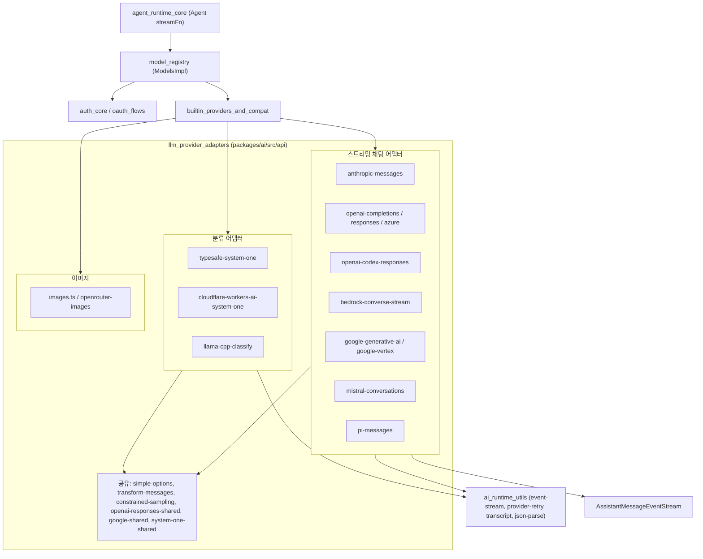
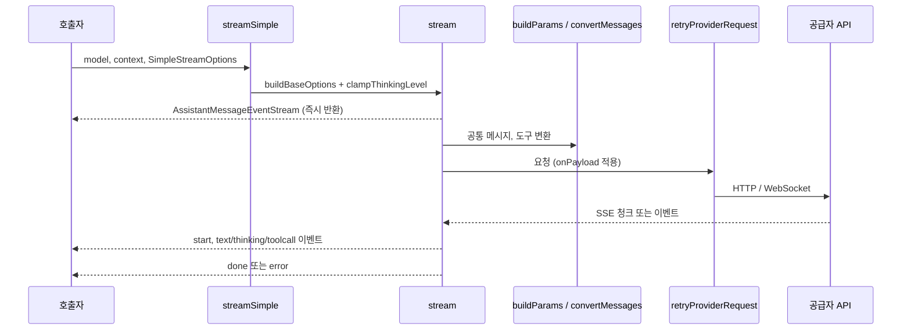

# llm_provider_adapters 개요

## 1. 목적

`llm_provider_adapters`(`packages/ai/src`)는 pi가 LLM 공급자마다 다른 요청·응답 형식을 하나의 공통 계약 뒤로 숨기는 어댑터 계층이다. 이 계층을 쓰면 상위 계층은 공급자별 차이를 몰라도 된다.

- **입력**: `Model<TApi>`, `TranscriptContext`, `StreamOptions` / `SimpleStreamOptions`
- **출력**: `AssistantMessageEventStream`
  - 이벤트는 `start`, `text_*`, `thinking_*`, `toolcall_*`, `done`, `error`이다.
- **공통 규약**
  - 각 어댑터는 스트림 객체를 먼저 반환하고, 비동기 IIFE에서 이벤트를 채운다.
  - 실패는 throw하지 않고 `error` 이벤트(`stopReason`: `aborted` 또는 `error`)로 전달한다. 예외는 `streamSimple`의 API 키 누락 throw 등 일부 경로뿐이다.
  - 재시도는 SDK에 맡기지 않고 `retryProviderRequest`가 맡는다. 대부분 SDK는 `maxRetries: 0`으로 둔다.
  - 스트리밍 임시 버퍼(`partialJson`, `partialArgs`, `index` 등)는 저장되는 메시지에서 제거한다.
  - `reasoning`은 `clampThinkingLevel`과 `thinkingLevelMap`으로 공급자별 값에 매핑한다.
  - `onPayload`, `onResponse`, `onProviderStreamEvent` 훅으로 요청과 응답을 관찰하거나 바꿀 수 있다.
  - 사용량은 `calculateCost`로 비용을 계산한다.

> 검증 수준: 이 개요는 하위 모듈 문서(CodeWiki 산출물, `artifacts/pi/codewiki-d4-3pkg/`)를 종합한 것이다. 각 문서가 제공된 소스를 읽고 쓴 `코드 확인` 내용을 따르며, 이 개요에서 `repos/pi`를 다시 대조하지는 않았다(`미확인`). 모듈 간 호출 관계 중 일부는 모듈 트리에 근거한 `추론`이다.

## 2. 하위 모듈

| 하위 모듈 | API 식별자 | 대상 | 전송 방식 |
|---|---|---|---|
| [anthropic_provider_api](anthropic_provider_api.md) | `anthropic-messages` | Anthropic Messages API (beta), Copilot, Vertex 등 | `@anthropic-ai/sdk` + `asResponse()` 후 SSE 직접 파싱 |
| [openai_provider_apis](openai_provider_apis.md) | `openai-completions`, `openai-responses`, `azure-openai-responses` | OpenAI와 호환 서버, Azure | `openai` SDK |
| [openai_codex_provider_api](openai_codex_provider_api.md) | `openai-codex-responses` | ChatGPT 구독용 Codex 백엔드 | WebSocket 우선, SSE 폴백 |
| [bedrock_provider_api](bedrock_provider_api.md) | `bedrock-converse-stream` | AWS Bedrock Converse Stream | AWS SDK, `.lazy.ts`로 지연 로딩 |
| [google_provider_apis](google_provider_apis.md) | `google-generative-ai`, `google-vertex` | Gemini Developer API, Vertex AI | `@google/genai` |
| [mistral_provider_api](mistral_provider_api.md) | `mistral-conversations` | Mistral 네이티브 Chat Completions | `fetch`와 자체 SSE 파서 |
| [cloudflare_and_pi_gateway_apis](cloudflare_and_pi_gateway_apis.md) | `pi-messages`, Workers AI 바인딩, Workers AI System One | pi 자체 게이트웨이(Radius), Cloudflare AI Gateway | `fetch`, `env.AI.fetch()` |
| [classifier_apis](classifier_apis.md) | `typesafe-system-one`, `llama-cpp-classify` | 채팅이 아닌 분류(`choice`/`score`/`bool`) | HTTP, llama-server logprob |
| [image_generation](image_generation.md) | `openrouter-images` | 이미지 생성 | 레지스트리와 지연 로딩 |

## 3. 아키텍처

### 3.1 계층 구조

### 3.2 공통 스트리밍 흐름

### 3.3 설계 포인트

- **API 식별자 기반 디스패치**: `model.api`가 구현체를 결정한다. 분류와 이미지는 별도 레지스트리(`images-api-registry`, 각 provider의 `classifiers` 맵)를 쓴다.
- **중복 제거용 공유 코드**: Responses 계열은 `openai-responses-shared.ts`를, Google 두 어댑터는 `google-shared.ts`를, System One 계열은 `system-one-shared.ts`를 공유한다. 다만 `google-generative-ai.ts`와 `google-vertex.ts`의 `stream` 본문은 거의 복제 구조라 수정할 때 둘을 함께 고쳐야 한다.
- **호환성 흡수**: 공급자와 모델별 차이는 `model.compat`으로 제어한다. 예: `detectCompat`(OpenAI Completions), `getAnthropicCompat`.
- **지연 로딩**: Node 전용 SDK나 번들 크기에 민감한 구현은 `.lazy.ts`나 동적 import로 늦게 로드한다. 예: Bedrock, 분류기, 이미지.
- **전송 계층 복원력**: Codex는 WebSocket 실패 시 세션 단위로 SSE로 폴백한다. 이미 이벤트가 나간 뒤의 실패는 중복 출력을 막으려고 폴백하지 않는다.
- **인증 분리**: 어댑터는 이미 해석된 `apiKey`와 `headers`만 받는다. 키 해석은 `auth_core`와 `oauth_flows`가 담당한다.
- **프롬프트 캐시**: `cacheRetention`과 `PI_CACHE_RETENTION`을 공통으로 해석하며, 공급자별로 `cache_control`, `prompt_cache_key`, cache point 등 다른 방식으로 매핑한다.

## 4. 주의할 점

- 오류 처리 규약이 경로마다 다르다. 예를 들어 `streamSimple`은 키가 없으면 동기 throw하고 `stream`은 `error` 이벤트로 바꾼다. 전역 `generateImages()`는 미등록 API에서 throw하고 `Models.generateImages()`는 항상 결과를 반환한다.
- 모델 ID 정규식(`usesGoogleThinkingLevel` 등)과 `claudeCodeVersion` 같은 하드코딩 값은 신규 모델이나 버전이 나올 때 수동으로 갱신해야 한다.
- 모듈 전역 상태(Codex의 `websocketSessionCache`, Anthropic의 `federationClient`)는 테스트 시 reset이나 close가 필요하다.
- `formatBedrockError` 같은 오류 문자열 형식은 상위 agent-session의 재시도·컨텍스트 오버플로 감지가 문자열 매칭에 의존하므로 바꾸면 안 된다.
- 테스트 설정은 `packages/ai/vitest.config.ts`이다. 실제 공급자 호출 대신 faux provider를 쓴다는 것이 repo 규칙이다.

## 5. 관련 모듈

- [agent_runtime_core](agent_runtime_core.md): `Agent`가 `streamFn`으로 어댑터를 호출하는 소비자
- [ai_platform_foundation](ai_platform_foundation.md): `model_registry`(모델 카탈로그, `calculateCost`), `auth_core`/`oauth_flows`(인증), `builtin_providers_and_compat`(provider 등록), `ai_runtime_utils`(이벤트 스트림, 재시도, 파싱 유틸)
- [experimental_radius_relay](experimental_radius_relay.md): `pi-messages`가 쓰는 Radius 게이트웨이 개념의 코딩 에이전트 쪽 구현