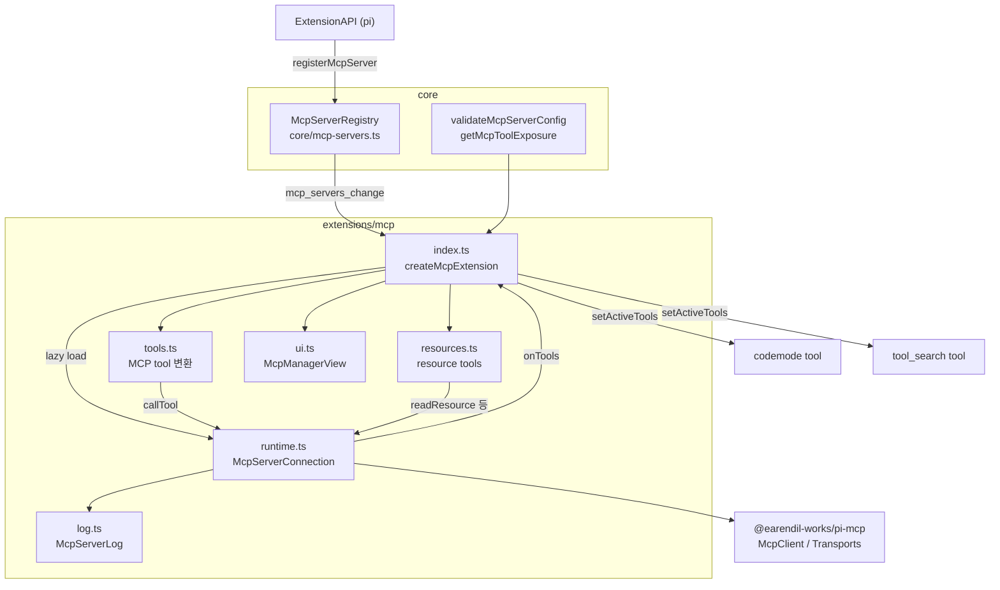
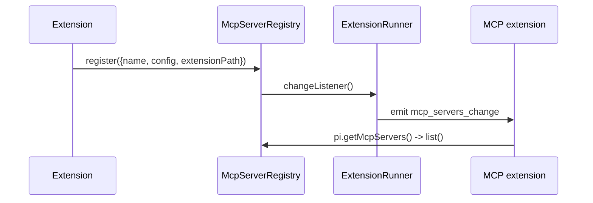
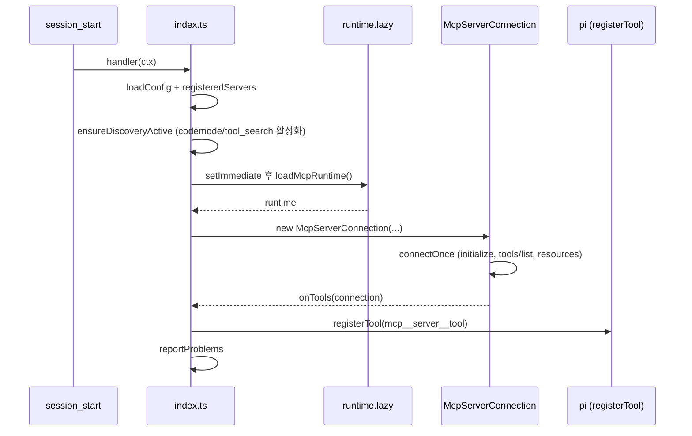
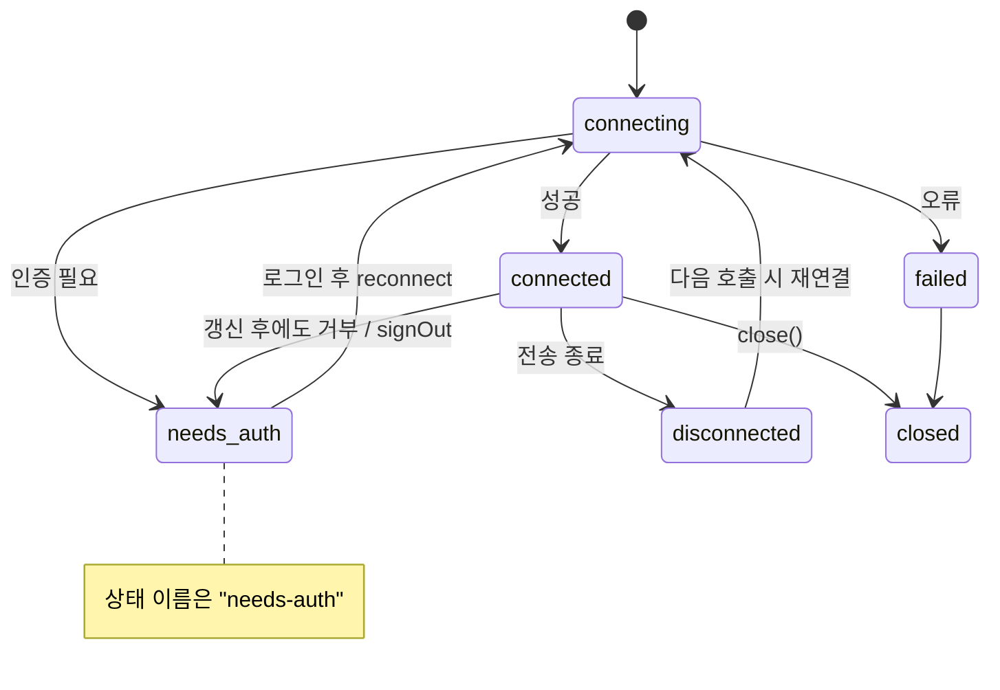
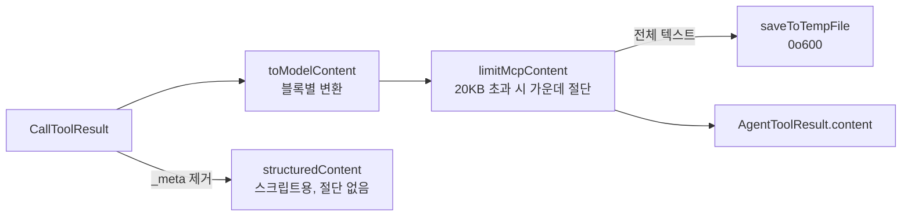
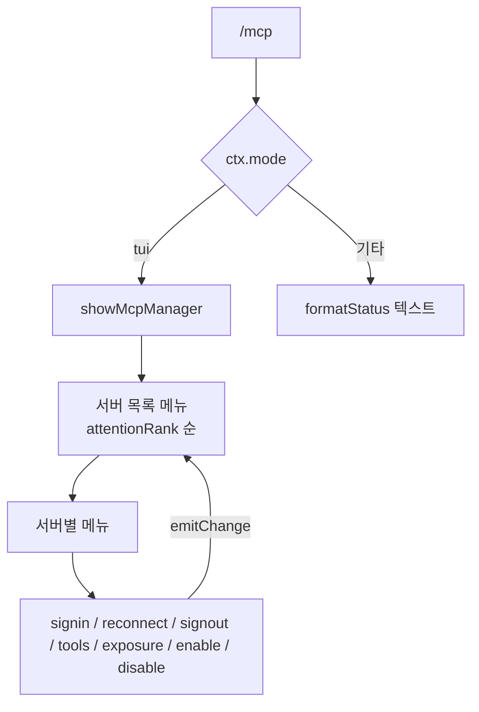

# mcp_integration 모듈

`mcp_integration`은 pi(coding-agent)가 외부 **MCP(Model Context Protocol) 서버**의 tool과 resource를 세션에 연결하는 내장 확장(extension)이다. 두 부분으로 나뉜다.

- **core 쪽 등록소**: `packages/coding-agent/src/core/mcp-servers.ts` — 서버 설정 타입, 검증, 그리고 확장이 `pi.registerMcpServer()`로 등록한 서버를 저장하는 `McpServerRegistry`.
- **내장 MCP 확장**: `packages/coding-agent/src/extensions/mcp/` — `mcp.json`과 등록된 서버에 연결하고, MCP tool을 pi tool로 변환하며, `/mcp` 관리 UI를 제공한다.

> 참고: 이 문서는 제공된 소스 코드(검증 수준: 코드 확인)에 근거한다. `config.ts`, `oauth.ts`, `runtime.lazy.ts`, `@earendil-works/pi-mcp`의 내부는 제공된 코드에 없으므로 인터페이스만 언급한다(미확인).

관련 모듈: [extension_system](extension_system.md) (확장 API/이벤트), [bundled_extensions](bundled_extensions.md) (`codemode`, `tool_search`), [builtin_tools](builtin_tools.md), [model_and_auth_management](model_and_auth_management.md) (`auth.provider` 토큰), [interactive_components](interactive_components.md) (TUI 컴포넌트).

---

## 1. 아키텍처 개요

핵심 설계:

1. **core는 검증과 저장만 한다.** 연결은 core가 아니라 확장이 담당한다(`mcp-servers.ts` 헤더 주석).
2. **MCP 클라이언트는 지연 로드된다.** `index.ts`는 `runtime.lazy.ts`의 `loadMcpRuntime()`을 통해 서버가 하나 이상 설정된 경우에만 `runtime.ts`(MCP 클라이언트 포함)를 불러온다.
3. **모든 호출은 pi tool 파이프라인을 거친다.** 따라서 `tool_call`/`tool_result` 훅과 권한 확장이 내장 tool과 동일하게 MCP tool에 적용된다.

---

## 2. 서버 설정과 등록소 (`core/mcp-servers.ts`)

### 설정 타입

| 타입 | 설명 |
|---|---|
| `McpServerConfigBase` | 공통: `exposure`(기본 `codemode`), `description`, `toolExposure`, `enabled`(기본 true), `timeout`(초, 기본 60) |
| `McpStdioServerConfig` | `command`, `args`, `env`(`${NAME}`/`!cmd` 참조 가능), `cwd` |
| `McpHttpServerConfig` | `url`, `headers`, `oauth`(`McpOAuthConfig`), `auth: { provider }` |

### Exposure(노출 방식)

| 값 | 의미 |
|---|---|
| `codemode` | codemode 스크립트에서만 호출. 모델 tool 선언과 codemode 설명에는 나오지 않고, 스크립트가 `searchTools()`로 찾는다. `codemode-deferred`는 별칭(검증 시 치환). |
| `deferred` | `tool_search`가 로드하기 전에는 모델에 선언되지 않음. 로드 후 모델이 직접 호출. |
| `direct` | 일반 tool처럼 모델에 즉시 선언. |
| `hidden` | 등록되지만 접근 불가. |

`getMcpToolExposure(config, toolName)`은 `toolExposure`의 정확한 이름 → 패턴(`*` 와일드카드, 객체 내 첫 일치) → 서버 `exposure` → `codemode` 순으로 결정한다.

### 검증 규칙 (`validateMcpServerConfig`)

- 서버 이름은 `/^[A-Za-z0-9_-]+$/`.
- `type: "sse"`는 거부(스트리머블 HTTP만 지원).
- `url`이 있으면 HTTP(`http`/`https` URL, `headers`는 문자열 맵, `oauth` 검증), `command`가 있으면 stdio.
- `oauth.callbackUrl`은 loopback(`localhost`, `127.0.0.1`, `[::1]`)의 http URI이며 query/fragment가 없어야 하고 `callbackPort`와 포트가 충돌하면 안 된다.
- `auth.provider`는 자격 증명을 `url`로 보내므로 https이거나 loopback이어야 한다.
- 반환값은 별칭이 치환된 복사본 또는 오류 문자열.

`mcpNamespace(server)`는 `mcp__<server>`(`-`는 `_`로 치환)를 반환한다.

### `McpServerRegistry`

- `register`: 같은 이름이면 교체. 소유권 확인은 호출자 책임.
- `unregister(name, extensionPath)`: 등록한 확장의 경로가 같을 때만 삭제.
- `get`, `list`(구조화 복제본을 등록 순서대로 반환), `setChangeListener`(변경마다 호출; runner가 바인딩 시 `mcp_servers_change` 발행에 사용).

---

## 3. 확장 진입점 (`extensions/mcp/index.ts`)

`createMcpExtension(options)`가 `ExtensionFactory`를 반환하고, `export default createMcpExtension()`이 내장 인스턴스다. `McpExtensionOptions`로 `loadConfig`, `createTransport`, `credentials`, `logPath`, `openUrl`, `updateConfig`, `startupWaitMs`(기본 10000ms)를 주입할 수 있다(테스트/대체 구현용).

`defaultLoadConfig(ctx)`는 `loadMcpConfig({ agentDir: getAgentDir(), cwd: ctx.cwd, projectTrusted: ctx.isProjectTrusted() })`를 호출한다. 즉 에이전트 디렉터리의 `mcp.json`과, 신뢰된 프로젝트의 `.pi/mcp.json`을 읽는다. **`mcp.json`의 서버가 같은 이름(네임스페이스 기준)의 등록 서버보다 우선**하며, 가려진 서버는 `overridden`으로 `/mcp`에 표시된다.

### 이벤트별 동작

| 이벤트 | 동작 |
|---|---|
| `session_start` | 설정 로드, 서버 목록 구성(`mcp.json` + 등록), `ensureDiscoveryActive`, 활성 서버를 백그라운드로 연결, 완료 후 문제를 한 번 보고(`reportProblems`). 서버가 없으면 런타임을 로드하지 않음. |
| `before_agent_start` | `direct` tool 서버를 최대 `startupWaitMs`까지 기다리고(첫 프롬프트 한 번만), 시스템 프롬프트 `mcp_servers` 섹션을 갱신. |
| `tool_call` | codemode 스크립트는 코드에서 서버 네임스페이스(또는 `searchTools`/`describeNamespace`/`describeTool`/`ALL_TOOLS`)를 언급하면 해당 서버를 기다림. `tool_search`와 resource tool은 모든 보류 서버를 기다림. |
| `turn_start` | 다른 프로세스(`pi mcp login` 등)에서 저장된 토큰이 바뀐 `needs-auth` 서버를 재연결. |
| `mcp_servers_change` | 세션 중 등록/해제된 서버를 즉시 연결/해제. 설정이 바뀐 재등록은 제거 후 다시 추가. |
| `session_shutdown` | `generation` 증가, 모든 연결 종료. |

`generation` 카운터는 세션 시작/종료마다 증가하여, 늦게 끝난 런타임 로드나 연결 결과를 버리는 데 쓰인다.

### 시작 흐름

### Tool 등록 (`registerTools`)

- 이름은 `createMcpToolName(server, tool)`로 `mcp__<server>__<tool>`을 만들고 `[A-Za-z0-9_]` 외 문자는 `_`로 바꾼다. 64자 초과이거나 충돌 시 sha256 기반 8자 해시 접미사를 붙인다. `toolOwners`가 이름의 소유자를 기억해 안정성을 유지한다.
- 서버가 tool을 철회하면 pi에는 unregister가 없으므로 `exposure: "hidden"`으로 재등록한다. 비활성화된 서버도 `hideTools`로 동일하게 처리한다.
- `ToolNamespace`(이름, `description`, 서버 `instructions`)를 함께 전달한다.

### Resource tool 노출 (`syncResourceTools`)

resource가 있는 활성 서버(`hidden` 아님)들의 exposure 중 가장 넓은 값(`direct` > `codemode` > `deferred`)으로 resource tool 3종을 등록한다. 서버가 없으면 `hidden`. `direct`였다가 바뀌면 활성 tool 목록에서 제거한다.

### 탐색 tool 활성화 (`ensureDiscoveryActive`)

설정상 `codemode`가 필요하면 codemode tool을(`autoEnableCodemode`가 false가 아닐 때), `deferred`가 필요하면 `tool_search`를 활성화한다. 둘 다 도달 불가이면 경고를 한 번만 표시한다. 다른 확장이 같은 이름으로 만든 tool은 `isCodemodeTool`/`isToolSearchTool`로 걸러 활성화하지 않는다.

### `mcp_servers` 시스템 프롬프트 섹션

`renderServersSection`은 codemode/deferred tool을 가진 활성 서버를 이름순으로 나열한다. 전체 4096자(`MAX_SERVERS_SECTION_CHARS`), 서버 설명은 250자 이내로 줄이며, 그래도 넘치면 뒤쪽 서버를 생략하고 개수만 표시한다. 설명은 `config.description`, 없으면 연결 후 서버 `instructions`의 첫 줄이다.

### `/mcp` 명령

- 인자 없음: TUI에서는 관리자 뷰(`showMcpManager`), 그 외 모드에서는 `formatStatus()` 텍스트.
- `login [server]`, `logout [server]`, `reconnect [server]`: 이름 생략 시 후보가 하나이거나 선호 후보(`needs-auth`/`failed`/`disconnected`)가 하나면 자동 선택, 아니면 선택창.
- 관리자 메뉴 동작: 로그인, 재연결, 로그아웃, tool 목록, exposure 변경, enable/disable. `enabled`/`exposure` 변경은 해당 서버를 정의한 `mcp.json`에 저장(`updateMcpServerConfig`)되며, 확장이 등록한 서버는 현재 세션에만 적용된다.

---

## 4. 연결 런타임 (`extensions/mcp/runtime.ts`)

### `McpServerConnection`

서버 하나의 연결을 관리하고 `McpToolCaller`와 `McpResourceServer`를 구현한다.

| 멤버 | 설명 |
|---|---|
| `name` | `entry.name` |
| `timeoutMs` | `config.timeout`(초, 기본 60) × 1000 |
| `oauthUrl` | HTTP이고 `auth`도 `Authorization` 헤더도 없을 때만 서버 URL, 그 외 `undefined` |
| `getClient()` | 연결된 클라이언트 반환, 없으면 `open()`(동시 호출은 `opening` 공유) |
| `withClient()` | 재연결 포함 요청 실행 |
| `reconnect()` / `signOut()` / `close()` | 재연결, 자격 증명 삭제 후 `needs-auth`, 종료 |

### 인증 방식 선택

1. `oauthUrl`이 있으면 `createMcpAuthProvider`(OAuth, 저장소는 `McpOAuthCredentialStore.forServer`).
2. 아니면 `auth.provider`가 있으면 호출마다 `providerToken(provider)`로 pi provider의 현재 토큰을 읽는다(복사본 저장 없음, `ModelRegistry.getApiKeyForProvider`를 index에서 주입).
3. 그 외에는 인증 provider 없음(헤더로 직접 인증).

### 전송 (`createDefaultTransport`)

- `url`이 있으면 `StreamableHttpTransport` (`resolveHeadersOrThrow`로 헤더 값 해석).
- 아니면 `StdioTransport`: `command`/`args`는 `~` 확장, `cwd`는 세션 cwd 기준 resolve, `env` 값은 `resolveConfigValueOrThrow`(`${NAME}`/`!cmd`), `stderr: "pipe"`.

### 연결/재시도 정책

- **연결**: HTTP 서버만 일시적 오류(408, 429, 5xx(501 제외), `TypeError`)에 대해 250ms, 1000ms 간격으로 재시도. stdio는 재시도 없음. 실패 시 stdio의 stderr 끝 2000자를 오류에 덧붙인다.
- **요청**: 읽기 전용 요청(resource 목록/읽기)만 일시적 HTTP 오류 시 1회 재시도. tool 호출은 이미 실행됐을 수 있어 재시도하지 않는다.
- `McpSessionExpiredError`(서버가 세션을 모름)는 요청이 실행되지 않았으므로 새 세션에서 1회 재시도한다. 이전 클라이언트는 닫지 않고 분리만 한다.
- 로그인이 필요한 오류(`McpOAuthAuthorizationRequiredError`, 또는 provider가 있을 때 `McpAuthRequiredError`)는 클라이언트를 버리고 `needs-auth`로 표시한다.

### 연결 시 수행 작업 (`connectOnce`)

1. `McpClient`(`name: "pi"`, `VERSION`, roots = 세션 cwd) 생성.
2. `notifications/message` → `McpServerLog.write`.
3. `notifications/tools/list_changed` → `refreshTools`, `notifications/resources/list_changed` → `refreshResources`.
4. 서버 capability에 `tools`가 있을 때만 `listTools`, `resources`가 있을 때만 resource/template 조회(`fetchResources`; 실패해도 연결은 유지, MCP App resource는 제외).
5. `instructions` 저장, 상태를 `connected`로 바꾸고 `onTools` 호출.

---

## 5. Tool 변환 (`extensions/mcp/tools.ts`)

`createMcpToolDefinition`이 MCP `Tool`을 pi `ToolDefinition`으로 바꾼다.

- `parameters`: `toParameters`가 `type`을 보정(기본 `object`)하고 `properties`가 없으면 `{}`를 넣는다.
- `outputSchema`: `createMcpResultSchema` — `CallToolResult` 형태(`content`, `structuredContent`, `isError`, `_meta`). codemode가 이 형태를 감지해 `CallToolResult<T>` 선언을 만든다.
- `exposure`: `toToolExposure`로 변환. `codemode`는 pi tool 쪽에서 `deferred`로 취급되고, 어느 tool을 활성화할지만 MCP 확장에서 구분한다.
- `annotations`: boolean 힌트 4종(`readOnlyHint`, `destructiveHint`, `idempotentHint`, `openWorldHint`).
- 진행 알림(`onProgress`)은 `onUpdate`로 전달되어 UI에 표시된다.

### 결과 변환과 출력 제한

- 텍스트가 `MCP_OUTPUT_MAX_BYTES`(20KB)를 넘으면 `truncateMiddle`로 앞뒤만 남기고, 전체는 임시 파일에 저장해 경로를 안내한다. 이미지 블록은 유지한다. 저장 실패 시 그 사유를 문구로 남긴다.
- `saveToTempFile(data, extension)`: `tmpdir()/pi-mcp-<랜덤16hex><ext>`에 `mode: 0o600`으로 쓴다(결과에 민감 정보가 있을 수 있기 때문).
- `resource_link` 블록은 설명 텍스트로, `readableResources`가 참이면 `read_mcp_resource` 사용 안내를 덧붙인다.
- blob resource: 이미지가 아니면 텍스트 MIME(`text/*`, `application/json`, `+json`, `+xml`)는 문자열로 디코딩, 그 외는 임시 파일로 저장하고 경로를 알린다.
- `isError` 결과는 에러 결과가 되지만 `structuredContent`는 유지되어 스크립트에서는 resolve된다.
- 렌더링: 접힌 상태에서는 시각적 줄 기준 5줄 미리보기(`VisualLinePreview`), 확장 시 전체 표시.

---

## 6. Resource tool (`extensions/mcp/resources.ts`)

Codex/opencode와 같은 이름의 tool 3종을 제공해 해당 모델이 그대로 쓸 수 있게 한다.

| Tool | 설명 |
|---|---|
| `list_mcp_resources` | `server` 지정 시 한 페이지(`cursor`로 이어서), 미지정 시 모든 서버의 전체 페이지. 일부 서버 실패는 `errors`에 모음(`Promise.allSettled`). |
| `list_mcp_resource_templates` | 위와 같은 방식으로 URI 템플릿(RFC 6570) 목록. |
| `read_mcp_resource` | `server`와 `uri`로 읽기. 여러 내용이면 URI 라벨을 붙이고, 변환/제한은 `tools.ts` 로직을 재사용. |

- `isMcpAppResource`: `ui://` URI 또는 `profile=mcp-app` MIME은 목록에서 제외(렌더링 호스트 전용).
- 목록 항목에서 `_meta`와 `icons`를 제거하고 `server`를 붙인다.
- `cursor`는 `server`가 있을 때만 사용 가능.
- 세 tool 모두 `readOnlyHint: true`.
- `stringProperty(description)`는 JSON Schema 문자열 속성 조각을 만드는 작은 헬퍼다.
- 서버는 호출 시점에 `options.servers()`로 해석하므로 연결/해제가 즉시 반영된다.

---

## 7. 서버 로그 (`extensions/mcp/log.ts`)

`McpServerLog.write(server, params)`는 서버의 `notifications/message`를 `mcp.log`(기본 에이전트 디렉터리)에 `ISO시각 [server] level logger: 텍스트` 형식으로 한 줄씩 동기 append한다.

- 여러 pi 프로세스가 같은 파일에 쓸 수 있으므로 메시지마다 단일 동기 append.
- 5MB(`MAX_LOG_BYTES`) 초과 시 `mcp.log.1`로 회전(다른 프로세스가 이미 회전했는지 크기를 다시 확인).
- 쓰기 오류는 무시한다: 로깅이 tool 동작을 깨뜨리면 안 된다.

---

## 8. 관리 UI (`extensions/mcp/ui.ts`)

`McpManagerView`는 `McpUi`, `Component`, `Focusable`을 구현하는 `/mcp` 화면이다.

| 메서드 | 역할 |
|---|---|
| `menu(build, subscribe)` | `SelectList` 메뉴. `subscribe`로 연결 상태가 바뀔 때마다 재구성하되 선택 항목을 유지. 취소 시 `undefined`. |
| `status(title, message)` | 진행 중 메시지(읽기 전용). |
| `redirectUrl(title, url, signal)` | 인증 URL(`AuthUrlComponent`, 복사 키 지원)을 보여주고 붙여넣은 리디렉션 URL을 받음. 브라우저 콜백이 도착해 `signal`이 abort되면 `undefined`로 종료. |
| `handleInput` / `render` / `invalidate` | 현재 콘텐츠에 위임. `render`는 폭 초과 줄을 잘라냄. |
| `focused` | 입력 대상(`Input`)에 포커스 전달. |

`showMcpManager(ctx, manage)`는 `ctx.ui.custom`으로 뷰를 띄우고 `manage`가 끝나면 닫으며, 예외는 `notify`로 알린다.

서버 목록은 `needs-auth` → `failed` → `disconnected` → 시작/연결 중 → `connected` → 비활성 순으로 정렬해 사용자 조치가 필요한 서버를 위로 올린다.

---

## 9. 설계상 주의점

- **Exposure 기본값이 `codemode`**: MCP tool이 모델의 tool 선언을 차지하지 않는다. 대신 codemode 또는 `tool_search`가 활성화되어 있어야 호출할 수 있으며, 없으면 경고가 나온다.
- **첫 프롬프트 지연 최소화**: `direct` tool이 있는 서버만 최대 10초 대기하고, 나머지는 스크립트나 검색이 필요로 할 때 대기한다.
- **인증 동시성**: `close()`는 `authProvider.settled()`를 기다려, 회전된 refresh token이 저장되기 전에 종료되어 grant를 잃지 않게 한다.
- **보안**: `auth.provider`는 프로젝트 `mcp.json`에서 금지(주석 근거, 해당 강제는 `config.ts`에 있을 것으로 추정 — 미확인)되고 https/loopback만 허용된다. 임시 파일은 소유자만 읽을 수 있다.
- **테스트 가능성**: `createTransport`, `credentials`, `loadConfig`, `updateConfig` 주입점이 있다. 테스트 설정은 `packages/coding-agent/vitest.config.ts`를 참고(내용은 이 문서에서 확인하지 않음).

## 10. 요약 표

| 파일 | 핵심 구성요소 | 역할 |
|---|---|---|
| `core/mcp-servers.ts` | `McpServerConfigBase`, `McpStdioServerConfig`, `McpServerRegistry` | 설정 타입/검증, 확장 등록 서버 저장 |
| `extensions/mcp/index.ts` | `createMcpExtension`, `defaultLoadConfig` | 수명 주기, tool 등록, `/mcp`, 프롬프트 섹션 |
| `extensions/mcp/runtime.ts` | `McpServerConnection`, `createDefaultTransport` | 연결, 전송, 재시도, 인증 |
| `extensions/mcp/tools.ts` | `saveToTempFile`, `createMcpToolDefinition` | MCP tool → pi tool, 결과 변환/절단 |
| `extensions/mcp/resources.ts` | `stringProperty`, `createMcpResourceToolDefinitions` | resource 조회 tool 3종 |
| `extensions/mcp/log.ts` | `McpServerLog.write` | 서버 로그 파일 기록/회전 |
| `extensions/mcp/ui.ts` | `McpManagerView` | `/mcp` TUI 관리 화면 |
