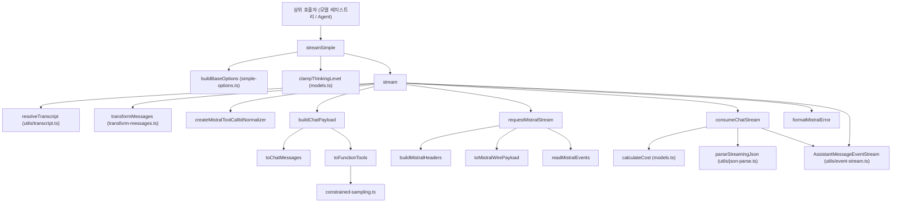
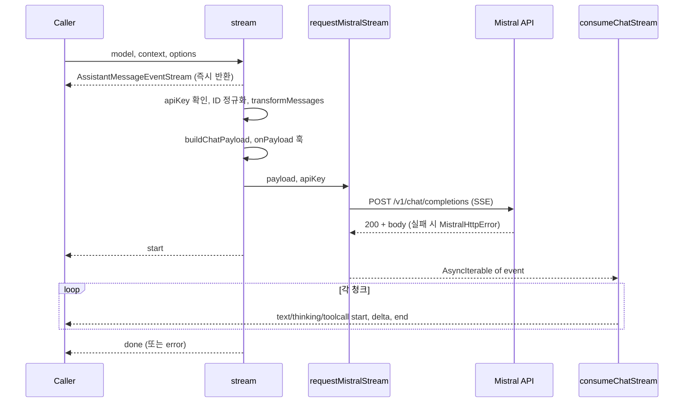
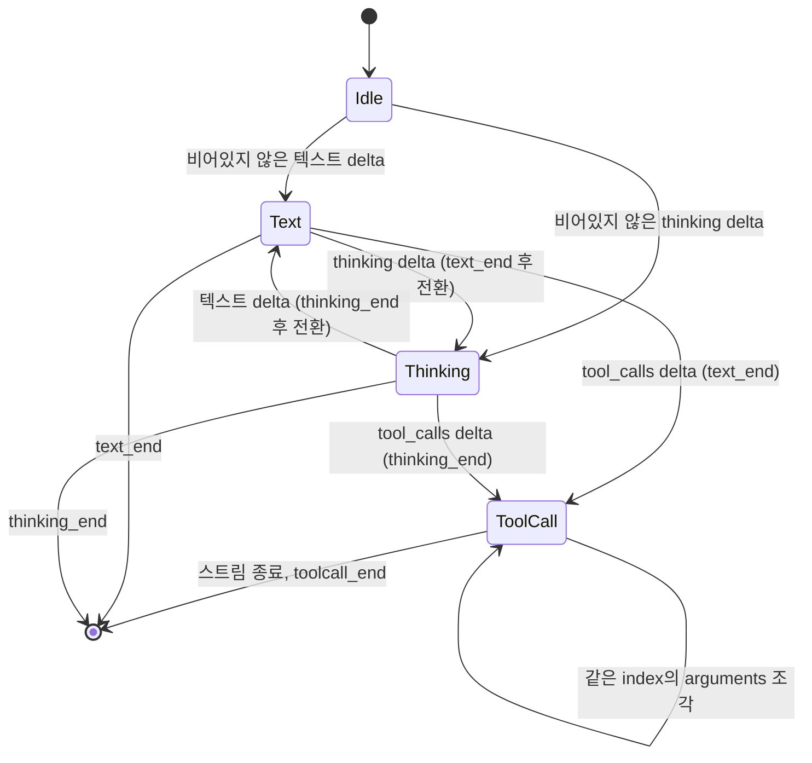
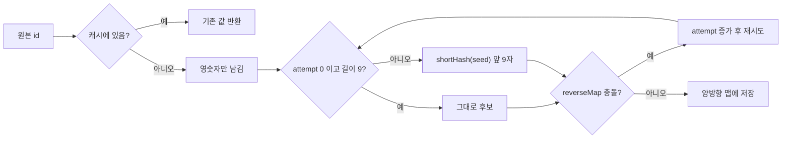

# mistral_provider_api 모듈

`packages/ai/src/api/mistral-conversations.ts` 한 파일로 구성된 어댑터다. 이 파일은 `mistral-conversations` API 타입의 모델을 Mistral 네이티브 Chat Completions 엔드포인트(`POST {baseUrl}/v1/chat/completions`, SSE 스트리밍)에 연결한다. 응답은 provider 공통 형식인 `AssistantMessageEventStream` 이벤트로 변환한다.

SDK 없이 `fetch`로 직접 요청하고, SSE 파서도 직접 구현했다. 상위 모듈은 [llm_provider_adapters](llm_provider_adapters.md)이고, 같은 계층의 다른 어댑터로 [anthropic_provider_api](anthropic_provider_api.md), [openai_provider_apis](openai_provider_apis.md), [google_provider_apis](google_provider_apis.md), [bedrock_provider_api](bedrock_provider_api.md)가 있다.

검증 수준: 아래 내용은 모두 제공된 소스 코드 기준의 `코드 확인`이다. `추론`은 별도로 표시한다.

## 1. 핵심 컴포넌트

| 컴포넌트 | 역할 |
|---|---|
| `streamSimple` | 공통 `SimpleStreamOptions`를 `MistralOptions`로 변환한다. reasoning 수준을 `reasoningEffort` 또는 `promptMode`로 매핑한 뒤 내부 `stream`을 호출한다. |
| `stream` | 내부 진입점이다. 비동기 IIFE로 요청과 소비를 수행하고 `AssistantMessageEventStream`을 즉시 반환한다. |
| `buildChatPayload` | 모델, 메시지, 도구, 샘플링 옵션으로 `MistralChatPayload`를 만든다. |
| `requestMistralStream` | URL과 헤더를 조립하고 타임아웃/abort 신호를 결합해 `fetch`로 요청한다. 성공하면 SSE 이벤트의 `AsyncIterable`을 반환한다. |
| `consumeChatStream` | 청크를 text, thinking, toolCall 블록과 usage, stopReason으로 누적하고 이벤트를 push한다. |
| `createMistralToolCallIdNormalizer` | tool call ID를 Mistral 규격(영숫자 9자)으로 변환하고 충돌을 피한다. |
| `createOutput` | `stopReason: "pending"`인 빈 `AssistantMessage`를 만든다. |
| `formatMistralError` | 오류를 사람이 읽을 문자열로 바꾼다. HTTP 오류는 상태 코드와 본문(최대 4000자)을 포함한다. |

## 2. 아키텍처

## 3. 요청 흐름

### 단계별 설명

1. **옵션 변환(`streamSimple`)**
   - API 키가 없으면 즉시 throw한다. 이 throw는 스트림 밖에서 발생하므로 이벤트가 아니라 예외로 전달된다.
   - `clampThinkingLevel`로 보정한 수준이 `"off"`이면 reasoning을 끈다.
   - 모델에 `thinkingLevelMap`이 있으면 `reasoning_effort`를 쓴다. 매핑에 값이 없으면 `"high"`로 대체하고, off일 때는 `effortMap.off`를 쓴다.
   - `thinkingLevelMap`이 없는 reasoning 모델은 `promptMode: "reasoning"`을 쓴다.
2. **전처리(`stream`)**
   - `resolveTranscript`로 컨텍스트를 정규화한다. `model.compat?.supportsMidConvoSystemMessages`를 인자로 넘긴다.
   - `transformMessages`에 ID 정규화 함수를 넘겨 tool call ID를 변환한다.
   - `options.onPayload`가 값을 반환하면 payload를 그 값으로 교체한다.
3. **HTTP 요청(`requestMistralStream`)**
   - `baseUrl` 끝에 `/`를 보장한 뒤 `v1/chat/completions`를 붙인다.
   - 타임아웃은 `options.timeoutMs ?? 60_000`이다. 사용자 `signal`이 있으면 `AbortSignal.any`로 결합한다.
   - 기본 `globalThis.fetch` 대신 `options.fetch`를 주입할 수 있다.
   - `onResponse` 콜백에 상태 코드와 헤더를 전달한다.
   - `response.ok`가 아니면 본문을 읽어 `MistralHttpError`(`statusCode`, `body`)를 던진다.
4. **스트림 소비(`consumeChatStream`)**: 4절에 정리했다.
5. **종료 판정**
   - `signal.aborted`이면 "Request was aborted"를 던진다.
   - `stopReason`이 `pending`이면 finish reason 없이 끝난 것으로 보고 오류로 처리한다.
   - `aborted`나 `error`이면 `errorMessage`와 함께 오류로 처리한다.
   - 그 외에는 `done`을 push하고 종료한다.
6. **오류 처리**
   - 모든 블록에서 `partialArgs`를 삭제한다.
   - `stopReason`은 abort 여부에 따라 `aborted` 또는 `error`로 정한다.
   - `formatMistralError`의 결과를 `errorMessage`에 담고 `error` 이벤트를 push한 뒤 종료한다.

## 4. 스트림 소비와 블록 상태 머신

- **ID**: 첫 번째로 비어 있지 않은 `chunk.id`를 `output.responseId`로 유지한다.
- **usage**
  - `prompt_tokens`에서 캐시 토큰을 빼 `input`으로 쓴다. `cacheRead`는 캐시 토큰 수이고 `cacheWrite`는 항상 0이다.
  - 캐시 토큰은 `getMistralCachedPromptTokens`가 camelCase와 snake_case 여섯 가지 필드 이름을 모두 확인해 읽는다. 값은 `promptTokens` 이하로 제한한다.
  - 이어서 `calculateCost`를 호출한다.
- **finish_reason**: `output.rawStopReason`에 원문을 저장하고 `mapChatStopReason`으로 매핑한다.

  | Mistral 값 | `stopReason` |
  |---|---|
  | `stop`, `null` | `stop` |
  | `length`, `model_length` | `length` |
  | `tool_calls` | `toolUse` |
  | `error` 및 알 수 없는 값 | `error` (+ `errorMessage`) |

- **텍스트와 thinking**
  - `delta.content`는 문자열이거나 청크 배열이다. 청크 타입은 `text`와 `thinking`이다.
  - 모든 텍스트에 `sanitizeSurrogates`를 적용한다.
  - 빈 문자열 delta는 무시한다. 소스 주석에 따르면 Mistral의 GLM 모델이 thinking과 tool call 주변에 빈 content delta를 보낸다. 이를 블록으로 열면 thinking이 여러 블록으로 쪼개지고, 재생(replay) 시 Mistral이 거부한다.
- **tool call**
  - `tool_calls`가 도착하면 진행 중인 텍스트/thinking 블록을 먼저 닫는다.
  - `id`가 없거나 `"null"`이면 `deriveMistralToolCallId("toolcall:<index>", 0)`으로 만든다.
  - `index`(없으면 callId)를 키로 같은 호출의 조각을 합친다.
  - `partialArgs`에 문자열을 누적하고 `parseStreamingJson`으로 매번 부분 파싱한다.
  - 스트림이 끝나면 최종 파싱 후 `partialArgs`를 지우고 `toolcall_end`를 낸다. 저장된 메시지에는 파싱된 `arguments`만 남는다.

발행하는 이벤트: `start`, `text_start|delta|end`, `thinking_start|delta|end`, `toolcall_start|delta|end`, `done`, `error`.

## 5. 메시지와 도구 변환

### `toChatMessages`

| 입력 역할 | 변환 |
|---|---|
| `system` | 첫 메시지는 `getSystemMessageText`, 이후는 `renderSystemMessageUpdate`로 만든다. 빈 문자열이면 건너뛴다. |
| `user` | 문자열이면 그대로 쓴다. 배열이면 `text`와 `image_url`(data URL) 청크로 바꾼다. 모델이 이미지를 지원하지 않으면 이미지를 제거한다. 이미지만 있었다면 `"(image omitted: model does not support images)"`로 대체한다. |
| `assistant` | text와 thinking은 content 청크로, toolCall은 `toolCalls`로 옮긴다. 내용이 하나도 없으면 메시지를 만들지 않는다. `prefix: false`를 지정한다. |
| tool result | `role: "tool"`에 `toolCallId`와 `name`을 담는다. 텍스트는 `buildToolResultText`가 만든다. 오류는 `[tool error]` 접두사로 표시하고, 출력이 없을 때와 이미지 생략 때도 정해진 문구를 쓴다. 이미지는 지원 모델에만 첨부한다. |

### `toFunctionTools`

- `getCurrentTools(context.messages)`로 얻은 현재 도구만 전달한다.
- `resolveJsonSchemaStrictSampling(tool, true)`로 strict 여부를 정하고, `getJsonSchemaToolParameters`로 스키마를 얻는다.
- `stripSymbolKeys`로 심볼 키를 제거해 순수 JSON 객체로 만든다. 상세는 `constrained-sampling.ts` 참조.

## 6. 와이어 포맷과 헤더

내부 payload는 camelCase를 쓴다(`maxTokens`, `toolChoice`, `toolCalls`, `imageUrl` 등). `toMistralWirePayload`가 전송 직전에 snake_case(`max_tokens`, `tool_choice`, `tool_calls`, `image_url` 등)로 변환한다. 변환 대상은 최상위 필드, 메시지, content 청크, `response_format.json_schema`다.

`buildMistralHeaders`는 다음 순서로 헤더를 만든다.
1. 기본값: `User-Agent`(`getPiUserAgent()`), `accept: text/event-stream`, `authorization: Bearer`, `content-type`.
2. `model.headers`를 적용한다. 값이 `null`이면 해당 헤더를 삭제한다.
3. `options.headers`를 같은 방식으로 적용한다.
4. 프롬프트 캐싱을 쓰고 `x-affinity`가 명시되지 않았으면 `x-affinity: sessionId`를 설정한다.

프롬프트 캐싱은 `cacheRetention !== "none"`이고 `sessionId`가 있을 때 켜진다(`shouldUsePromptCaching`). 이때 payload에 `promptCacheKey`(와이어에서는 `prompt_cache_key`)도 들어간다.

## 7. SSE 파싱 (`readMistralEvents`)

- `ReadableStream`을 `TextDecoder`로 디코딩해 버퍼에 쌓는다.
- 이벤트 경계는 CR, LF, CRLF 조합의 빈 줄 전체를 인식한다(`findMistralEventBoundary`).
- `parseMistralEvent`는 `data:` 줄만 모아 합친다. `[DONE]`이면 종료하고, `choices` 배열이 없으면 "Invalid Mistral streaming event"를 던진다.
- `signal` abort 시 `reader.cancel()`을 호출한다. `finally`에서 리스너를 제거하고 reader를 취소한 뒤 lock을 해제한다.

## 8. Tool call ID 정규화

Mistral은 9자 영숫자 ID를 요구한다. 다른 provider가 만든 ID가 히스토리에 섞여 있을 수 있으므로 변환한다.

`idMap`과 `reverseMap`은 `stream` 호출마다 새로 만든다. 따라서 같은 요청 안에서만 일관성이 보장된다. 서로 다른 원본 ID가 같은 후보로 해시되면 `attempt`를 올려 충돌을 피한다.

## 9. 오류 처리

- `MistralHttpError`는 `statusCode`와 `body`를 가진다. `formatMistralError`가 이를 `Mistral API error (<status>): <body>` 형식으로 만든다. 본문이 4000자를 넘으면 `... [truncated N chars]`로 자른다.
- 일반 `Error`는 `message`를, 그 외 값은 `JSON.stringify` 결과를 쓴다.
- 오류는 예외가 아니라 `error` 이벤트로 전달한다. 단, API 키 누락은 `streamSimple`에서 동기적으로 throw한다. 반면 `stream`에서는 키 누락이 스트림 안의 `error` 이벤트가 된다.

## 10. 확장 지점

| 옵션 | 용도 |
|---|---|
| `onPayload(payload, model)` | 전송 전 payload를 검사하거나 교체한다. |
| `onResponse({status, headers}, model)` | 응답 직후 상태와 헤더를 관찰한다. |
| `onProviderStreamEvent(chunk, model)` | 원본 청크를 구독한다. |
| `fetch` | 사용자 정의 fetch를 주입한다. |
| `headers`, `model.headers` | 헤더를 추가, 덮어쓰기, 삭제한다. |
| `toolChoice`, `promptMode`, `reasoningEffort` | `MistralOptions` 고유 옵션이다. |

`MistralOptions`는 `StreamOptions`를 확장한 타입이다.

## 11. 의존 관계

| 의존 대상 | 사용 목적 |
|---|---|
| `../models.ts` | `calculateCost`, `clampThinkingLevel` |
| `../types.ts` | 메시지, 모델, 옵션 타입 |
| `../utils/event-stream.ts` | `AssistantMessageEventStream` |
| `../utils/json-parse.ts` | `parseStreamingJson` |
| `../utils/transcript.ts` | `resolveTranscript`, `getCurrentTools` |
| `../utils/sanitize-unicode.ts` | `sanitizeSurrogates` |
| `../utils/hash.ts` | `shortHash` |
| `../utils/headers.ts`, `../utils/pi-user-agent.ts` | 헤더 유틸 |
| `./constrained-sampling.ts`, `./simple-options.ts`, `./transform-messages.ts` | 도구 스키마, 기본 옵션, 메시지 변환 |

이 모듈의 소비자는 [agent_runtime_core](agent_runtime_core.md)(`Agent`가 `streamFn`으로 호출)이며, 모델 해석과 인증은 [ai_platform_foundation](ai_platform_foundation.md)의 `model_registry`, `auth_core`가 담당한다. 이 연결은 모듈 트리 구조에서 본 관계다(`추론`).

## 12. 주의할 점

- `partialArgs`는 스트리밍 중의 임시 버퍼다. 오류 경로와 정상 종료 경로 모두에서 삭제해야 재생 시 문제가 없다.
- `index: 0`을 assistant 요청 쪽 모든 `toolCalls`에 고정으로 넣는다.
- 이미지 미지원 모델에서는 이미지가 제거되고 안내 문구로 대체된다. 정보 손실을 감수하는 설계다.
- 테스트 설정은 `packages/ai/vitest.config.ts`에 있다. 이 모듈의 전용 테스트 파일은 제공된 자료에서 확인하지 못했다(`미확인`).
