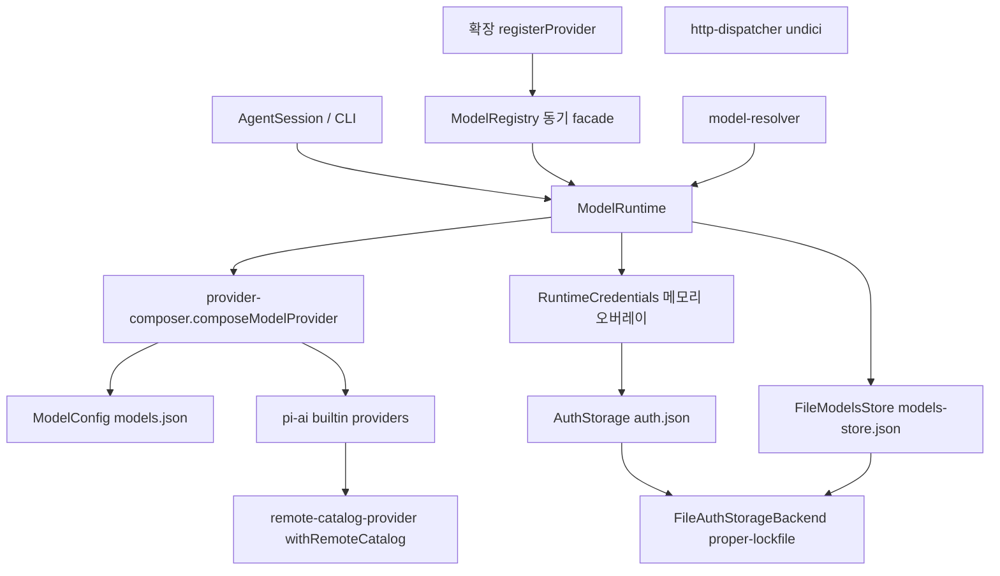
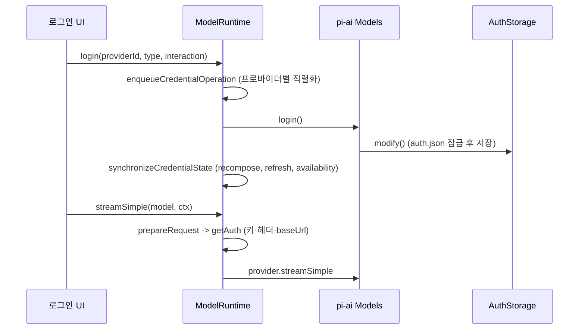

# model_and_auth_management

## 개요

`packages/coding-agent/src/core/` 아래에서 **모델 카탈로그, 프로바이더 구성, 인증 정보(credential) 저장**을 담당하는 모듈이다. `@earendil-works/pi-ai`의 `Models`/`CredentialStore` 추상화 위에 coding-agent 전용 계층(파일 저장, models.json 오버레이, 확장 프로바이더, 가상 모델)을 얹는다.

관련 모듈: 하위 모델 구현은 [model_registry](model_registry.md), [auth_core](auth_core.md), [oauth_flows](oauth_flows.md), 세션/설정은 [agent_session_core](agent_session_core.md), [settings_and_keybindings](settings_and_keybindings.md), 확장 API는 [extension_system](extension_system.md)를 참고한다.

> 서브모듈 분리는 하지 않았다. 파일 수가 적고(9개) 한 흐름으로 이어져 한 문서로 충분하다.

## 아키텍처

## 구성 요소

### 인증 저장 — `auth-storage.ts`, `runtime-credentials.ts`
- `AuthStorageBackend` 인터페이스: `withLock`(동기) / `withLockAsync`(비동기, `AbortSignal` 지원).
  - `FileAuthStorageBackend`: `proper-lockfile`로 `auth.json` 잠금. 동기는 최대 10회·20ms 재시도, 비동기는 stale 30초·지수 백오프+지터. 락이 compromised 되면 예외. 파일은 mode `0o600`, 디렉터리는 `0o700` (생성 시에만 적용).
  - `InMemoryAuthStorageBackend`: Promise 체인으로 직렬화 (테스트/`AuthStorage.inMemory`).
- `AuthStorage` (`CredentialStore` 구현): `read/modify/delete/list`. 파일 revision(`getFileRevision`)이 같으면 캐시된 스냅샷을 쓰고, 동시 reload는 하나로 합친다(reader 카운트 0이면 abort). `api_key`의 `key`는 `read` 시점에 `resolveConfigValue`로 환경변수/명령 값을 해석한다. `list`는 해석 없이 메타데이터만 반환.
- `ReadOnlyAuthStorage`: 스키마를 검증하며 읽기만 허용, `modify/delete`는 예외.
- `readStoredCredential`: 스토어 생성 없이 동기 1회 읽기, 실패 시 `undefined`.
- `RuntimeCredentials`: 영속 스토어 위의 **비영속 API 키 오버레이**. 오버라이드가 있으면 `{type:"api_key", key}`를 반환하고 `list`에도 병합한다. `delete`는 스토어와 오버라이드 모두 제거.

### 모델 설정 — `model-config.ts`
`models.json`을 한 번 로드한 **불변(deepFreeze) 스냅샷**. 주석/BOM을 제거한 뒤 TypeBox 스키마(`ProviderConfigSchema`, `ModelDefinitionSchema`, `ModelOverrideSchema`, 각 `compat` 스키마)로 검증한다. 파일 없음(ENOENT)은 빈 설정, 읽기/파싱/스키마 오류는 빈 설정 + `getError()` 메시지. 자격 증명은 다루지 않는다(credential-blind).

### 프로바이더 합성 — `provider-composer.ts`
`composeModelProvider(providerId, base, modelConfig, extension)`이 세 레이어를 합친다.
1. 빌트인 `Provider` (pi-ai)
2. `models.json` (baseUrl/compat 적용, 커스텀 모델 upsert, 마지막에 `modelOverrides`)
3. 확장 `ProviderConfigInput` (models 교체, `streamSimple`, `oauth`, `images`, `classifiers`, `refreshModels`)

주요 타입: `ProviderChatModelConfig`, `ProviderImageModelConfig`, `ProviderClassifierModelConfig`. 인증은 `composeApiKeyAuth`(설정 키/환경변수/명령/헤더 해석, `authHeader`면 `Authorization: Bearer`)와 `composeOAuthAuth`(확장 OAuth를 `adaptOAuth`로 변환)가 구성한다. 구조 오류는 즉시 throw하며, `ModelRuntime`이 이를 `compositionErrors`로 수집한다. `configuredRequestAuthStatus`는 `AuthStatus`(출처: stored/runtime/environment/fallback/models_json_key/models_json_command)를 계산한다.

### 원격 카탈로그 — `remote-catalog-provider.ts`
`withRemoteCatalog`는 빌트인 프로바이더에 `pi.dev` 카탈로그 오버레이를 덧붙인다. 저장된 항목을 먼저 publish하고, 네트워크가 허용될 때만 `?types=chat,image,classifier`로 조회한다. 4시간 갱신 주기, ETag/`If-None-Match`(304이면 `checkedAt`만 갱신), 404/501은 빈 마커 저장, 일시 실패는 캐시 유지 후 예외. `isSupportedModelType`이 미지원 타입 항목을 걸러낸다. 로컬 빌트인 생성 시각보다 오래된 저장 항목은 무시한다.

### 모델 저장소 — `models-store.ts`
`FileModelsStore`(`models-store.json`): `FileAuthStorageBackend`를 재사용한 잠금 JSON 저장소로 `AuthStorage`와 같은 revision 캐시/reload 병합 패턴을 쓴다. `InMemoryCodingAgentModelsStore`는 `structuredClone` 기반 메모리 구현.

### 런타임 — `model-runtime.ts`
`ModelRuntime`(pi-ai `Models` 구현)이 중심이다.
- `create()`: `RuntimeCredentials(AuthStorage)`, `ModelConfig`, 모델 저장소, 빌트인(+원격 카탈로그)을 조립하고 초기 `refresh`. `PI_OFFLINE`이 설정되면 네트워크 비활성.
- 스냅샷(`all/available/configuredProviders/storedProviders/auth`)을 유지해 동기 조회(`getAvailableSnapshot`, `hasConfiguredAuth`, `isUsingOAuth`, `getProviderAuthStatus`)를 제공. 시퀀스 번호로 오래된 availability 갱신을 폐기.
- 요청 경로: `prepareRequest`가 `getAuth`로 키/헤더/baseUrl을 해석 → `stream/streamSimple/complete/classify/generateImages/fetchDeferred/cancelDeferred`.
- 자격 증명 변경(`login`, `logout`, `setRuntimeApiKey`, `removeRuntimeApiKey`)은 프로바이더별로 직렬화(`enqueueCredentialOperation`)되고 `synchronizeCredentialState`로 스냅샷을 동기화한다. 저장은 성공했으나 동기화가 실패하면 `CredentialSynchronizationError`.
- 확장/가상 모델: `registerProvider`, `registerNativeProvider`, `registerVirtualModel`, `resolveModel`(가상 모델 라우터가 물리 모델·인증 보유 여부를 검증하고 thinking level을 `clampThinkingLevel`).
- `getError()`는 설정 오류, 합성 오류, availability 오류를 합쳐 반환.

### 동기 facade — `model-registry.ts`
`ModelRegistry`는 확장에 노출되는 호환 래퍼로 `ModelRuntime`에 위임한다. `getApiKeyAndHeaders`는 예외 대신 `ResolvedRequestAuth`(`ok` 판별 유니온)를 반환한다. `refresh()`를 await한 뒤 동기 조회를 해야 한다.

### 모델 선택 — `model-resolver.ts`
- `defaultModelPerProvider`: 프로바이더별 기본 모델.
- `parseModelPattern`: 마지막 `:`를 thinking level 접미사로 해석(OpenRouter의 `:exacto` 같은 ID 고려). 별칭을 날짜 버전보다 우선.
- `resolveModelScope*`: glob/패턴 → `ScopedModel[]` + 진단.
- `resolveCliModel`: `--provider/--model`, 모호한 ID는 인증된 프로바이더가 하나일 때만 선택, 미등록 ID는 fallback 모델 생성.
- `findInitialModel` 우선순위: CLI → scoped → 저장된 기본값(인증 필요) → 기본 모델 → 첫 사용 가능 모델.
- `restoreModelFromSession`: 세션 모델 복원, 없거나 인증이 없으면 현재 모델 또는 사용 가능 모델로 fallback하고 메시지 반환.

### HTTP — `http-dispatcher.ts`
`configureHttpDispatcher`가 `undici.EnvHttpProxyAgent`(프록시 터널, idle timeout, h2 비활성)를 전역 dispatcher로 설치한다. `createUndiciOriginDispatcher`/`ignoreUndiciDispatcherError`는 스트림 중단 시 Client의 "error" 이벤트로 프로세스가 죽지 않도록 no-op 리스너를 붙인다.

## 대표 흐름: 로그인 후 모델 사용

## 테스트 설정
`packages/coding-agent/vitest.config.ts`가 이 패키지의 테스트 실행을 설정한다 (미열람, 경로만 참고).

## 검증 수준
제공된 소스 코드를 직접 읽고 작성했다(코드 확인). 호출 측(`AgentSession` 등)과의 세부 연동은 미확인.
