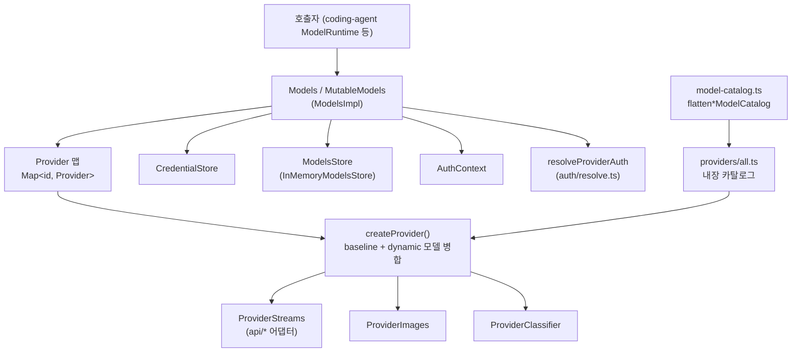
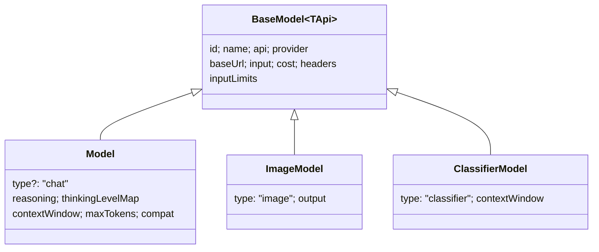
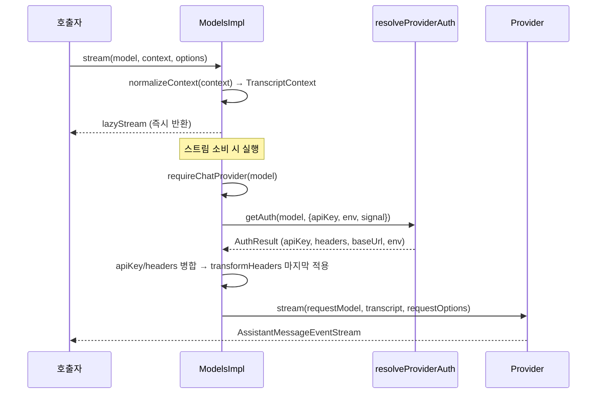
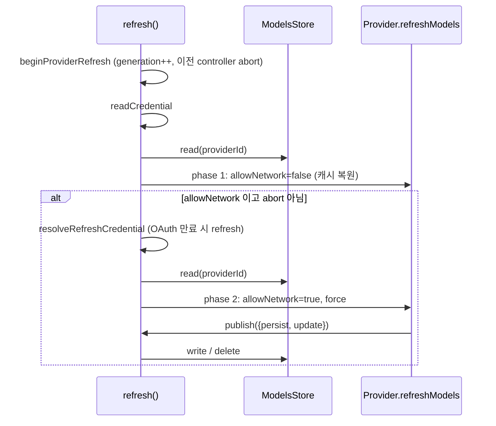

# model_registry 모듈

`packages/ai`의 **모델 레지스트리**는 "어떤 provider가 어떤 모델을 제공하는가"와 "그 모델로 요청을 보낼 때 인증을 어떻게 적용하는가"를 한곳에서 관리하는 계층이다. 핵심은 `Models` 컬렉션(구현체 `ModelsImpl`)이며, provider 목록·모델 카탈로그 캐시(`ModelsStore`)·자격 증명(`CredentialStore`)을 묶어 `stream`/`complete`/`generateImages`/`classify` 요청을 소유 provider에 위임한다.

> 이 문서는 `packages/ai/src/models.ts`, `models-store.ts`, `model-catalog.ts`, `types.ts`의 코드를 근거로 한다. (검증 수준: 코드 확인)

## 1. 구성 파일

| 파일 | 역할 |
|---|---|
| `packages/ai/src/models.ts` | `Provider`/`Models`/`MutableModels` 인터페이스, `ModelsImpl`, `createModels`, `createProvider`, `hasApi`, 비용·thinking level 유틸 |
| `packages/ai/src/models-store.ts` | provider별 모델 카탈로그 영속화 계약 `ModelsStore`와 `InMemoryModelsStore` |
| `packages/ai/src/model-catalog.ts` | 생성된 모델 그룹을 id 키 레코드로 평탄화하는 `flatten*ModelCatalog` (타입 수준 매핑 포함) |
| `packages/ai/src/types.ts` | `Api`, `Model`, `ImageModel`, `ClassifierModel`, `BaseModel`, `ApiOptionsMap`, Classifier 질문/답변 타입 등 공용 타입 |

## 2. 아키텍처

### 책임 분리

- **Provider**: id/이름/baseUrl/headers, `auth`(apiKey 또는 oauth 중 최소 하나 필수), 모델 목록(`getModels`, `getAllModels`), 선택적 `refreshModels`, `filterModels`/`filterAllModels`, 그리고 `stream`/`streamSimple`/`fetchDeferred`/`cancelDeferred`/`generateImages`/`classify`를 소유한다.
- **Models**: provider를 모아 두고 인증을 해석해 요청에 적용한 뒤, 모델의 `provider` 필드로 소유 provider를 찾아 위임한다. 요청 동작 자체는 provider가 가진다.
- **ModelsStore**: 동적 provider가 받아온 카탈로그(`models`, `lastModified`, `checkedAt`, `etag`)를 provider ID 키로 보관한다.

## 3. 모델 타입 체계

`ModelType = "chat" | "image" | "classifier"`이며 `ModelTypeMap`이 각 타입의 모델 형태를 정한다.

- `type`이 없는 모델은 chat이다. 섞인 목록은 `isModelType()`으로 좁힌다.
- `hasKnownModelType()`은 저장소/원격 카탈로그에서 온 모델 중 현재 버전이 모르는 타입을 걸러 낸다(`withKnownModelTypes`). 신버전이 쓴 캐시를 구버전이 읽어도 깨지지 않게 하는 장치다.
- `hasApi(model, api)`는 동적으로 조회한 `Model<Api>`를 `Model<"anthropic-messages">` 등으로 좁히는 type guard이며 chat 모델만 통과시킨다.
- `ApiOptionsMap`은 알려진 API별 옵션 타입을 연결하고(`ApiStreamOptions<TApi>`), 커스텀 API 문자열은 일반 `StreamOptions`로 대체된다. 타입 전용 import라 tree-shake에 안전하다.
- Classifier 타입: 질문은 `choice`/`score`/`bool` 3종(`ClassifierChoiceQuestion` 등), 답변은 각각 `choice`+`probabilities`+`confidence`, `score`+`confidence`, `bool`+`probability`.

## 4. 모델 카탈로그 평탄화 (`model-catalog.ts`)

생성된 모델 데이터는 `{ [api]: { "chat:<id>": model, ... } }` 형태의 그룹이다. `flattenChatModelCatalog`/`flattenImageModelCatalog`/`flattenClassifierModelCatalog`는 모든 그룹의 값을 펼쳐 `type`이 일치하는 모델만 `id → model` 레코드로 만든다. 반환 타입은 조건부/매핑 타입(`ChatModelCatalog` 등)으로 id별 정확한 `Model<Api>`와 `provider`를 보존한다. 첫 인자 `_provider`는 런타임에서 쓰이지 않고 타입 추론용이다.

## 5. 주요 흐름

### 5.1 요청 (stream / complete / streamSimple)

`applyAuth`의 우선순위 규칙:
- `apiKey`: 요청 옵션이 provider 인증 결과보다 우선.
- `headers`: `mergeHeaders`가 대소문자 무시로 병합하며 요청 옵션이 이긴다. 그 뒤 `ModelsRequestTransforms.transformHeaders`가 마지막에 실행되고, provider에는 전달되지 않는다(제거됨).
- `env`: 인증 결과 env 위에 요청 env를 덮어쓴다.
- `auth.baseUrl`이 있으면 `requestModel.baseUrl`을 교체한다.
- `getAuth(model)`은 모델의 정적 `headers`도 병합한다.
- 인증이 없으면 `ModelsError("auth", "Provider is not configured: ...")`. 스트림 경로에서는 stream error로 표면화된다.

`complete`/`completeSimple`/`fetchDeferred`는 각각 스트림의 `.result()`를 기다린다. `streamDeferred`/`fetchDeferred`/`cancelDeferred`는 provider가 deferred를 지원하지 않으면 `ModelsError("provider", ...)`를 던진다.

### 5.2 이미지·분류 (절대 reject하지 않음)

`generateImages`와 `classify`는 전 과정을 `try/catch`로 감싸 오류를 `imageErrorResult`/`classifierErrorResult`(abort 여부 포함)로 변환한다. 알 수 없는 provider, 미설정 인증, 미지원 provider 모두 결과 객체의 오류로 돌아온다.

### 5.3 가용 모델 조회와 인증 확인

- `getModels/getModel/getAllModels/getModelsOfType/getModelOfType`: 동기, "마지막으로 알려진" 목록을 반환. provider가 throw하면 빈 목록(best-effort).
- `checkAuth`: OAuth 갱신 없이 설정 완전성만 확인. 저장된 credential이 oauth면 provider에 oauth 지원이 있을 때 `{source:"OAuth"}`, 아니면 `apiKey.check` 또는 `resolveProviderAuth` 결과를 사용한다.
- `getAvailable`/`getAvailableOfType`/`getAllAvailable`: 인증이 확인된 provider만 대상으로 `filterModels`/`filterAllModels`(credential별 정책)를 적용한다. `filterAllModels`가 없으면 chat 모델에만 `filterModels`를 적용하고 다른 타입은 유지한다.

### 5.4 로그인/로그아웃

`login`은 provider의 `oauth` 또는 `apiKey`의 `login`을 실행하고(abort와 경주), 반환된 credential을 `credentials.modify`로 저장한다. 저장 시작 전에 abort되면 거절하고, 시작 후에는 완료를 기다린다(저장 중간 중단을 방지). 저장 실패는 `ModelsError("auth")`로 감싼다. `logout`은 `credentials.delete`.

## 6. 동적 모델 갱신 (`refresh`)

동적 provider(`refreshModels` 보유)만 대상이다.

설계 포인트:
- **2단계**: 먼저 네트워크 없이 캐시를 복원한 뒤 인증을 해석해 네트워크 갱신을 수행한다. credential 읽기 오류는 캐시 복원 후에 던진다.
- **generation 검사**: `refreshGenerations`로 세대를 관리하고, `setProvider`/`deleteProvider`/`clearProviders`나 새 refresh가 이전 refresh를 `supersede`(abort)한다. `publishProviderModels`는 저장 전후로 세대·abort를 확인해 오래된 결과가 덮어쓰지 못하게 한다.
- **직렬화**: provider별 `publicationChains` promise 체인으로 publish를 순서대로 실행한다. `persist === null`이면 삭제, `undefined`면 저장소 유지, 객체면 `structuredClone` 후 write. 영속 변경 이후에만 동기 `update()`를 호출한다.
- **오류 처리**: provider별 오류는 `errors` 맵에 모으고 reject하지 않는다. 호출자 abort는 `aborted: true`로 반환한다. 미설정/정적/알 수 없는 provider는 건너뛴다.
- `stored`는 `structuredClone` + `withKnownModelTypes`로 방어 복사한다.

## 7. `createProvider()`

내장 provider와 `models.json` 커스텀 provider가 모두 이 팩토리를 거친다.

- `api`: 단일 `ProviderStreams` 또는 `model.api` 키 맵. 맵에 없는 api면 `ModelsError("stream", ...)`를 담은 lazy stream 반환.
- `images`, `classifiers`: `model.api` 키로 디스패치. 구현이 없으면 오류 결과 반환.
- `api/images/classifiers` 중 구현이 하나도 없으면 생성 시 throw.
- 모델 목록은 `models`(baseline)에 동적 모델을 (타입, id) 기준으로 덮어쓰거나 추가해 병합한다. `getModels`는 chat만 필터링.
- `fetchModels`가 있으면 `refreshModels`를 자동 생성: 저장된 목록 복원(`publish`) → 네트워크 허용 시 fetch → 알려진 타입만 남겨 `{models, checkedAt}`로 publish.
- 하위 구현 중 하나라도 `fetchDeferred`/`cancelDeferred`를 가지면 해당 메서드를 provider에 노출한다.

## 8. 비용·thinking 유틸

- `calculateCost(model, usage)`: 총 입력 토큰(`input+cacheRead+cacheWrite`)이 `cost.tiers`의 `inputTokensAbove`를 넘는 가장 높은 tier를 요청 전체에 적용한다. 1h 캐시 쓰기(`cacheWrite1h`)는 기본 입력 단가의 2배로 계산(Anthropic 정책). `usage.cost`를 직접 갱신한다.
- `getSupportedThinkingLevels`: `reasoning`이 false면 `["off"]`. `thinkingLevelMap`에서 `null`은 미지원, `xhigh`/`max`는 매핑이 명시된 경우에만 지원.
- `clampThinkingLevel`: 요청 레벨이 미지원이면 위쪽으로, 그다음 아래쪽으로 가장 가까운 지원 레벨을 선택.
- `modelsAreEqual`: 타입·id·provider 비교.

## 9. 오류 모델

`ModelsError`(`auth/resolve.ts`)의 코드: `auth`(키 해석/저장소 실패), `oauth`(토큰 갱신 실패, credential은 보존), `provider`(알 수 없음/미지원), `stream`, `model_source`. 요청 경로는 이를 스트림 오류로, 이미지·분류는 결과 객체로, `login/logout/refresh` 등은 예외 또는 `errors` 맵으로 전달한다.

## 10. 다른 모듈과의 관계

- 인증 계층: [auth_core](auth_core.md), [oauth_flows](oauth_flows.md) — `CredentialStore`, `AuthContext`, OAuth 로그인/갱신.
- 내장 provider 정의와 테스트용 faux provider: [builtin_providers_and_compat](builtin_providers_and_compat.md).
- 실제 API 어댑터(`ProviderStreams` 구현): [llm_provider_adapters](llm_provider_adapters.md), 이미지·분류는 [image_generation](image_generation.md), [classifier_apis](classifier_apis.md).
- 모델 카탈로그 생성 스크립트(`generate-models.ts`): [build_and_test_config](build_and_test_config.md). `models.generated.ts`는 직접 수정하지 않고 스크립트로 재생성한다(레포 규칙).
- 상위 소비자: [model_and_auth_management](model_and_auth_management.md)의 `ModelRegistry`/`ModelRuntime`이 `Models`를 감싸 설정 파일·확장 provider·OAuth UI와 연결한다. 에이전트 루프는 [agent_loop_and_state](agent_loop_and_state.md)가 스트림 함수를 통해 간접 사용한다.
- 유틸(abort, 모델 연산 헬퍼): [ai_runtime_utils](ai_runtime_utils.md).

## 11. 확인하지 못한 범위

`auth/resolve.ts`의 `resolveProviderAuth`, `utils/model-operations.ts`, `api/lazy.ts`, `utils/transcript.ts`의 내부 구현은 제공된 코드에 없어 인터페이스 사용 방식만 기술했다. (미확인)
