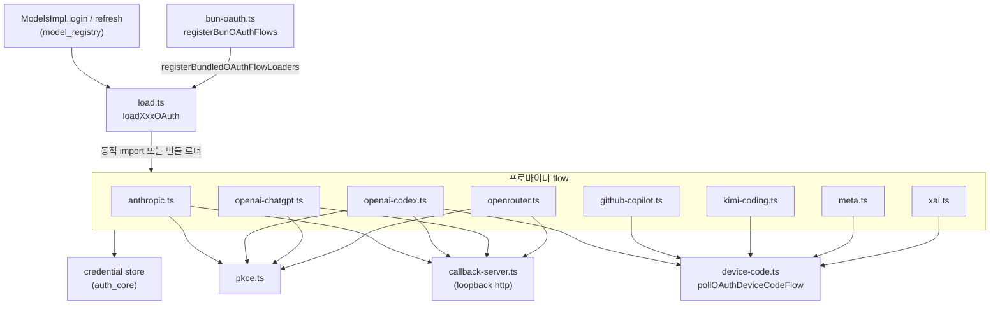
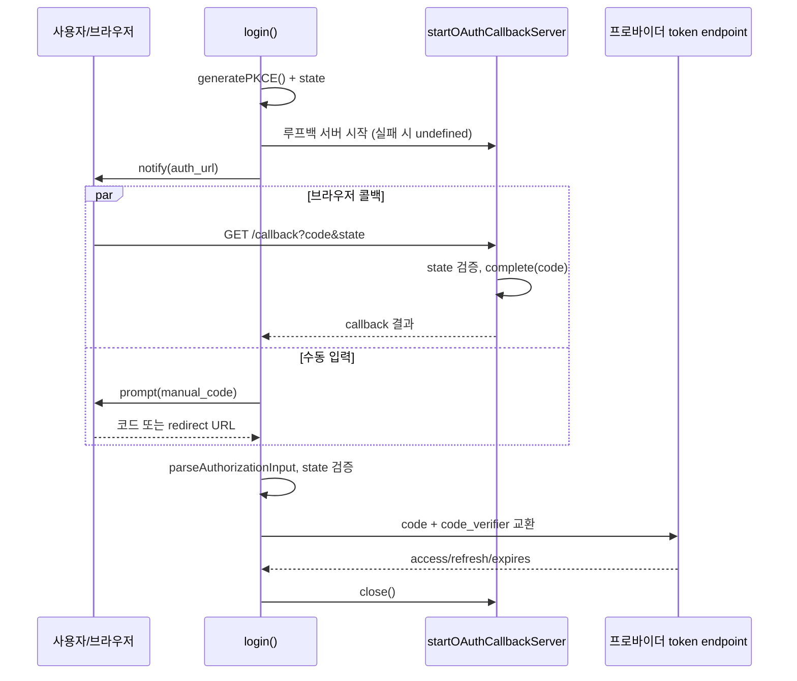
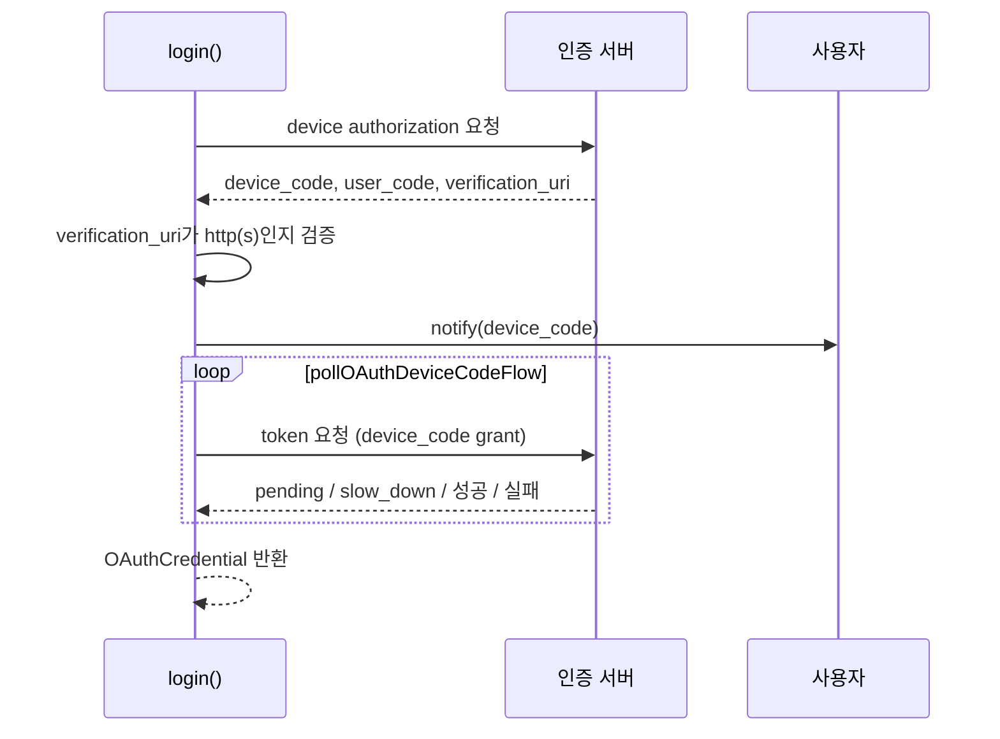

# oauth_flows 모듈

`oauth_flows`는 `packages/ai/src/auth/oauth/` 아래에서 구독형/계정 기반 LLM 프로바이더(Anthropic, OpenAI Codex, ChatGPT, GitHub Copilot, OpenRouter, Kimi Code, Meta, xAI)의 **로그인·토큰 갱신·요청용 인증 정보 변환**을 담당하는 모듈이다. 상위 모듈 [ai_platform_foundation](ai_platform_foundation.md)의 하위 모듈이며, 저장소/컨텍스트는 [auth_core](auth_core.md), 로그인 트리거(`ModelsImpl.login`)는 [model_registry](model_registry.md)에서 호출한다.

## 1. 공통 계약: `OAuthAuth`

모든 프로바이더 파일은 `OAuthAuth` 객체 하나를 export 한다(타입은 `../types.ts`, 이 모듈 범위 밖).

| 멤버 | 역할 |
|---|---|
| `name`, `loginLabel`, `isSubscription` | UI 표시용 메타데이터 |
| `login(interaction, options?)` | 사용자 상호작용으로 `OAuthCredential` 발급 |
| `refresh(credential, signal)` | 만료 전 토큰 갱신 |
| `toAuth(credential)` | 요청에 쓸 `{ apiKey, baseUrl?, headers? }` 변환 |

`ProviderAuthInteraction`은 `notify({type: "auth_url" | "device_code" | "progress" | "info"})`, `prompt({type: "select" | "text" | "manual_code"})`, `signal`을 제공한다. 이 추상화 덕분에 flow 코드는 TUI([login-dialog](interactive_components.md))와 분리된다.

`OAuthCredential`: `{ type: "oauth", access, refresh, expires, ...provider별 필드 }` (`accountId`, `clientId`, `scopes`, `enterpriseUrl`, `availableModelIds`).

## 2. 아키텍처

`callback-server.ts`, `device-code.ts`, `pkce.ts`는 이 모듈의 핵심 컴포넌트 목록에는 없지만 flow가 공유하는 헬퍼다(코드 확인: `callback-server.ts`, `device-code.ts`; `pkce.ts`는 import로만 확인).

### 2.1 지연 로딩: `load.ts`

- `importOAuthModule(specifier)`는 **변수 specifier로 `import()`** 하여 번들러가 `node:http`/`node:crypto` 의존 코드를 정적으로 따라가지 못하게 한다. `import.meta.url`이 `.js`로 끝나면 `.ts`→`.js`로 치환해 빌드 산출물에서도 동작한다.
- `loadAnthropicOAuth`, `loadOpenAICodexOAuth`, `loadOpenAIChatGPTOAuth`, `loadGitHubCopilotOAuth`, `loadOpenRouterOAuth`, `loadKimiCodingOAuth`, `loadMetaOAuth`, `loadXaiOAuth`(+ `loadRadiusOAuth`)는 `bundledLoaders`가 등록돼 있으면 그것을, 아니면 동적 import 결과를 반환한다.
- `registerBunOAuthFlows()`(`bun-oauth.ts`)는 standalone Bun 바이너리에서 모든 flow를 **정적 import**로 묶어 `registerBundledOAuthFlowLoaders`에 등록한다. Radius flow(`radius.ts`)는 본 문서 범위 밖이다.

## 3. 인증 방식별 flow

| 프로바이더 | 방식 | 토큰 특성 | `toAuth` 결과 |
|---|---|---|---|
| Anthropic | Authorization Code + PKCE (browser) / copy-code(headless) | access+refresh, 5분 일찍 만료 처리 | `{ apiKey: access }` |
| OpenAI Codex | PKCE browser(포트 1455) / device code | JWT에서 `chatgpt_account_id` 추출 → `accountId` | `{ apiKey: access }` |
| OpenAI ChatGPT | PKCE + 동적 클라이언트 등록(`dynamic_agent_client`) | 발급된 `clientId`·`scopes` 저장, 3분 마진 | `{ apiKey: access }` |
| GitHub Copilot | RFC 8628 device code → Copilot 토큰 교환 | `refresh`=GitHub 토큰, `access`=Copilot 토큰 | `{ apiKey, baseUrl }` |
| OpenRouter | PKCE, 임시 포트 루프백 | 영구 API 키(`refresh: ""`, `expires: MAX_SAFE_INTEGER`) | `{ apiKey }` |
| Kimi Code | RFC 8628 device code | access+refresh | `{ headers: { Authorization: Bearer … } }` |
| Meta | device code → identity token → API 키 mint | `refresh`=identity token, `access`=약 24시간 키 | `{ apiKey }` |
| xAI | RFC 8628 device code | refresh 미회전 시 이전 값 재사용 | `{ apiKey }` |

### 3.1 브라우저(PKCE) 흐름

핵심 포인트:
- `waitForCallbackOrManualInput`이 콜백과 수동 붙여넣기를 경쟁시킨다. 한쪽이 끝나면 다른 쪽을 `cancel()`/`abort()`한다. SSH·원격 환경에서 루프백에 못 닿는 경우를 위한 장치다.
- 포트가 이미 사용 중이면(예: Codex CLI와 공유하는 1455) `startOAuthCallbackServer(...).catch(() => undefined)`로 서버 없이 수동 입력만 사용한다.
- 콜백 서버는 GET + 경로 일치 + (설정 시) `state` 일치를 검사하고, 중복 요청은 409로 거부한다. `callback-server.ts`는 `Cache-Control: no-store` 페이지를 반환한다.
- Anthropic은 `state`로 `verifier`를 재사용한다. OpenRouter는 `state`를 보내지 않으므로 경로에 `crypto.randomUUID()`를 넣어 임의 요청을 막는다(코드 주석 근거).
- OpenAI ChatGPT는 자체 `createServer`를 사용하며, 종료 시 `closeAllConnections()`로 브라우저가 미리 열어둔 유휴 연결에서 다음 로그인의 콜백이 잘못 처리되는 문제를 방지한다.
- 로그인 방식 선택(`select` prompt): Anthropic(`browser`/`copy_code`), OpenAI Codex(`browser`/`device_code`).

### 3.2 Device code 흐름

`pollOAuthDeviceCodeFlow<T>`(`device-code.ts`)의 규칙:
- 기본 간격 5초, 최소 1초(`MINIMUM_INTERVAL_MS`).
- `pending`: 계속 폴링. `slow_down`: 서버가 준 `intervalSeconds`가 있으면 사용, 없으면 +5초(RFC 8628 §3.5). `failed`: 메시지로 예외. `complete`: 값 반환.
- `expiresInSeconds` 데드라인 초과 시 타임아웃 오류. `slow_down`을 받은 적이 있으면 WSL/VM 시계 오차를 안내하는 메시지를 사용.
- `abortableSleep`으로 `AbortSignal` 취소 시 `"Login cancelled"` 예외.
- 보안: 모든 device flow는 `verification_uri`를 브라우저가 열기 전에 URL로 파싱해 검증한다(GitHub·Kimi·Meta는 http/https, xAI는 https만 허용).

## 4. 프로바이더별 특이사항

- **GitHub Copilot** (`github-copilot.ts`): 엔터프라이즈 도메인 입력(`normalizeDomain`) 지원. GitHub 토큰을 `copilot_internal/v2/token`으로 Copilot 토큰으로 교환하고, 토큰의 `proxy-ep`에서 API base URL을 유도한다(`getBaseUrlFromToken`; `proxy.`→`api.`). 로그인 시 `/models` 카탈로그를 읽어 `availableModelIds`를 저장하고, 정책이 `unconfigured`인 모델은 `/models/{id}/policy`로 best-effort 활성화한다. 429에는 `retry-after` 또는 지수 백오프로 재시도(`fetchWithRateLimitRetry`). refresh 시에는 재시도 없이 모델 목록도 갱신한다. `toAuth`는 요청마다 `baseUrl`을 도출한다.
- **Kimi Code**: 호스트를 `KIMI_CODE_OAUTH_HOST`/`KIMI_OAUTH_HOST`로 덮어쓸 수 있다. refresh는 429/5xx/네트워크 오류에 최대 3회 지수 백오프, 401/403/`invalid_grant`는 즉시 실패(저장된 자격 증명이 죽은 것으로 간주 — 코드 주석상 Models가 제거 후 재로그인 유도).
- **Meta**: identity token은 갱신 불가(헤더 주석)이므로 `refresh`는 `mintApiKey(credential.refresh)`로 API 키만 재발급한다. 401/403이면 `/login meta` 재실행을 안내.
- **OpenAI ChatGPT**: 설치별 UUID `deviceId`(`LoginOptions.getDeviceId`)가 필수이며 `urn:uuid:` 호스트 ID로 전달. `DIRECT_TOKEN_SCOPE` 미포함 시 거부.
- **OpenAI Codex**: `node:crypto`를 최상단 import 하지 않고 조건부 동적 import한다(브라우저/Vite 빌드 보호, 주석 "NEVER convert to top-level imports").
- **OpenRouter**: 만료/갱신 없음. `refresh`는 credential을 그대로 반환.
- **xAI**: 응답에 `refresh_token`이 없으면 이전 refresh 토큰을 유지.

## 5. 공통 설계 원칙

- **만료 마진**: Anthropic·Copilot·xAI는 5분, ChatGPT는 3분 일찍 `expires`를 설정해 요청 도중 만료를 방지한다. Codex·Kimi는 마진이 없다.
- **취소 처리**: 대부분 `interaction.signal`을 fetch에 전달하고 취소 시 `"Login cancelled"`로 통일한다(UI가 이 메시지를 매칭하는 것으로 주석에 언급: Meta).
- **네트워크 타임아웃**: `AbortSignal.timeout`(Anthropic 30s, Kimi·Meta 30s, Copilot 5s)을 `AbortSignal.any`로 결합.
- **환경 변수**: `PI_OAUTH_CALLBACK_HOST`(기본 `127.0.0.1`)로 콜백 바인딩 호스트를 변경. `getProviderEnvValue` 경유.
- **Node 전용**: 콜백 서버를 쓰는 flow는 CLI(Node/Bun) 전용이며, 그래서 `load.ts`로 격리한다.

## 6. 검증 수준

- 코드 확인: 위 서술 전체(제공된 소스와 `device-code.ts`, `callback-server.ts` 기준).
- 미확인: `pkce.ts`, `radius.ts`, `../types.ts`의 정확한 시그니처, 호출 측(`ModelsImpl.login/refresh`)의 refresh 스케줄링 세부와 실패 시 자격 증명 삭제 동작.
- 추론: Copilot `proxy-ep` 토큰 포맷은 코드 주석에 근거하며 GitHub 공식 문서로 검증하지 않았다. 하드코딩된 `CLIENT_ID` 값은 각 CLI 공개 클라이언트 ID로 보이나 출처는 추론이다.

## 7. 관련 문서

- [ai_platform_foundation](ai_platform_foundation.md): 상위 모듈
- [auth_core](auth_core.md): `InMemoryCredentialStore`, 인증 컨텍스트
- [model_registry](model_registry.md): `ModelsImpl.login/logout/refresh`
- [model_and_auth_management](model_and_auth_management.md): `AuthStorage`, `ModelRuntime.login` (coding-agent 측)
- [interactive_components](interactive_components.md): `LoginDialogComponent`, `OAuthSelectorComponent`
