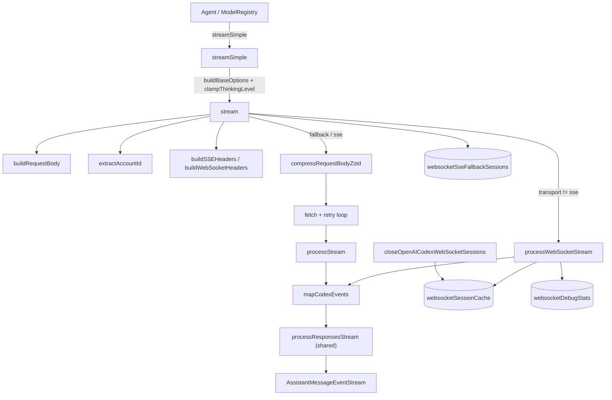
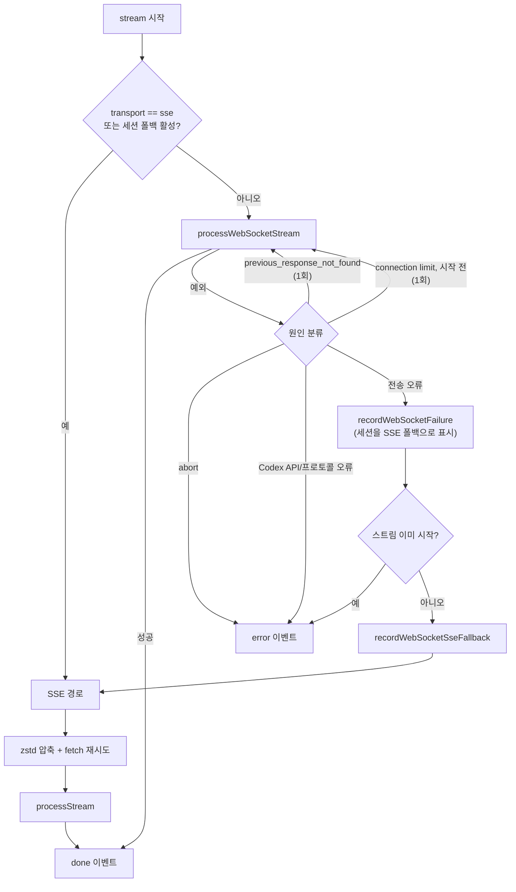
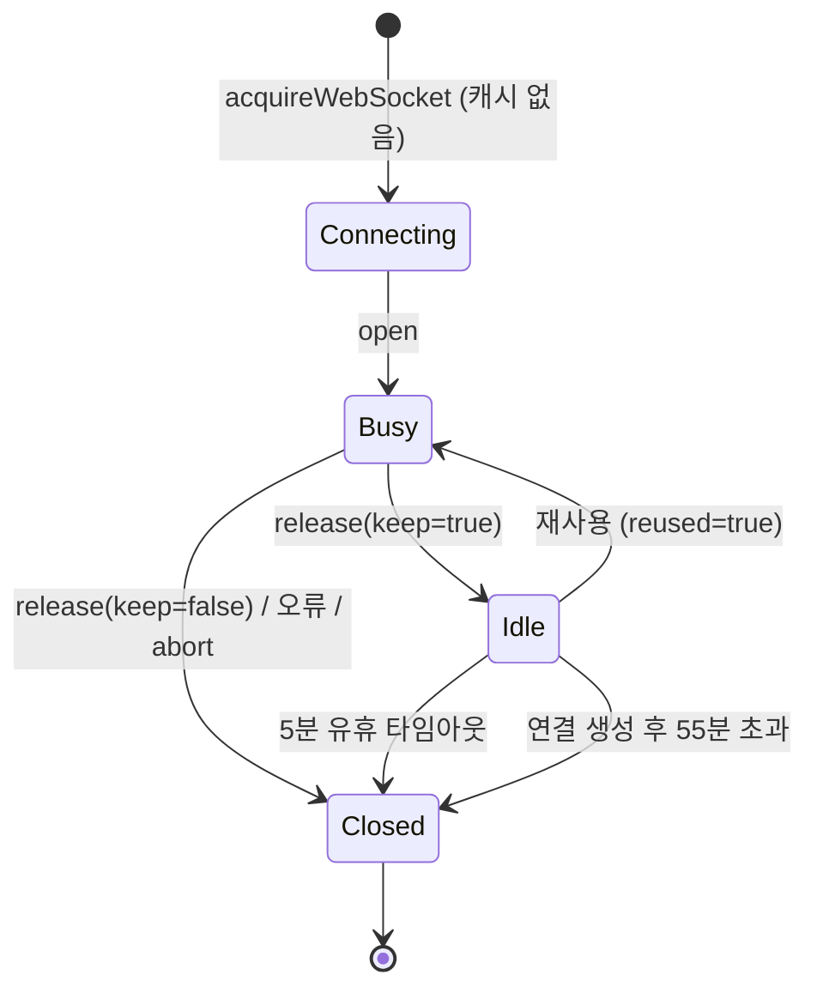
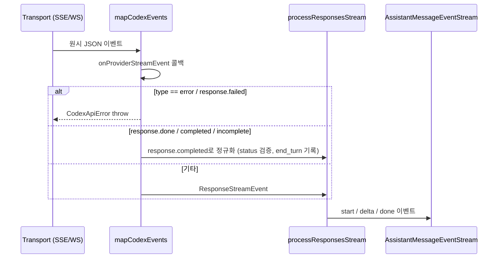

# openai_codex_provider_api

## 개요

`openai_codex_provider_api` 모듈은 ChatGPT 구독 기반 **OpenAI Codex Responses 백엔드**(`https://chatgpt.com/backend-api/codex/responses`)와 통신하는 LLM provider 어댑터이다. 구현은 단일 파일 `packages/ai/src/api/openai-codex-responses.ts`에 있으며, API 식별자는 `"openai-codex-responses"`이다.

핵심 역할:

- `TranscriptContext`를 Codex Responses 요청 본문(`RequestBody`)으로 변환
- **WebSocket(우선) → SSE(폴백)** 이중 전송 계층과 연결/연속(continuation) 캐시
- 재시도, 에러 분류, 사용량 한도(usage limit) 메시지 정리
- 스트림 이벤트를 공통 `AssistantMessageEventStream`으로 변환

상위 모듈은 [llm_provider_adapters](llm_provider_adapters.md)이며, 같은 계열의 [openai_provider_apis](openai_provider_apis.md)와 Responses 변환 로직(`openai-responses-shared.ts`)을 공유한다. 인증(JWT/OAuth)은 [oauth_flows](oauth_flows.md)의 `openai-codex` 흐름이 발급한 토큰을 사용하고, 세션 정리는 [ai_runtime_utils](ai_runtime_utils.md)의 `registerSessionResourceCleanup`에 의존한다.

## 아키텍처

## 구성 요소

### 공개 진입점

| 구성 요소 | 설명 |
|---|---|
| `stream` | 내부 `async` IIFE로 전송 선택·재시도·에러 처리를 수행하고 이벤트 스트림을 즉시 반환 |
| `streamSimple` | `SimpleStreamOptions`를 `OpenAICodexResponsesOptions`로 변환. API 키가 없으면 즉시 throw. `reasoning`은 `clampThinkingLevel`로 보정, `"off"`는 `undefined` |
| `getOpenAICodexWebSocketDebugStats` | 세션별 통계 복사본 반환 |
| `resetOpenAICodexWebSocketDebugStats` | 통계와 SSE 폴백 플래그 초기화 (세션 지정 또는 전체) |
| `closeOpenAICodexWebSocketSessions` | 캐시된 소켓을 닫고 제거. `registerSessionResourceCleanup`으로 자동 등록됨 |

### 옵션 (`OpenAICodexResponsesOptions`)

`StreamOptions`를 확장: `reasoningEffort`(`none`~`max`), `reasoningSummary`, `serviceTier`, `textVerbosity`, `toolChoice`. 공통 옵션으로 `transport`(`"sse" | "websocket" | "websocket-cached" | "auto"`, 기본 `auto`), `timeoutMs`, `websocketConnectTimeoutMs`, `maxRetries`(기본 0), `maxRetryDelayMs`(기본 60초), `sessionId`, `cacheRetention`, `onPayload`, `onResponse`, `onProviderStreamEvent`가 사용된다.

### 요청 구성

- `buildRequestBody`: `store: false`, `stream: true`, `include: ["reasoning.encrypted_content"]`, `parallel_tool_calls: true`, `text.verbosity`(기본 `low`), `tool_choice`(기본 `auto`)를 설정. 첫 system 메시지는 `instructions`로 분리(없으면 `"You are a helpful assistant."`). `thinkingLevelMap`으로 reasoning effort를 모델별로 매핑하고, reasoning 모델에서 effort 미지정 시 `off` 값을 기본 적용.
- `resolveCodexWebSocketUrl`: `resolveCodexUrl`(`/codex/responses` 정규화) 결과의 `https→wss`, `http→ws` 변환.
- `buildSSEHeaders` / `buildWebSocketHeaders`: `Authorization`, `chatgpt-account-id`, `originator: pi`, `User-Agent`, `session-id`, `x-client-request-id` 설정. SSE는 `OpenAI-Beta: responses=experimental`, WebSocket은 `responses_websockets=2026-02-06`(연결 시 `OpenAI-Beta`는 다시 제거됨 — `connectWebSocket`).
- `extractAccountId`: JWT payload의 `https://api.openai.com/auth`.`chatgpt_account_id` 추출. 실패 시 `"Failed to extract accountId from token"`.
- `compressRequestBodyZstd`: Node/Bun의 `zlib.zstdCompressSync`(level 3)로 압축, 불가하면 `null` → 비압축 JSON 사용. **SSE 경로에서만** 적용(WebSocket은 비압축 프레임).

### 서비스 티어 가격

`resolveCodexServiceTier`는 응답이 `default`인데 요청이 `flex`/`priority`면 요청값을 유지한다. `applyServiceTierPricing`은 `flex` ×0.5, `priority` ×2(`gpt-5.5`는 ×2.5)로 비용을 보정한다.

### 재시도·에러 분류

| 함수 | 동작 |
|---|---|
| `isRetryableError` | 429/500/502/503/504 또는 rate limit·overloaded 패턴이면 재시도. 사용량·결제 소진 계열 429(`insufficient_quota` 등)는 제외 |
| `getRetryAfterDelayMs` | `retry-after-ms` → `retry-after`(초 또는 날짜) 순으로 파싱 |
| `validateRetryDelayMs` | 서버 요청 지연이 `maxRetryDelayMs` 초과면 `RetryDelayExceededError` |
| `normalizeTimeoutMs` | 음수/비유한값 거부, 정수로 내림 |
| `parseErrorResponse` | 사용량 한도 코드/429를 `"You have hit your ChatGPT usage limit (plan). Try again in ~N min."` 메시지로 변환 |
| `assertSuccessfulOutput` | `pending`/`error`/`aborted` stopReason이면 throw |
| `isCodexNonTransportError` | `CodexApiError`, `CodexProtocolError`, `ProviderStreamEventCallbackError`는 WebSocket 폴백 대상이 아님 |
| `isWebSocketConnectionLimitReachedError` | 코드 `websocket_connection_limit_reached` |
| `isPreviousResponseNotFoundError` | 코드 `previous_response_not_found` |

SSE 재시도 지연은 `Retry-After`가 없으면 `1000ms * 2^attempt`(지수 백오프)이다.

## 전송 계층 제어 흐름

핵심 정책(코드 확인):

- WebSocket이 한 번 실패하면 `recordWebSocketFailure`가 `sessionId`를 `websocketSseFallbackSessions`에 넣어, 이후 해당 세션의 요청은 SSE로 직행한다(`resetOpenAICodexWebSocketDebugStats`로 해제).
- 이벤트가 이미 방출된 뒤의 WebSocket 실패는 중복 출력을 막기 위해 폴백하지 않고 에러로 끝낸다.
- 폴백 시 `provider_transport_failure` 진단(`appendAssistantMessageDiagnostic`)이 출력 메시지에 기록된다.
- 최종 catch에서 `partialJson`, `customInput` 스크래치 버퍼를 제거하고 `stopReason`을 `aborted`/`error`로 설정한다.

## WebSocket 세션 캐시와 연속 요청

`websocketSessionCache`는 `sessionId → accountId → CachedWebSocketConnection` 2단 맵이다.

- 상수: `SESSION_WEBSOCKET_CACHE_TTL_MS`(5분), `SESSION_WEBSOCKET_MAX_AGE_MS`(55분), 기본 연결 타임아웃 15초.
- 이미 `busy`인 캐시 소켓이 있으면 캐시에 넣지 않는 임시 연결을 새로 만든다.
- `transport`가 `websocket-cached` 또는 `auto`이면 `buildCachedWebSocketRequestBody`가 직전 요청 본문(입력 제외)과 일치하고 입력이 `이전 입력 + 이전 응답 항목`을 접두로 포함할 때, `previous_response_id`와 **delta 입력만** 전송한다. 불일치 시 continuation을 버리고 전체 컨텍스트를 보낸다. (`store: true`는 백엔드가 거부하므로 연결 범위의 `previous_response_id`로 연속성 확보.)
- `parseWebSocket`은 메시지를 큐에 쌓아 async generator로 내보내며, `response.completed|done|incomplete` 수신 후 닫힘은 정상 처리, 완료 없이 닫히면 `WebSocketCloseError`(예: 1009 `message too big`)로 처리한다. `idleTimeoutMs`(= `timeoutMs`) 초과 시 소켓을 닫는다.
- Bun 런타임에서는 WebSocket이 프록시 환경변수를 따르지 않으므로 `resolveHttpProxyUrlForTarget`으로 `proxy` 옵션을 주입하는 서브클래스를 사용한다.

## 이벤트 처리 파이프라인

- `parseSSE`: `\n\n` 프레임 단위로 `data:` 줄을 합쳐 JSON 파싱, `[DONE]` 무시, 파싱 실패 시 `CodexProtocolError`.
- 콜백 예외는 `ProviderStreamEventCallbackError`로 감싸 WebSocket 재시도/SSE 폴백 경로에서 제외한다.
- `processStream`과 `processWebSocketStream`은 같은 `processResponsesStream` 옵션(`resolveServiceTier`, `applyServiceTierPricing`, `grammarToolInputProperties`)을 사용한다.

## 디버그 통계 (`OpenAICodexWebSocketDebugStats`)

`requests`, `connectionsCreated/Reused`, `cachedContextRequests`, `storeTrueRequests`, `fullContextRequests`, `deltaRequests`, `lastInputItems`, `lastDeltaInputItems`, `lastPreviousResponseId`, `websocketFailures`, `sseFallbacks`, `websocketFallbackActive`, `lastWebSocketError`를 세션 단위로 기록한다. continuation 캐시가 실제로 delta 전송을 하는지 확인하는 용도이다.

## 의존성과 주의점

- 직접 의존: `../models.ts`(`clampThinkingLevel`), `../session-resources.ts`, `../utils/*`(abort-signals, diagnostics, error-body, event-stream, headers, node-http-proxy, pi-user-agent, transcript, uuid), `./openai-responses-shared.ts`, `./openai-prompt-cache.ts`, `./constrained-sampling.ts`, `./simple-options.ts`.
- 모듈 레벨 전역 상태(`websocketSessionCache`, `websocketDebugStats`, `websocketSseFallbackSessions`)가 프로세스 전체에서 공유되므로 테스트에서는 reset/close 함수를 호출해야 한다.
- 파일 내부에 `sleep`이 별도로 정의돼 있다(공용 `utils/sleep.ts`와 중복, 검증 수준: 코드 확인).
- `cacheRetention === "none"`이면 `sessionId`를 캐시 키로 쓰지 않아 WebSocket 캐시/폴백 추적이 비활성화된다.
- 빌드/테스트 설정은 `packages/ai/vitest.config.ts`를 참고하며 ([build_and_test_config](build_and_test_config.md)), 이 모듈의 실제 백엔드 호출은 인증이 필요하므로 단위 테스트는 faux/mock 기반이어야 한다(추론).
