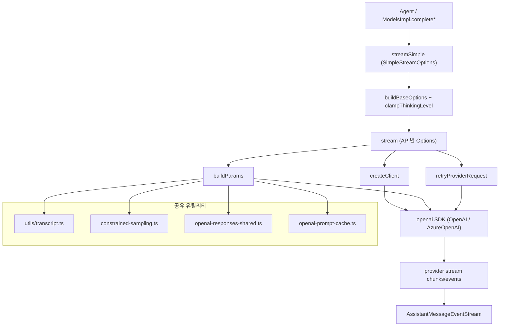
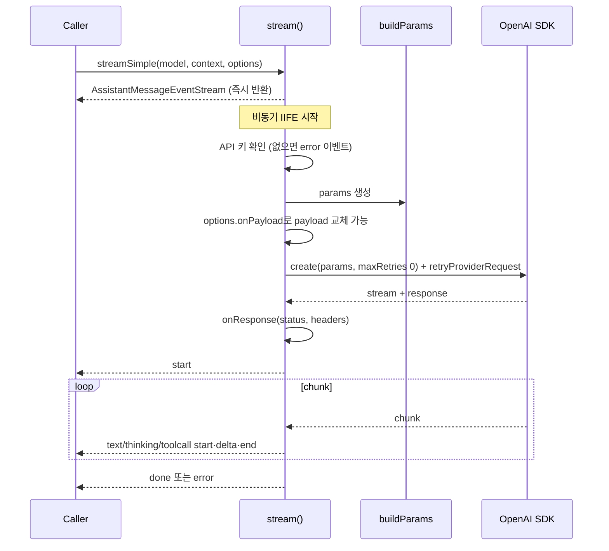

# openai_provider_apis

## 개요

`openai_provider_apis`는 `packages/ai`의 LLM 공급자 어댑터 중 **OpenAI SDK(`openai` 패키지)** 를 사용하는 세 가지 API 구현을 묶은 모듈이다. 모두 동일한 `StreamFunction` 계약을 따른다. 입력은 `Model`, `TranscriptContext`, 옵션이고, 출력은 `AssistantMessageEventStream`이다.

| 파일 | API 식별자 | 대상 |
|---|---|---|
| `packages/ai/src/api/openai-completions.ts` | `openai-completions` | Chat Completions API 및 OpenAI 호환 서버 (OpenRouter, DeepSeek, Z.ai, Together, Moonshot, vLLM, llama.cpp 등) |
| `packages/ai/src/api/openai-responses.ts` | `openai-responses` | OpenAI Responses API (openai, github-copilot, openrouter, xai 등) |
| `packages/ai/src/api/azure-openai-responses.ts` | `azure-openai-responses` | Azure OpenAI의 Responses API |

Codex 전용 구현은 [openai_codex_provider_api](openai_codex_provider_api.md), 다른 공급자는 [anthropic_provider_api](anthropic_provider_api.md), [google_provider_apis](google_provider_apis.md), [bedrock_provider_api](bedrock_provider_api.md), [mistral_provider_api](mistral_provider_api.md)를 참고한다. 상위 모듈은 `llm_provider_adapters`이다.

## 아키텍처

### 공통 실행 흐름

핵심 설계 포인트(코드 확인):
- `stream`은 스트림 객체를 먼저 반환하고 비동기로 채운다. 실패는 throw가 아니라 `error` 이벤트(`stopReason`: `aborted` 또는 `error`)로 전달된다. 단 `streamSimple`은 API 키가 없으면 동기적으로 throw한다.
- SDK 자체 재시도는 `maxRetries: 0`으로 끄고 `retryProviderRequest`가 재시도를 담당한다.
- 오류 처리 시 `index`, `partialArgs`, `partialJson`, `customInput`, `streamIndex` 같은 스트리밍 임시 버퍼를 content 블록에서 제거해 저장·재전송에 남지 않게 한다.
- `Object.assign(params, model.samplingParams, options?.samplingParams)`를 마지막에 실행하므로 요청별 값이 모델 기본값을, 모델 값이 기본 필드를 덮어쓴다.
- `thinkingLevelMap`으로 추론 수준을 공급자별 값으로 매핑한다.

## 하위 구성요소

### 1. openai-completions.ts (Chat Completions)

가장 복잡한 파일이다. OpenAI 호환 서버마다 다른 동작을 `detectCompat`/`getCompat`로 흡수한다. `detectCompat`은 provider 이름과 `baseUrl`로 자동 감지하고, 명시적 `model.compat`이 이를 덮어쓴다.

주요 구성요소:
- `streamSimple`: `SimpleStreamOptions`를 `OpenAICompletionsOptions`로 변환한다. `clampThinkingLevel`로 추론 수준을 보정하고 `off`는 제거한다.
- `createClient`: `User-Agent`, `model.headers`, GitHub Copilot 동적 헤더, 세션 어피니티 헤더(`x-session-id`, `session_id`, `x-client-request-id`, `x-session-affinity`)를 구성한다. 옵션 헤더가 마지막에 덮어쓴다. 인증 헤더(`authorization`, `cf-aig-authorization`)가 있으면 API 키 없이 `"unused"`를 사용한다.
- `buildParams`: 요청 본문을 만든다.
  - `max_tokens` / `max_completion_tokens` 선택(`compat.maxTokensField`).
  - `thinkingFormat`별 추론 파라미터: `zai`, `qwen`, `qwen-chat-template`, `chat-template`, `baseten`, `deepseek`, `openrouter`, `ant-ling`, `together`, `string-thinking`, 기본 OpenAI `reasoning_effort`.
  - `thinkingTokenBudgetField`로 추론 토큰 예산 상한 적용(`resolveClampedThinkingBudget`).
  - Anthropic 방식 `cache_control` 주입(`applyAnthropicCacheControl`: 시스템 프롬프트, 마지막 도구, 마지막 대화 메시지).
  - OpenRouter / Vercel Gateway 라우팅 옵션.
  - 도구 이력이 있는데 도구가 없으면 `tools: []`를 보낸다(프록시 뒤 Anthropic 요구 사항).
- `convertMessages` / `convertTools`: 내부 메시지를 Chat Completions 형식으로 변환한다. 도구 호출 ID 정규화(`|` 구분 ID는 영숫자와 `_`, `-`만 남기고 40자 이내로 해시 축약), `developer` vs `system` 역할 선택, 이미지가 포함된 tool result 처리, 문법(grammar) 기반 `custom` 도구, strict 모드를 처리한다.
- 스트림 파싱: `reasoning_content`/`reasoning`/`reasoning_text` 중 비어 있지 않은 첫 필드를 사용한다. `reasoning_details`는 `appendOpenAIReasoningDetail`로 병합하고 블록 종료 시 `thinkingSignature`에 JSON으로 직렬화한다. 도구 호출은 `index` 또는 `id`로 블록을 추적한다.
- `parseChunkUsage`: 캐시 읽기 토큰을 `prompt_tokens_details.cached_tokens`, `prompt_cache_hit_tokens`, `cached_tokens` 순으로 찾고, `cache_write_tokens`는 별도로 계산한 뒤 `calculateCost`를 호출한다. `Math.max(0, ...)`으로 입력 토큰이 음수가 되지 않게 한다.
- `mapStopReason`: `stop`/`end` → `stop`, `length` → `length`, `tool_calls`/`function_call` → `toolUse`, `content_filter`/`network_error`/그 외 → `error`.
- 타입 가드 `isTextContentBlock`, `isThinkingContentBlock`, `isToolCallBlock`로 content 블록을 구분한다.
- `finish_reason`이 오지 않는 서버를 위해 `compat.supportsFinishReason`이 false이면 도구 호출 유무로 `toolUse`/`stop`을 추론한다.

### 2. openai-responses.ts (Responses API)

- `getCompat`: `supportsDeveloperRole`, `supportsStrictMode`, `supportsLongCacheRetention`, `supportsMaxOutputTokens`, `supportsExplicitPromptCacheMode` 등 기본값을 채운다.
- `createClient`: Completions와 유사하지만 `x-session-id`(openrouter) 또는 `session_id` + `x-client-request-id`(openai)만 사용한다.
- `buildParams`:
  - `convertResponsesMessages`/`convertResponsesTools`(`openai-responses-shared.ts`)로 입력을 변환한다.
  - `store: false`, `prompt_cache_key`, `prompt_cache_retention`(`"24h"`), `prompt_cache_options`를 설정한다. `cacheRetention`과 compat에 따라 `getPromptCacheRetention`/`getPromptCacheOptions`가 결정한다.
  - `max_output_tokens`는 최소 16으로 보정한다(이슈 #6265 주석).
  - ChatGPT 로그인 토큰(`sk-`로 시작하지 않는 키로 `api.openai.com` 접속)이면 `isChatGPTSignIn`이 지원되지 않는 필드를 생략한다.
  - 추론: `reasoning.effort`/`summary`와 `include: ["reasoning.encrypted_content"]`.
- `applyServiceTierPricing`: `flex`는 비용 ×0.5, `priority`/`fast`는 ×2(`gpt-5.5`는 ×2.5)로 `usage.cost`를 재계산한다. `processResponsesStream`에 콜백으로 전달된다.
- 오류에 `subscription_sharing_usage_limit_exceeded`가 있으면 ChatGPT 사용량 URL을 덧붙인다.

### 3. azure-openai-responses.ts (Azure)

Responses 구현과 구조가 거의 같지만 `AzureOpenAI` 클라이언트를 쓴다.
- `resolveDeploymentName`: `options.azureDeploymentName` → 환경변수 `AZURE_OPENAI_DEPLOYMENT_NAME_MAP`(`모델ID=배포명,...`) → `model.id` 순이다.
- `resolveAzureConfig`: base URL을 `azureBaseUrl` → `AZURE_OPENAI_BASE_URL` → `AZURE_OPENAI_RESOURCE_NAME` → `model.baseUrl` 순으로 정하고, 없으면 오류를 던진다. API 버전 기본값은 `v1`이다. `normalizeAzureBaseUrl`은 Azure 호스트에서 경로를 `/openai/v1`로 정규화한다.
- `buildParams`는 `model`에 배포명을 넣는다.
- `formatAzureOpenAIError`는 `normalizeProviderError` + `formatProviderError`를 감싼다.
- `streamSimple`은 API 키가 필수이며 Azure 헤더 대체가 없다.

## 세 구현 비교

| 항목 | completions | responses | azure-responses |
|---|---|---|---|
| SDK 클래스 | `OpenAI` | `OpenAI` | `AzureOpenAI` |
| 호출 | `chat.completions.create` | `responses.create` | `responses.create` |
| 호환성 처리 | `detectCompat` + `model.compat` | `getCompat` (고정 기본값) | 일부 `model.compat` 직접 참조 |
| 스트림 처리 | 파일 내부 파싱 | `processResponsesStream` (공유) | `processResponsesStream` (공유) |
| 모델 식별 | `model.id` | `model.id` | 배포명 |
| 서비스 티어 가격 | 없음 | `applyServiceTierPricing` | 없음 |

## 의존 관계

- 타입·유틸: `../types.ts`, `../models.ts`(`calculateCost`, `clampThinkingLevel`), `utils/event-stream.ts`, `utils/provider-retry.ts`, `utils/error-body.ts`, `utils/transcript.ts`, `utils/provider-env.ts`.
- 같은 디렉터리: `constrained-sampling.ts`, `simple-options.ts`, `openai-prompt-cache.ts`, `openai-responses-shared.ts`, `github-copilot-headers.ts`, `transform-messages.ts`.
- 호출자: 모델 레지스트리(`model_registry`)와 에이전트 루프(`agent_loop_and_state`)가 `streamSimple` 계열을 통해 사용한다.
- 테스트 설정: `packages/ai/vitest.config.ts`.

## 검증 수준

위 내용은 제공된 소스 코드를 직접 읽고 작성했다(코드 확인). 공유 유틸리티(`openai-responses-shared.ts` 등)의 내부 동작과 호출 관계는 이번 입력에 코드가 없어 확인하지 않았다(미확인). 설계 의도에 관한 서술은 코드 주석 외에는 추론이다.
