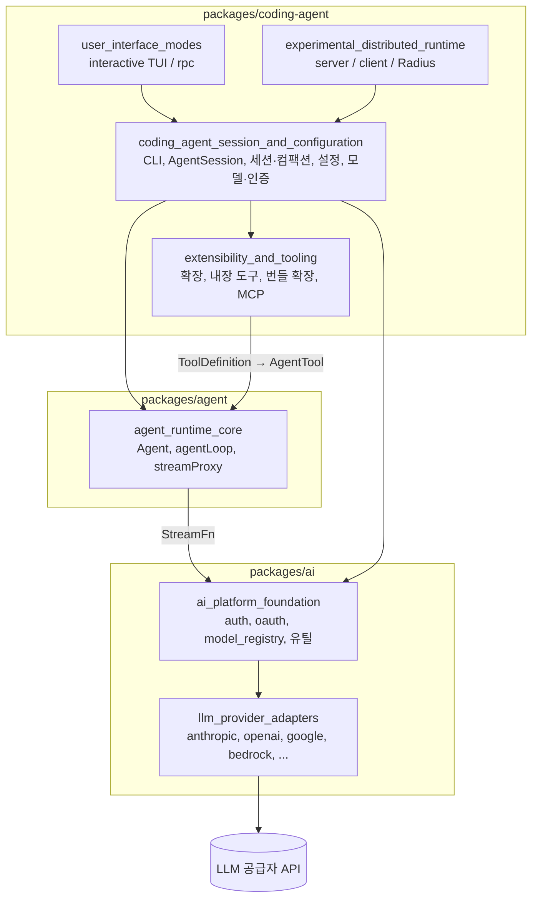
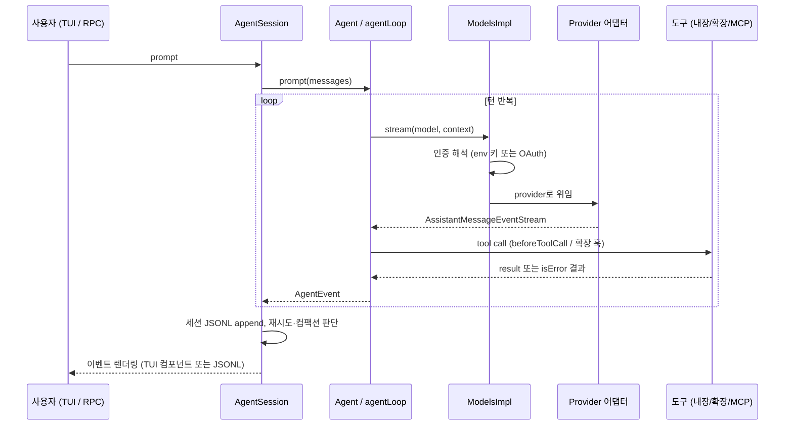

# pi 저장소 개요

> 검증 수준: 아래 내용은 CodeWiki 산출물(`artifacts/pi/codewiki-d4-3pkg/`)의 모듈 문서 7개를 읽고 정리한 것이다. 각 문서는 소스를 읽고 쓴 내용이지만 분석 후보(second opinion)다. 이 개요 작성 중에 `repos/pi`를 다시 대조하지는 않았다(`미확인`). 빌드·배포 관련 서술은 일부 `추론`이다.

## 1. 목적

`pi`는 터미널에서 쓰는 **코딩 에이전트**와 그 아래의 재사용 가능한 패키지들로 이루어진 TypeScript 모노레포다. 패키지는 세 개다.

| 패키지 | npm 이름 | 역할 |
|---|---|---|
| `packages/ai` | (`pi-ai`) | LLM 공급자별 요청·응답 형식을 하나의 스트리밍 계약 뒤로 숨기는 추상화 계층. 인증, 모델 레지스트리 포함 |
| `packages/agent` | `@earendil-works/pi-agent-core` | LLM 호출, 도구 실행, transcript 관리를 하나로 묶는 에이전트 루프(`Agent`, `agentLoop`) |
| `packages/coding-agent` | (`pi` CLI) | CLI, 세션·컴팩션, 설정, 확장·도구, TUI와 RPC 모드, 실험적 분산 런타임 |

(`pi-ai`, `pi` CLI의 정확한 npm 이름은 문서에서 확인하지 못했다. `미확인`.)

## 2. 전체 아키텍처

### 2.1 계층 구조

- 의존 방향은 위에서 아래다. UI 모드는 입출력만 맡고, 프롬프트·재시도·컴팩션은 `AgentSession`이 조율한다.
- `agent_runtime_core`는 공급자 카탈로그에 의존하지 않는다. 호스트가 `setDefaultStreamFn`으로 모델 런타임을 주입한다.
- 내장 도구, 확장 도구, MCP 도구는 모두 같은 `ToolDefinition` 형태를 쓴다. 그래서 훅과 권한 검사가 동일하게 적용된다.

### 2.2 대표 흐름: 프롬프트 한 번

### 2.3 공통 설계 원칙

- **실패는 예외가 아니라 이벤트**: 어댑터와 `StreamFn`은 throw하지 않고 `stopReason: "error" | "aborted"`로 보고한다. 도구 오류도 `isError: true` 결과가 된다.
- **상태 분리**: 루프는 상태가 없고 `Agent`가 transcript와 큐(steering, follow-up)를 소유한다.
- **append-only 세션 트리**: 컴팩션 후에도 원본 엔트리는 파일에 남고, 모델 컨텍스트는 leaf에서 root까지의 경로로 투영한다.
- **신뢰 기반 설정**: 프로젝트 설정(`<cwd>/.pi/settings.json`)은 신뢰된 경우에만 전역 설정 위에 병합된다.
- **프로바이더 3계층 합성**: 빌트인, `models.json`, 확장 등록 순으로 합친다.

## 3. 핵심 모듈 문서

문서는 모두 `artifacts/pi/codewiki-d4-3pkg/` 아래에 있다.

| 모듈 | 경로 | 요약 | 문서 |
|---|---|---|---|
| `agent_runtime_core` | `packages/agent/src` | `Agent`, `agentLoop`, 이중 루프, `streamProxy`, 기본 `streamFn` 주입 | [agent_runtime_core](/Users/kkh/Desktop/oss-analysis/artifacts/pi/codewiki-d4-3pkg/agent_runtime_core.md) |
| `llm_provider_adapters` | `packages/ai/src/api` | Anthropic, OpenAI, Codex, Bedrock, Google, Mistral, pi 게이트웨이, 분류기, 이미지 생성 어댑터 | [llm_provider_adapters](/Users/kkh/Desktop/oss-analysis/artifacts/pi/codewiki-d4-3pkg/llm_provider_adapters.md) |
| `ai_platform_foundation` | `packages/ai/src` 외 | 인증, OAuth 흐름, 모델 레지스트리, 내장 provider, 런타임 유틸, 빌드·테스트 설정 | [ai_platform_foundation](/Users/kkh/Desktop/oss-analysis/artifacts/pi/codewiki-d4-3pkg/ai_platform_foundation.md) |
| `coding_agent_session_and_configuration` | `packages/coding-agent/src` | CLI 진입, `AgentSession`, 세션 영속화·컴팩션, 설정·키 바인딩, 모델·인증 관리 | [coding_agent_session_and_configuration](/Users/kkh/Desktop/oss-analysis/artifacts/pi/codewiki-d4-3pkg/coding_agent_session_and_configuration.md) |
| `extensibility_and_tooling` | `packages/coding-agent/src` | 확장 시스템, 내장 도구 8종, 번들 확장(codemode, tool_search, llama), MCP | [extensibility_and_tooling](/Users/kkh/Desktop/oss-analysis/artifacts/pi/codewiki-d4-3pkg/extensibility_and_tooling.md) |
| `user_interface_modes` | `packages/coding-agent/src/modes` | 인터랙티브 TUI 컴포넌트, JSONL RPC 서버와 `RpcClient` | [user_interface_modes](/Users/kkh/Desktop/oss-analysis/artifacts/pi/codewiki-d4-3pkg/user_interface_modes.md) |
| `experimental_distributed_runtime` | `packages/coding-agent/src/experimental` 외 | 실험적 `pi server` / `pi client`, 코디네이터, 세션 워커, Radius 중계, durable/vacation 데모 | [experimental_distributed_runtime](/Users/kkh/Desktop/oss-analysis/artifacts/pi/codewiki-d4-3pkg/experimental_distributed_runtime.md) |

## 4. How it is built and run

- **구성**: 세 패키지(`packages/ai`, `packages/agent`, `packages/coding-agent`)로 이루어진 모노레포다. 코드는 TypeScript이며, 루트 설정이 검사하는 소스는 Node strip-only 모드에서 동작하는 erasable 문법만 쓴다(레포 `AGENTS.md` 기준).
- **모델 카탈로그 생성**: `packages/ai/scripts/generate-models.ts`가 외부 카탈로그를 수집해 `models.generated.ts`를 만든다. 생성 파일은 직접 수정하지 않는다.
- **테스트**: 세 패키지 각각 `vitest.config.ts`를 가진다(`packages/agent`, `packages/ai`, `packages/coding-agent`). 레포 규칙상 e2e 때문에 전체 vitest를 직접 돌리지 않고 루트 `./test.sh`를 쓴다.
- **정적 검사**: `npm run check`.
- **설치 방식**: npm 설치, 소스 체크아웃, 단독(Bun) 바이너리를 구분해 에셋 경로를 해석한다(`config.ts` 헬퍼). 단독 바이너리에서는 `registerBunOAuthFlows()`가 OAuth 모듈을 정적 import로 대체한다.
- **의존성 정책**: 직접 의존성은 정확한 버전으로 고정하고, `npm install --ignore-scripts`를 쓴다. `packages/coding-agent/npm-shrinkwrap.json`은 스크립트로 생성한다(레포 `AGENTS.md` 기준).
- **실행 모드**: `interactive`(기본), `print`(`--print` 또는 비 TTY), `json`, `rpc`. 실험 기능은 활성화된 경우에만 `pi server` / `pi client`가 동작한다.
- **미확인**: CI 워크플로, 컨테이너, 릴리스·배포 파이프라인은 제공된 아티팩트(vitest 설정 3개)와 모듈 문서에 없어 확인하지 못했다. 릴리스 절차는 레포의 `.pi/skills/release.md`에 있다고만 알려져 있다.

빌드·테스트 설정의 세부는 별도 `Build, Deployment and Configuration` 모듈이 없으므로 다음 문서를 참고한다.

- [ai_platform_foundation](/Users/kkh/Desktop/oss-analysis/artifacts/pi/codewiki-d4-3pkg/ai_platform_foundation.md)의 `build_and_test_config` 항목: vitest 설정, `generate-models.ts`
- [coding_agent_session_and_configuration](/Users/kkh/Desktop/oss-analysis/artifacts/pi/codewiki-d4-3pkg/coding_agent_session_and_configuration.md)의 `cli_entry_and_config` 항목: 설치 방식과 에셋 경로

## 5. 읽는 순서 제안

1. 이 개요의 2.1, 2.2 그림으로 계층과 흐름을 잡는다.
2. [agent_runtime_core](/Users/kkh/Desktop/oss-analysis/artifacts/pi/codewiki-d4-3pkg/agent_runtime_core.md)에서 루프와 이벤트 규약을 본다.
3. [coding_agent_session_and_configuration](/Users/kkh/Desktop/oss-analysis/artifacts/pi/codewiki-d4-3pkg/coding_agent_session_and_configuration.md)에서 세션 생명주기를 본다.
4. 필요에 따라 어댑터, 확장, UI, 실험 런타임 문서로 내려간다.