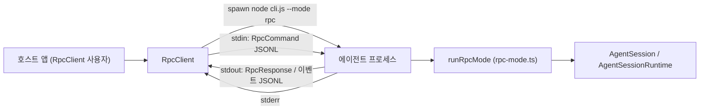
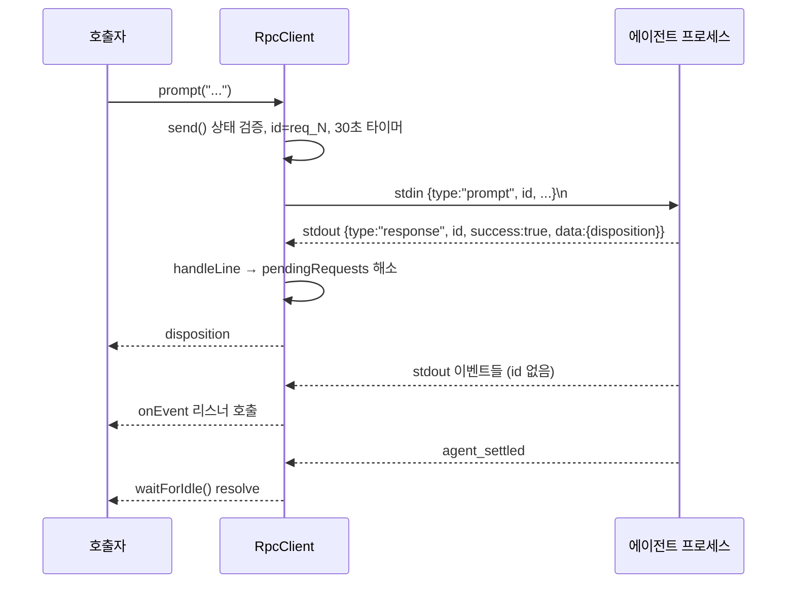
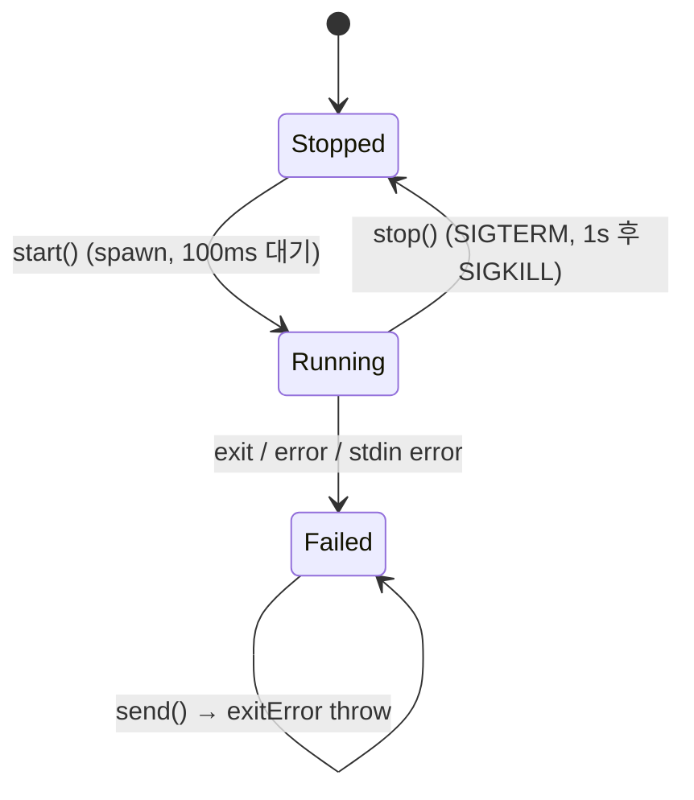

# rpc_mode 모듈

`rpc_mode`는 coding agent를 **자식 프로세스(`--mode rpc`)로 띄우고 stdin/stdout JSONL로 제어**하기 위한 타입드 Node.js 클라이언트(`RpcClient`)를 제공한다. 핵심 컴포넌트는 `packages/coding-agent/src/modes/rpc/rpc-client.ts`의 `RpcClient` 하나이며, 서버 쪽(`rpc-mode.ts`의 `runRpcMode`), 프로토콜 타입(`rpc-types.ts`), 프레이밍(`jsonl.ts`)은 같은 디렉터리의 협력 파일이다.

> 검증 수준: `rpc-client.ts` 전문, `jsonl.ts` 전문은 **코드 확인**. `rpc-types.ts`/`rpc-mode.ts`는 타입 선언과 `case` 목록만 확인했고 핸들러 내부 동작은 **미확인**.

## 1. 아키텍처

| 파일 | 역할 |
|---|---|
| `rpc-client.ts` | 프로세스 spawn, 요청-응답 상관(correlation), 이벤트 구독, 편의 헬퍼 |
| `rpc-types.ts` | `RpcCommand`, `RpcResponse`, `RpcSessionState`, `RpcSlashCommand`, `RpcExtensionUIRequest/Response` |
| `jsonl.ts` | `serializeJsonLine`, `attachJsonlLineReader` (LF 전용 엄격 JSONL) |
| `rpc-mode.ts` | 서버 측 `runRpcMode(runtimeHost)`: 명령 디스패치, 이벤트 출력 |

의존 모듈: 세션/에이전트 동작은 [agent_session_core](agent_session_core.md), 세션 저장·트리는 [session_persistence_and_compaction](session_persistence_and_compaction.md), 이벤트 원천은 [agent_loop_and_state](agent_loop_and_state.md), 사람용 UI 모드는 [interactive_mode](interactive_mode.md)를 참고한다.

## 2. RpcClient 내부 상태

- `process`: spawn한 `ChildProcess`. `stdio: ["pipe","pipe","pipe"]`.
- `pendingRequests: Map<id, {resolve, reject}>`: 응답 대기 요청.
- `requestId`: `req_1`, `req_2`, … 순번 ID.
- `eventListeners`: `onEvent`로 등록된 리스너.
- `stderr`: 누적 stderr(오류 메시지에 포함, 부모 stderr로도 전달).
- `exitError`: 프로세스 종료/오류 후 모든 `send`를 즉시 실패시키는 플래그.

`RpcClientOptions`: `cliPath`(기본 `dist/cli.js`), `cwd`, `env`, `provider`, `model`, `args`.

## 3. 요청/응답 흐름

`handleLine`의 분기 규칙: `type === "response"`이고 `id`가 `pendingRequests`에 있으면 응답, 그 외 모든 JSON은 이벤트로 리스너에 전달한다. JSON 파싱 실패 줄은 무시한다. 리스너는 스냅샷(`[...this.eventListeners]`)을 순회하므로 디스패치 중 unsubscribe해도 다른 리스너가 이벤트를 놓치지 않는다.

`getData<T>`는 `success:false`이면 `error` 문자열로 `Error`를 던지고, 성공이면 `data`를 `T`로 단언한다(각 메서드가 올바른 `T`를 지정한다는 신뢰 기반).

## 4. 생명주기

- `start()`: 이미 시작됐으면 `"Client already started"`. `node <cliPath> --mode rpc [--provider] [--model] [...args]` 실행. 100ms 후 `exitCode`가 null이 아니면 즉시 실패. 고정 sleep이므로 준비 완료 핸드셰이크는 아니다(코드 확인).
- 종료/에러 핸들러는 `this.process !== childProcess`이면 무시해 이전 프로세스의 지연 이벤트를 걸러낸다. 발생 시 모든 대기 요청을 reject.
- `stop()`: stdout 리더 해제 → `SIGTERM` → 1초 내 미종료 시 `SIGKILL` → `pendingRequests.clear()`. 주의: 이때 대기 중 요청은 reject되지 않고 비워지며 각자의 30초 타이머로만 종료된다(코드상 관찰, 실행 미확인).
- `send()`는 미시작, `exitError`, 종료 코드, stdin 비쓰기 가능 상태를 순서대로 검사한다.

## 5. JSONL 프레이밍 (`jsonl.ts`)

- 쓰기: `JSON.stringify(value) + "\n"`.
- 읽기: Node `readline`을 **의도적으로 사용하지 않는다**. readline은 U+2028/U+2029에서도 줄을 나누지만 이는 JSON 문자열 안에서 유효하므로 엄격 JSONL이 깨진다. `StringDecoder("utf8")`로 멀티바이트 경계를 처리하고 `\n`에서만 분리하며, 끝의 `\r`은 제거한다. 스트림 종료 시 남은 버퍼를 마지막 줄로 방출한다.
- 다른 언어로 클라이언트를 구현할 때도 `\n`만으로 분리해야 한다.

## 6. API 레퍼런스 (RpcClient)

| 분류 | 메서드 → 명령 `type` |
|---|---|
| 프롬프트 | `prompt`→`prompt` (`PromptDisposition` 반환, `streamingBehavior: "steer"\|"followUp"`), `steer`→`steer`, `followUp`→`follow_up`, `abort`→`abort`, `clearQueue`→`clear_queue` |
| 세션 | `newSession`→`new_session`, `switchSession`→`switch_session`, `fork`→`fork`, `clone`→`clone`, `getForkMessages`, `getEntries(since)`, `getTree`, `setSessionName`, `getMessages`, `getLastAssistantText`, `exportHtml`, `getSessionStats`, `getState` |
| 모델/사고 | `setModel`, `cycleModel`, `getAvailableModels`, `setThinkingLevel`, `cycleThinkingLevel`, `getAvailableThinkingLevels` |
| 큐 모드 | `setSteeringMode`, `setFollowUpMode` (`"all"\|"one-at-a-time"`) |
| 압축/재시도 | `compact(customInstructions)`, `setAutoCompaction`, `setAutoRetry`, `abortRetry` |
| bash | `bash(command)`, `abortBash` |
| 기타 | `getCommands` (확장 명령/프롬프트 템플릿/스킬) |
| 헬퍼 | `onEvent`, `waitForIdle`, `collectEvents`, `promptAndWait`, `getStderr` |

`new_session`/`switch_session`/`fork`/`clone`은 확장이 취소할 수 있어 `cancelled` 플래그를 돌려준다.

타임아웃: 요청 응답 30초(하드코딩), `waitForIdle`/`collectEvents`/`promptAndWait` 기본 60초. `agent_settled` 이벤트가 완료 신호다.

## 7. 사용 시 주의점

1. `prompt()`의 disposition이 `"handled"`면 실행이 시작되지 않았으므로 `agent_settled`를 기다리면 안 된다(소스 주석).
2. `promptAndWait`는 `collectEvents`를 먼저 등록한 뒤 `prompt`를 보내 이벤트 유실을 막는다.
3. `RpcClient`에 `bash`의 `excludeFromContext`(`rpc-types.ts`에는 존재)와 `extension_ui_request` 응답 전송 래퍼는 없다. 확장 UI 요청은 이벤트로 도달할 수 있으나 응답을 보내려면 `send`가 private이므로 별도 구현이 필요하다(코드 확인, 서버 동작은 추론).
4. 이벤트 타입은 `../json-event.ts`의 `JsonAgentSessionEvent`.
5. 테스트 설정은 `packages/coding-agent/vitest.config.ts`.

## 8. 시스템 내 위치

CLI 진입점([cli_entry_and_config](cli_entry_and_config.md))이 `--mode rpc`를 받으면 `runRpcMode`로 진입하고, `RpcClient`는 그 반대편의 공식 임베딩 클라이언트이다. 다른 UI 모드인 [interactive_mode](interactive_mode.md)와 동일한 `AgentSession`을 공유하되 입출력만 JSONL로 바꾼 형태다.
