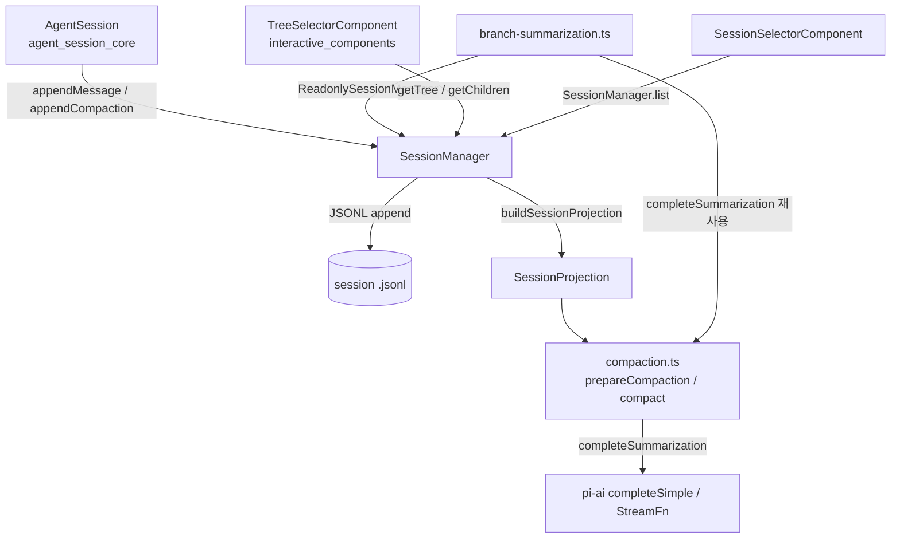
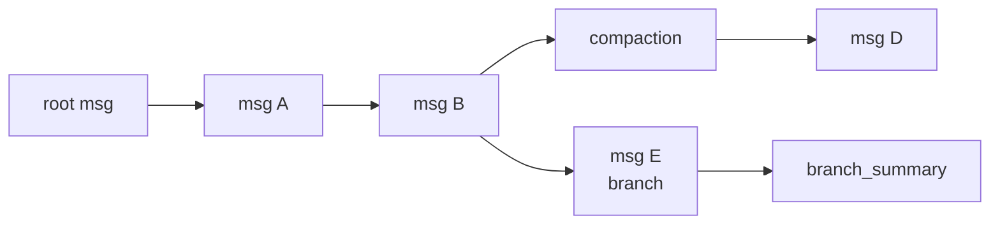
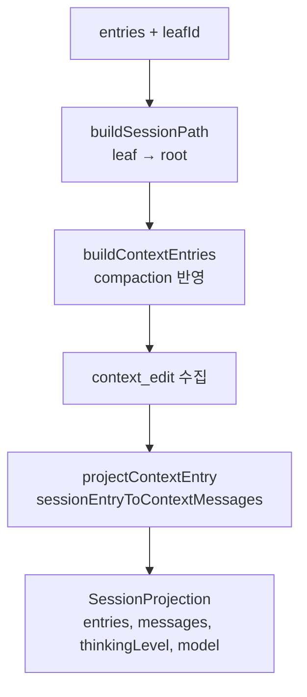
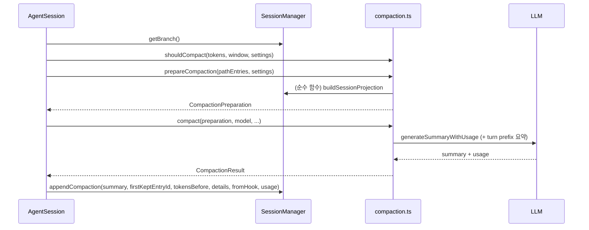
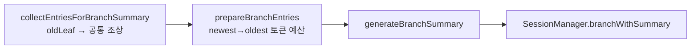

# session_persistence_and_compaction 모듈

## 개요

이 모듈은 `coding-agent`의 **대화 세션 영속화**와 **컨텍스트 압축(compaction)**을 담당한다. 세 파일로 구성된다.

| 파일 | 역할 |
|---|---|
| `packages/coding-agent/src/core/session-manager.ts` | append-only 트리 구조의 JSONL 세션 저장·로드·분기·목록·마이그레이션, LLM 컨텍스트 투영(projection) |
| `packages/coding-agent/src/core/compaction/compaction.ts` | 토큰 추정, 컷 포인트 탐색, LLM 기반 요약 생성(compaction) |
| `packages/coding-agent/src/core/compaction/branch-summarization.ts` | 트리 탐색 시 떠나는 브랜치의 요약 생성 |

핵심 아이디어: 세션은 **수정·삭제 없이 추가만 되는 트리**이며, 모델에 보내는 메시지는 항상 현재 leaf에서 root까지의 경로를 **투영**해서 만든다. 컨텍스트가 커지면 오래된 부분을 요약 엔트리(`compaction`)로 대체하되, 원본 엔트리는 파일에 그대로 남는다.

## 아키텍처

관련 모듈: [agent_session_core](agent_session_core.md)(호출 주체), [settings_and_keybindings](settings_and_keybindings.md)(`CompactionSettings`·세션 디렉터리 설정), [interactive_components](interactive_components.md)(트리/세션 선택 UI), [rpc_mode](rpc_mode.md)(`compact`, `fork`, `getTree` 등 RPC), [extension_system](extension_system.md)(`CompactionEntryDraft`, `CustomEntryDraft` 등 확장 훅), [agent_loop_and_state](agent_loop_and_state.md)(`AgentMessage` 정의).

## 1. SessionManager: 세션 저장소

### 1.1 파일 형식

JSONL 한 줄이 한 엔트리다. 첫 줄은 `SessionHeader`(`type: "session"`, `version`, `id`, `cwd`, `parentSession?`), 이후는 `SessionEntry`이며 모두 `SessionEntryBase`(`id`, `parentId`, `timestamp`)를 가진다. 현재 버전은 `CURRENT_SESSION_VERSION = 3`.

| 엔트리 type | 용도 | LLM 컨텍스트 참여 |
|---|---|---|
| `message` | `AgentMessage` (user/assistant/toolResult/system/bashExecution/custom) | O |
| `compaction` | 요약, `firstKeptEntryId`, `tokensBefore`, `details`, `usage`, `fromHook`, `systemMessage` | O (요약 메시지로) |
| `branch_summary` | 떠난 브랜치의 요약 (`fromId`) | O |
| `custom_message` | 확장이 주입하는 메시지 | O (`display`는 TUI 표시 여부만) |
| `context_edit` | 이전 엔트리 내용을 교체/생략하는 append-only 편집 | 대상에 적용 |
| `custom` | 확장 상태 저장 | X |
| `thinking_level_change`, `model_change` | 설정 변경 이력 | X (상태로만 반영) |
| `usage` | 모델별 사용량 기록(예: `cache_warm`) | X |
| `label`, `session_info` | 북마크, 세션 이름 | X |

### 1.2 트리와 leaf

- 모든 `append*`는 현재 `leafId`의 자식을 만들고 leaf를 전진시킨다 (`_appendEntry`).
- `branch(id)`는 leaf만 옮긴다. 다음 append가 새 가지를 만든다. `resetLeaf()`는 leaf를 `null`로 되돌려 새 root를 만든다.
- `branchWithSummary()`는 leaf를 옮기고 `branch_summary` 엔트리를 추가한다.
- `getBranch()`는 root→leaf 경로, `getTree()`는 `SessionTreeNode[]`(라벨 포함, 자식은 timestamp 오름차순; 깊은 트리를 위해 반복문 사용), `getChildren()`은 직계 자식을 반환한다. 부모를 잃은 orphan은 root로 취급한다.
- `getLabel()`/`appendLabelChange()`는 `labelsById`를 `_buildIndex()` 시 재구성한다.

### 1.3 영속화 정책 (`_persist`)

- 메모리에는 항상 `fileEntries`와 `byId` 인덱스를 유지한다.
- **user 또는 assistant 메시지가 처음 생기기 전에는 파일을 만들지 않는다** (`_hasConversation`). 설정 엔트리만 있는 세션은 흔적이 남지 않는다. 첫 대화가 생기면 `openSync(..., "wx")`로 전체를 쓰고(`flushed = true`), 이후는 `appendFileSync`로 한 줄씩 추가한다.
- 로드 시 마이그레이션이 일어나면 `_rewriteFile()`로 전체를 다시 쓴다.
- `loadEntriesFromFile()`은 1MB 버퍼로 스트리밍 파싱하고, 손상된 줄은 건너뛰며, 첫 엔트리가 유효한 `session` 헤더가 아니면 `[]`을 반환한다. 마지막 줄에 개행이 없으면 개행을 붙여 복구한다.
- `readSessionHeader()`는 최대 1MB(`MAX_SESSION_HEADER_SCAN_BYTES`)만 훑어 헤더를 찾는다. 초과 시 `SessionHeaderScanLimitError`를 던지고, `open()`은 전체 로드로 폴백한다. 탐색용(`readSessionHeaderForDiscovery`)은 오류를 삼키고 `null`을 반환해 파일 하나의 손상이 전체 탐색을 막지 않게 한다.

### 1.4 마이그레이션

`migrateToCurrentVersion()`은 제자리 변경(in place)으로 순차 적용한다.

- v1 → v2: `id`/`parentId` 부여(선형 체인), `firstKeptEntryIndex` → `firstKeptEntryId` 변환.
- v2 → v3: `hookMessage` role을 `custom`으로 변경.

`migrateSessionEntries`(테스트용)와 `parseSessionEntries`(`compaction.test.ts`용)는 이 로직을 외부에 노출한 얇은 래퍼다.

### 1.5 생성·열기·포크 팩토리

| 메서드 | 동작 |
|---|---|
| `create(cwd, sessionDir?, options?)` | 새 세션. 기본 디렉터리는 `~/.pi/agent/sessions/--<인코딩된 cwd>--/` |
| `open(path, sessionDir?, cwdOverride?)` | 지정 파일 열기. 헤더의 `cwd` 사용 |
| `continueRecent(cwd, sessionDir?)` | mtime이 가장 최근인 세션 이어가기, 없으면 새로 생성 |
| `inMemory(cwd?, options?, entries?)` | 파일 없는 세션 (`persist = false`) |
| `forkFrom(sourcePath, targetCwd, ...)` | 다른 프로젝트의 세션을 복사해 새 id·`parentSession`으로 포크 |
| `createBranchedSession(leafId)` | root→leaf 경로만 담은 새 세션 파일 생성 |
| `setSessionFile(file)` | 세션 파일 교체(재개/분기). 파일이 비어 있으면 헤더로 초기화, 비어 있지 않은데 유효하지 않으면 오류 |
| `findById`, `list`, `listAll` | id 탐색, 디렉터리별/전체 세션 목록 |

`createBranchedSession`은 `label` 엔트리를 제거하고 경로를 재연결(re-chain)한 뒤 라벨을 경로 끝에 다시 붙인다. 이때 `compaction.firstKeptEntryId`가 라벨을 가리키고 있으면 대체 id로 교체한다.

세션 id는 `uuidv7()`, 엔트리 id는 충돌 검사하는 8자리 hex(`generateId`)다. `assertValidSessionId`가 사용자 지정 id의 문자 집합을 검증한다.

### 1.6 세션 목록

`list()`/`listAll()`은 `buildSessionInfo()`로 각 파일을 스트리밍 파싱해 `SessionInfo`(이름, 메시지 수, 첫 메시지, 최근 활동 시각 등)를 만든다. `mapWithConcurrency`로 동시성을 제한하고(정보 로드 10, 탐색 64) `onProgress`로 부분 결과를 주기적으로 알린다(`AbortSignal` 지원). `sessionDir`가 기본 경로가 아닐 때는 헤더 `cwd`로 필터링한다.

## 2. 컨텍스트 투영 (Projection)

- `buildSessionPath`: leaf에서 `parentId`를 따라 root까지 올라간 뒤 뒤집는다. `leafId === null`이면 빈 배열, 못 찾으면 마지막 엔트리를 사용한다.
- `buildContextEntries`: 경로에서 **가장 최근 compaction**을 찾아 `[compaction, firstKeptEntryId부터 compaction 직전까지(system 메시지 제외), compaction 이후 전부]` 순으로 구성한다. 이전 요약된 엔트리는 제외된다.
- `sessionEntryToContextMessages`: 엔트리를 메시지로 변환한다. `content`가 null인 오래된/수동 편집 파일을 방어적으로 보정한다. compaction은 `systemMessage`가 있으면 `[systemMessage, compactionSummary]`를 낸다.
- `buildSessionProjection`: `context_edit`를 대상 엔트리에 적용한다(`replacement === null`이면 생략, 아니면 content 교체). 최신 compaction이 index 0이 아닌 옛 compaction은 빈 메시지로 투영된다. `thinkingLevel`(기본 `"off"`)과 `model`은 경로를 순회하며 마지막 값을 취한다.
- `buildSessionContext`는 projection에서 `messages/thinkingLevel/model`만 뽑은 축약판이다.

`appendContextEdit`는 대상이 활성 브랜치에 있고 편집 가능한 엔트리(user/assistant/toolResult/custom_message)일 때만 허용되며, 원본은 건드리지 않는다.

## 3. Compaction

### 3.1 흐름

compaction.ts는 **순수 함수 중심**이며 I/O는 SessionManager가 담당한다. 압축 후 세션은 다시 로드된다.

### 3.2 트리거와 토큰 추정

- `CompactionSettings`: `enabled`, `reserveTokens`(기본 16384), `keepRecentTokens`(기본 20000).
- `shouldCompact`: `enabled`이고 `contextTokens > contextWindow - reserveTokens`일 때 true.
- `estimateTokens`: 문자 수 / 4 휴리스틱(과대추정, 이미지는 4800자로 가정).
- `getLastAssistantUsage`: 뒤에서부터 `aborted`/`error`/0토큰이 아닌 assistant `usage`를 찾는다. `estimateContextTokens`는 마지막 실제 usage + 이후 메시지의 추정치를 합산한다.
- `estimateProjectedContextTokens`: 마지막 usage가 `context_edit`/`compaction` 이전 것이면 신뢰하지 않고 전체를 추정치로 다시 계산한다.

### 3.3 컷 포인트 (`findCutPoint`)

- 유효한 컷 포인트: `user`, `assistant`, `bashExecution`, `custom`, `branchSummary`, `compactionSummary` (`isCutPointMessage`). **`toolResult`에서는 절대 자르지 않는다** (호출과 결과가 분리되지 않도록).
- 뒤에서 앞으로 토큰을 누적해 `keepRecentTokens` 이상이 되는 지점 이후의 가장 가까운 컷 포인트를 선택한다. 그 직전의 컨텍스트에 영향 없는 메타 엔트리는 함께 유지 쪽으로 당긴다.
- 컷이 턴 중간(assistant)이면 `isSplitTurn = true`이고 `turnStartIndex`(`isTurnStartMessage`: user/bashExecution/custom/요약류)를 찾는다.
- 실제 `prepareCompaction`은 `findProjectedCutPoint`(투영 엔트리 기반)를 사용한다. 생략된 assistant 시도 뒤의 "복구 생략 suffix"를 넘겨 입력이 유실되지 않게 하는 보정 로직이 있다.

### 3.4 `prepareCompaction` 과 `compact`

`prepareCompaction`:
1. 마지막 엔트리가 이미 compaction이면 `undefined`.
2. 투영에서 이전 compaction을 찾아 `previousSummary`와 시작 경계를 정한다.
3. 컷 포인트 이전을 `messagesToSummarize`, 분할 턴이면 `turnPrefixMessages`로 나눈다. system 메시지는 제외(`getMessagesFromProjectedEntryForCompaction`).
4. 파일 작업(read/edited)을 이전 compaction의 `details`(`CompactionDetails`: `readFiles`, `modifiedFiles`)와 tool call에서 누적한다. `fromHook` 요약의 details는 신뢰하지 않는다.

`compact`:
- 일반: `generateSummaryWithUsage`로 요약(이전 요약이 있으면 `UPDATE_SUMMARIZATION_PROMPT`로 병합 갱신).
- 분할 턴: 히스토리 요약 + `generateTurnPrefixSummary`를 합쳐 `**Turn Context (split turn):**` 섹션으로 결합하고 `combineUsage`로 usage 합산.
- 마지막에 파일 목록을 요약 끝에 덧붙이고 `CompactionResult`(`summary`, `firstKeptEntryId`, `tokensBefore`, `usage`, `details`)를 반환한다.

### 3.5 요약 호출의 안전장치

- `completeSummarization`: 모든 요약 호출의 단일 관문. `cacheRetention: "none"`, `sessionId` 없으면 `uuidv7()`, `retryAssistantCall`로 일시적 스트림 오류 재시도. 서버가 `streamFn`을 주면 그것을 쓰고 아니면 `completeSimple`.
- `maxTokens = min(0.8 * reserveTokens, model.maxTokens)` (turn prefix는 0.5배).
- `getSummarizationFailure`: `stopReason`이 `error` 또는 `length`(잘린 요약)이면 실패로 처리해 불완전한 체크포인트가 저장되지 않게 한다. 요약 응답에 `toolCall`이 있으면 오류.
- 대화는 `serializeConversation`으로 텍스트화해 `<conversation>` 태그로 감싼다 (모델이 대화를 이어가지 않게 함). 요약 형식은 Goal / Constraints / Progress / Key Decisions / Next Steps / Critical Context 고정 템플릿.

## 4. Branch Summarization

트리에서 다른 지점으로 이동할 때 떠나는 경로의 맥락을 보존한다.

- `collectEntriesForBranchSummary`: `ReadonlySessionManager`로 두 경로의 가장 깊은 공통 조상을 찾고 옛 leaf에서 그 조상 직전까지 수집한다. compaction 경계에서 멈추지 않는다.
- `prepareBranchEntries`: 최신 → 과거 순으로 `tokenBudget`(= `contextWindow - reserveTokens`)까지 채운다. `toolResult`는 제외, 요약 엔트리는 예산의 90% 미만일 때 예외적으로 포함한다. 파일 작업은 예산과 무관하게 이전 `branch_summary.details`(`BranchSummaryDetails`)에서 누적한다(`fromHook` 제외).
- `generateBranchSummary`: `maxTokens = min(4096, model.maxTokens)`. 결과는 `BranchSummaryResult` 형태로 `aborted`/`error`/`summary`를 구분해 **예외 대신 값**으로 반환한다 (compaction은 예외를 던진다는 차이). 요약 앞에 `BRANCH_SUMMARY_PREAMBLE`을 붙이고 파일 목록을 덧붙인다.
- `replaceInstructions`가 true면 `customInstructions`가 기본 프롬프트를 대체한다.

## 5. 설계상 주의점

- **불변성**: 엔트리는 수정·삭제되지 않는다. 편집은 `context_edit`, 요약은 `compaction`/`branch_summary`로 표현해 이력을 보존한다.
- **system 메시지 처리**: `appendCompaction`이 현재 system 메시지를 `systemMessage`로 스냅샷한다. `buildContextEntries`는 유지 범위의 옛 system 메시지를 제외해 중복을 막는다.
- **fromHook**: 확장이 만든 요약은 `fromHook = true`로 표시되고, 파일 추적 `details`를 누적할 때 무시된다.
- **방어적 파싱**: 세션 파일은 검증 없이 파싱되므로 null content, 손상된 줄, 거대한 헤더에 대비한 코드가 곳곳에 있다.
- **관련 설정/테스트**: 압축 기본값은 `DEFAULT_COMPACTION_SETTINGS`. 테스트 설정은 `packages/coding-agent/vitest.config.ts`를 참고한다 (`compaction.test.ts`가 `parseSessionEntries`를 사용).

## 검증 수준

위 내용은 제공된 소스 코드 3개 파일을 직접 읽고 작성했다 (**코드 확인**). `AgentSession`이 실제로 이 함수들을 어떤 순서로 호출하는지(3.1 시퀀스 다이어그램의 호출 주체 부분)와 `utils.ts`, `messages.ts` 내부 동작은 이 문서의 범위 밖 파일이라 **추론/미확인**이다.
