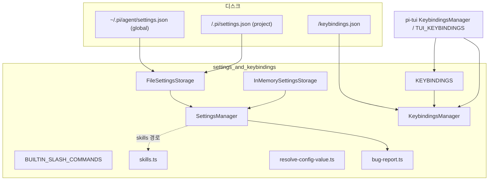
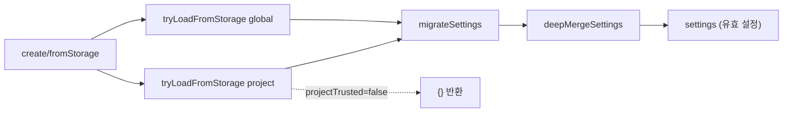
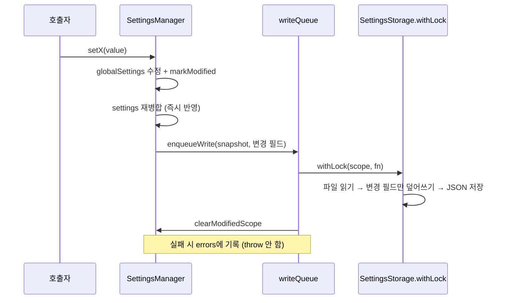
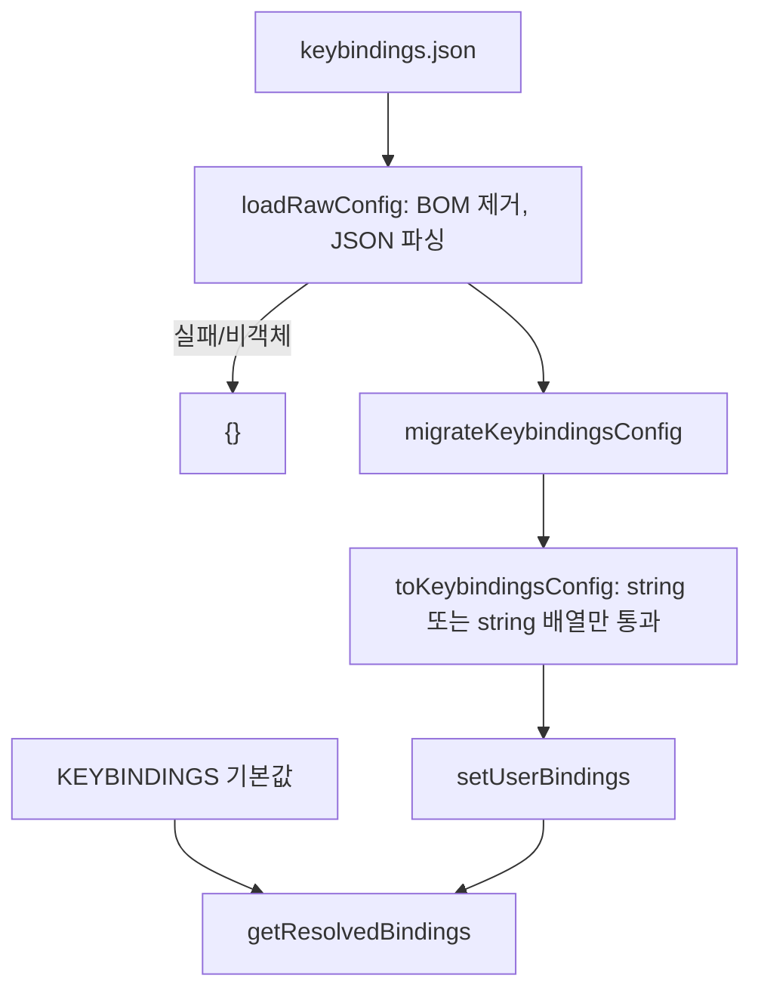
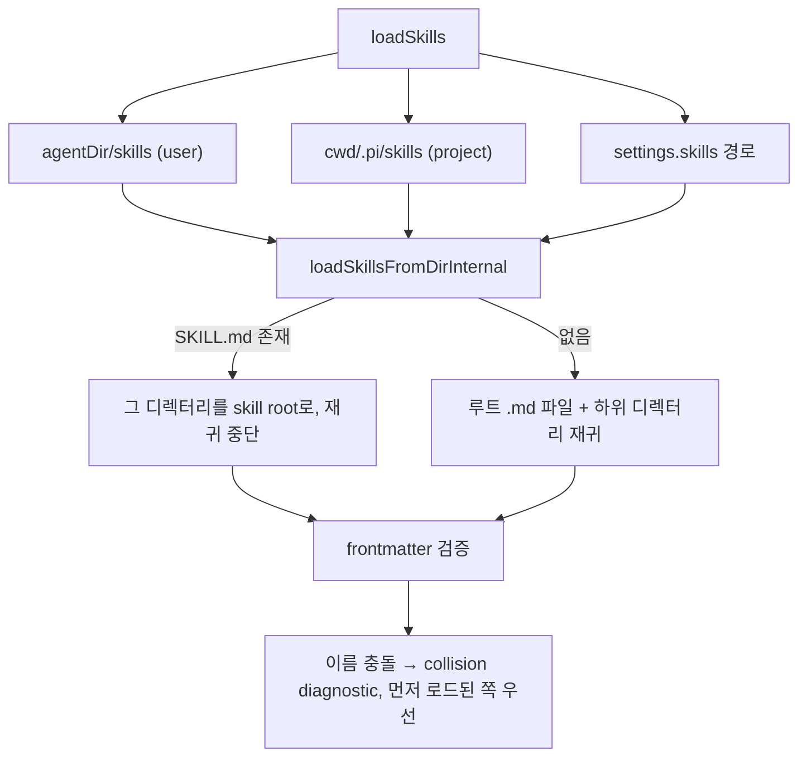

# settings_and_keybindings 모듈

`settings_and_keybindings`는 `packages/coding-agent`의 **사용자 설정(`settings.json`)**, **키 바인딩(`keybindings.json`)**, **내장 슬래시 명령 목록**, **스킬 로딩**, **설정값 해석(셸 명령/환경변수)**, **버그 리포트 메타데이터 수집**을 담당하는 `core` 계층 모듈이다. 상위 모듈은 [coding_agent_session_and_configuration](coding_agent_session_and_configuration.md)이다.

| 파일 | 역할 |
|---|---|
| `core/settings-manager.ts` | 전역/프로젝트 두 계층 설정의 로드·병합·저장 (`SettingsManager`, `FileSettingsStorage`) |
| `core/keybindings.ts` | 앱 키 바인딩 정의, 플랫폼별 기본값, 레거시 이름 마이그레이션, `KeybindingsManager` |
| `core/slash-commands.ts` | 내장 슬래시 명령 목록 `BUILTIN_SLASH_COMMANDS` |
| `core/skills.ts` | `SKILL.md` 탐색/검증 (`loadSkillsFromDir`, `loadSkills`) |
| `core/resolve-config-value.ts` | `!command`, `$ENV`, 리터럴 형태의 설정값 해석 |
| `core/bug-report.ts` | 비밀값을 제거한 버그 리포트 메타데이터 생성 (`describeExtension` 등) |

---

## 1. 아키텍처

> 경로 `~/.pi/agent`, `.pi`는 `getAgentDir()`와 `CONFIG_DIR_NAME`(`config.ts`)이 결정한다. 정확한 값은 [cli_entry_and_config](cli_entry_and_config.md) 참조 (코드에서는 상수 참조만 확인).

소비자: [agent_session_core](agent_session_core.md)(압축/재시도/스티어링 설정), [interactive_mode](interactive_mode.md)·[interactive_components](interactive_components.md)(테마, 이미지, 키 바인딩, 설정 UI), [extension_system](extension_system.md)(확장 경로), [model_and_auth_management](model_and_auth_management.md)(`resolveHeaders` 등 설정값 해석), [session_persistence_and_compaction](session_persistence_and_compaction.md)(압축 토큰 설정).

---

## 2. SettingsManager

### 2.1 두 계층 설정과 병합

- `globalSettings`: `agentDir/settings.json`
- `projectSettings`: `cwd/<CONFIG_DIR_NAME>/settings.json`
- `settings`: `deepMergeSettings(global, project)` 결과. 프로젝트 값이 우선이며 중첩 객체는 재귀 병합, 배열은 교체된다.
- 예외 `defaultTools`: 일반 이름 목록은 교체, `+name`/`-name`만 있는 목록은 상속 목록에 **append**되어 수정 효과를 낸다. `resolveDefaultTools`가 `DEFAULT_TOOL_NAMES = ["read","bash","edit","write"]`에 적용한다.

### 2.2 신뢰(trust)와 보안 관련 규칙

- `projectTrusted=false`면 프로젝트 설정은 로드하지 않고 `{}`로 취급한다. 쓰기(`assertProjectTrustedForWrite`)도 거부한다.
- `setProjectTrusted(true)` 시 프로젝트 설정을 다시 로드한다.
- `defaultProjectTrust`, `cacheWarming`, `deviceId`는 **global만** 읽는다. 이유는 코드 주석상 비용 발생(`cacheWarming`)과, 커밋된 프로젝트 파일이 모든 clone에 같은 ID를 부여하는 문제(`deviceId`) 방지이다.
- `setEnableAnalytics(true)` 최초 호출 시 `randomUUID()`로 `trackingId` 생성.

### 2.3 저장 경로: 변경 필드만 기록

setter는 `globalSettings`를 수정하고 `markModified(field, nestedKey?)`로 변경 필드를 기록한 뒤 `save()`를 호출한다.

- **변경 필드만 병합**하므로 다른 프로세스가 같은 파일에 쓴 다른 키를 덮어쓰지 않는다. 중첩 필드(`terminal.showImages` 등)는 `modifiedNestedFields`로 하위 키 단위까지 추적.
- 로드 시 파싱 에러가 있었던 스코프(`globalSettingsLoadError`)는 파일 보호를 위해 **저장하지 않는다**.
- 쓰기는 `writeQueue` Promise 체인으로 직렬화. `flush()`로 대기, `drainErrors()`로 누적 오류 수거.
- `reload()`는 대기 중 쓰기를 기다린 뒤 다시 로드하고 modified 추적을 초기화한다.
- `applyOverrides()`는 메모리 상의 `settings`에만 덮어쓴다 (CLI 플래그 용도로 추정, `추론`).

### 2.4 스토리지 추상화

| 클래스 | 설명 |
|---|---|
| `SettingsStorage` | `withLock(scope, fn(current) => next \| undefined)` 인터페이스 |
| `FileSettingsStorage` | `proper-lockfile`의 `lockSync`를 최대 10회, 20ms 간격 busy-wait로 재시도(`ELOCKED`만). 파일이 존재할 때 잠금, 쓰기 시에만 디렉터리 생성 |
| `InMemorySettingsStorage` | 테스트/`SettingsManager.inMemory()`용 |

`fn`이 `undefined`를 반환하면 쓰기하지 않는다 (읽기 전용 용도로 `loadFromStorage`가 사용).

### 2.5 마이그레이션 (`migrateSettings`)

| 레거시 | 신규 |
|---|---|
| `queueMode` | `steeringMode` |
| `websockets: boolean` | `transport: "websocket" \| "sse"` |
| `skills: {enableSkillCommands, customDirectories}` | `enableSkillCommands` + `skills: string[]` |
| `retry.maxDelayMs` | `retry.provider.maxRetryDelayMs` |

### 2.6 주요 설정 그룹과 getter 동작

| 그룹 | 대표 키 / 메서드 | 동작 |
|---|---|---|
| 모델 | `defaultProvider`, `defaultModel`, `setDefaultModelAndProvider`, `modelThinkingLevels` | 키는 `"provider/modelId"` |
| 큐 모드 | `steeringMode`, `followUpMode` | 기본 `"one-at-a-time"` ([agent_loop_and_state](agent_loop_and_state.md)의 `Agent.steeringMode`와 연동) |
| 압축 | `getCompactionSettings(model)` | 우선순위: `modelOverrides[provider/id]` → 일반 설정 → 기본값(`reserveTokens` 16384, `keepRecentTokens` 20000). 음수/비정수면 `Error` |
| 재시도 | `getRetrySettings`, `getProviderRetrySettings` | 기본 3회, 2000ms, provider `maxRetryDelayMs` 60000 |
| 타임아웃 | `getHttpIdleTimeoutMs`, `getWebSocketConnectTimeoutMs` | `parseTimeoutSetting`이 잘못된 값에 throw, 0은 비활성 |
| 터미널/이미지 | `showImages`, `imageWidthCells`(기본 60, 최소 1), `clearOnShrink`(env `PI_CLEAR_ON_SHRINK`), `getTerminalCapabilityOverrides` | 설정 > 환경변수 > 기본 순 |
| TUI | `tuiMode`(기본 fullscreen), `fullscreen*`, `showHardwareCursor`(env `PI_HARDWARE_CURSOR`) | 잘못된 값은 기본으로 폴백 |
| 레이아웃 | `outputPad`(0/1), `editorPaddingX`(0~3 clamp), `autocompleteMaxVisible`(3~20 clamp) | setter에서 clamp |
| 리소스 | `packages`, `extensions`, `skills`, `prompts`, `themes` | 전역 `setX`와 프로젝트 `setProjectX` 쌍 제공 |
| 외부 편집기 | `getExternalEditorCommand` | `externalEditor` → `VISUAL`/`EDITOR` → `notepad`(win32)/`nano` |
| 셸/npm | `shellPath`(경로 정규화), `shellCommandPrefix`, `npmCommand`(argv 배열) | |
| 분석 | `enableAnalytics`(기본 false), `enableInstallTelemetry`(기본 true), `trackingId` | |
| 캐시 워밍 | `cacheWarming`: `off`/`streaming`/`idle` | global만 읽음. 기본 `streaming` |
| 마크다운 | `markdown.mermaid`: `off`/`final`/`streaming` | 기본 `streaming` |

UI 쪽 소비: `setHideThinkingBlock`, `setOutputPad`, `setShowImages`, `setImageWidthCells`는 [interactive_components](interactive_components.md)의 `AssistantMessageComponent`, `UserMessageComponent`, `ToolExecutionComponent`에서 반영된다. 설정 화면은 `settings-selector.ts`/`settings-submenu.ts`.

---

## 3. KeybindingsManager

### 3.1 구조

`KeybindingsManager`는 `@earendil-works/pi-tui`의 `KeybindingsManager`를 상속하고 `KEYBINDINGS`를 정의 테이블로 넘긴다. `KEYBINDINGS = { ...TUI_KEYBINDINGS, ...app.* }`.

- TypeScript `declare module`로 `Keybindings` 인터페이스를 `AppKeybindings`로 확장하여 `app.*` ID가 타입 안전하게 사용된다.
- `AGENTS.md` 규칙: 키 검사를 하드코딩(`matchesKey(data, "ctrl+x")`)하지 말고 기본값을 `DEFAULT_*_KEYBINDINGS`에 추가해 설정 가능하게 유지.

- `create(agentDir)`: `agentDir/keybindings.json` 로드.
- `reload()`: `configPath`가 있을 때만 재로드 (`/reload` 명령이 "Reload keybindings"를 수행).
- `getEffectiveConfig()`: 기본값+사용자 값이 합쳐진 결과.
- 파일이 깨졌거나 없으면 조용히 `{}`로 처리 (오류 보고 없음, 코드 확인).

### 3.2 레거시 이름 마이그레이션

`KEYBINDING_NAME_MIGRATIONS`가 `cursorUp` → `tui.editor.cursorUp`, `interrupt` → `app.interrupt` 등 구 이름을 신 이름으로 매핑한다. 신 이름이 이미 존재하면 구 이름 항목은 버려지고 `migrated=true`. 결과는 `KEYBINDINGS` 정의 순서 → 나머지는 알파벳 순으로 정렬(`orderKeybindingsConfig`). 이 함수는 파일을 다시 쓰지는 않으며 로드 시 메모리 변환만 한다 (이 파일 안에서는 쓰기 없음).

### 3.3 플랫폼별 기본값

`useWindowsKeybindings(platform, env)`는 `win32` 또는 WSL(`WSL_DISTRO_NAME`/`WSL_INTEROP`가 있는 linux)에서 `true`.

| 키 ID | 기본 (비 Windows) | Windows/WSL |
|---|---|---|
| `tui.editor.undo` | `ctrl+-` | win32 `ctrl+z`, WSL `alt+z` |
| `app.model.cycleBackward` | `shift+ctrl+p` | `alt+p` |
| `app.message.followUp` | `alt+enter` | `ctrl+q` |
| `app.message.dequeue` | `alt+up` | `alt+q` |
| `app.clipboard.pasteImage` | `ctrl+v` | `alt+v` |
| `app.suspend` | `ctrl+z` | win32는 없음 |
| `tui.altScreen.search` | `ctrl+shift+f` | `ctrl+f` |
| `app.tree.foldOrUp` | darwin `alt+left`, 그 외 `ctrl+left` 우선 | |

### 3.4 주요 `app.*` 기본 키

- 전역: `app.interrupt`=`escape`, `app.clear`=`ctrl+c`, `app.exit`=`ctrl+d`, `app.thinking.cycle`=`shift+tab`, `app.model.cycleForward`=`ctrl+p`, `app.model.select`=`ctrl+l`, `app.tools.expand`=`ctrl+o`, `app.thinking.toggle`=`ctrl+t`, `app.editor.external`=`ctrl+g`, `app.message.copy`=`ctrl+x`.
- 키 없음(사용자 지정용): `app.session.new/tree/fork/resume` (`defaultKeys: []`).
- 컨텍스트별 재사용: 같은 키가 서로 다른 화면에서 다른 의미를 가진다. 예: `ctrl+s`는 `app.thinking.save`, `app.session.toggleSort`, `app.models.save`; `ctrl+d`는 `app.exit`, `app.session.delete`, `app.tree.filter.default`. 화면(컴포넌트)이 서로 다른 ID만 검사하므로 충돌하지 않는다 (설계 의도는 `추론`). 같은 화면에서 여러 ID를 같은 키로 재바인딩하면 충돌 가능.
- 트리 선택기 필터: `app.tree.filter.*` (`ctrl+d/t/u/l/a`, 순환 `ctrl+o`/`shift+ctrl+o`).

---

## 4. 내장 슬래시 명령 (`slash-commands.ts`)

`BUILTIN_SLASH_COMMANDS`는 `{name, description, argumentHint?}` 정적 배열이다: `settings`, `model`, `tree`, `thinking`, `scoped-models`, `export`, `import`, `share`, `bug`, `copy`, `name`, `session`, `changelog`, `hotkeys`, `fork`, `clone`, `trust`, `login`, `logout`, `new`, `compact`, `resume`, `reload`, `quit` 등. 확장/프롬프트/스킬이 추가하는 명령은 `SlashCommandInfo`(`source: "extension" | "prompt" | "skill"`)로 구분한다. 실제 디스패치는 [interactive_mode](interactive_mode.md)에서 수행한다.

---

## 5. 스킬 로딩 (`skills.ts`)

- `.gitignore`, `.ignore`, `.fdignore` 규칙 적용(`ignore` 패키지, 하위 디렉터리 접두사 처리). 점(.)으로 시작하는 항목과 `node_modules`는 건너뜀.
- 이름 규칙: 소문자/숫자/하이픈, 최대 64자, 연속·양끝 하이픈 금지. `description`은 필수, 최대 1024자. 이름 위반은 경고만 내고 로드하며, **description이 없으면 로드하지 않는다**.
- 심볼릭 링크는 `canonicalizePath`로 중복 제거.
- `disable-model-invocation: true`인 스킬은 `formatSkillsForPrompt`가 만드는 XML 프롬프트에서 제외되고 `/skill:name`으로만 호출된다. 시스템 프롬프트 조립은 [agent_session_core](agent_session_core.md)의 `buildSystemPrompt` 참조.

---

## 6. 설정값 해석 (`resolve-config-value.ts`)

API 키·헤더 값 등 문자열 설정을 실제 값으로 바꾼다.

| 형태 | 동작 |
|---|---|
| `!cmd` | 셸 명령 실행 후 stdout 사용 (타임아웃 10초, **프로세스 수명 동안 캐시**) |
| `$VAR`, `${VAR}` | 환경변수 보간. 하나라도 없으면 `undefined` |
| `$$`, `$!` | 리터럴 `$`, `!` 이스케이프 |
| 그 외 | 리터럴 |

- Windows에서는 `getShellConfig()`의 설정 셸을 먼저 시도하고, 셸이 없을 때(`ENOENT`)만 기본 셸로 폴백.
- `resolveHeaders`는 값이 해석된 헤더만 남긴다. `resolveHeadersOrThrow`/`resolveConfigValueOrThrow`는 실패 사유(명령, 환경변수명)를 담은 오류를 던진다.
- `getConfigValueEnvVarName`은 값이 정확히 하나의 환경변수일 때만 이름을 반환 (UI에서 어느 환경변수가 필요한지 표시하는 용도로 추정).
- `clearConfigValueCache()`는 테스트용.
- 보안 주의: `!cmd`는 임의 명령을 실행하므로 신뢰된 설정 파일에서만 쓰여야 한다. 프로젝트 설정이 신뢰되지 않으면 로드되지 않는 점과 맞물린다 (모델/인증 설정이 프로젝트 파일에서 오는지는 이 모듈 범위에서 `미확인`). 사용처: [model_and_auth_management](model_and_auth_management.md).

---

## 7. 버그 리포트 (`bug-report.ts`)

`/bug` 명령용 번들을 만든다. 이 모듈에서의 핵심은 **비밀값 제거**와 **설정 스냅샷**이다.

- `redactUrl`: URL의 사용자/비밀번호 제거, `api_key`/`token`/`secret`/`password`/`authorization`/`cookie` 등 민감 키 쿼리를 `<redacted>`로 치환.
- `redactJsonValue`: 민감 키 이름의 값을 마스킹하고 문자열은 URL로 간주해 redact.
- `redactSettings`: `trackingId`, `deviceId`를 제거한 뒤 redact. `collectBugReportMetadata`가 `settings.global`, `settings.project`로 포함 (`SettingsManager.getGlobalSettings()/getProjectSettings()`가 입력).
- `describeExtension`: 확장의 `path`, redact된 `source`, `scope`, `origin`, `hidden`만 요약.
- 환경변수는 `PI_` 접두 **이름만** 수집하고 값은 보내지 않는다.
- `generateBugReportSummary`: 세션 모델로 요약을 생성(컨텍스트 윈도우의 60% 토큰 예산, 도구 호출 시 오류). 전달 방식은 `zip` 또는 `upload`.

---

## 8. 테스트/빌드 구성

`packages/coding-agent/vitest.config.ts`가 이 패키지의 테스트 설정이다. 리포지토리 규칙(`AGENTS.md`)상 전체 vitest를 직접 실행하지 말고 루트의 `./test.sh` 또는 개별 파일 단위로 실행한다. 이 모듈은 `InMemorySettingsStorage`, `SettingsManager.inMemory()`, `clearConfigValueCache()` 같은 테스트 친화적 진입점을 제공한다. 설정 파일 내용 자체는 이 문서 작성 시 열어보지 않았다 (`미확인`).

## 9. 사용 시 유의점

1. 설정은 setter 호출 직후 메모리에 반영되지만 디스크 기록은 비동기이다. 종료 직전에는 `flush()`가 필요하다.
2. 파싱 실패한 settings 파일은 덮어쓰지 않는다. 오류는 `drainErrors()`로만 노출된다.
3. 새 단축키를 추가할 때는 `KEYBINDINGS`에 항목을 추가하고 `AppKeybindings`에도 ID를 선언해야 한다 (두 곳 동기화 필요, 코드 확인).
4. 레거시 키 이름을 바꿀 때는 `KEYBINDING_NAME_MIGRATIONS`에 매핑을 추가한다.
5. 프로젝트 전용 설정(`setProject*`)은 신뢰된 프로젝트에서만 쓸 수 있다.

검증 수준: 위 내용은 제공된 소스 코드를 읽고 작성한 것(`코드 확인`)이며, 실행 확인은 하지 않았다. 설계 의도로 표시된 항목은 `추론`이다.
