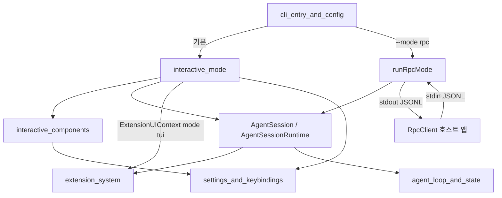
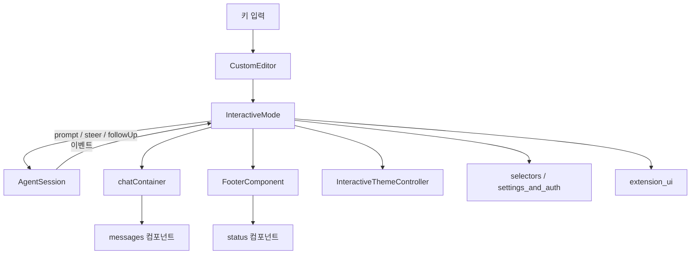
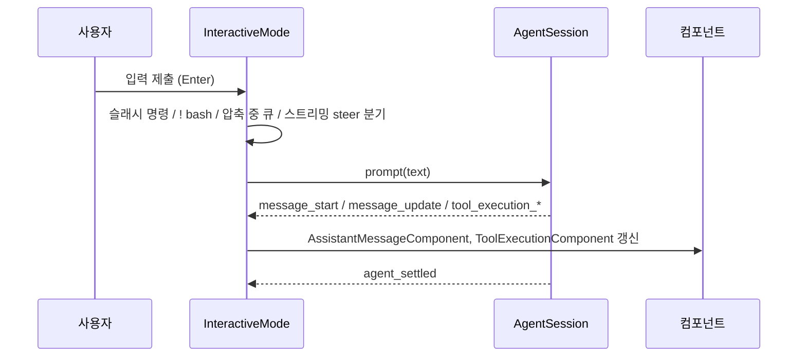
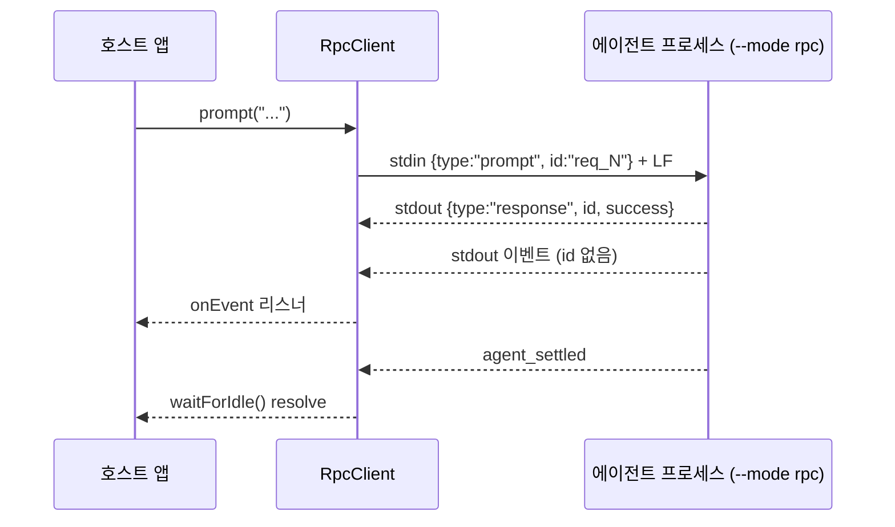

# user_interface_modes 모듈 개요

`user_interface_modes`(`packages/coding-agent/src/modes`)는 coding agent의 **사용자 접점 계층**입니다. 같은 `AgentSession`/`AgentSessionRuntime`을 두 가지 방식으로 노출합니다.

- **사람용 TUI**: 터미널 UI(`interactive_mode`, `interactive_components`)
- **프로그램용 JSONL RPC**: 자식 프로세스 제어(`rpc_mode`)

프롬프트 처리, 모델 호출, 압축, 세션 저장 같은 비즈니스 로직은 이 모듈에 없습니다. 이 모듈은 입출력 표현만 맡습니다. 두 모드는 입력 수집, 이벤트 표시, 확장 UI 처리 방식만 다릅니다.

> 검증 수준: 하위 모듈 문서 3개를 읽고 정리했습니다. 해당 문서는 소스를 직접 읽고 쓴 것이므로 코드 확인 수준입니다. 이 개요 작성 중에 소스를 다시 확인하지는 않았습니다. `rpc-mode.ts` 핸들러 내부와 `interactive_components` 개별 컴포넌트의 세부 동작은 미확인입니다.

## 1. 모듈 구성

| 하위 모듈 | 경로 | 역할 |
|---|---|---|
| [interactive_mode](interactive_mode.md) | `modes/interactive` | TUI 본체(`InteractiveMode`), 레이아웃, 키 입력·슬래시 명령, 이벤트→컴포넌트 매핑, 테마(`Theme`, `InteractiveThemeController`), `FooterDataProvider`, `ModelCatalogRefreshCoordinator` |
| [interactive_components](interactive_components.md) | `modes/interactive/components` | 메시지 렌더링, 상태/푸터, 선택기, 설정/인증 대화상자, 확장 UI, 이스터에그 컴포넌트 |
| [rpc_mode](rpc_mode.md) | `modes/rpc` | 서버 `runRpcMode`, 타입드 클라이언트 `RpcClient`, 프로토콜 타입, 엄격 JSONL 프레이밍 |

`interactive_components`의 하위 모듈은 다음과 같습니다.

- [interactive_components_messages](interactive_components_messages.md)
- [interactive_components_status](interactive_components_status.md)
- [interactive_components_selectors](interactive_components_selectors.md)
- [interactive_components_settings_and_auth](interactive_components_settings_and_auth.md)
- [interactive_components_extension_ui](interactive_components_extension_ui.md)
- [interactive_components_easter_eggs](interactive_components_easter_eggs.md)

## 2. 아키텍처

### 2.1 모드 간 관계

- **공통 기반**: 두 모드 모두 `AgentSession` 이벤트를 구독합니다. 인터랙티브 모드는 이를 컴포넌트로 그리고, RPC 모드는 JSONL로 내보냅니다.
- **진입 분기**: CLI 진입점이 모드를 고릅니다. `--mode rpc`이면 `runRpcMode`로 들어갑니다.

### 2.2 TUI 구조

- `InteractiveMode`는 `runtimeHost.session`을 getter로 읽기 때문에 세션 교체(새 세션, fork, resume) 후에도 참조가 낡지 않습니다.
- `editorContainer`는 선택기, 확장 입력, 로그인 대화상자가 에디터 자리를 임시로 대체하는 슬롯입니다.
- 테마는 `globalThis`에 저장되는 Proxy입니다. node와 jiti처럼 모듈 인스턴스가 여러 개여도 같은 테마를 공유합니다.

### 2.3 대표 실행 흐름

### 2.4 RPC 구조

- **응답 상관**: `type:"response"`이고 `id`가 대기 중인 요청이면 응답으로, 그 외 JSON은 모두 이벤트로 처리합니다.
- **프레이밍**: Node `readline`은 쓰지 않습니다. `readline`은 U+2028/U+2029에서도 줄을 나누는데, 이 문자는 JSON 문자열 안에서 유효합니다. 그래서 `jsonl.ts`는 `\n`에서만 분리합니다.
- **타임아웃**: 요청 응답은 30초(하드코딩)입니다. `waitForIdle`, `collectEvents`, `promptAndWait`는 기본 60초입니다.

## 3. 두 모드 비교

| 항목 | interactive | rpc |
|---|---|---|
| 대상 | 사람(터미널) | 프로그램(호스트 앱) |
| 입력 | `CustomEditor`, 키바인딩, 슬래시 명령 | stdin `RpcCommand` JSONL |
| 출력 | TUI 컴포넌트 | stdout `RpcResponse`/이벤트 JSONL |
| 확장 UI | `ExtensionUIContext`(`mode: "tui"`)로 직접 렌더링 | `extension_ui_request` 이벤트로 전달됨(응답 래퍼는 `RpcClient`에 없음) |
| 완료 신호 | `agent_settled` | `agent_settled` |

## 4. 알아둘 점

- **얇은 UI 계층**: 상태 변경은 `AgentSession`/`SettingsManager`를 거치고, UI는 이벤트로 재구성합니다.
- **키 하드코딩 금지**: 컴포넌트는 `getKeybindings().matches(...)`로 입력을 처리합니다(`tui.select.*`, `app.*`).
- **RpcClient 한계**: `start()`는 100ms 고정 대기라 준비 완료 핸드셰이크가 아닙니다. `stop()`은 대기 요청을 reject하지 않고 비웁니다(코드상 관찰, 실행 미확인).
- **오프라인**: `PI_OFFLINE`이면 카탈로그 갱신, 패키지 업데이트 확인, 설치 텔레메트리를 건너뜁니다.

## 5. 관련 문서

- 세션 로직: [agent_session_core](agent_session_core.md), [session_persistence_and_compaction](session_persistence_and_compaction.md)
- 이벤트 원천: [agent_loop_and_state](agent_loop_and_state.md)
- 설정과 키바인딩: [settings_and_keybindings](settings_and_keybindings.md)
- 모델과 인증: [model_and_auth_management](model_and_auth_management.md)
- 확장: [extension_system](extension_system.md)
- 진입점: [cli_entry_and_config](cli_entry_and_config.md)