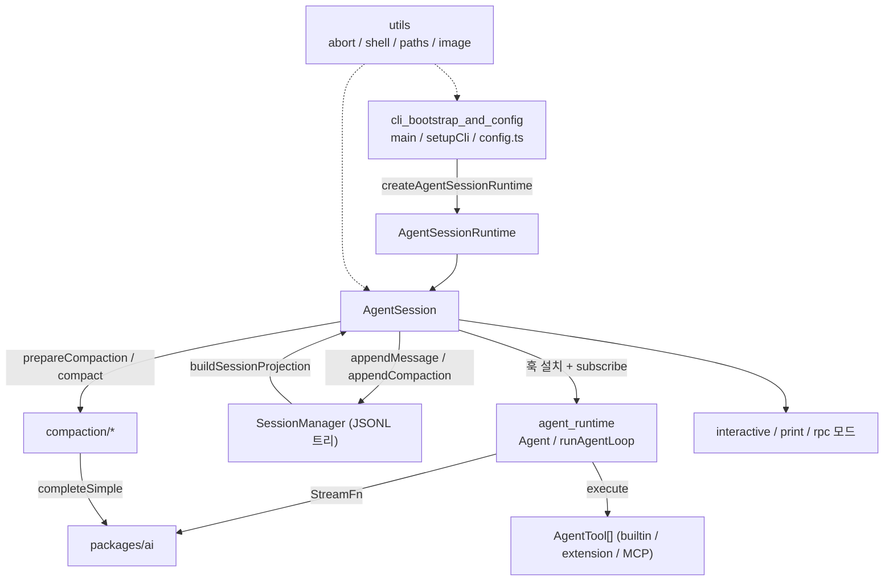
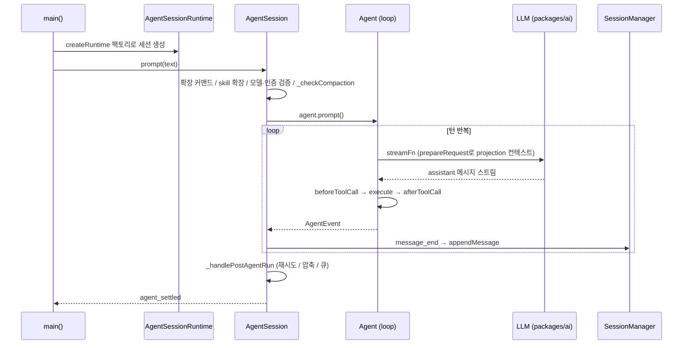

# Agent_Loop_and_Session_Core 모듈 개요

> 검증 수준: 하위 모듈 문서(`agent_runtime.md`, `agent_session_core.md`, `session_persistence_and_compaction.md`, `cli_bootstrap_and_config.md`, `utils.md`)를 읽고 정리했다. 소스를 다시 열어 확인하지는 않았으므로 하위 문서의 검증 수준(코드 확인 / 추론 / 미확인)을 그대로 따른다.

## 1. 목적

이 모듈은 pi 코딩 에이전트의 중심부다. 한 번의 사용자 입력이 LLM 호출, 도구 실행, 세션 저장, 컨텍스트 압축을 거쳐 끝나기까지의 흐름을 맡는다. 3개 레이어로 나뉜다.

| 레이어 | 위치 | 책임 |
|---|---|---|
| 범용 루프 | `packages/agent` | LLM 호출과 도구 실행을 묶는 provider/UI 비의존 에이전트 루프 |
| 세션 코어 | `packages/coding-agent/src/core` | 루프 위에 코딩 에이전트 기능을 얹는다: 모델 선택, 압축, 재시도, 큐, 확장, 세션 교체 |
| 부트스트랩 | `packages/coding-agent/src` | CLI 인자 해석, 환경 준비, 실행 모드 결정, 설치/경로 설정 |

세션 저장은 append-only JSONL 트리로 한다. 압축, 편집, 요약도 모두 새 엔트리를 append하고, 모델에 보낼 컨텍스트는 `buildSessionProjection`이 재구성한다.

## 2. 하위 모듈

| 모듈 | 경로 | 핵심 구성 요소 | 문서 |
|---|---|---|---|
| `agent_runtime` | `packages/agent` | `Agent`, `runAgentLoop`, `runToolCall`, `StreamFn`, `streamProxy` | [agent_runtime.md](agent_runtime.md) |
| `agent_session_core` | `packages/coding-agent/src/core` | `AgentSession`, `AgentSessionRuntime`, `CacheWarmer`, `NestedToolCallRunner`, `buildSystemPrompt` | [agent_session_core.md](agent_session_core.md) |
| `session_persistence_and_compaction` | `packages/coding-agent/src/core` | `SessionManager`, `buildSessionProjection`, `prepareCompaction`, `compact`, `generateBranchSummary` | [session_persistence_and_compaction.md](session_persistence_and_compaction.md) |
| `cli_bootstrap_and_config` | `packages/coding-agent/src` | `main`, `setupCli`, `restoreSandboxEnv`, `config.ts` | [cli_bootstrap_and_config.md](cli_bootstrap_and_config.md) |
| `utils` | `packages/coding-agent/src/utils` | `operationSignal`, `raceWithAbortSignal`, `shell.ts`, `tools-manager.ts`, `resizeImage` | [utils.md](utils.md) |

## 3. 전체 아키텍처

핵심 설계는 다음과 같다.

- `AgentSession`은 `Agent`의 훅을 덮어쓰지 않고 `previous*`로 체이닝해 설치한다. 훅이 `ExtensionRunner`를 실행 시점에 읽으므로 확장 reload 때 재설치하지 않는다.
- 이벤트는 확장, 공개 리스너, `SessionManager` 영속화 순서로 전달된다.
- 모델 컨텍스트는 `prepareRequest`에서 `SessionManager`의 projection으로 재구성한다. 오류 응답 제외, compaction, `context_edit`가 JSONL 이력을 지우지 않고 적용된다.
- `streamFn`은 호스트가 주입하므로 `packages/agent`는 provider 카탈로그에 의존하지 않는다.

## 4. 대표 실행 흐름: 프롬프트 한 번

## 5. 주요 동작 요약

### 에이전트 루프 (`agent_runtime`)
- 루프는 이중 구조다. 안쪽은 도구 호출과 steering을 처리하고, 바깥쪽은 follow-up을 확인한다.
- 도구는 기본적으로 병렬 실행한다. 준비(검증, `beforeToolCall`)는 순차로 하고, 결과 메시지는 assistant 소스 순서로 emit한다.
- `length`로 잘린 응답의 도구 호출은 실행하지 않고 오류 결과로 처리한다.
- `StreamFn`은 throw하지 않고 `stopReason`이 `error`/`aborted`인 메시지를 돌려줘야 한다.
- `runToolCall`은 `NestedToolCallRunner`가 재사용해, 중첩 도구 호출에도 권한 훅이 적용된다.

### 세션 코어 (`agent_session_core`)
- `steer()`는 현재 턴의 도구 실행 뒤, 다음 LLM 호출 전에 전달한다. `followUp()`은 더 할 일이 없을 때 전달한다.
- custom/bash 메시지는 스트리밍 중이면 보류했다가 `turn_end`에 flush한다. provider의 tool call/result 순서 검증을 지키기 위해서다.
- 자동 압축은 context overflow 복구(1회만 재시도), threshold 압축, 요청 직전 압축으로 나뉜다. 재시도 실패분은 `context_edit`로 projection에서만 제외한다.
- `AgentSessionRuntime`은 `new`/`switch`/`fork`/`import` 때 teardown 후 `createRuntime`으로 재생성한다.
- `CacheWarmer`는 prompt cache TTL이 끝나기 전에 `maxTokens: 1` 요청으로 캐시를 유지한다. 예상 절감액이 $0.05 이상일 때만 동작한다.

### 세션 저장과 압축 (`session_persistence_and_compaction`)
- 세션 파일은 `CURRENT_SESSION_VERSION = 3`이다. 대화가 생기기 전에는 파일을 만들지 않는다.
- `buildSessionProjection`이 모델 컨텍스트의 단일 진실 공급원이다. 최신 compaction 하나만 요약을 기여한다.
- 압축은 `shouldCompact`로 트리거되고, `findProjectedCutPoint`로 자를 위치를 정한다. 요약은 `completeSummarization`을 통해서만 호출되며, 잘렸거나 오류인 요약은 저장하지 않는다.
- 트리 이동 시 떠나는 가지는 `generateBranchSummary`가 요약해 `branch_summary` 엔트리로 남긴다.

### 부트스트랩 (`cli_bootstrap_and_config`)
- `main()`은 서브커맨드(auth, package, config, mcp)를 먼저 처리한 뒤 모드를 결정한다.
- 모드는 `rpc` / `json` / `print` / `interactive` 중 하나다. 파이프된 stdin이 있으면 interactive는 `print`로 강등된다.
- 프로젝트 로컬 설정과 리소스는 최종 세션 cwd와 프로젝트 신뢰(`--project-trust` > 캐시 > `ProjectTrustStore`)가 정해진 뒤에만 해석한다.
- `config.ts`는 설치 방식(`bun-binary`/`pnpm`/`yarn`/`bun`/`npm`)을 감지하고 에셋 경로를 해석한다.

### 유틸리티 (`utils`)
- 도메인 로직 없는 횡단 헬퍼다: abort 처리, 경로 정규화, 셸 탐색과 프로세스 트리 종료, 이미지 리사이즈(워커 스레드), fd/rg 설치, 버전 확인.
- 실패하면 `null`/`undefined`로 degrade하는 함수가 많다. 단 셸 탐색은 조치를 안내하는 오류를 던진다.

## 6. 읽는 순서

1. [agent_runtime.md](agent_runtime.md): 루프, 도구 실행, 이벤트 모델
2. [agent_session_core.md](agent_session_core.md): `AgentSession`이 루프를 감싸는 방식, 압축, 재시도, 세션 교체
3. [session_persistence_and_compaction.md](session_persistence_and_compaction.md): JSONL 트리, projection, compaction 알고리즘
4. [cli_bootstrap_and_config.md](cli_bootstrap_and_config.md): 진입점과 모드 결정
5. [utils.md](utils.md): 필요할 때 참조

## 7. 인접 모듈

- 하위 LLM 호출: [LLM_Provider_Abstraction_and_Auth](LLM_Provider_Abstraction_and_Auth.md)
- 모델, 인증, 설정: [Model,_Credential_and_Settings_Management](Model,_Credential_and_Settings_Management.md)
- 도구와 확장: [Extensibility,_Tools_and_Integrations](Extensibility,_Tools_and_Integrations.md)
- 모드 계층: [User-Facing_Modes_(Interactive_and_RPC)](User-Facing_Modes_(Interactive_and_RPC).md)
- 별도 durable 구현: [Durable_Agent_Harness](Durable_Agent_Harness.md). 자체 compaction을 가진다.

## 8. 미확인 사항

하위 문서에서 미확인으로 남은 항목이다.

- `setDefaultStreamFn`을 호출하는 실제 등록 위치(추론만 있음)
- `AgentTool.replay`의 사용처
- `agent-session-services.ts`, `sdk.ts`, `compaction/` 내부 세부, `ResourceLoader` 동작
- `utils`의 `image-resize-core.ts`, `exif-orientation.ts`, `photon.ts`, `child-process.ts`, `management-http.ts` 내부
- `scripts/migrate-sessions.sh`