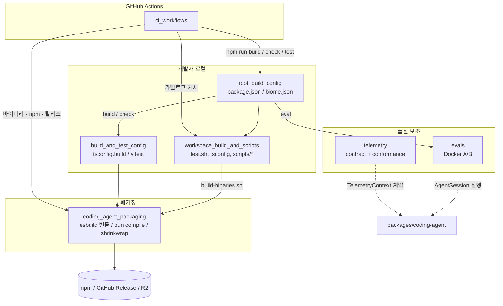
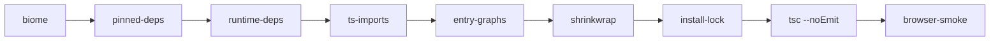
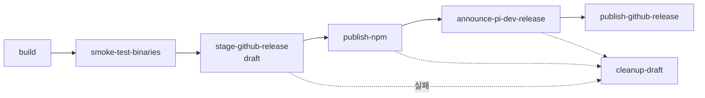

# Build, Release, CI and Quality Infrastructure

## 1. 목적

이 모듈은 `pi` 모노레포를 **빌드, 검사, 테스트, 배포**하고 **기여자와 이슈를 운영**하는 바깥 껍질이다. 제품 로직(`packages/ai`, `packages/agent`, `packages/coding-agent`)은 포함하지 않고, 그 패키지들이 재현 가능하게 만들어지고 안전하게 배포되도록 만든다.

| 영역 | 하위 모듈 | 역할 |
|---|---|---|
| CI/CD 자동화 | `ci_workflows` | `.github/workflows` 워크플로 10개: 품질 게이트, 릴리스, 기여자·이슈 운영 |
| 루트 빌드·검사 | `root_build_config` | `package.json`의 workspaces, 순차 `build` 체인, `check` 파이프라인, `biome.json` |
| 패키징 | `coding_agent_packaging` | `pi-coding-agent`의 npm 번들, Bun 단일 바이너리, shrinkwrap, install-lock |
| 패키지 빌드·테스트 설정 | `build_and_test_config` | `tsconfig.build.json`, `tsconfig.examples.json`, `vitest.config.ts` |
| 스크립트·공통 설정 | `workspace_build_and_scripts` | 공통 tsconfig, `test.sh` 격리, 바이너리·소스 아카이브 스크립트, 모델 카탈로그 프로토콜 |
| 품질 평가 | `evals` | 문서가 에이전트 성능을 높이는지 보는 Docker A/B 평가 하네스 |
| 관측 계약 | `telemetry` | 벤더 중립 텔레메트리 계약, no-op/인메모리 구현, conformance 스위트 |

> 검증 수준: 하위 문서를 기준으로 정리했다. 개별 항목의 검증 수준(코드 확인/추론/미확인)은 각 하위 문서에 있다.

## 2. 전체 아키텍처

## 3. 핵심 흐름

### 3.1 품질 게이트 (로컬과 CI 공통)

`ci.yml`은 `npm ci --ignore-scripts`, `npm run build`, `npm run check`, `npm test`를 실행하고, 별도 잡 `mcp-conformance`를 돌린다. `npm run check`는 다음을 순차 실행한다(`&&`로 연결되어 하나라도 실패하면 중단).

- 빌드 순서는 하드코딩된 체인이다: `chord → tui → telemetry → codemode → mcp → ai → durable → agent → protocol → client → server → coding-agent`. 새 패키지는 이 체인에 직접 추가해야 한다.
- 타입 검사(`tsc --noEmit`)와 vitest는 `paths`/alias로 **소스를 직접** 참조한다. 반면 `tsconfig.build.json`은 의존 패키지의 **빌드된 `.d.ts`**를 참조한다.
- `test.sh`는 `env -i`와 임시 HOME으로 API 키 없이 격리 실행한다. vitest는 기본 `PI_OFFLINE=1`이다.

### 3.2 릴리스 파이프라인 (`build-binaries.yml`)

- `v*` 태그가 트리거다. 6개 플랫폼(darwin, linux, windows × arm64, x64) 바이너리를 만든다.
- 설계 원칙은 **공개 릴리스를 가장 마지막에 하는 것**이다. draft를 먼저 만들고, 실패하면 정리한다.
- 모델 카탈로그는 `publish-model-catalog.yml`이 R2로 게시한다. 평일 Europe/Vienna 10:00–15:00 창 안에서만 발행한다. 프로토콜은 `scripts/model-catalog-protocol.ts`에 있고, pi.dev와 바이트 단위로 동일한 사본을 쓴다.

### 3.3 패키징 (`coding_agent_packaging`)

- `build`는 `tsc`로 `dist/`를 만든 뒤 esbuild 번들(`dist/bundle/cli.js`, `rpc-entry.js`)을 만든다.
- `build:binary`는 `bun build --compile`로 `dist/pi` 단일 바이너리를 만들고, 리소스를 `copy-binary-assets`로 옆에 복사한다.
- 의존성은 exact 버전으로 고정한다. `npm-shrinkwrap.json`과 `install-lock/`은 생성물이며 `--check`로 검증한다.
- 실험적 `src/client`, `src/experimental`, `src/cli/experimental`은 npm 배포물에서 제외한다.

### 3.4 기여자·이슈 운영

`issue-gate.yml`과 `pr-gate.yml`은 `.github/APPROVED_CONTRIBUTORS`에 없는 신규 기여자의 이슈·PR을 자동으로 닫는다. 메인테이너가 `lgtmi`/`lgtm` 댓글을 달면 `approve-contributor.yml`이 승인 목록을 갱신한다. `issue-analysis.yml`은 CI 안에서 pi CLI를 실행해 이슈를 분석한다.

### 3.5 evals와 telemetry

- `evals`는 같은 모델·과제를 `without_docs`/`with_docs` 두 Docker 이미지로 실행하고 쌍으로 비교한다. 샌드박스는 비특권 UID, 읽기 전용 파일시스템, 자격증명 은닉으로 격리한다.
- `telemetry`는 콜백 기반 span 계약, 스키마 타입 추론(`createTypedSpanStarter`), `NOOP_TELEMETRY_CONTEXT`, `InMemoryTelemetryContext`를 제공한다. 외부 어댑터는 `createTelemetryAdapterConformance`로 검증한다. 소비 패키지가 실제로 이를 import하는지는 하위 문서에서 미확인이다.

## 4. 공통 설계 특징

- **supply chain 보안**: 모든 `uses:`를 커밋 SHA로 고정하고, `npm ci --ignore-scripts`를 쓴다. 직접 의존성은 exact 버전으로 핀하며, lifecycle script가 있는 의존성은 허용 목록에 명시한다.
- **최소 권한과 환경 분리**: 릴리스 워크플로는 `permissions: {}`에서 시작하고 잡마다 권한을 부여한다. 민감 작업은 `npm-publish`, `pi-model-upload`, `pi-analyze` 환경으로 나눈다.
- **재현성**: 소스 아카이브는 결정적(`--mtime`, `gzip -n`)으로 만들고, 배포 전 자체 검증을 통과해야 최종 경로로 이동한다.
- **세 가지 실행 환경**: 소스 체크아웃, npm 설치, Bun 바이너리를 모두 지원한다. 에셋은 `src/config.ts` 헬퍼로만 해석한다.

## 5. 알려진 주의점 (하위 문서 근거)

- `pi-test.sh`는 `experimental/cli.ts`를, `pi-test.ps1`은 `cli.ts`를 실행한다. 진입점이 서로 다르다.
- `tsconfig.json`에 모듈 트리에 없는 `pi-agent-old` 경로가 남아 있다(추론: 잔여 설정).
- `migrate-sessions.sh`는 `set -e`와 `((failed++))` 조합 때문에 중단될 수 있다(추론, 실행 미확인).
- `issue-analysis.yml` 후반부(gist 업로드, `PI_AUTH_JSON` 갱신)는 입력이 잘려 있어 미확인이다.

## 6. 핵심 컴포넌트 문서

| 하위 모듈 | 문서 | 먼저 볼 내용 |
|---|---|---|
| `ci_workflows` | [ci_workflows.md](ci_workflows.md) | 워크플로 요약표, 릴리스 잡 순서, 기여자 승인 시퀀스 |
| `root_build_config` | [root_build_config.md](root_build_config.md) | `build` 순서, `check` 파이프라인, 모델 카탈로그 스크립트, `biome.json` |
| `coding_agent_packaging` | [coding_agent_packaging.md](coding_agent_packaging.md) | exports/files 정책, esbuild 번들 플러그인, shrinkwrap/install-lock |
| `build_and_test_config` | [build_and_test_config.md](build_and_test_config.md) | 빌드(dist 기준)와 테스트(src 기준) 설정 차이, `PI_OFFLINE` |
| `workspace_build_and_scripts` | [workspace_build_and_scripts.md](workspace_build_and_scripts.md) | `test.sh` 격리, `build-binaries.sh`, 모델 카탈로그 프로토콜 |
| `evals` | [evals.md](evals.md) | A/B 하네스 구조, 격리 설계, 보고서 플래그 |
| `telemetry` | [telemetry.md](telemetry.md) | span 계약, 스키마 타입, conformance 스위트 |

## 7. 관련 모듈

- [LLM_Provider_Abstraction_and_Auth](LLM_Provider_Abstraction_and_Auth.md): `packages/ai`의 `generate-models`, `hydrate-model-data`, 모델 카탈로그 생성. 이 모듈의 루트 스크립트와 워크플로가 호출한다.
- [Agent_Loop_and_Session_Core](Agent_Loop_and_Session_Core.md): `packages/agent`와 `packages/coding-agent`. 빌드 체인에서 `agent`는 `ai` 이후, `coding-agent`는 마지막이다. `evals`와 `issue-analysis.yml`이 이를 실행한다.
- [Extensibility,_Tools_and_Integrations](Extensibility,_Tools_and_Integrations.md): `mcp-conformance`가 검증하는 `packages/mcp`와 `.pi/extensions`.
- [Terminal_UI_Framework](Terminal_UI_Framework.md): 바이너리에 동봉되는 `packages/tui/native` prebuilds.