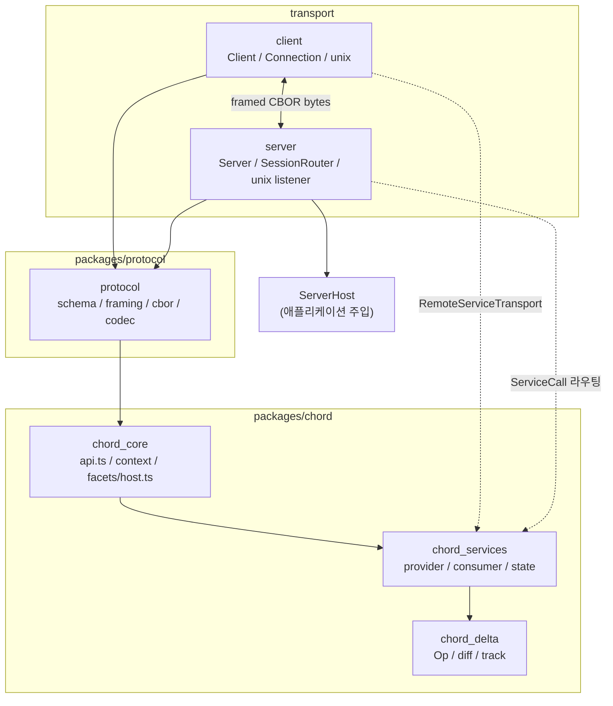
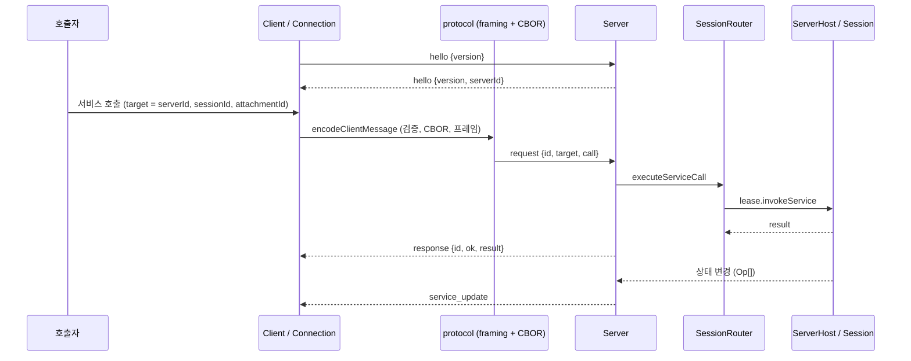

# Distributed_Runtime_Foundation_(Chord,_Protocol,_Transport) 개요

> 검증 수준: 아래 내용은 하위 모듈 문서(`chord_core.md`, `chord_delta.md`, `chord_services.md`, `protocol.md`, `server.md`, `client.md`)를 종합한 것이다. 각 문서의 검증 수준(코드 확인 / 추론 / 미확인)을 그대로 따른다. 이 개요 작성 시 원본 소스를 새로 읽지는 않았다.

## 1. 목적

이 모듈은 pi의 **원격 세션과 서비스 호출을 위한 분산 런타임 기반**이다. 세 계층으로 이루어진다.

| 계층 | 패키지 | 책임 |
|---|---|---|
| Chord | `packages/chord` (`@earendil-works/chord`) | 서비스, 복제 상태(replicated state), RPC, 플러그인(Facet)을 합성하는 런타임 |
| Protocol | `packages/protocol` (`@earendil-works/pi-protocol`) | 전송 중립 CBOR 와이어 포맷: 스키마, 길이 접두 프레이밍, 엄격한 디코딩 |
| Transport | `packages/server`, `packages/client` | Unix 소켓 등 바이트 스트림 위의 서버 라우팅과 클라이언트 연결 |

핵심 아이디어는 다음과 같다.

- **Facet**이 `setup(env)`에서 서비스 의존 관계(`provide`, `use`, `observe`)를 선언하고, 호스트가 이를 검증해 위상 순서로 활성화한다.
- 서비스 메서드는 RPC로, 상태 멤버는 **snapshot + delta 스트림**으로 원격에 복제된다.
- 프로토콜은 `call`, `result`, `update` 페이로드를 불투명 JSON으로 취급한다. 서비스 의미는 Chord가, 바이트 운반은 Protocol과 Transport가 맡는다.
- 서버는 세션의 실체(에이전트 하네스)를 모른다. 애플리케이션이 주입하는 `ServerHost`로만 세션을 해석하고 연다.

## 2. 전체 아키텍처

의존 방향은 `delta → services → core` 쪽이 가장 아래이고, `protocol`은 `chord`의 `JsonValue`, `isJsonValue`를 사용하며, `client`와 `server`는 `chord`와 `protocol`만 의존한다. `chord_delta`는 하니스의 다른 부분에 의존하지 않는다(코드 확인).

## 3. 대표 실행 흐름: 세션 서비스 호출

1. 클라이언트는 `hello`로 버전과 `serverId`를 협상한다. 첫 프레임이 `hello`가 아니거나 버전이 다르면 서버가 `hello_error`로 닫는다.
2. 서버는 `target`에 `sessionId`가 없으면 서버 서비스로, 있으면 `SessionRouter`를 거쳐 attachment에 펜싱된 세션 서비스로 보낸다.
3. 상태 변경은 `chord_delta`의 Op 배치로 계산되어 `service_update`로 전달되고, 소비 측 `ReplicatedStateReplica`가 적용한다.

## 4. 하위 모듈 요약

### chord_core — 공개 API, Context, Facet 호스트
`createFacetHost`, `defineService`, `defineFacet`, `replicatedState`를 제공한다. 불변 연결 리스트 기반 `Context`(취소와 값 전파)와 `FacetKernel`을 포함한다. 호스트는 Facet 집합을 원자적으로 활성화하고, requires/provides shape가 같은 교체(`reload`)를 허용한다. 원격 서비스는 같은 프로세스 안에서도 loopback 전송을 거쳐 로컬과 원격의 호출 의미를 맞춘다. 상세: [chord_core](chord_core.md)

### chord_delta — 불변 JSON 리비전과 델타
Op 어휘(`r`, `s`, `d`, `a`, `t`, `p`, `m`), 와이어 압축(경로 인터닝과 arity 생략)을 정의한다. `diffRevisions`로 두 리비전의 차이를 계산하고, `track`으로 Proxy 오버레이 기반 변경을 추적한다. 커밋은 prepare, adopt 2단계로 나뉘어 저장소 쓰기가 실패해도 권위 상태가 손상되지 않는다. `__proto__` 등 예약 경로 거부와 상한 초과 시 전체 스냅샷 폴백을 갖췄다. 상세: [chord_delta](chord_delta.md)

### chord_services — 원격 서비스와 복제 상태
`RemoteServiceProvider`(구현 등록, 호출 처리, update 방송)와 `RemoteServiceBindingImpl`(로컬 프록시, 구독 수명)이 중심이다. `singleton`과 `keyed`(key + generation) 두 모드, allowlist 카탈로그, 8종 오류 코드를 가진다. 구독자 버퍼가 100개에 도달하면 snapshot `reset`으로 대체해 backpressure를 처리한다. `ReplicatedStatePublisher`와 `ReplicatedStateReplica`는 sequence가 정확히 +1씩 증가해야 한다. 상세: [chord_services](chord_services.md)

### protocol — 와이어 포맷
`PROTOCOL_VERSION = 8`, TypeBox 스키마(`ClientMessageSchema`, `ServerMessageSchema`), `[uint32 길이][CBOR]` 프레이밍, RFC 8949의 엄격한 부분집합 CBOR 디코더를 제공한다. 길이는 선언값만으로 먼저 거부하고 깊이와 컨테이너 한도를 둔다. 송신 전에도 검증하며, 디코더는 한 번 실패하면 `failed`로 고정된다. 상세: [protocol](protocol.md)

### server — 연결 수락과 세션 라우팅
`Server`가 핸드셰이크, 요청 디스패치, 취소, 종료를 맡는다. `SessionRouter`는 클라이언트별 직렬화 큐로 attach/detach와 서비스 호출을 라우팅한다. 연결 하나는 동시에 최대 하나의 세션에 attach되며 서버가 `attachmentId`를 발급한다. Unix 리스너는 stale 소켓 정리와 `dev/ino` 확인으로 경쟁과 탈취를 막는다. 테스트 유틸(`./testing`)을 함께 제공한다. 상세: [server](server.md)

### client — 전송 중립 클라이언트
`Client`(요청 ID 관리, 응답 매칭, `AbortSignal`→`cancel`, 구독)와 `Connection`(`disconnected → connecting → connected`)으로 구성된다. 구독은 snapshot 이전 update를 버퍼링하고 `start()` 이후 순서대로 전달한다. 전송은 `ByteTransportFactory`로 주입되며, `@earendil-works/pi-client/unix`가 Unix 소켓 전송과 `discoverUnixServers`를 제공한다. 상세: [client](client.md)

## 5. 설계 포인트

| 관심사 | 처리 방식 |
|---|---|
| 전송 중립성 | 프로토콜은 바이트만 알고, 서버와 클라이언트는 `ByteConnection`과 `ByteTransportFactory`로 전송을 주입받는다 |
| 신뢰할 수 없는 입력 | 프레임 길이, CBOR 깊이와 컨테이너 한도, 예약 경로(`RESERVED_SEGMENTS`), 스키마 검증으로 방어 |
| 일관성 | sequence +1 검증, 스냅샷 기반 복구(`isBase`), 상태 codec의 이벤트 순서 보존 |
| 부분 실패 | 정리 경로가 오류를 수집해 `AggregateError`로 보고. prepare/adopt 분리로 권위 상태 보호 |
| 오래된 콜백 방지 | 연결 `id`, 바인딩 revision 카운터, `generation` 비교 |
| 내부 오류 은닉 | `toProtocolError`가 알 수 없는 오류를 `internal_error`로 가리고 원본은 `onError`로만 보고 |

## 6. 외부와의 관계

- `ServerHost` 구현(coordinator, session worker)과 `RoutedServiceBinding` 등 실제 사용처는 [Experimental_Server_and_Client_Runtime](Experimental_Server_and_Client_Runtime.md)에 있다(추론).
- 문서 커밋과 저장 시 델타를 소비하는 쪽은 [Durable_Agent_Harness](Durable_Agent_Harness.md)로 추정된다(추론).
- 같은 프로토콜 바이트를 WebSocket 릴레이로 운반하는 `experimental_radius_relay`는 이 모듈을 변경하지 않고 붙는다.
- 빌드 구성(`tsc -p tsconfig.build.json`, `source` export 조건, Node `>=22.19.0`)은 [Build,_Release,_CI_and_Quality_Infrastructure](Build,_Release,_CI_and_Quality_Infrastructure.md)를 참고한다.

## 7. 핵심 컴포넌트 문서

| 컴포넌트 | 경로 | 문서 |
|---|---|---|
| `chord_core` | `packages/chord` | [chord_core.md](chord_core.md) |
| `chord_delta` | `packages/chord/src/delta` | [chord_delta.md](chord_delta.md) |
| `chord_services` | `packages/chord/src/services` | [chord_services.md](chord_services.md) |
| `protocol` | `packages/protocol` | [protocol.md](protocol.md) |
| `server` | `packages/server` | [server.md](server.md) |
| `client` | `packages/client` | [client.md](client.md) |

## 8. 미확인 영역

- `chord_core`의 `types.ts`, `loader.ts`, `loopback.ts`와 `chord_services`의 `wire.ts`, `state-internals.ts`는 직접 확인하지 못했다(미확인).
- `protocol`의 `cbor/encoder.ts` 내부 동작, `client`의 `errors.ts`, `transport.ts`는 사용 방식에서 추론했다(추론).
- `RemoteServiceSource`가 `client`와 `server`를 호스트에 잇는 구체적인 결합 방식은 위 문서들에서 확인되지 않았다(추론).