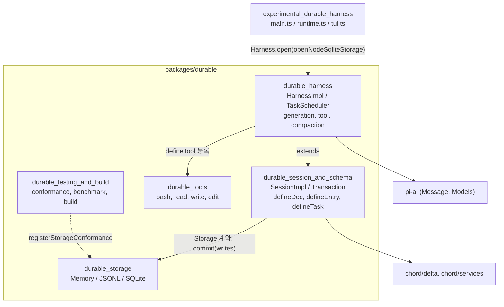
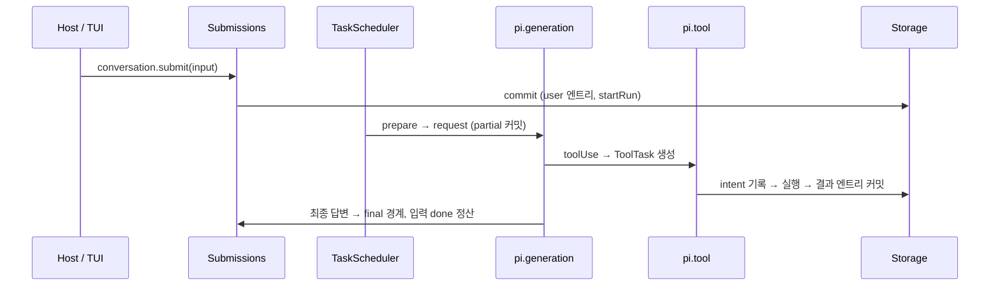
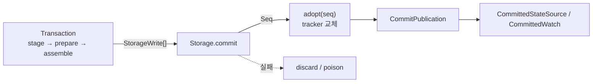

# Durable_Agent_Harness 개요

`Durable_Agent_Harness`는 `packages/durable`(`@earendil-works/pi-durable`)과 `packages/coding-agent/src/experimental`의 진입점으로 이루어진 **내구성(durable) 에이전트 하네스**다. 대화·제출·태스크의 모든 상태를 트랜잭션 로그(Session)에 커밋된 상태로 저장한다. 그래서 프로세스가 중단돼도 `--continue`나 `harness.resume()`으로 중단된 LLM 에이전트 루프를 이어갈 수 있다.

검증 수준: 아래 내용은 하위 문서가 소스 코드를 직접 읽고 확인한 결과(코드 확인)를 요약한 것이다. 하위 문서에 "미확인"으로 표시된 부분(`agent.ts`, `context.ts`, `usage.ts`, `ExecutionEnv` 내부, `vacation.ts` 등)은 이 개요에서도 미확인이다.

## 1. 목적

- **재개 가능한 에이전트 루프**: 부분 응답, 도구 진행, compaction 상태까지 `pi.live` 문서에 커밋한다. 중단 후에는 `running` 태스크를 `pending`으로 되돌려 이어서 실행한다.
- **단일 mutation line**: 모든 쓰기는 직렬화된 커밋 콜백 하나를 거친다. 관찰자(뷰, 이벤트, 태스크 그래프)는 커밋된 상태만 본다.
- **교체 가능한 저장소**: 하나의 `Storage` 계약을 Memory, JSONL, SQLite 세 구현이 따른다.
- **환경 독립적인 도구**: `bash`, `read`, `write`, `edit` 도구는 `ExecutionEnv`로만 I/O를 수행한다.
- **실험적 TUI 진입점**: SQLite 세션 위에 alt-screen TUI를 올린다.

## 2. 아키텍처

계층 의존 방향은 `experimental → harness → session → storage`다. 도구는 harness가 레지스트리를 통해 호출한다.

### 대표 실행 흐름

### 커밋 원자성

Storage가 성공한 뒤에만 메모리 상태(tracker)를 교체한다. 승인 이후 채택에 실패하거나 파일 쓰기에 실패하면 세션이나 저장소를 오염(poison)시켜 재오픈을 강제한다. 메모리와 디스크가 어긋나는 것을 막기 위해서다.

## 3. 하위 모듈과 핵심 컴포넌트 문서

| 모듈 | 경로 | 핵심 내용 | 문서 |
|---|---|---|---|
| durable_session_and_schema | `packages/durable/src` | 데이터 모델(Conversation/Entry/Submission/Task/Document), `Session` 커널, `Transaction`의 3단계 정산, 커밋 후 관측 | [durable_session_and_schema](durable_session_and_schema.md) |
| durable_harness | `packages/durable/src/harness` | `HarnessImpl`, `TaskScheduler`, `pi.generation`/`pi.tool`/`pi.compaction` 태스크, inbox 경계, 레지스트리, 뷰와 이벤트 | [durable_harness](durable_harness.md) |
| durable_storage | `packages/durable/src/storage` | `MemoryStorage`(참조 구현), `JsonlStorage`(마커+사이드카, 크래시 복구), `SqliteStorage`(WAL, `BEGIN IMMEDIATE`) | [durable_storage](durable_storage.md) |
| durable_tools | `packages/durable/src/tools` | `createBashTool`, `createReadTool`, `createWriteTool`, `createEditTool`, 퍼지 매칭 diff, `withFileMutationQueue`, 출력 절단 | [durable_tools](durable_tools.md) |
| durable_testing_and_build | `packages/durable` | `registerStorageConformance`, 스토리지 벤치마크, `package.json`/`tsconfig.build.json`/`vitest.config.ts` | [durable_testing_and_build](durable_testing_and_build.md) |
| experimental_durable_harness | `packages/coding-agent/src/experimental` | `openDurable`, `DurableController`, `DurableTui`, `Subagent` 확장, durable와 vacation 변형 | [experimental_durable_harness](experimental_durable_harness.md) |

## 4. 핵심 설계 포인트

| 문제 | 해결 | 위치 |
|---|---|---|
| 동시 변경 충돌 | 하나의 직렬화된 mutation line | `durable_session_and_schema` |
| 크래시 후 재개 | 모든 상태를 커밋, 체크포인트 phase 단위 실행, 시작 시 `running`을 `pending`으로 복원 | `durable_harness` |
| 도구 재실행 안전성 | intent(`execute`/`replay`)를 기록하고, 저장 정책과 현재 정책이 모두 `safe`일 때만 재실행 | `durable_harness` (`tool.ts`) |
| 느린 관찰자 | `MAX_PENDING_WATCH_FRAMES = 100` 초과 시 루트 교체 프레임으로 압축 | `durable_session_and_schema` |
| 저장소 간 계약 일치 | 공통 적합성 스위트와 reopen 변형 케이스 | `durable_testing_and_build` |
| 스키마 진화 | `version` + `migrate`, 낮은 버전 문서는 materialize 시 변환 | `durable_session_and_schema` |
| 큰 도구 출력 | head/tail 절단, 파일 spill, 진단 메시지 | `durable_tools`, `durable_harness` (`output.ts`) |

## 5. 알아둘 점

- `MemoryStorage`와 `SqliteStorage`에 문서 검증 로직(`checkDocumentActions`, `checkGlobalIds`)이 중복돼 있다. 규칙을 바꾸면 두 구현과 JSONL(Memory에 위임)을 함께 확인해야 한다.
- `JsonlStorage`는 시작 시 로그 전체를 재생하므로 시작 비용이 로그 길이에 비례한다. 대용량 세션에는 SQLite가 맞다(추론).
- `experimental/durable`과 `experimental/vacation`은 거의 같은 코드의 복제본이다. 차이는 세션 루트, 레지스트리, 실행 환경 정리에 한정된다.
- `withFileMutationQueue`는 같은 프로세스 안의 `edit`/`write`만 직렬화한다. `bash`나 다른 프로세스에 대한 잠금은 없다.

## 6. 관련 모듈

- `chord_delta`, `chord_services` (`Distributed_Runtime_Foundation_(Chord,_Protocol,_Transport)`): 문서 변경 추적과 복제 상태
- `LLM_Provider_Abstraction_and_Auth` (`packages/ai`): `Message`, `Models`
- `Terminal_UI_Framework`, `Model,_Credential_and_Settings_Management`: 실험적 TUI가 사용
- `builtin_tools` (`Extensibility,_Tools_and_Integrations`): coding-agent 쪽의 유사한 `edit`/`read` 도구