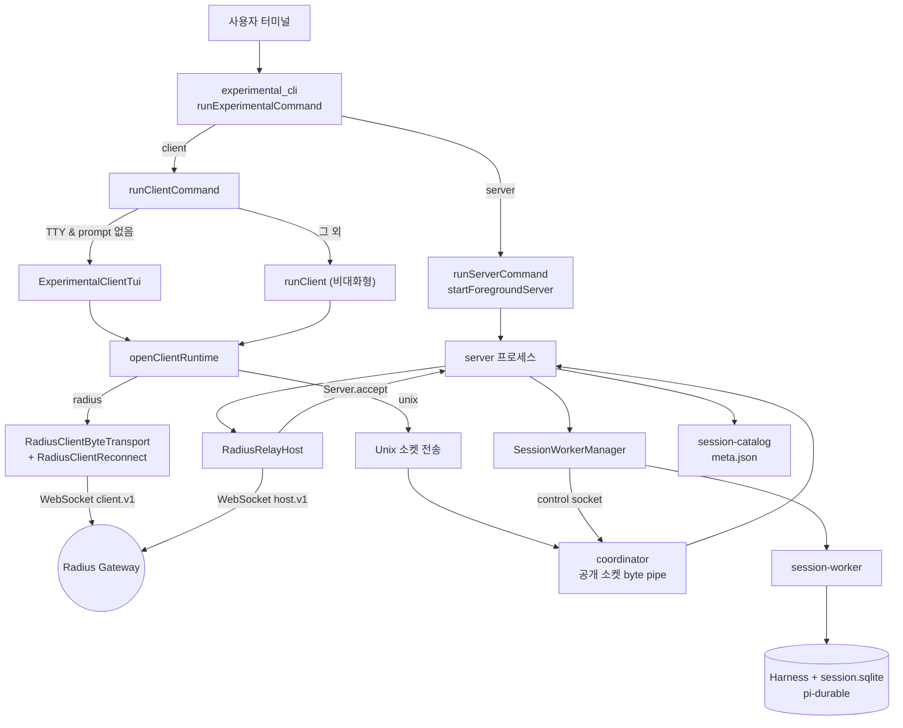
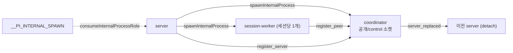
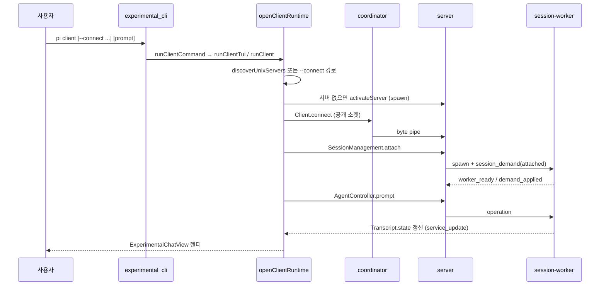

# Experimental_Server_and_Client_Runtime 개요

## 1. 목적

`packages/coding-agent` 안에 들어 있는 **개발 전용(experimental) 서버/클라이언트 런타임**이다. `pi` CLI의 `server` / `client` 서브커맨드를 제공한다. 이 서브커맨드는 `areExperimentalFeaturesEnabled()`가 참일 때만 동작하며, 배포 엔트리포인트는 이 모듈을 import하면 안 된다.

- 하나의 논리 서버(`ServerId`)를 **coordinator / server / session-worker** 세 종류의 OS 프로세스로 나눠 운영한다. 서버 본체를 교체해도 세션 worker는 유지된다.
- 세션 하나당 worker 프로세스 하나가 `@earendil-works/pi-durable`의 `Harness`와 SQLite 저장소(`session.sqlite`)를 단독 소유한다.
- 클라이언트는 도메인 로직을 갖지 않는다. 서버가 소유한 서비스(`SessionDirectory`, `AgentController`, `Transcript` 등)를 chord 원격 서비스로 사용하고, 복제된 `ConversationView`를 전체 화면 TUI로 그리기만 한다.
- 전송 방식은 로컬 Unix 소켓(`unix:///abs/path`)과 Radius 게이트웨이 WebSocket 릴레이(`radius://<serverId>`) 두 가지다. 후자는 원격 클라이언트용이다.

> 검증 수준: 하위 문서 4개를 읽고 정리했다. 서술은 하위 문서가 소스를 읽고 확인한 내용에 근거한다. 이 개요 작성 과정에서 소스를 다시 확인하지는 않았다(문서 기반). Radius 게이트웨이 서버 구현과 외부 패키지(`chord`, `pi-client`, `pi-durable`) 내부 동작은 **미확인**이다.

## 2. 하위 모듈 구성

| 모듈 | 경로 | 책임 | 상세 문서 |
|---|---|---|---|
| `experimental_cli` | `packages/coding-agent/src/cli/experimental`, `src/experimental/commands.ts`, `process.ts` | 타입 안전 `Command` 파서, `server`/`client` 옵션 검증, `runServer`/`runClient` 디스패치, 내부 프로세스 role(`__PI_INTERNAL_SPAWN`) 관리 | [experimental_cli.md](experimental_cli.md) |
| `experimental_server_runtime` | `packages/coding-agent/src/experimental` | coordinator·server·session-worker 프로세스, 세션 카탈로그, `SessionWorkerManager`, 플러그인 선택, `source-resolver.ts` | [experimental_server_runtime.md](experimental_server_runtime.md) |
| `experimental_radius_relay` | `packages/coding-agent/src/experimental` (`radius-auth.ts`, `radius-relay.ts`) | `RadiusRelayHost`, `RadiusClientByteTransport`, `RadiusClientReconnect`, `RadiusRelayAuthResolver`, `OrderedWebSocketWriter` | [experimental_radius_relay.md](experimental_radius_relay.md) |
| `experimental_services_and_client` | `packages/coding-agent/src/experimental` | `openClientRuntime`, 서비스 소스/계약, `ExperimentalClientTui`, `ExperimentalChatView`, 슬래시 명령 | [experimental_services_and_client.md](experimental_services_and_client.md) |

## 3. 전체 아키텍처

그림 읽는 순서: CLI에서 시작해 클라이언트 경로(`openClientRuntime` → 전송 → coordinator → server)를 따라간다. 그 다음 server가 worker를 관리하는 아래쪽과, Radius를 거치는 원격 경로를 본다.

### 프로세스 모델

- coordinator는 payload를 해석하지 않고 Node 내장 모듈만 사용하는 전송 shim이다. 공개 소켓 연결을 현재 server로 프록시하고 server와 worker 사이 메시지를 라우팅한다.
- 새 server가 `register_server`를 보내면 이전 server는 `server_replaced`를 받고 worker를 종료하지 않은 채 `detach()`한다. 새 server는 `discover(peerIds)`로 worker를 다시 찾는다.
- worker는 활성 demand, Harness의 살아 있는 task, 진행 중 요청이 없으면 자기 종료한다(`WorkerLifecycle`). 자동 활성화된 server는 `ServerLifetime`에 따라 연결과 worker가 모두 0이면 retire한다.

## 4. 대표 흐름: `client` 실행에서 세션 작업까지

Radius 경로는 Unix 소켓 대신 게이트웨이를 통한다. 서버 측 `RadiusRelayHost`가 `connection_open`마다 `Server.accept`로 연결을 넘기고, 클라이언트 측 `RadiusClientReconnect`가 끊김 시 `reconnect()` 후 `reattach(sessionId)`를 수행한다.

## 5. 핵심 설계 포인트

- **안정 엔드포인트 + 교체 가능한 서버**: 클라이언트는 항상 같은 공개 소켓 경로로 접속한다. 서버 코드를 갈아 끼워도 세션 worker는 이어진다.
- **보안**: 서버 디렉터리는 `0700`과 소유자 UID 검사를 강제하고 소켓은 `0600`이다. worker 이벤트는 `peerId`·`token`·`sessionKey` 일치로 검증한다. 클라이언트 프레젠테이션 플러그인은 서버가 보낸 artifact로만 로드한다.
- **동시성 제어**: `launcher-*`, `activation-*`, 세션 디렉터리 lock(`proper-lockfile`)으로 동시 기동을 직렬화한다.
- **세대(revision) 기반 상태 관리**: `SessionServiceSourceImpl`은 `#attachmentRevision`으로 오래된 전이 결과를 버린다. 서버는 `serverConnectionId`로 세대를 구분한다.
- **Radius 인증 재해석**: `RadiusRelayAuthResolver`가 토큰을 캐시하지 않고 연결 시도마다 다시 해석한다. 파일 토큰 교체나 OAuth 갱신이 재시작 없이 반영된다. `PI_OFFLINE`이면 릴레이는 비활성이다.
- **정리 규약**: 종료 경로는 모두 `Promise.allSettled`로 처리하고, 오류가 여러 개면 `AggregateError`로 묶는다.

## 6. 외부 모듈과의 관계

| 대상 | 사용처 |
|---|---|
| Distributed_Runtime_Foundation (`chord`, `protocol`, `server`, `client`) | 서비스/facet 런타임, `isServerId`, `createUnixServer`, `Server.accept`, `Client` |
| Durable_Agent_Harness (`pi-durable`) | worker가 `Harness`와 SQLite 저장소를 소유. `ConversationView` 제공 |
| Model,_Credential_and_Settings_Management | `ModelRuntime`, `SettingsManager`, `getAuth("radius")` |
| Terminal_UI_Framework, User-Facing_Modes | TUI 컴포넌트, 메시지 컴포넌트, 테마 |
| LLM_Provider_Abstraction_and_Auth (`packages/ai`) | `normalizeRadiusGatewayUrl` 등 Radius 설정과 인증 |

## 7. 핵심 구성 요소 문서 참조

- [experimental_cli](experimental_cli.md): `Command` 파서, `parseTransportAddress`, `runExperimentalCommand`, `process.ts`의 내부 프로세스 규약
- [experimental_server_runtime](experimental_server_runtime.md): `startServer`, `ServerLifetime`, `coordinator.ts`, `SessionWorkerManager`, `WorkerLifecycle`, `source-resolver.ts`, 서버 교체 흐름
- [experimental_radius_relay](experimental_radius_relay.md): 와이어 프로토콜(`host.v1` / `client.v1`, 18바이트 데이터 프레임 헤더), `RadiusRelayHost` 상태 전이, `OrderedWebSocketWriter`
- [experimental_services_and_client](experimental_services_and_client.md): `openClientRuntime`, `ServerServiceSource` / `SessionServiceSource`, `AgentController` 계약, `ExperimentalClientTui`, `SlashCommandRegistry`

## 8. 알려진 한계와 주의점

- 실험 커맨드는 기존 CLI 옵션과 아직 호환되지 않는다(`unsupportedOptions`가 오류를 낸다).
- `assertAccess() {}`와 `onError() {}`가 빈 구현인 호출부가 있어 서비스 오류가 조용히 무시될 수 있다(하위 문서 기준).
- TUI 코드는 `process.cwd()`를 도구 렌더 기준으로 쓴다. 원격 서버의 cwd와 다를 수 있다(추론).