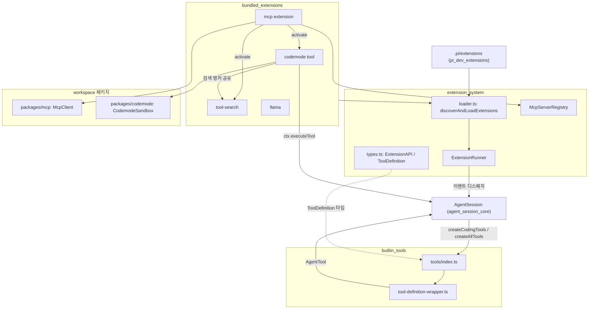
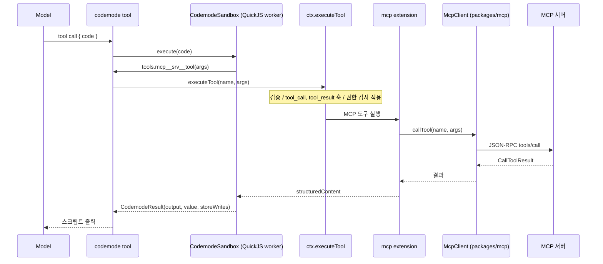

# Extensibility, Tools and Integrations 모듈 개요

## 1. 목적

이 모듈은 pi 코딩 에이전트(`packages/coding-agent`)의 도구와 확장 기능을 한데 묶은 계층입니다. 크게 네 가지를 담당합니다.

- LLM이 호출하는 내장 도구(`read`, `bash`, `edit` 등)를 정의합니다.
- 확장(extension)을 발견·로드하고, 에이전트 수명주기 이벤트를 확장에 전달합니다.
- 외부 도구 생태계(MCP)와 코드 실행 샌드박스(codemode)를 연결합니다.
- 저장소 메인테이너용 개발 보조 확장을 제공합니다.

핵심 원칙은 **코어가 특별 취급하지 않는다**는 점입니다. `codemode`, `mcp`, `tool-search`, `llama` 같은 번들 기능도 일반 확장과 같은 `ExtensionAPI`만 사용합니다. 코어는 `ToolDefinition`, `ExtensionRunner`, `McpServerRegistry` 같은 확장 지점만 제공합니다.

> 검증 수준: 아래 내용은 각 하위 모듈 문서(`codewiki-d4`)를 종합한 것입니다. 하위 문서가 소스를 직접 읽고 작성한 부분은 코드 확인 수준이고, 일부 호출 관계는 추론·미확인입니다. 자세한 수준은 각 하위 문서에 표시되어 있습니다. 이 개요 작성 중에 `repos/pi` 소스를 다시 열어 검증하지는 않았습니다.

## 2. 하위 모듈 구성

| 하위 모듈 | 경로 | 역할 |
|---|---|---|
| [extension_system](extension_system.md) | `packages/coding-agent/src/core/extensions` | 확장 로더(`loader.ts`), 이벤트 러너(`runner.ts`), 공개 타입(`types.ts`), MCP 서버 등록소(`mcp-servers.ts`) |
| [builtin_tools](builtin_tools.md) | `packages/coding-agent/src/core/tools` | `read`, `bash`, `powershell`, `edit`, `write`, `grep`, `find`, `ls` 도구와 TUI 렌더러 |
| [bundled_extensions](bundled_extensions.md) | `packages/coding-agent/src/extensions` | 기본 탑재 확장: `codemode`, `mcp`, `tool-search`, `llama` |
| [mcp](mcp.md) | `packages/mcp` | 독립형 MCP 클라이언트 라이브러리(JSON-RPC, stdio / Streamable HTTP / in-memory transport, OAuth) |
| [codemode](codemode.md) | `packages/codemode` | QuickJS(WASM) worker 샌드박스 JS 실행기 |
| [pi_dev_extensions](pi_dev_extensions.md) | `.pi/extensions` | 저장소 개발용 확장: `/ir`, prompt URL 위젯, TPS 통계 |

## 3. 전체 아키텍처

핵심 흐름은 다음과 같습니다.

1. `AgentSession`이 `builtin_tools`의 팩토리로 내장 도구를 만듭니다. 내부적으로는 `ToolDefinition`을 `wrapToolDefinition`으로 `AgentTool`로 변환해 에이전트 루프에 넘깁니다.
2. `extension_system`의 로더가 `.pi/extensions`, 전역 `agentDir/extensions`, 설정 경로에서 확장을 찾아 `jiti`로 로드합니다. 번들 확장도 같은 방식으로 등록됩니다.
3. 확장은 `pi.registerTool`, `pi.on`, `pi.registerCommand`, `pi.registerProvider`, `registerMcpServer` 등으로 기능을 등록합니다.
4. `ExtensionRunner`가 `tool_call`, `tool_result`, `context`, `before_provider_request` 같은 이벤트를 확장 핸들러에 전달합니다. 핸들러는 도구 호출을 차단하거나 결과를 수정할 수 있습니다.

## 4. 도구 노출 모델 (exposure)

이 모듈에서 가장 중요한 설계는 도구를 모델에 어떻게 보여 줄지 정하는 `exposure`입니다. 모델의 도구 선언 크기와 프롬프트 캐시 안정성에 직접 영향을 줍니다.

| `exposure` | 모델에 선언 | 다른 도구에서 호출(`executeTool`) |
|---|---|---|
| `direct` (기본) | 활성 시 | 활성 시 |
| `model-only` | 활성 시 | 불가 |
| `codemode` | 명시적 활성화 시에만 | 가능 |
| `deferred` | 명시적 활성화 시에만 | 가능, `tool_search`로 발견 |
| `hidden` | 불가 | 불가 |

MCP 도구는 기본값이 `codemode`입니다. 도구 이름은 `mcp__<server>__<tool>` 형식이고, 모델의 도구 선언에는 들어가지 않습니다. 대신 codemode 스크립트가 `searchTools()`로 찾아 호출하거나, `deferred`이면 `tool_search`가 활성화합니다. 그래서 MCP 서버가 많아도 프롬프트가 커지지 않고, 서버가 연결·변경되어도 도구 선언이 바뀌지 않아 프롬프트 캐시가 유지됩니다.

## 5. 대표 흐름: MCP 도구를 codemode로 호출

- 스크립트의 중첩 호출도 `ctx.executeTool`을 거칩니다. 일반 도구 호출과 같은 검증, 훅, 권한 검사가 적용됩니다.
- 모델에는 스크립트 출력만 전달됩니다. 중첩 호출은 transcript에 나타나지 않고 부모 결과의 `nestedCalls`에만 기록됩니다.

## 6. 하위 모듈별 요점

### extension_system
- `loadExtensionModule`이 실행 환경(Bun 바이너리, TS 소스, 빌드된 dist)에 따라 `jiti` 해석 옵션을 달리합니다.
- 로드는 트랜잭션 방식입니다(`loading → active | failed`). 로드 중 실패한 확장의 provider, MCP, flag 등 런타임 부수효과는 적용되지 않습니다.
- 등록은 `Extension` 객체에 저장하고, 동작은 공유 `ExtensionRuntime`에 둡니다. 로드 시점의 액션은 throwing stub이고, `bindCore()`가 실제 구현으로 교체합니다.
- 이벤트 디스패치 규칙은 이벤트마다 다릅니다. `tool_call`의 `block`은 즉시 중단하고, 예외를 격리하지 않습니다. 반면 `tool_result`는 필드별로 체이닝합니다.
- 이름 충돌 규칙은 도구는 먼저 로드된 확장 우선, 명령은 `name:1` 같은 접미사, 단축키는 예약 키 보호입니다.
- `McpServerRegistry`는 검증과 저장만 합니다. 실제 연결은 `mcp_servers_change`를 처리하는 확장이 맡습니다.

### builtin_tools
- 각 도구는 `ToolDefinition`(스키마, `execute`, 렌더러)으로 정의됩니다. 기본 세트는 `read, bash, edit, write`이고, 읽기 전용 세트는 `read, grep, find, ls`입니다.
- `edit`는 `edit-diff.ts`의 매칭 엔진을 씁니다. 모든 edit을 같은 원본에 대해 매칭하고, 정확 일치가 안 되면 fuzzy 정규화로 폴백합니다. 같은 파일에 대한 편집은 `withFileMutationQueue`로 직렬화됩니다.
- 렌더러(`renderers/*.ts`)는 실행 코드와 분리되어 있어, 출력만 표시하는 프로세스는 실행 경로를 로드하지 않아도 됩니다.
- `*Operations` 주입 지점으로 원격 실행(SSH 등)에 위임할 수 있습니다.

### bundled_extensions
- `codemode`: `{ code }` 하나를 입력으로 받는 `model-only` 도구입니다. 실행기는 첫 호출 때만 지연 로드됩니다. `store()/load()`는 세션 브랜치별로 값이 분리됩니다.
- `tool-search`: BM25 기반으로 `codemode`/`deferred` 도구를 검색하고 `setActiveTools`로 활성화합니다.
- `mcp`: 서버 설정(`mcp.json`) 로딩, 도구·리소스 등록, OAuth 로그인, `/mcp` 관리 UI를 담당합니다. 프로젝트 `mcp.json`은 신뢰된 프로젝트일 때만 로드합니다.
- `llama`: llama.cpp router 서버의 모델 로드/언로드/다운로드를 `/llama`로 관리합니다.

### mcp (`@earendil-works/pi-mcp`)
- 공식 SDK와 Zod 없이 JSON-RPC 2.0, transport 3종, OAuth 2.x를 직접 구현한 라이브러리입니다. 런타임 의존성은 `cross-spawn` 하나입니다.
- `McpClient`(요청/응답 상관관계)와 `McpTransport`(메시지 운반)를 분리했습니다.
- OAuth는 PKCE S256 필수, RFC 9207 `iss` 검증, step-up scope, 동시 401 병합을 지원합니다.
- 사용자에게 보이는 MCP 기능은 이 라이브러리가 아니라 `bundled_extensions`의 mcp 확장이 제공합니다.

### codemode (`@earendil-works/pi-codemode`)
- 스크립트가 쓸 수 있는 capability는 주입된 `tools.<name>(args)` 호출뿐입니다. 타이머, `fetch`, `process`, `require`는 없습니다.
- 실행마다 새 worker와 새 QuickJS VM을 만듭니다. 폭주 스크립트는 `Atomics` interrupt와 `terminate()`로 종료합니다.
- 인자와 결과는 JSON 문자열 경계를 넘습니다. 종료 상태는 `Ok`, `Script`, `Timeout`, `Aborted`, `Sandbox` 다섯 가지입니다.
- `renderDeclarations`가 JSON Schema를 TypeScript 선언으로 바꿔 프롬프트에 넣을 수 있게 합니다.

### pi_dev_extensions
- 제품 코드가 아니라 pi 저장소를 열었을 때 자동 로드되는 개발 보조 확장입니다.
- `/ir`은 CI 분석 세션(gist)을 로컬로 가져와 `cwd`를 재작성한 뒤 `switchSession`합니다. `prompt-url-widget`은 PR/Issue/Advisory URL을 위젯과 세션 이름으로 표시합니다. `tps`는 에이전트 실행 종료 시 tokens/sec를 알립니다.

## 7. 하위 모듈 간 의존 관계

| 관계 | 설명 |
|---|---|
| `bundled_extensions` → `extension_system` | 모든 번들 확장이 `ExtensionAPI`로 동작 |
| `bundled_extensions(mcp)` → `mcp` | `McpClient`와 transport 사용, `McpOAuthCredentialStore`가 `McpOAuthStateStore` 구현 |
| `bundled_extensions(codemode)` → `codemode` | `CodemodeSandbox`를 감싸 에이전트 도구로 제공 |
| `bundled_extensions(mcp)` → `codemode`, `tool-search` | `isCodemodeTool`, `isToolSearchTool` 확인 후 `setActiveTools`로 활성화 |
| `builtin_tools` → `extension_system` | `ToolDefinition`, `ExtensionContext` 타입 사용. 도구별 `ToolCallEvent`/`ToolResultEvent` 타입은 거꾸로 `builtin_tools`의 타입에 의존 |
| `pi_dev_extensions` → `extension_system` | `discoverAndLoadExtensions`가 `.pi/extensions`를 탐색 |

## 8. 유의사항

- `tool_call` 핸들러의 예외는 격리되지 않고 전파됩니다. 확장은 방어적으로 작성해야 합니다.
- `newSession`, `fork`, `switchSession`, `reload` 이후에는 캡처해 둔 `pi`/`ctx`를 쓸 수 없습니다. 교체 후 작업은 `withSession` 콜백의 ctx를 사용합니다.
- `packages/durable/src/tools/`에 `builtin_tools`와 비슷한 편집 로직의 별도 구현이 있습니다. 두 구현의 동기화 여부는 미확인입니다.
- 저장소 규칙(`AGENTS.md`)에 따라 인라인 import 금지, erasable TypeScript 문법만 사용, 키 바인딩은 `DEFAULT_*_KEYBINDINGS`로 설정 가능하게 둡니다.

## 9. 관련 모듈

- [LLM_Provider_Abstraction_and_Auth](LLM_Provider_Abstraction_and_Auth.md): `packages/ai`의 메시지·모델 타입과 provider 등록 대상
- [Agent_Loop_and_Session_Core](Agent_Loop_and_Session_Core.md): `packages/agent`, `AgentSession`, 이벤트 소비자
- [Model,_Credential_and_Settings_Management](Model,_Credential_and_Settings_Management.md): `ModelRegistry`, 키바인딩 설정
- [Terminal_UI_Framework](Terminal_UI_Framework.md): 도구 렌더러와 확장 UI가 쓰는 `pi-tui`
- [Build,_Release,_CI_and_Quality_Infrastructure](Build,_Release,_CI_and_Quality_Infrastructure.md): `mcp-conformance` CI 잡과 `issue-analysis` 워크플로