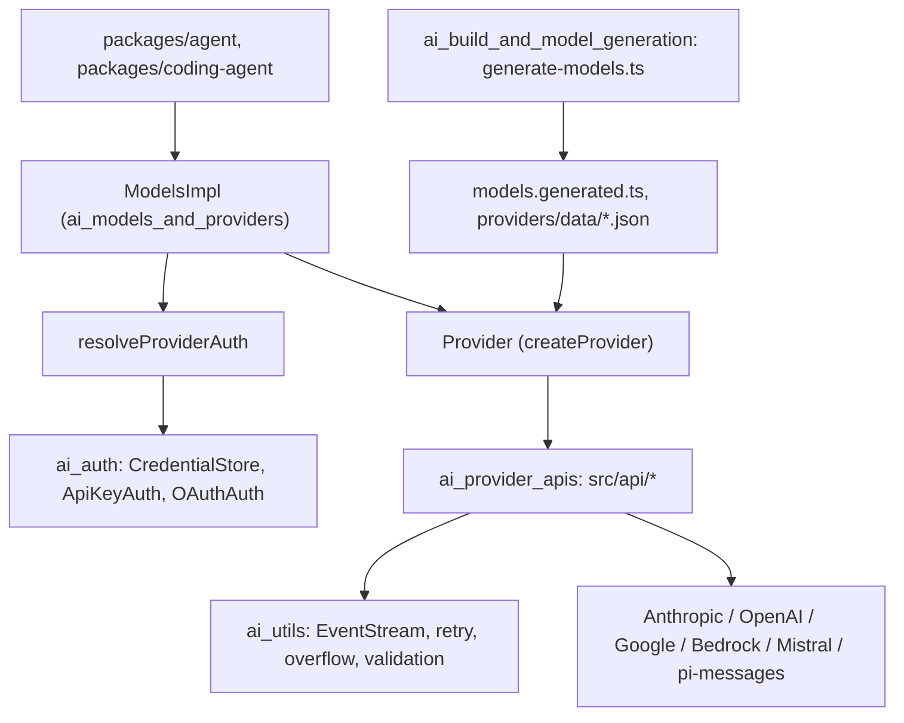
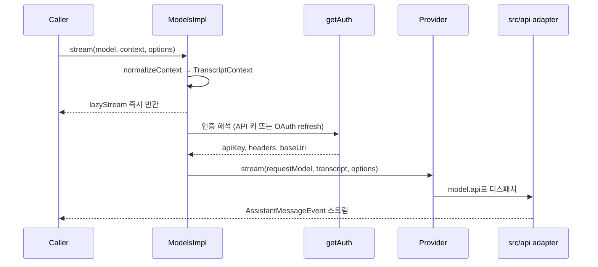
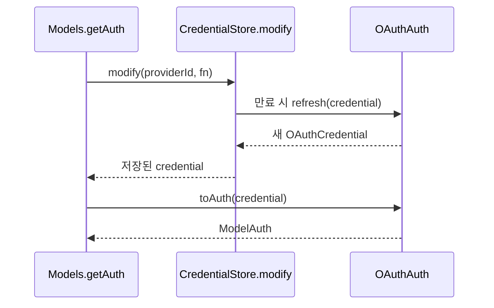

# LLM_Provider_Abstraction_and_Auth 모듈 개요

`packages/ai`(`@earendil-works/pi-ai`)는 서로 다른 LLM 프로바이더(Anthropic, OpenAI, Google, Bedrock, Mistral 등)를 하나의 공통 모델·스트리밍 이벤트 계약으로 묶고, 요청마다 필요한 인증 정보(`ModelAuth`)를 만들어 주는 계층입니다. 상위의 `packages/agent`(`agent_runtime`)와 `packages/coding-agent`는 이 모듈의 `Models`를 통해서만 모델을 호출합니다.

## 1. 목적

- **프로바이더 추상화**: 프로바이더마다 다른 와이어 프로토콜을 `stream` / `streamSimple`의 `AssistantMessageEventStream`으로 정규화합니다. 이벤트는 `start → *_delta → done | error` 순서입니다. 실패는 예외가 아니라 `stopReason: "error"`인 메시지로 전달합니다.
- **모델 카탈로그**: 채팅·이미지·분류기(`classifier`) 모델 메타데이터(비용, thinking 수준, `compat`)를 생성해 보관하고 조회합니다.
- **인증**: API 키(저장값과 환경 변수), 구독형 OAuth(PKCE, device code)를 처리합니다. 토큰 갱신은 저장소 락 안에서 수행합니다.
- **공용 유틸**: 이벤트 스트림, 재시도, 컨텍스트 오버플로 판별, tool 인자 검증, abort 신호 결합을 제공합니다.
- **환경 이식성**: Node, Bun 단일 바이너리, 브라우저(Vite)에서 모두 쓸 수 있도록 Node 전용 모듈을 변수 specifier로 지연 import합니다.

## 2. 아키텍처

의존 방향은 `ModelsImpl`이 인증을 해석한 뒤 `Provider`에 위임하고, `Provider`가 `src/api/*` 어댑터를 호출하는 구조입니다. 어댑터는 `options.apiKey`와 `headers`만 받으므로 인증 로직을 알지 못합니다.

### 요청 경로

### OAuth 토큰 갱신

`OAuthAuth`는 네트워크를 쓰는 `refresh`와 부작용 없는 `toAuth`로 나뉩니다. 이 분리 덕분에 갱신을 락 안에서 직렬화할 수 있고, 회전하는 refresh token을 동시 요청이 이중으로 갱신하는 일을 막습니다.

## 3. 하위 모듈 요약

| 하위 모듈 | 경로 | 핵심 내용 |
|---|---|---|
| [ai_provider_apis](ai_provider_apis.md) | `packages/ai/src/api` | 프로토콜 어댑터 계층. 공통 계약(`stream`/`streamSimple`, stop reason, tool call ID, 스트리밍 JSON 정규화). 하위는 Anthropic/Bedrock, OpenAI 계열(Codex는 WebSocket에서 SSE로 폴백), Google/Vertex, 게이트웨이·분류기(Mistral, `pi-messages`, Cloudflare, llama.cpp) |
| [ai_auth](ai_auth.md) | `packages/ai/src/auth` | `ModelAuth`, `Credential`, `CredentialStore` 계약. `InMemoryCredentialStore`, `env-api-keys.ts`, OAuth 플로우 8종(Anthropic, OpenAI Codex/ChatGPT, GitHub Copilot, OpenRouter, Kimi, Meta, xAI). 콜백 서버, device code 폴링, PKCE 헬퍼 |
| [ai_models_and_providers](ai_models_and_providers.md) | `packages/ai/src` | `Provider`, `createProvider`, `ModelsImpl`(인증 적용, 위임, 동적 카탈로그 refresh, login/logout). 내장 프로바이더 42개, `faux` 테스트 프로바이더, Radius 설정, `compat.ts` 호환 계층, 개발용 `cli.ts` |
| [ai_utils](ai_utils.md) | `packages/ai/src/utils` | `EventStream`, `assistant-message-frame`, `retryAssistantCall`, `isContextOverflow`, `validateToolArguments`, `combineAbortSignals`, `getPiUserAgent`, 세션 자원 정리 |
| [ai_build_and_model_generation](ai_build_and_model_generation.md) | `packages/ai` | `package.json`, `tsconfig.build.json`, `vitest.config.ts`, `scripts/generate-models.ts`. models.dev, OpenRouter, AI Gateway, Radius를 수집해 카탈로그와 `models.generated.ts` 생성 |

## 4. 핵심 설계 포인트

1. **Provider가 요청 동작을 소유하고 `Models`는 인증 해석 후 위임만 합니다.** 인증이 없으면 `ModelsError("auth")`가 스트림 오류로 나옵니다. `generateImages`와 `classify`는 reject하지 않고 오류 결과를 반환합니다.
2. **`TranscriptContext`는 브랜드 타입입니다.** `normalizeContext()`만 생성할 수 있어서 원시 `Context`가 프로바이더에 도달하지 않습니다.
3. **오류를 값으로 다룹니다.** 스트림, 재시도, `result()` 모두 오류를 `AssistantMessage`로 표현합니다. 재시도(`retry.ts`)와 오버플로 판별(`overflow.ts`)은 프로바이더 오류 문자열 정규식에 의존하므로, 새 프로바이더는 패턴 추가가 필요합니다.
4. **동적 카탈로그 refresh에는 동시성 보호가 있습니다.** `refreshGenerations`, `AbortController`, `publicationChains`로 낡은 결과가 상태를 덮어쓰지 못하게 합니다.
5. **카탈로그는 생성물입니다.** `models.generated.ts`는 직접 수정하지 않고 `scripts/generate-models.ts`를 고친 뒤 재생성합니다. 임시 디렉터리에 쓰고 검증한 뒤 교체하며, 실패하면 이전 산출물로 복원합니다.
6. **번들 환경별 분기가 있습니다.** Bun 단일 바이너리에서는 `registerBunOAuthFlows()`가 OAuth 플로우를 정적으로 등록합니다. 그 밖의 환경에서는 `importOAuthModule`이 변수 specifier로 지연 로딩합니다.

## 5. 확장 지점

- **새 OAuth 프로바이더**: `OAuthAuth`(`login`/`refresh`/`toAuth`)를 구현하고, `oauth/load.ts`에 로더를 추가한 뒤 `bun-oauth.ts`에 등록합니다.
- **환경 변수 키**: `env-api-keys.ts`의 `envMap`에 항목을 추가합니다.
- **새 모델/프로바이더**: `generate-models.ts`를 수정해 재생성하고, `providers/all.ts`에 팩토리를 등록합니다.
- **테스트**: `fauxProvider`를 `coding-agent`의 `test/suite/harness.ts`와 함께 사용합니다. 실제 API는 쓰지 않습니다.

## 6. 검증 수준과 미확인 영역

- 위 내용은 하위 모듈 문서(CodeWiki 산출물, 분석 후보)를 종합한 것입니다. 하위 문서가 직접 코드로 읽어 확인했다고 밝힌 부분은 **코드 확인**, 그렇지 않은 부분은 아래와 같이 구분합니다.
- **미확인**: `Models`가 영구 갱신 실패(예: Kimi 401) 시 credential을 삭제하는 동작은 확인되지 않았습니다. `assistant-message-frame`이 durable 하네스에서 실제로 쓰이는지와 `registerSessionResourceCleanup`의 등록 지점도 확인되지 않았습니다.
- **추론**: `ai_utils` 다이어그램의 소비자 의존 방향과 tool 인자 강제 변환의 설계 의도는 추론입니다.
- 이 문서는 `ai_provider_apis`의 네 하위 문서를 열어 보지 않고 부모 문서 기준으로 요약했습니다. 어댑터별 세부 내용은 각 하위 문서에서 확인해야 합니다.

## 7. 관련 모듈

- 상위 소비자: [agent_runtime](agent_runtime.md), [Agent_Loop_and_Session_Core](Agent_Loop_and_Session_Core.md)
- 앱 측 영속 인증·모델 관리: [model_and_auth_management](model_and_auth_management.md)
- 로그인 UI: [interactive_selectors_and_dialogs](interactive_selectors_and_dialogs.md)