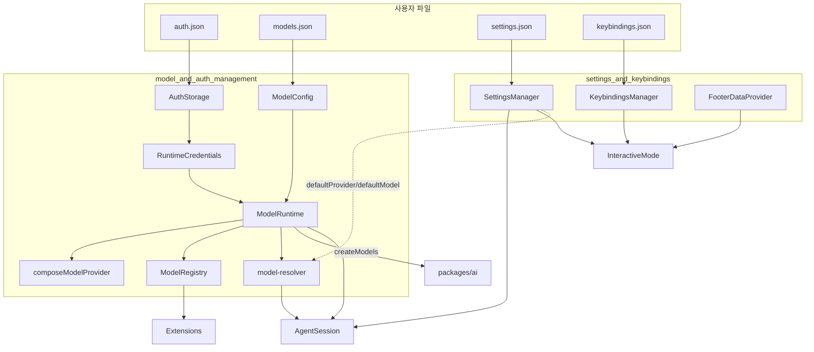
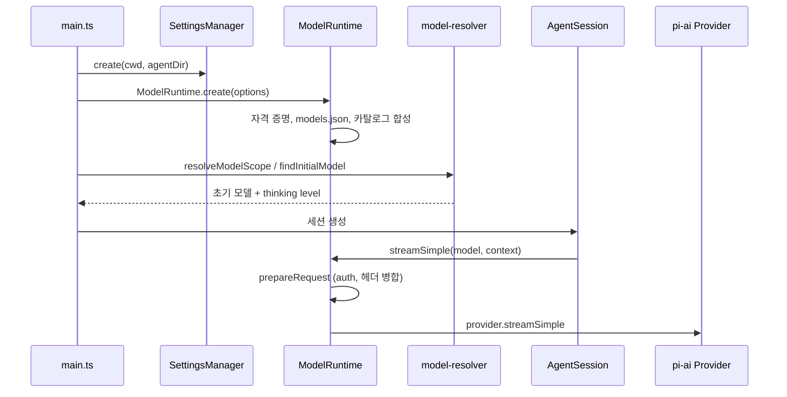

# Model,_Credential_and_Settings_Management 모듈 개요

> 검증 수준: 하위 모듈 문서(`model_and_auth_management.md`, `settings_and_keybindings.md`)의 내용을 근거로 작성했다. 코드 대조는 하위 문서가 수행한 범위를 따른다.

## 1. 목적

`packages/coding-agent/src/core`에 위치하며, coding-agent가 동작하기 위해 필요한 세 가지 구성 요소를 관리한다.

1. **모델**: `models.json`, 원격 카탈로그, 확장 provider, 가상 모델을 합쳐 사용 가능한 모델 목록을 만든다. 시작 시 모델을 정하고 세션에서 복원하는 일도 이 모듈이 맡는다.
2. **자격 증명**: `auth.json` 저장소, 런타임 API 키, `!command`/`$ENV` 참조, HTTP 프록시와 timeout을 처리한다.
3. **설정과 키 바인딩**: 전역/프로젝트 `settings.json`, `keybindings.json`, 푸터용 git 브랜치와 확장 상태를 다룬다.

이 모듈은 `packages/ai`의 `Models`/`Provider`/`CredentialStore` 추상화를 coding-agent 환경에 맞게 조립하는 계층이다. 소비자는 `AgentSession`, CLI 부트스트랩, 확장 시스템, 인터랙티브 UI이다.

## 2. 하위 모듈

| 하위 모듈 | 책임 | 문서 |
|---|---|---|
| `model_and_auth_management` | `ModelRuntime`, `AuthStorage`, `ModelConfig`, `composeModelProvider`, `ModelRegistry`, `model-resolver` | [model_and_auth_management.md](model_and_auth_management.md) |
| `settings_and_keybindings` | `SettingsManager`, `KeybindingsManager`, `FooterDataProvider` | [settings_and_keybindings.md](settings_and_keybindings.md) |

## 3. 전체 아키텍처

두 하위 모듈은 코드에서 직접 의존하지 않는다. 연결 지점은 `SettingsManager`가 저장하는 기본 모델 값(`defaultProvider`, `defaultModel`)이 `findInitialModel`의 입력이 되는 것이다. 이 연결은 설정 키와 resolver의 우선순위 규칙을 근거로 한 추론이다.

## 4. 대표 흐름: 시작 시 모델 결정과 요청 처리

## 5. 핵심 설계 포인트

- **`ModelRuntime`이 유일한 상태 보유자이다.** `ModelRegistry`는 확장에 노출하는 동기식 호환 facade이다.
- **Provider는 레이어 순서로 합성한다.** 순서는 builtin → `models.json` → 확장 → OAuth `modifyModels` → `modelOverrides`이다. 합성에 실패하면 base provider로 폴백한다.
- **자격 증명 변경은 provider별 직렬 큐로 처리한다.** 변경 후 provider를 다시 합성하고 가용성을 갱신한다.
- **비밀값은 `models.json`에 직접 두지 않는다.** `ModelConfig`는 credential-blind이며, 값은 `auth.json` 또는 `!cmd`/`$ENV` 참조로 둔다.
- **가상 모델이 다른 provider로 라우팅할 때는 호출자의 `apiKey`/`headers`/`env`를 넘기지 않는다.** 키 유출을 막기 위해서이다.
- **설정은 전역과 프로젝트 두 레이어를 `deepMergeSettings`로 병합한다.** 프로젝트가 우선하지만 신뢰(trust)되지 않은 프로젝트의 설정은 무시되고 쓰기도 막힌다.
- **설정 저장은 수정한 필드만 디스크 최신본 위에 덮어쓴다.** 동시에 실행 중인 다른 pi 프로세스의 변경을 지우지 않는다.
- **키 바인딩은 `KEYBINDINGS`에 기본값을 선언한다.** 하드코딩된 키 검사는 금지이며, Windows/WSL 기본값과 구 이름 마이그레이션을 지원한다.
- **파일 락은 `proper-lockfile`을 쓴다.** 동기 경로는 busy-wait 재시도이므로, 경합이 길면 이벤트 루프를 막을 수 있다.

## 6. 외부 모듈과의 관계

| 관계 | 모듈 |
|---|---|
| 하부 추상화 | `LLM_Provider_Abstraction_and_Auth` (`ai_models_and_providers`, `ai_auth`, `ai_provider_apis`) |
| 소비자 | `agent_session_core`, `cli_bootstrap_and_config` |
| 확장 | `extension_system` (`registerProvider`, `ModelRegistry`) |
| UI | `interactive_selectors_and_dialogs` (로그인/모델 선택), `interactive_mode_core`, `interactive_message_components` (`FooterComponent`) |
| 키 바인딩 상속 | `tui_core` (`KeybindingsManager`) |

## 7. 미확인 영역과 주의점

- 모델 카탈로그 생성과 배포 파이프라인(`ai_build_and_model_generation`, `publish-model-catalog.yml`)은 하위 문서에서 다루지 않았다(미확인).
- 설정 파일은 스키마 검증이 없고 일부 getter만 값을 검증하거나 clamp한다.
- 설정 쓰기 오류는 `errors`에 쌓일 뿐 던져지지 않으므로, 호출 측이 `drainErrors()`로 표시해야 한다.
- `ModelRegistry`의 동기 읽기 전에는 `await refresh()`가 필요하다. 로그인/로그아웃 직후에는 `ModelRuntime`의 동기화가 끝난 뒤에 가용 모델을 읽어야 한다.