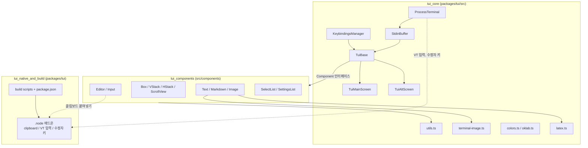
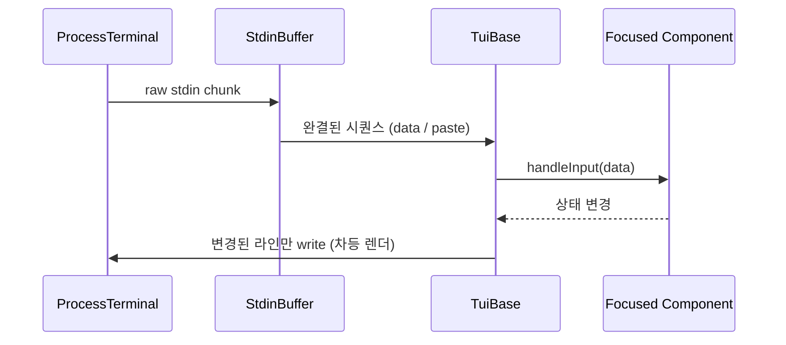

# Terminal_UI_Framework 개요

`packages/tui`(`@earendil-works/pi-tui`)는 pi의 터미널 UI 프레임워크다. 터미널 입출력, 키 입력 해석, 차등 렌더링, 재사용 위젯, 네이티브 클립보드 애드온을 제공한다. 상위 앱(주로 `packages/coding-agent`의 interactive 모드)은 이 패키지를 조합해 화면을 만든다. 이 관계는 모듈 트리 기반 추론이며 코드로 확인하지 않았다.

검증 수준: 이 개요는 하위 문서 3개(`tui_core`, `tui_components`, `tui_native_and_build`)를 읽고 정리했다. 하위 문서는 CodeWiki 산출물(분석 후보)이라 개요 자체는 `repos/pi` 소스와 직접 대조하지 않았다(미확인).

## 목적

- **터미널 계층**: raw mode, bracketed paste, Kitty keyboard protocol / `modifyOtherKeys` 폴백, 조각난 이스케이프 시퀀스 정규화(`StdinBuffer`).
- **렌더링**: 모든 컴포넌트는 `render(width): string[]`(ANSI 포함 문자열 줄 배열)로 출력한다. `TuiMainScreen`은 스크롤백을 쓰는 차등 렌더링을, `TuiAltScreen`은 대체 화면과 `ScrollView` 뷰포트를 맡는다.
- **키 바인딩**: `KeybindingsManager`가 ID(`tui.editor.*`, `tui.select.*` 등)로 키를 매칭하며, 키는 하드코딩하지 않는다.
- **위젯**: `Editor`, `Input`, `Markdown`, `SelectList`, `SettingsList`, `Image`, `VStack`/`HStack` 등.
- **부가 기능**: 이미지 프로토콜(Kitty/iTerm2), OKLCH 색상 수학, LaTeX를 유니코드로 변환, 대체 화면 검색.
- **네이티브**: X11/Win32 클립보드, Windows VT 입력 활성화, 수정자 키 상태 조회를 `.node` prebuild로 제공한다.

## 아키텍처

점선 관계(네이티브 호출 지점)는 하위 문서에서 정확한 호출 위치가 확인되지 않아 추론이다.

### 대표 흐름: 키 입력에서 화면 갱신까지

## 하위 모듈

| 모듈 | 경로 | 역할 | 문서 |
|---|---|---|---|
| `tui_core` | `packages/tui/src` | 터미널, 키, 렌더러(`TuiMainScreen`/`TuiAltScreen`), 오버레이, 마우스, 이미지, 색상, LaTeX, 검색 | [tui_core.md](tui_core.md) |
| `tui_components` | `packages/tui/src/components` | 레이아웃, 표시, 입력, 선택 위젯 | [tui_components.md](tui_components.md) |
| `tui_native_and_build` | `packages/tui` | N-API 비의존 C 애드온(클립보드 등)과 prebuild/패키징 | [tui_native_and_build.md](tui_native_and_build.md) |

## 핵심 설계 포인트

- **줄 배열 렌더링**: 줄 끝에 `SEGMENT_RESET`을 붙여 스타일 누수를 막고, 너비를 넘는 줄은 예외로 처리한다.
- **프로토콜 차이 은닉**: 입력은 시퀀스 단위로 정규화된 뒤 `matchesKey`로 비교되므로, 컴포넌트는 터미널 프로토콜 차이를 알 필요가 없다.
- **IME 지원**: `CURSOR_MARKER`로 하드웨어 커서 위치를 지정한다.
- **네이티브 애드온**: `napi.h`가 `dlsym`/`GetProcAddress`로 N-API 심볼을 런타임에 해석한다. Node와 Bun이 같은 바이너리를 쓸 수 있고, 워커 스레드에서는 N-API를 호출하지 않는다.
- **배포**: prebuild는 `prebuilds/<platform>-<arch>/*.node`로 패키징되어 사용자가 컴파일러 없이 쓸 수 있다. 네이티브 코드는 `tsc` 빌드에 포함되지 않는다.
- **전역 싱글턴**: Kitty 활성 여부, 능력 캐시, 키바인딩은 모듈 싱글턴이며 테스트용 리셋 함수가 있다.

## 관련 모듈

- 소비처: [User-Facing_Modes_(Interactive_and_RPC)](User-Facing_Modes_(Interactive_and_RPC).md) (추론)
- 빌드/릴리스: [Build,_Release,_CI_and_Quality_Infrastructure](Build,_Release,_CI_and_Quality_Infrastructure.md)