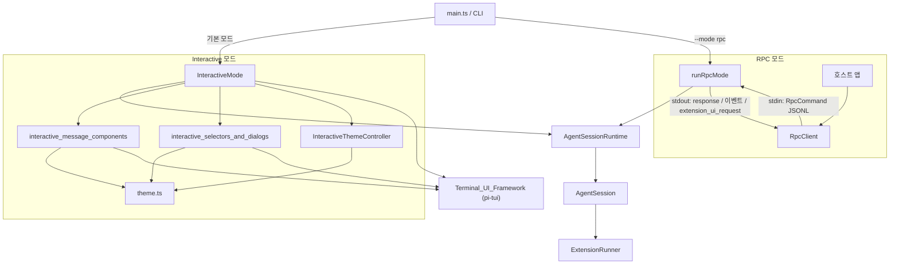
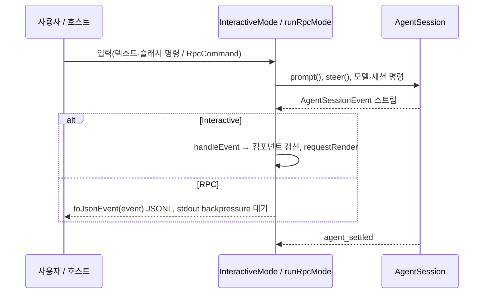

# User-Facing_Modes_(Interactive_and_RPC) 개요

`packages/coding-agent/src/modes`에 있는 모듈로, 같은 `AgentSession`을 두 가지 방식으로 사용자 또는 호스트 앱에 노출한다.

- **Interactive 모드** (`modes/interactive`): 터미널 TUI 앱이다. 사용자가 입력하고, `AgentSession` 이벤트가 화면 컴포넌트로 그려진다.
- **RPC 모드** (`modes/rpc`): UI 없는 헤드리스 모드다. stdin/stdout JSONL 프로토콜로 제어하고, 다른 애플리케이션이 에이전트를 자식 프로세스로 내장할 때 쓴다.

두 모드 모두 얇은 표현 계층이다. 프롬프트 실행, 압축, 재시도, 모델 전환, 세션 트리 같은 비즈니스 로직은 [Agent_Loop_and_Session_Core](Agent_Loop_and_Session_Core.md)의 `AgentSession`/`AgentSessionRuntime`에 위임한다. 이 모듈은 입력 수집, 이벤트 렌더링·직렬화, 수명주기만 맡는다.

> 검증 수준: 아래 내용은 하위 모듈 문서(코드 확인 기반)를 종합한 것이다. 모드 간 호출 관계는 일부 추론이다.

## 구성

| 하위 모듈 | 위치 | 역할 |
|---|---|---|
| [interactive_mode_core](interactive_mode_core.md) | `modes/interactive` | `InteractiveMode`(TUI 구성, 입력 루프, 이벤트→UI 매핑, 슬래시 명령, 종료 처리), `ModelCatalogRefreshCoordinator`(동시 refresh 병합) |
| [interactive_message_components](interactive_message_components.md) | `modes/interactive/components` | transcript와 하단 영역 컴포넌트: `UserMessageComponent`, `AssistantMessageComponent`, `CustomMessageComponent`, `ToolExecutionComponent`, `BashExecutionComponent`, `FooterComponent`, `StatusIndicator` 계열 |
| [interactive_selectors_and_dialogs](interactive_selectors_and_dialogs.md) | `modes/interactive/components` | 에디터 영역을 임시로 대체하는 선택기·다이얼로그: 모델, 세션, 트리, 설정, 로그인, 확장 UI, 신뢰 |
| [interactive_theme](interactive_theme.md) | `modes/interactive/theme` | `Theme`, `InteractiveThemeController`, `validateThemeJson`. 터미널 색상·외관에 맞춘 테마 동기화 |
| [rpc_mode](rpc_mode.md) | `modes/rpc` | `runRpcMode`(서버), `RpcClient`(클라이언트), `rpc-types.ts`, `jsonl.ts` |

## 아키텍처

### 전체 구조

### 이벤트 처리 비교

두 모드는 `AgentSessionEvent` 스트림을 서로 다른 방식으로 소비한다.

### 확장 UI 처리

확장은 `ExtensionUIContext`를 통해 사용자와 상호작용한다. 두 모드는 이를 다르게 구현한다.

| 항목 | Interactive | RPC |
|---|---|---|
| 대화형(`select`/`confirm`/`input`/`editor`) | 선택기 컴포넌트로 에디터 영역 대체 | `extension_ui_request`를 보내고 `extension_ui_response` 대기 |
| 위젯·푸터·헤더·커스텀 컴포넌트 | 지원 | 대부분 no-op (`setWidget`은 문자열 배열만) |
| 테마 변경 | `InteractiveThemeController`로 적용 | 실패 반환 |

## 핵심 설계 포인트

- **세션 교체 내성**: `InteractiveMode`와 `runRpcMode` 모두 new/fork/resume 등으로 `runtimeHost.session`이 바뀌면 `rebindCurrentSession()`/`rebindSession()`으로 구독과 확장 바인딩을 다시 연결한다.
- **렌더 분리**: Interactive 모드는 `Container` 트리를 유지하고 렌더러(`TuiMainScreen`/`TuiAltScreen`)만 교체한다. 컴포넌트는 상태 변경 시 자식을 재구성(rebuild)하는 패턴을 쓴다.
- **오류 격리**: 확장 렌더러가 throw하면 기본 렌더링으로 fallback한다.
- **엄격한 프로토콜 프레이밍**: RPC는 Node `readline`을 쓰지 않고 `\n`으로만 분리한다. `readline`이 U+2028/U+2029에서도 분리해 JSON 문자열을 깨뜨리기 때문이다.
- **종료 순서**: 시그널 종료 시 확장 정리(`session_shutdown`)를 터미널 복원보다 먼저 수행한다. 크래시는 기록되어 다음 시작 때 `/bug` 안내가 나온다.
- **설정 가능한 키**: 키 액션은 `app.*`, `tui.*` 바인딩 id로 등록한다. 하드코딩하지 않는다.

## 주의할 점

- `RpcClient`는 요청 타임아웃이 30초로 고정이다. 오래 걸리는 `compact`나 `bash`는 응답 대기가 이를 넘으면 reject될 수 있다.
- `RpcClient`는 `extension_ui_request`를 처리하지 않는다. 호스트가 `onEvent`로 받아 stdin으로 직접 응답해야 한다.
- `createInteractiveTui`, `createChatViewport`, `system-theme.ts`의 내부는 하위 문서에서 확인되지 않았다(미확인).

## 관련 모듈

- 세션/에이전트 코어: [Agent_Loop_and_Session_Core](Agent_Loop_and_Session_Core.md)
- TUI 프레임워크: [Terminal_UI_Framework](Terminal_UI_Framework.md)
- 모델·인증·설정: [Model,_Credential_and_Settings_Management](Model,_Credential_and_Settings_Management.md)
- 확장 시스템: [Extensibility,_Tools_and_Integrations](Extensibility,_Tools_and_Integrations.md)
- LLM 계층: [LLM_Provider_Abstraction_and_Auth](LLM_Provider_Abstraction_and_Auth.md)