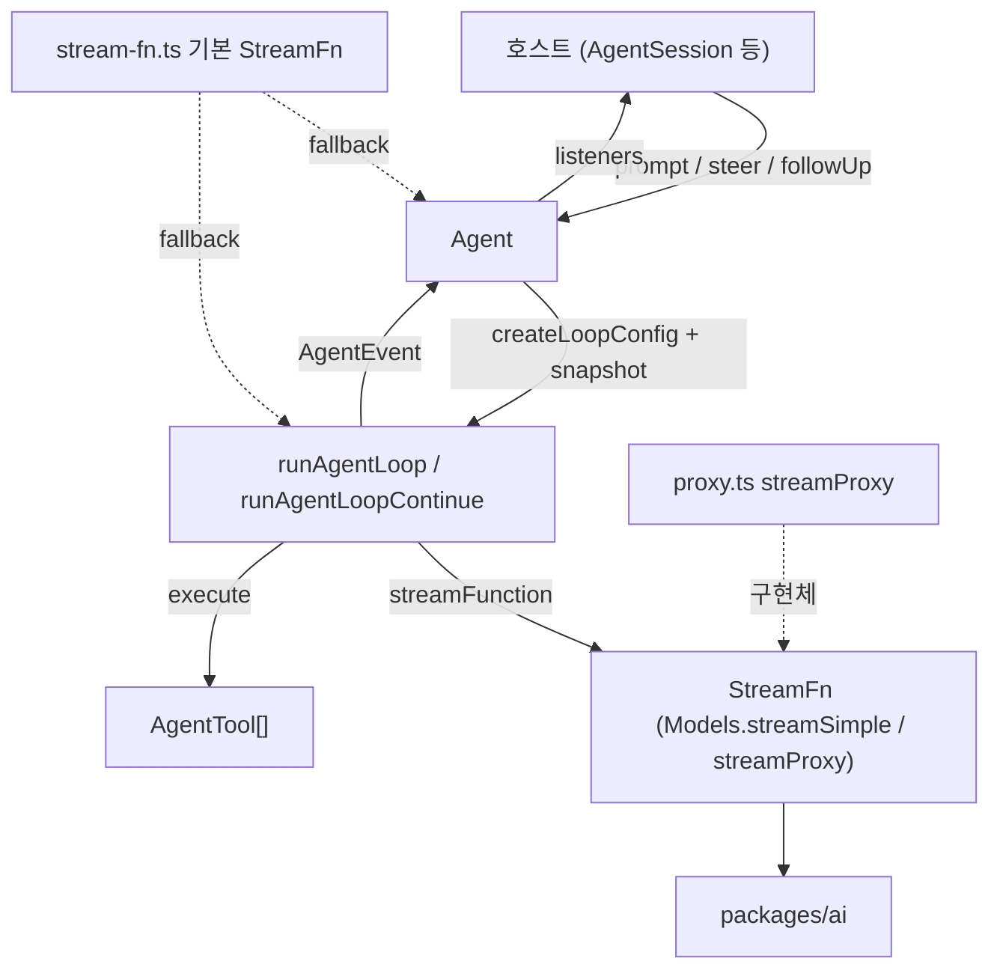
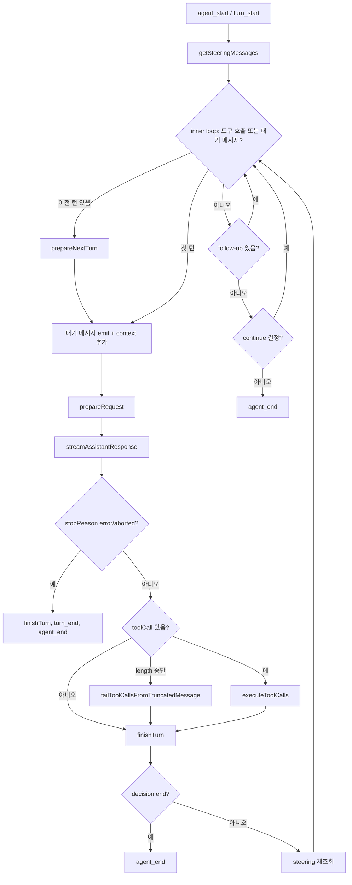
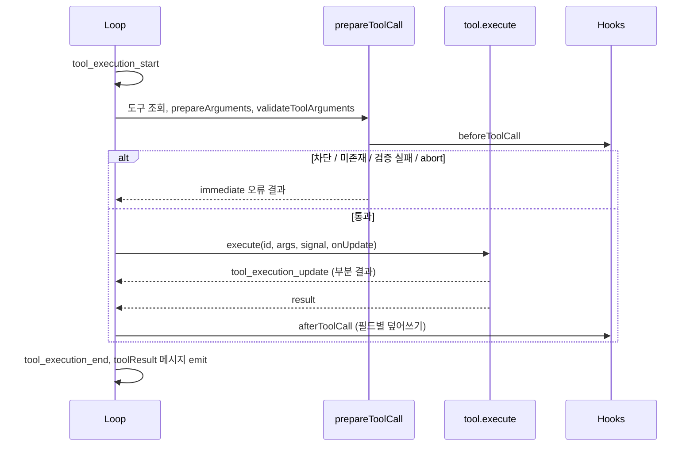
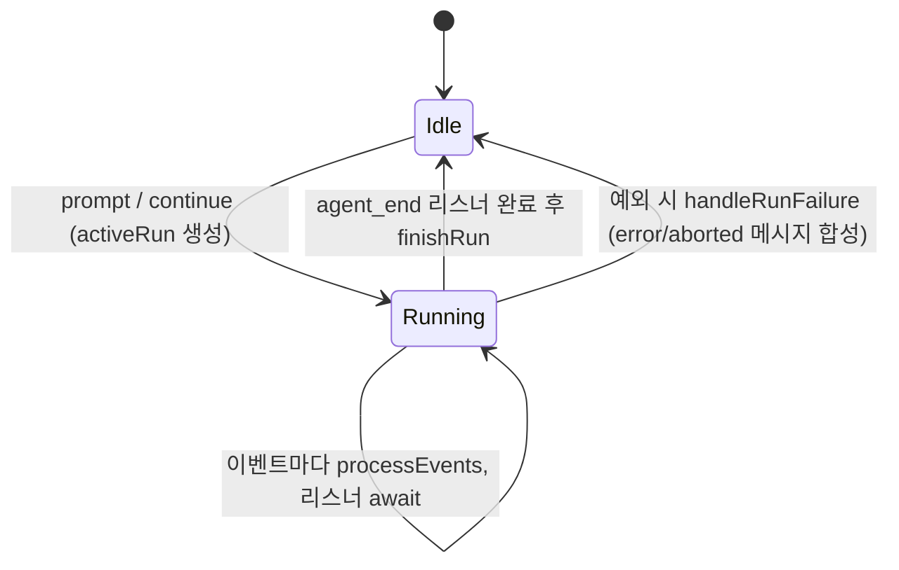

# agent_runtime 모듈

`agent_runtime`은 `packages/agent` (`@earendil-works/pi-agent-core`) 패키지입니다. LLM 호출, 도구 실행, 대화 transcript 관리를 하나의 **에이전트 루프**로 묶는 범용 런타임입니다. 특정 provider 카탈로그나 UI에 의존하지 않습니다. 모델 호출은 호출자가 주입하는 `StreamFn`을 통해서만 이루어집니다.

- 하위 레이어: [ai_models_and_providers](ai_models_and_providers.md), [ai_provider_apis](ai_provider_apis.md), [ai_utils](ai_utils.md) (`@earendil-works/pi-ai`)
- 상위 소비자: [agent_session_core](agent_session_core.md) (`AgentSession`이 `Agent`를 감쌈), [session_persistence_and_compaction](session_persistence_and_compaction.md), [rpc_mode](rpc_mode.md), [interactive_mode_core](interactive_mode_core.md), [durable_harness](durable_harness.md)
- 도구 정의 공급: [builtin_tools](builtin_tools.md), [extension_system](extension_system.md), [mcp](mcp.md)

> 아래 내용은 제공된 소스(`packages/agent/src/*.ts`, `package.json`, `tsconfig.build.json`, `vitest.config.ts`)를 직접 읽고 작성했습니다. 검증 수준: 코드 확인.

## 1. 구성 요소

| 파일 | 역할 |
|---|---|
| `src/agent-loop.ts` | 저수준 루프. `agentLoop`, `agentLoopContinue`(EventStream 반환), `runAgentLoop`, `runAgentLoopContinue`(콜백 emit), `runToolCall` |
| `src/agent.ts` | 상태를 가진 `Agent` 클래스. transcript, 이벤트 구독, steering/follow-up 큐, abort/idle 관리 |
| `src/types.ts` | `AgentMessage`, `AgentTool`, `AgentLoopConfig`, `AgentEvent`, `StreamFn` 등 모든 계약 |
| `src/stream-fn.ts` | 기본 `StreamFn` 전역 슬롯 (`setDefaultStreamFn`/`getDefaultStreamFn`) |
| `src/proxy.ts` | `streamProxy`: 서버 경유 LLM 호출용 `StreamFn` |

패키지 의존성은 `@earendil-works/pi-ai`와 `typebox`뿐입니다 (`packages/agent/package.json`). 빌드는 `tsc -p tsconfig.build.json`이고, 이때 `pi-ai`는 `../ai/dist`의 타입을 참조합니다. 테스트(`vitest.config.ts`)는 `source` condition과 alias로 `pi-ai`, `pi-telemetry`, `pi-agent-core`를 소스에 직접 연결합니다.

## 2. 아키텍처

설계 핵심은 다음과 같습니다.

1. **메시지 경계**: 루프 내부는 `AgentMessage`(LLM 메시지 + `CustomAgentMessages` 선언 병합 확장)로 동작합니다. LLM 호출 직전에만 `transformContext` → `convertToLlm` → `normalizeContext`를 거쳐 `Message[]`로 바꿉니다.
2. **시스템 프롬프트와 도구 선언은 transcript 안에 있습니다.** system 메시지의 `toolsAdded`/`toolsRemoved`로 선언합니다. `declareToolChanges`가 실행 가능한 `context.tools`와 transcript 재생 결과의 차이를 계산해 system 메시지를 삽입하거나 갱신합니다. 따라서 replay하면 항상 `context.tools`와 같아집니다.
3. **StreamFn 계약**: 실패 시 throw하지 않고, `stopReason`이 `"error"`/`"aborted"`인 최종 `AssistantMessage`를 스트림으로 돌려줘야 합니다.

## 3. 루프 흐름 (`runLoop`)

주요 동작은 다음과 같습니다.

- **이중 루프**: 안쪽은 도구 호출과 steering 처리, 바깥쪽은 에이전트가 멈추려 할 때 follow-up을 확인합니다.
- **steering**은 현재 턴의 도구 실행이 끝난 뒤 다음 LLM 호출 전에 주입됩니다. 현재 턴의 도구 호출은 건너뛰지 않습니다. **follow-up**은 도구 호출과 steering이 모두 없을 때만 처리됩니다.
- **`prepareNextTurn`** 은 긴 작업(예: compaction) 이후 context/model/thinkingLevel을 교체할 수 있습니다. 작업 중 쌓인 steering은 다시 조회합니다. 단, 앞선 조회 결과가 비어 있을 때만 조회합니다. 그렇지 않으면 one-at-a-time 모드에서 한 턴에 두 메시지가 전달될 수 있습니다.
- **`prepareRequest`** 는 매 요청 직전(첫 요청 포함)에 호출되며 큐를 폴링하지 않습니다.
- **`finishTurn`** 의 `{action: "end"}`는 즉시 종료합니다. `{action: "continue"}`는 다음 요청을 정확히 한 번 보장합니다. error/aborted는 항상 하드 종료입니다.
- **`length` 중단**: 토큰 한도로 잘린 응답의 도구 호출은 인자가 불완전할 수 있습니다. 실행하지 않고 전부 오류 결과로 처리해 모델이 다시 호출하게 합니다.
- API 키는 호출마다 `getApiKey(provider)`로 해석해 만료되는 OAuth 토큰에 대응합니다. 응답 메시지에는 요청한 `thinkingLevel`을 기록합니다.

### 도구 실행

- **모드**: 기본은 `"parallel"`입니다. 준비(검증, `beforeToolCall`)는 순차로 하고, 허용된 도구만 동시에 실행합니다. `tool_execution_end`는 완료 순서로, toolResult 메시지는 assistant 소스 순서로 emit합니다. 하나라도 `executionMode: "sequential"`인 도구가 있거나 `config.toolExecution === "sequential"`이면 전체가 순차 실행됩니다.
- **종료 힌트**: 배치의 모든 결과가 `terminate: true`일 때만 루프가 멈춥니다.
- **오류 처리**: 도구 오류는 reject하지 않고 `isError: true` 결과가 됩니다. `afterToolCall`이 `content`만 바꾸면 `structuredContent`는 버려지고(내용과 맞지 않을 수 있어서), 얕은 병합만 수행합니다.
- **`runToolCall`**: 이벤트나 메시지 없이 같은 파이프라인(인자 준비, 검증, 훅, 실행)을 수행합니다. 다른 도구를 호출하는 도구가 사용하면 권한 훅이 중첩 호출에도 적용됩니다 (참고: [agent_session_core](agent_session_core.md)의 `NestedToolCallRunner`).

## 4. `Agent` 클래스

`Agent`는 루프 위의 상태 래퍼입니다.

| 기능 | API |
|---|---|
| 실행 | `prompt(string \| message \| messages)`, `continue()` |
| 큐 | `steer`, `followUp`, `clearAllQueues`, `steeringMode`/`followUpMode` (`"all"` \| `"one-at-a-time"`, 기본 one-at-a-time) |
| 제어 | `abort`, `signal`, `waitForIdle`, `reset` |
| 관찰 | `subscribe(listener)`, `state` |
| 훅 | `convertToLlm`, `transformContext`, `getApiKey`, `beforeToolCall`, `afterToolCall`, `finishTurn`, `prepareRequest`, `prepareNextTurn(WithContext)` |

- 동시 실행은 금지됩니다. 실행 중에 `prompt()`를 호출하면 throw하므로 `steer()`/`followUp()`을 써야 합니다.
- `processEvents`가 `AgentState`(`streamingMessage`, `messages`, `pendingToolCalls`, `errorMessage`)를 갱신한 뒤 리스너를 구독 순서대로 await합니다. `agent_end` 리스너가 끝나야 `isStreaming`이 false가 되고 idle이 됩니다.
- 루프가 예외로 중단되면 `handleRunFailure`가 `stopReason`이 `"error"`/`"aborted"`인 assistant 메시지를 만들고 정상 이벤트 시퀀스를 emit합니다. 구독자는 항상 닫힌 이벤트 시퀀스를 받습니다.
- `continue()`는 마지막 메시지가 assistant이면 큐된 steering, 그다음 follow-up을 먼저 소비합니다. 둘 다 없으면 throw합니다.
- 초기 상태의 `systemPrompt`와 `tools`는 `messages`가 system 메시지로 시작하지 않을 때만 선두 system 메시지로 변환됩니다. `reset()`은 기준 system 메시지만 남깁니다.
- `defaultConvertToLlm`은 `system`/`user`/`assistant`/`toolResult` 역할만 통과시키고 나머지 커스텀 메시지는 버립니다.

## 5. 이벤트 모델 (`AgentEvent`)

`agent_start` → `turn_start` → `message_start` / `message_update`(assistant 스트리밍 중) / `message_end` → `tool_execution_start` / `update` / `end` → `turn_end` → … → `agent_end`. 한 턴은 assistant 응답 하나와 그 도구 결과들입니다. UI는 이 이벤트로 렌더링합니다 (참고: [interactive_message_components](interactive_message_components.md)).

## 6. `streamProxy` (`proxy.ts`)

앱이 서버를 통해 LLM을 호출할 때 `Agent`의 `streamFn`으로 사용합니다.

- `POST {proxyUrl}/api/stream`에 `{model, context, options}`를 보냅니다. 직렬화 가능한 옵션만 전송합니다. 인증은 Bearer 토큰입니다.
- 서버는 대역폭 절약을 위해 `partial` 필드를 뺀 SSE(`data: ...`)를 보냅니다. 클라이언트가 `processProxyEvent`로 `partial` `AssistantMessage`를 재구성합니다. 툴 호출 인자는 `parseStreamingJson`으로 점진 파싱합니다.
- `done`/`error` 없이 연결이 끊기면 오류 이벤트를 합성합니다. abort 시 reader를 취소하고 `stopReason`은 `"aborted"`가 됩니다. 이 방식으로 `StreamFn`의 "throw하지 않는다" 계약을 지킵니다.

## 7. 기본 StreamFn (`stream-fn.ts`)

`setDefaultStreamFn`으로 호스트가 `Models.streamSimple` 같은 함수를 등록합니다. 이 패키지는 provider 카탈로그에 직접 의존하지 않습니다. 등록하지 않고 `streamFn`도 생략하면 `getDefaultStreamFn`이 throw합니다. 실제 등록은 [cli_bootstrap_and_config](cli_bootstrap_and_config.md) 등 호스트 쪽에서 합니다. 호출 지점은 이 모듈에서 확인했지만 등록 위치는 미확인(추론)입니다.

## 8. 확장 지점

- `CustomAgentMessages` 선언 병합으로 앱 전용 메시지 타입을 추가합니다. 실제 확장은 `packages/coding-agent/src/core/messages.ts`에서 이루어집니다 ([agent_session_core](agent_session_core.md)).
- `convertToLlm`, `transformContext`로 컨텍스트 가공(프루닝, compaction)을 합니다 ([session_persistence_and_compaction](session_persistence_and_compaction.md)).
- 도구 훅(`beforeToolCall`, `afterToolCall`)으로 권한과 결과 후처리를 합니다 ([extension_system](extension_system.md)).
- `AgentTool.replay` (`"never"` | `"safe"`)는 durable 복구 정책용입니다 ([durable_harness](durable_harness.md)). 이 모듈에서는 정의만 있고 사용처는 미확인입니다.
