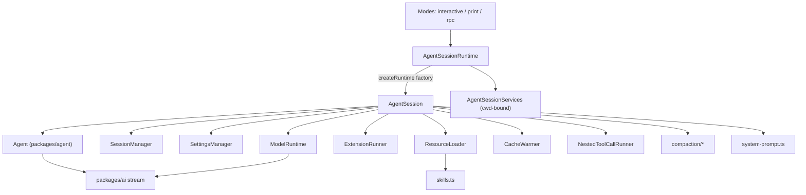
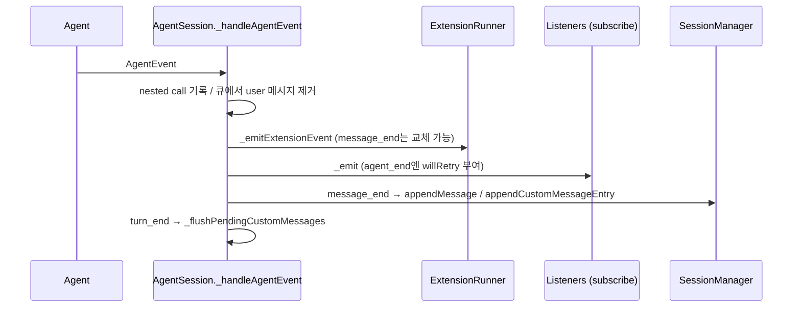
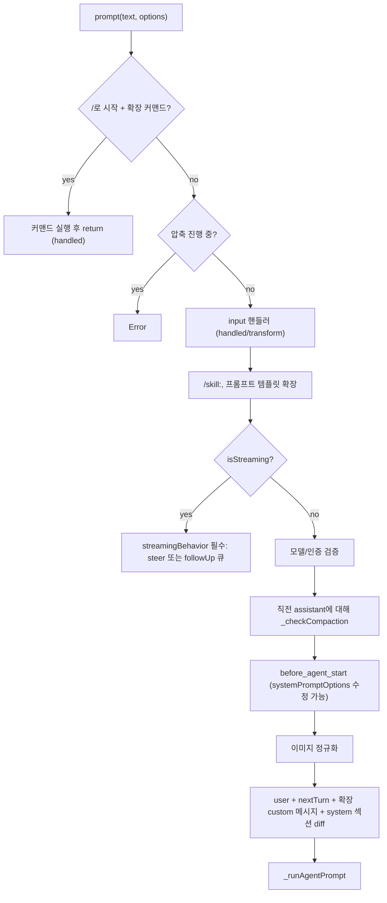
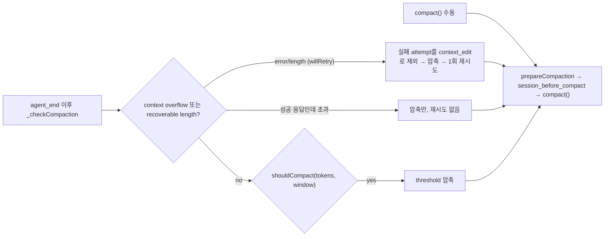
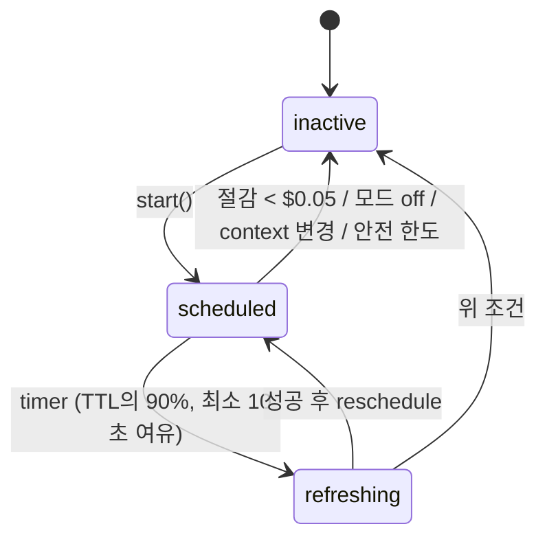
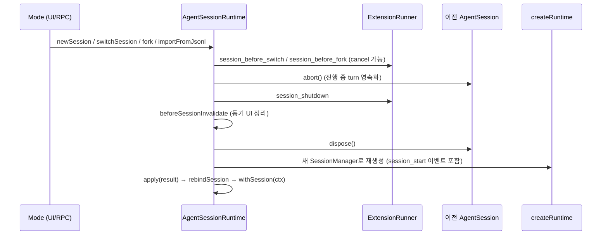

# agent_session_core

`agent_session_core`는 `packages/coding-agent/src/core/`에 있는 **세션 수명주기 중심부**다. `packages/agent`의 저수준 `Agent` 루프([agent_runtime](agent_runtime.md)) 위에 코딩 에이전트 전용 기능을 얹은 `AgentSession`과, 세션 교체(new / resume / fork / import)를 책임지는 `AgentSessionRuntime`이 핵심이다. interactive / print / RPC 모드는 모두 이 클래스를 공유하고 자기 I/O 계층만 추가한다.

> 검증 수준: 아래 내용은 제공된 소스(`agent-session.ts`, `agent-session-runtime.ts`, `cache-warmer.ts`, `nested-tool-calls.ts`, `messages.ts`, `system-prompt.ts`, `slash-commands.ts`, `skills.ts`, `bug-report.ts`)를 직접 읽고 정리한 것이다(코드 확인). 의도에 대한 설명은 `추론`으로 표기한다.

## 1. 구성 요소 한눈에 보기

| 파일 | 역할 |
|---|---|
| `core/agent-session.ts` | `AgentSession`: 이벤트 구독·세션 영속화, 프롬프트/큐, 모델·thinking level, 압축(compaction), 재시도, bash, 트리 이동, 도구 레지스트리, 확장 바인딩 |
| `core/agent-session-runtime.ts` | `AgentSessionRuntime`: 현재 `AgentSession` + cwd 종속 서비스를 소유, 세션 교체 시 teardown → 재생성 |
| `core/cache-warmer.ts` | `CacheWarmer`: prompt cache TTL 만료 전에 1토큰 요청으로 캐시 유지 |
| `core/nested-tool-calls.ts` | `NestedToolCallRunner` / `NestedCallRecorder`: 도구가 `ctx.executeTool()`로 호출하는 중첩 도구 호출 실행·기록 |
| `core/messages.ts` | `CustomAgentMessages` 선언 병합(`bashExecution`, `custom`, `branchSummary`, `compactionSummary`)과 `convertToLlm` |
| `core/system-prompt.ts` | 구조화된 system prompt 섹션 빌드·diff (`buildSystemPrompt`) |
| `core/slash-commands.ts` | `BUILTIN_SLASH_COMMANDS` (`BuiltinSlashCommand`) |
| `core/skills.ts` | `loadSkillsFromDir`, `loadSkills`, `formatSkillsForPrompt` |
| `core/bug-report.ts` | `/bug` 번들(메타데이터·진단·요약) 생성, 민감정보 redaction |

## 2. 아키텍처

관련 모듈 문서:
- 저수준 루프·큐·`prepareRequest`/`finishTurn` 훅: [agent_runtime](agent_runtime.md)
- 세션 JSONL 트리, projection, compaction 알고리즘: [session_persistence_and_compaction](session_persistence_and_compaction.md)
- 모델/인증 런타임: [model_and_auth_management](model_and_auth_management.md), 설정: [settings_and_keybindings](settings_and_keybindings.md)
- 확장 시스템/내장 도구: [extension_system](extension_system.md), [builtin_tools](builtin_tools.md)
- 모드 계층: [interactive_mode_core](interactive_mode_core.md), [rpc_mode](rpc_mode.md)
- 하위 LLM 스트림: [LLM_Provider_Abstraction_and_Auth](LLM_Provider_Abstraction_and_Auth.md)

## 3. AgentSession

### 3.1 생성 시 하는 일
생성자(`AgentSessionConfig`)는 다음을 수행한다.
1. `agent.subscribe(this._handleAgentEvent)`로 내부 이벤트 처리 등록(세션 영속화, 확장 이벤트, 자동 압축/재시도).
2. `Agent`의 훅을 **한 번만** 설치: `beforeToolCall`/`afterToolCall`, `prepareNextTurnWithContext`, `prepareRequest`, `finishTurn`, `transformContext`(숨김 선언 제거 + forced prompt 투영). 기존 훅은 `previous*`로 체이닝한다.
3. `_buildRuntime()`: 기본 도구 정의(`createAllToolDefinitions`), `ExtensionRunner` 생성, `_bindExtensionCore`, `_refreshToolRegistry`.
4. `initialActiveToolNames`가 없으면 `_restoreToolsFromTranscript()`로 transcript의 system message `toolsAdded`에서 도구 loadout 복원.

훅이 `this._extensionRunner`를 실행 시점에 읽기 때문에 확장 reload 때 훅을 재설치하지 않는다(코드 주석 근거).

### 3.2 이벤트 흐름

`AgentSessionEvent`는 `AgentEvent`에 `agent_settled`, `queue_update`, `compaction_start/end`, `auto_retry_start/end`, `summarization_retry_*`, `entry_appended`, `session_info_changed`, `thinking_level_changed`, `bash_execution_update`를 더한 합집합이다. `agent_end`에는 `willRetry`가 추가된다.

핵심 규칙: 확장에 먼저 알리고 그 다음 공개 리스너에 전달한 뒤 영속화한다. `message_end`에서 확장이 반환한 대체 메시지는 `_replaceMessageInPlace`로 **같은 객체를 변경**해 agent state·이벤트·저장본이 일치하도록 한다.

### 3.3 prompt() 파이프라인

`_runAgentPrompt` 루프:
`agent.prompt()` → `_handlePostAgentRun()`(재시도/압축/큐 확인) → true면 `agent.continue()`, 아니면 `_runBeforeSettleBoundary()`(`agent_before_settle` 확장 훅) → 계속 여부 판단. 종료 시 `_flushPendingBashMessages`, `_flushPendingCustomMessages`, `_emitAgentSettled()`(CacheWarmer 알림, `agent_settled` 이벤트, 지연 액션 처리, idle 대기 해제).

`agent_settled` 이벤트 처리 중 호출된 `prompt()`/`sendCustomMessage()`는 `_deferredSettledActions`에 쌓였다가 이벤트 이후 실행된다.

### 3.4 메시지 큐: steer vs followUp
- `steer()`: 현재 assistant turn의 도구 호출이 끝난 뒤, 다음 LLM 호출 전에 전달.
- `followUp()`: 도구 호출·steering이 더 없을 때 전달.
- 둘 다 `_queueUserInput`을 거치며 확장 커맨드는 큐잉 불가(에러). UI 표시용 `_steeringMessages`/`_followUpMessages`를 유지하고 user `message_start` 때 제거 후 `queue_update` 발행.
- `sendCustomMessage`는 4가지 경우(스트리밍 / triggerTurn / deliverAs `nextTurn` 등)로 분기. 스트리밍 중 도구 호출과 결과 사이에 끼면 provider 순서 검증이 깨지므로 `_pendingCustomMessages`에 모았다가 `turn_end`에 flush한다(코드 주석).
- bash 결과도 스트리밍 중이면 `_pendingBashMessages`에 보류해 `tool_use/tool_result` 순서를 보존한다.

### 3.4.1 경계(boundary) 훅
`turn_end`와 `agent_before_settle` 시점에 확장이 `SessionBoundaryDraft`(`custom`, `custom_message`, `context_edit`, `compaction`)를 반환할 수 있다. 세션은 인메모리 `SessionManager`로 **미리보기 context**를 만들어 `canContinue`를 계산하고, 실행 가능한 context가 없으면 continue 요청을 무시하고 오류를 보고한다.

## 4. 모델 · thinking level

- `setModel`: 인증 확인 → `agent.state.model` 설정 → `appendModelChange` → (옵션 `persist`) 기본값 저장 → thinking level 재적용 → `model_select` 확장 이벤트.
- `cycleModel`: `scopedModels`(`--models`)가 있으면 그 안에서, 없으면 `getAvailableSnapshot()`에서 순환.
- `setThinkingLevel`: 모델이 지원하는 레벨로 clamp, 실제 변경 시에만 transcript에 기록하고 `thinking_level_changed` 발행. 우선순위: 명시값 > 모델별 설정 > 전역 기본값 > 현재값.
- **가상 모델(virtual model)**: `isVirtualModel`이면 `prepareRequest`에서 `modelRuntime.resolveModel()`로 요청별 물리 모델을 라우팅한다. 선택은 agent state에 유지되고 요청만 라우팅된다. 상태는 `VIRTUAL_MODEL_STATE_ENTRY` custom entry로 저장. `routedModel`, `_limitsModel()`이 한도 계산에 물리 모델을 사용한다.

## 5. Compaction과 복구

- 수동(`compact`), 자동(`_runAutoCompaction`) 모두 `prepareCompaction` → `session_before_compact`(취소 또는 확장 제공 결과 가능) → `_runDefaultCompaction`(내부 `compact()`) → `appendCompaction` → `session_compact`.
- overflow 복구는 한 번만(`_overflowRecoveryAttempted`). 다른 모델이 낸 오류나 마지막 compaction 이전의 usage는 무시해 오탐을 막는다.
- `prepareNextTurnWithContext`(`_compactBeforeNextAssistantResponse`)와 가상 모델의 `prepareRequest`에서 요청 직전 threshold 압축도 수행한다.
- 요약 호출 인증은 `_getSummarizationRequestAuth`; 재시도는 `_summarizationRetryCallbacks`로 `summarization_retry_*` 이벤트를 낸다.
- `getContextUsage()`: compaction 이후 새 assistant usage가 없으면 `tokens: null`(알 수 없음)을 반환.

## 6. 자동 재시도

`_isRetryableError`: context overflow는 재시도가 아닌 압축 대상, 나머지는 `isRetryableAssistantError`. `_prepareRetry`는 `retryDelayMs`로 지수 백오프 후 `sleep`(abort 가능), 실패한 응답은 `_omitRecoveryAttempt`로 `context_edit`(null 대체)를 영속 기록해 raw history에는 남기고 모델 projection에서만 제외한다. 성공 응답이 오면 `auto_retry_end(success)`를 낸다. 취소 시 `"Retry cancelled"`.

## 7. 도구 레지스트리와 loadout

- 노출 방식(`exposure`): `direct`, `model-only`, `hidden`, `codemode`, `deferred`. 선언(모델에 전달)되는 것은 active인 `direct`/`model-only`. `codemode`/`deferred`는 선언 없이도 `ctx.executeTool()`로 호출 가능(`_getCallableTools`).
- `_refreshToolRegistry`: 내장 + 확장 + SDK 커스텀 도구 병합, `allowedToolNames`/`excludedToolNames` 필터, 확장 래핑(`wrapRegisteredTools`), 새 도구 자동 활성화(`defaultActive !== false`), `_pendingToolNames`(아직 등록되지 않은 MCP 도구) 활성화.
- `prepareLoadout` 훅으로 설명 변경과 `hiddenDeclarations`를 적용하고 `transformContext`가 `toolsAdded/toolsRemoved`에서 숨긴 선언을 제거한다.
- 중첩 호출: [3.5](#35-중첩-도구-호출) 참조.

### 3.5 중첩 도구 호출
`NestedToolCallRunner.execute(callerId, name, args)`는 호출 ID `<callerId>/<n>`로 `runToolCall`(agent 도구 파이프라인)을 실행한다. 세션의 `tool_call`/`tool_result` 훅을 동일하게 거치며 `parentToolCallId`가 붙은 `tool_execution_*` 이벤트를 낸다. 순차 실행이 필요하면(`isSequential()` 또는 도구의 `executionMode === "sequential"`) `queueTail` Promise 체인으로 직렬화하고, 이미 큐를 잡은 호출의 하위 호출은 `holdsQueue`로 교착을 피한다. 결과는 `NestedCallRecorder`가 `NESTED_CALL_LIMITS`(최대 256건, 호출당 인수 8KB, 합계 32KB, 오류 500자) 안에서 기록하고, 모델이 발행한 호출의 `toolResult`에 `nestedCalls`와 합산 `usage`로 붙인다. 중첩 결과 자체는 영속화되지 않는다.

## 8. System prompt

`system-prompt.ts`는 prompt를 `preamble`, `tools`, `rules`, `docs`, `addendum`, `project_context`, `skills`, `cwd`와 사용자 정의 섹션으로 나눠 `<name>…</name>` 태그로 감싼다. 세션은 이전 transcript에서 재생한 섹션과 diff(`diffSystemPromptSections`)해 변경분만 `SystemMessage.sections` 패치로 transcript에 넣는다(삭제는 `null`). `forceSystemPrompt`(`before_agent_start`에서 설정)는 transcript를 바꾸지 않고 요청 시점에만 시스템 메시지를 하나로 합치는 투영(`_installAgentForcedPromptProjection`)으로 적용한다. `skills.ts`는 `SKILL.md` 탐색·검증(이름 64자, 설명 1024자, 소문자/숫자/하이픈)과 `<available_skills>` XML 렌더링을 맡고, `disable-model-invocation` 스킬은 프롬프트에서 제외되며 `/skill:name`으로만 호출된다.

## 9. 메시지 변환

`messages.ts`는 `CustomAgentMessages`를 선언 병합으로 확장해 `bashExecution`, `custom`, `branchSummary`, `compactionSummary`를 추가한다. `convertToLlm`이 이들을 모두 `user` 메시지로 변환하며(bash는 `excludeFromContext`면 제외, 요약은 `
` 접두/접미 포함), 나머지는 그대로 통과시킨다. 이는 에이전트 `Agent`의 변환 옵션, compaction 요약, 가상 모델 라우팅에서 공통으로 쓰인다.

## 10. CacheWarmer

prompt cache 항목의 TTL(`model.promptCache[retention]`)이 끝나기 전에 동일 요청을 `maxTokens: 1`로 재전송해 캐시를 유지한다.

- 결정식: `expectedSavings = continuationProbability * missCost - warmCost`, `>= $0.05`이면 `warm`. streaming 단계 확률 1, idle 단계 0.15.
- 안전 한도: streaming 최대 1시간, idle 30분. 타이머 지연으로 `refreshDeadlineAt`을 넘기면 중단.
- 확장은 `cache_warming_decision`으로 `warm`/`stop`을 덮어쓸 수 있고, 확장 실패 시 pi의 결정을 사용한다.
- 성공한 갱신은 `appendUsage("cache_warm", …)`로 기록되고 `onWarmed`가 `entry_appended`를 내보낸다.
- Anthropic 예산형 thinking은 `max_tokens`에서 budget이 유도되어 캐시 키가 달라지므로 `isReplayable`에서 제외된다(`forceAdaptiveThinking`만 허용).

## 11. AgentSessionRuntime

세션 교체를 담당하는 소유자. `createRuntime` 팩토리(프로세스 전역 입력은 클로저, cwd 종속 서비스는 매번 재생성)를 보관하고 재사용한다.

- `fork(entryId, {position})`: `"before"`는 user 메시지만 허용하고 부모 leaf로 분기하며 `selectedText`를 반환(편집기에 복원). `"at"`은 해당 엔트리까지 포함. 영속 세션은 `createBranchedSession`으로 새 파일을, 비영속은 같은 매니저를 재사용. 저장 전 세션은 `"This session has not been saved yet..."` 오류.
- `importFromJsonl`: 파일을 세션 디렉터리로 복사(`COPYFILE_EXCL`, 이름 충돌 시 `-n` 접미)한 뒤 resume. 파일이 없으면 `SessionImportFileNotFoundError`.
- 교체가 실패하면 예외를 그대로 전파하고 사용자 대면 처리는 호출자 책임이다.
- `dispose()`는 `session_shutdown(reason: "quit")` 후 세션을 해제.
- 확장의 오래된 `ctx` 사용을 막기 위해 `dispose()`는 `extensionRunner.invalidate(...)`를 호출하고, 교체 후 작업은 `withSession`에 전달되는 `ReplacedSessionContext`로 하도록 안내한다.

## 12. 기타 기능

- **bash**: `executeBash`는 `shellCommandPrefix`/`shellPath` 설정을 적용해 `executeBashWithOperations` 실행, `!!` 접두(`excludeFromContext`)는 LLM context 제외.
- **트리 이동**: `navigateTree`는 같은 파일에서 leaf를 이동하고(`fork`와 다름) 선택적으로 이탈 브랜치를 요약(`generateBranchSummary`)하며, `session_before_tree`/`session_tree` 확장 이벤트와 label 부여를 지원. user/custom 메시지로 이동하면 부모가 leaf가 되고 텍스트는 편집기로 돌려준다.
- **통계/내보내기**: `getSessionStats`(압축으로 사라진 이력 포함 전체 엔트리 집계), `exportToHtml`, `exportToJsonl`.
- **/bug**: `bug-report.ts`가 환경·모델·provider·확장·설정 메타데이터와 실패한 assistant turn 진단을 수집한다. 키 이름 패턴(`api key`, `token`, `password` 등)과 URL의 자격 증명/쿼리를 `<redacted>`로 치환하며, 환경 변수는 `PI_*` **이름만** 포함한다. 사용자가 transcript 공유를 거부하면 `summarizeForBugReport`로 모델이 요약을 작성한다.
- **slash command**: `BUILTIN_SLASH_COMMANDS`(settings, model, tree, compact, fork, resume 등 24개)는 모드가 사용하고, 확장·프롬프트 템플릿·스킬은 `getCommands`로 합쳐진다.

## 13. 설계상 주의점 (코드 확인 + 추론)

1. **메시지 순서 보존**: custom/bash 메시지를 turn 경계까지 미루는 구조는 provider의 tool call/result 순서 검증 때문이다(코드 주석).
2. **projection 중심**: 모델에 보내는 context는 항상 `SessionManager.buildSessionProjection()`에서 재구성된다(`prepareRequest`). 따라서 오류 응답 제외, compaction, context edit이 JSONL 이력을 지우지 않고 일관되게 적용된다. (추론: append-only 저장을 유지하려는 설계)
3. **훅 체이닝**: `AgentSession`은 `Agent`의 훅을 덮어쓰지 않고 `previous*`를 감싼다. SDK 사용자가 설정한 훅과 공존하기 위한 것으로 보인다(추론).
4. **미확인**: `agent-session-services.ts`, `sdk.ts`, `compaction/` 내부, `ResourceLoader`의 세부 동작은 제공된 컴포넌트에 포함되지 않아 본 문서에서는 인터페이스만 다뤘다.

## 14. 빌드·테스트 참고

`packages/coding-agent/package.json`의 빌드 스크립트와 `vitest.config.ts`가 이 모듈을 포함한다. 저장소 규칙상 `packages/coding-agent/test/suite/`는 `harness.ts` + faux provider를 사용하며 실제 provider API는 쓰지 않는다. 상세는 [coding_agent_packaging](coding_agent_packaging.md), [build_and_test_config](build_and_test_config.md) 참조.
