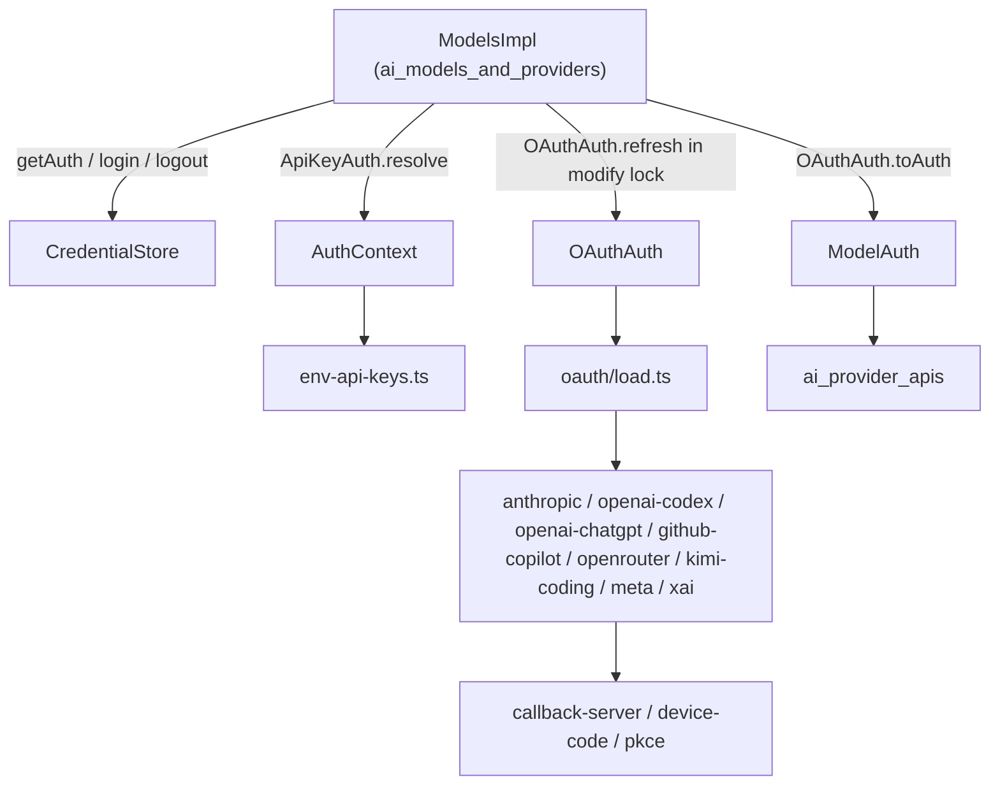
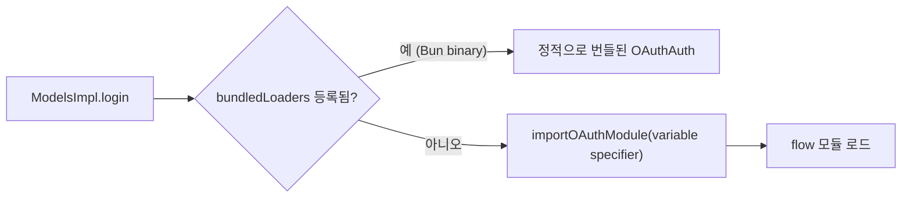
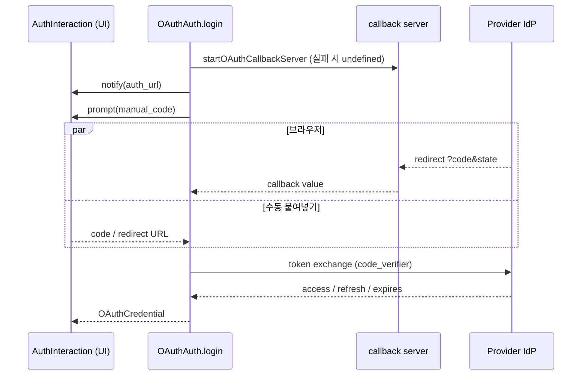
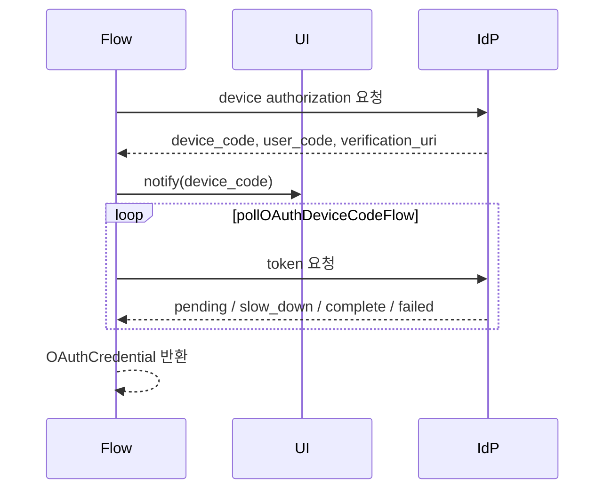
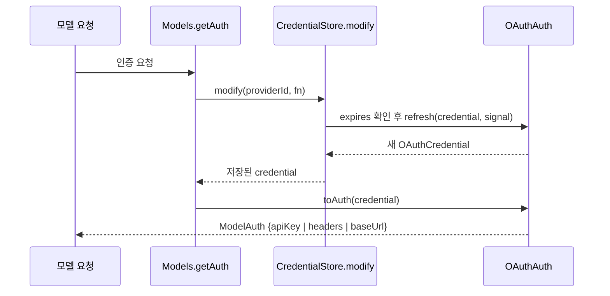

# ai_auth 모듈

`ai_auth`는 `packages/ai`의 **인증(Auth) 계층**이다. 모델 요청 한 건에 필요한 `ModelAuth`(`apiKey` / `headers` / `baseUrl`)를 만들어 내는 타입 계약, 자격 증명 저장소, 환경 변수 기반 API 키 탐색, 그리고 구독형 provider용 OAuth 로그인·갱신 플로우를 담당한다.

상위 모듈: [LLM_Provider_Abstraction_and_Auth](LLM_Provider_Abstraction_and_Auth.md). 이 인증 결과를 소비하는 쪽은 [ai_models_and_providers](ai_models_and_providers.md)(`ModelsImpl.login/logout/checkAuth`)와 [ai_provider_apis](ai_provider_apis.md)이다. 앱 측 영속 저장소는 [model_and_auth_management](model_and_auth_management.md)(`AuthStorage`, `RuntimeCredentials`)에 있다. 로그인 UI는 [interactive_selectors_and_dialogs](interactive_selectors_and_dialogs.md)(`LoginDialogComponent`, `OAuthSelectorComponent`)가 맡는다.

---

## 1. 핵심 타입 계약 (`auth/types.ts`)

| 타입 | 역할 |
|---|---|
| `ModelAuth` | 요청별 인증 결과. `apiKey`, `headers`, `baseUrl` 중 표현 가능한 것만 포함 |
| `Credential` | `ApiKeyCredential`(`type:"api_key"`, `key`, `env`) 또는 `OAuthCredential`(`type:"oauth"`, `refresh`, `access`, `expires` + 추가 필드) |
| `CredentialStore` | `read` / `list` / `modify` / `delete`. 쓰기는 `modify`만 허용(직렬화된 read-modify-write) |
| `AuthContext` | `env(name)`, `fileExists(path)` 주입 가능한 환경 접근 |
| `ApiKeyAuth` | `login?`, `check?`, `resolve` — 저장 키 + 환경(ambient) 소스 병합 |
| `OAuthAuth` | `login`, `refresh`, `toAuth` (+ `name`, `isSubscription`, `loginLabel`) |
| `ProviderAuth` | `apiKey?` / `oauth?` 중 최소 하나 |
| `AuthInteraction` | `prompt(AuthPrompt)`, `notify(AuthEvent)`, `signal` — 로그인 UI 추상화 |

`AuthEvent`는 `info`, `auth_url`, `device_code`, `progress` 네 종류이고, `AuthPrompt`는 `text`, `secret`, `select`, `manual_code` 네 종류다.

핵심 설계: `OAuthAuth`가 `refresh`(네트워크, 새 credential 생성)와 `toAuth`(부작용 없는 요청 인증 도출)로 분리되어 있어서, `Models`가 **저장소 락 안에서** 갱신을 수행하고 저장된 최종 credential로부터 `toAuth`를 호출할 수 있다. 동시 요청이 회전(rotate)된 refresh token을 이중 갱신하는 일을 막기 위한 구조다. (코드 확인: `types.ts` 주석)

---

## 2. 컴포넌트 상세

### 2.1 `context.ts` — `defaultProviderAuthContext`
- `env(name)`: `globalThis.process.env`에서 값을 읽고, 공백뿐인 값은 `undefined`로 취급. 브라우저에선 항상 `undefined`.
- `fileExists(path)`: `node:fs/promises`를 **변수 specifier**(`importNodeModule`)로 동적 import 해서 브라우저 번들러가 node 내장 모듈을 따라가지 않게 한다. 선행 `~`는 `node:os`의 `homedir()`로 치환. 실패 시 `false`.
- `NodeFsModule`, `NodeOsModule`은 동적 import 결과를 좁히는 최소 인터페이스.

### 2.2 `credential-store.ts` — `InMemoryCredentialStore`
기본 구현(앱이 영속 저장소를 주입). provider id당 credential 하나를 `Map`에 보관한다.
- `enqueue()`: provider별 promise chain(`chains`)으로 작업을 직렬화. 이전 작업 실패는 무시(`previous.catch`), `AbortSignal`과 `raceWithAbortSignal`로 취소 지원. chain 꼬리가 자기 자신이면 정리.
- `read` / `list`: 락 없이 즉시 조회. `list`는 `{providerId, type}`만 반환(비밀 노출 없음).
- `modify(providerId, fn)`: 락 안에서 현재 값을 `fn`에 전달, 반환이 `undefined`면 기존 값 유지.
- `delete`: 같은 chain으로 직렬화.

영속 구현은 [model_and_auth_management](model_and_auth_management.md)의 `AuthStorage`(파일 락 `FileAuthStorageBackend`)가 `CredentialStore` 계약을 따른다.

### 2.3 `env-api-keys.ts` — 환경 변수 API 키 탐색
- `getApiKeyEnvVars(provider)`: provider id → 환경 변수 이름 매핑(예: `openai`→`OPENAI_API_KEY`, `google`→`GEMINI_API_KEY`, `github-copilot`→`COPILOT_GITHUB_TOKEN`, `anthropic`→`ANTHROPIC_AUTH_TOKEN`/`ANTHROPIC_OAUTH_TOKEN`/`ANTHROPIC_API_KEY`).
- `findEnvKeys()`: 실제 설정된 API 키 변수 이름 목록. AWS 프로파일·ADC 같은 ambient 소스는 의도적으로 제외.
- `getEnvApiKey()`: 값 반환. Anthropic은 `ANTHROPIC_AUTH_TOKEN`을 건너뛴다(반드시 `Authorization: Bearer`로 전달해야 하므로). `google-vertex`는 ADC 파일 + project + location이 모두 있으면, `amazon-bedrock`은 AWS 자격 증명 소스 중 하나라도 있으면 센티넬 `"<authenticated>"`를 반환.
- `hasVertexAdcCredentials()`: node 모듈 로딩 레이스를 고려 — 로딩 전이면 캐시하지 않고 `false`, 브라우저로 확정될 때만 `false`를 영구 캐시.
- `dynamicImport`: `"node:" + "fs"` 같은 문자열 연결 + 동적 import로 번들러 정적 분석을 회피("NEVER convert to top-level imports" 주석).

### 2.4 OAuth 로더 (`oauth/load.ts`, `bun-oauth.ts`)
OAuth 플로우 모듈은 `node:http`, `node:crypto`에 의존하므로 브라우저 번들에 포함되면 안 된다.
- `importOAuthModule`: 변수 specifier로 import하며, 빌드 산출물(`.js`)이면 `.ts`→`.js`로 치환.
- `loadAnthropicOAuth`, `loadOpenAICodexOAuth`, `loadOpenAIChatGPTOAuth`, `loadGitHubCopilotOAuth`, `loadOpenRouterOAuth`, `loadKimiCodingOAuth`, `loadMetaOAuth`, `loadXaiOAuth`, `loadRadiusOAuth`: 지연 로딩 래퍼.
- `registerBundledOAuthFlowLoaders` / `registerBunOAuthFlows`: 단일 Bun 바이너리에서는 동적 import가 불가하므로 모든 플로우를 정적 import로 묶어 `bundledLoaders`에 등록. 등록되면 로더가 이를 우선 사용.

### 2.5 OAuth 플로우 공용 헬퍼 (제공된 컴포넌트 외, 코드 확인)
- `callback-server.ts`: `startOAuthCallbackServer` — loopback HTTP 서버. 경로·`state` 검증, 중복 처리 방지(`claimed`/`settled`, 409), 에러/타임아웃/abort 시 reject. `waitForCallbackOrManualInput`은 브라우저 콜백과 `manual_code` 프롬프트(SSH/헤드리스에서 redirect URL 붙여넣기)를 경쟁시킨다.
- `device-code.ts`: `pollOAuthDeviceCodeFlow` — RFC 8628 폴링. 기본 간격 5초, 최소 1초, `slow_down` 시 서버 제공 `interval` 우선 아니면 +5초, 만료 시 타임아웃(slow_down이 있었으면 시계 드리프트 안내 메시지).
- `pkce.ts`: `generatePKCE` (verifier/challenge S256).

---

## 3. Provider별 OAuth 플로우

| Provider | 방식 | 저장되는 값 / `toAuth` 결과 |
|---|---|---|
| Anthropic (`anthropic.ts`) | PKCE 브라우저(포트 53692) 또는 copy-code(헤드리스) 선택 | `access`→`apiKey`. `refreshAnthropicToken`이 refresh_token grant, 만료 5분 전 갱신 |
| OpenAI Codex (`openai-codex.ts`) | PKCE 브라우저(포트 1455) 또는 device code | JWT에서 `chatgpt_account_id`를 추출해 `accountId`로 저장. `refreshOpenAICodexToken` |
| OpenAI ChatGPT (`openai-chatgpt.ts`) | 동적 클라이언트 등록 + PKCE, `getDeviceId`로 agent host id(`urn:uuid:`) 전송 | 발급된 `clientId`, `scopes` 저장. `chatgpt.tokens.use.direct` 스코프 필수. `refreshAccessToken` |
| GitHub Copilot (`github-copilot.ts`) | device code, 선택적 Enterprise 도메인 | `refresh`=GitHub 토큰, `access`=Copilot 토큰, `availableModelIds`. `toAuth`가 토큰의 `proxy-ep`에서 `baseUrl` 도출 |
| OpenRouter (`openrouter.ts`) | PKCE, 임시 포트 콜백 + 랜덤 경로 | 영구 키를 `access`에 저장, `expires=Number.MAX_SAFE_INTEGER`, `refresh`는 no-op |
| Kimi Code (`kimi-coding.ts`) | device code | `toAuth`가 `Authorization: Bearer` **헤더** 반환. 갱신 시 429/5xx 재시도(최대 3회), 401/403/`invalid_grant`는 즉시 실패 |
| Meta (`meta.ts`) | device code → identity token → API key mint | `refresh`=identity token, `access`=minted key(약 1일). 갱신=재mint, 401/403이면 재로그인 필요 |
| xAI (`xai.ts`) | device code (https 검증) | `refreshXaiToken`; refresh_token 미회전 시 이전 값 재사용 |

공통 보안 관행(코드 확인):
- verification URI는 브라우저로 열리므로 `http(s)`(xAI는 `https`)만 허용.
- PKCE `state` 불일치 시 거부.
- 만료 시각에 여유(대개 3~5분)를 빼서 요청 도중 만료를 방지.
- abort 시 `"Login cancelled"` 메시지로 통일(UI가 이 문자열로 판별).
- `CLIENT_ID` 일부는 `atob`로 디코딩된 상수.

### 로그인 시퀀스 (브라우저 + 수동 입력 경쟁)

### Device code 시퀀스

---

## 4. 토큰 갱신과 저장 흐름

로그인 완료 후 앱은 `modify(provider.id, async () => credential)`로 저장한다. 갱신 실패가 영구적이면(예: Kimi 401) Models가 credential을 지우고 재로그인을 유도한다(Kimi 코드 주석 근거; Models 쪽 실제 동작은 [ai_models_and_providers](ai_models_and_providers.md)에서 확인 필요 — 미확인).

---

## 5. 환경별 번들링 전략 요약

| 환경 | 방식 |
|---|---|
| Node/Bun 소스 실행 | 변수 specifier 동적 import (`importOAuthModule`, `dynamicImport`) |
| 브라우저/Vite | node 모듈이 정적 그래프에 나타나지 않음, `env`/`fileExists`는 안전한 기본값 |
| Bun standalone 바이너리 | `registerBunOAuthFlows()`가 정적 import로 등록 |

## 6. 확장 시 참고
- 새 OAuth provider 추가: `OAuthAuth` 구현(`login`/`refresh`/`toAuth`) → `load.ts`에 로더 추가 → `bun-oauth.ts` 및 `OAuthFlowLoaders`에 등록.
- 새 환경 변수 provider: `env-api-keys.ts`의 `envMap`에 항목 추가.
- 검증 수준: 위 내용은 제공된 소스 코드 기준 **코드 확인**이며, `callback-server`/`device-code`/`types`는 추가로 직접 읽어 확인했다. `Models` 내부 갱신·삭제 로직은 **미확인**.
