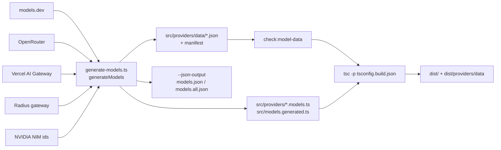

# ai_build_and_model_generation

`packages/ai`(`@earendil-works/pi-ai`)의 **빌드·테스트 설정**과 **모델 카탈로그 생성기**(`scripts/generate-models.ts`)를 다루는 모듈이다. 런타임 provider 로직은 다루지 않으며, 아래 문서를 참고한다.

- [ai_provider_apis](ai_provider_apis.md): `src/api/*` 의 provider별 스트리밍 구현
- [ai_models_and_providers](ai_models_and_providers.md): `src/models.ts`, `src/providers/all.ts`, `model-catalog.ts` 등 카탈로그 소비 측
- [ai_auth](ai_auth.md), [ai_utils](ai_utils.md)

## 구성 파일

| 파일 | 역할 |
|---|---|
| `packages/ai/package.json` | exports 맵, bin(`pi-ai` → `dist/cli.js`), 스크립트, 의존성(`@anthropic-ai/sdk`, `openai`, `@google/genai`, `@aws-sdk/client-bedrock-runtime`, `typebox` 등), `engines.node >=22.19.0` |
| `packages/ai/tsconfig.build.json` | `tsconfig.base.json` 상속, `src/**/*.ts` → `dist`, `NodeNext` 모듈 |
| `packages/ai/vitest.config.ts` | `globals`, node 환경, 30초 타임아웃, `@earendil-works/pi-telemetry` 를 `../telemetry/src/index.ts` 로 alias |
| `packages/ai/scripts/generate-models.ts` | 상위 카탈로그를 수집·정규화해 `src/providers/data/*.json` 과 생성 TS 샤드를 만든다 |

`package.json`의 `sideEffects` 는 `dist/compat.js`, `dist/images.js`, `dist/providers/images/register-builtins.js` 만 지정한다(등록용 부수효과 모듈).

## npm 스크립트와 빌드 흐름

| 스크립트 | 동작 |
|---|---|
| `generate-models` | `node scripts/generate-models.ts --strict` |
| `hydrate-model-data` | `--strict --data-only` (JSON 데이터만 재생성, TS 샤드는 건드리지 않음) |
| `generate-model-catalog` | `--strict --json-only --json-output ../../.artifacts/model-catalog` (배포용 JSON 카탈로그) |
| `check:model-data` | `scripts/check-model-data.ts` 로 데이터 검증 |
| `build` | `generate-models` → `build:offline` |
| `build:offline` | `check:model-data` → `tsc -p tsconfig.build.json` → `dist/providers/data` 를 `src/providers/data` 로 교체 복사 |
| `prepublishOnly` | `clean` + `build` |
| `test` | `vitest --run` |

`build:offline` 은 네트워크 없이 이미 있는 데이터로 빌드한다. `build` 만 상위 API(네트워크)를 호출한다. 루트 `package.json`의 `generate:models`, `hydrate:model-data`, `check:model-data`, `generate:model-catalog` 가 이를 위임하며, CI의 `.github/workflows/publish-model-catalog.yml` 이 JSON 카탈로그를 게시한다(상세는 Build/CI 모듈 참조).

## generate-models.ts 동작

### 1. 옵션: `readGeneratorOptions`
`--strict`(수집 실패 시 throw), `--data-only`, `--json-only`(`--json-output` 필수), `--json-output <dir>`, `--pretty`. `--data-only` 는 JSON 출력과 함께 쓸 수 없다. 모르는 인자는 오류.

### 2. 수집
`generateModels()` 가 순서대로 호출한다.
- `loadModelsDevData()`: `https://models.dev/api.json` 에서 `tool_call === true` 인 모델만 사용. Bedrock, Anthropic, Google/Vertex, OpenAI, Groq, Cerebras, Cloudflare(Workers AI/AI Gateway), xAI, Meta, Z.ai, Mistral, Hugging Face, Fireworks, NVIDIA NIM, Together, Baseten, OpenCode(Zen/Go), GitHub Copilot, MiniMax, Kimi Coding, Moonshot, Xiaomi, Qwen Token Plan 등을 provider별 `api`(예: `anthropic-messages`, `openai-completions`, `openai-responses`, `bedrock-converse-stream`)와 `baseUrl` 로 매핑한다. 일부는 `processZaiModels`, `processBasetenModels`, `processGoogleModels`, `processFireworksModels` 로 분리.
- `loadModelsDevClassifierModels()`: `typesafe/jev-latest` 분류기 모델.
- `fetchOpenRouterModels()`, `fetchAiGatewayModels()`(`AiGatewayModel` 인터페이스 사용, `evaluation` 타입은 classifier 로), `fetchRadiusModels()`, `fetchNvidiaNimModelIds()`(라이브 ID와 교차 확인).

병합 시 models.dev 가 우선이고, 같은 provider/id 는 `??=` 로 먼저 들어온 것이 유지된다.

### 3. 수동 보정
models.dev 에 아직 없거나 틀린 항목을 코드에 직접 둔다: Claude Opus/Sonnet 5.5, Copilot 누락 모델, GPT-5.6/GPT-6 계열 비용(`OPENAI_STANDARD_COSTS`, `withOpenAiLongContextPricing`), DeepSeek, Ant Ling, OpenAI Codex(`openai-codex-responses`), Mistral Medium 3.5, OpenRouter `auto`/`openrouter/fusion`. `openai` provider 의 `openai-responses` 모델은 복제되어 `azure-openai-responses` 모델이 된다. 컨텍스트 윈도 등 임시 override 루프도 여기 있다. 이 부분은 상위 데이터 정정 시 제거 대상이라는 주석이 달려 있다.

### 4. 메타데이터 적용 (모델마다 순차)
`applyOpenAICompletionsCompatMetadata` → `applyAnthropicMessagesCompatMetadata` → `applyModelsDevReasoningOptionMetadata` → `applyThinkingLevelMetadata` → `applyStrictToolCompatMetadata` → `applyOpenAIGrammarToolCompatMetadata` → `applyOpenAIToolSearchMetadata` → `applyOpenAICompletionsTranscriptMetadata` → `applyOpenAIResponsesTranscriptMetadata` → `applyOpenAIExplicitPromptCacheMetadata` → `applyPromptCacheMetadata` → `applyImageInputMetadata`. 이후 `applyAnthropicAllowedFallbackModelMetadata` 로 폴백 모델 목록을 채운다.

- `detectOpenAICompletionsCompat`: provider/baseUrl 로 비표준 서버(z.ai, Together, Moonshot, OpenRouter, Cloudflare, NVIDIA, DeepSeek 등)를 판별해 `supportsStore`, `supportsDeveloperRole`, `maxTokensField`, `thinkingFormat` 등을 결정. `openAICompletionsCompatDelta` 가 기본값(`OPENAI_COMPLETIONS_DEFAULT_COMPAT`)과 다른 필드만 남기고, `mergeOpenAICompletionsCompat` 은 모델의 기존 `compat` 에 병합한다. 명시 값이 감지값보다 우선한다.
- `thinkingLevelMap`: 모델별로 `off/minimal/low/medium/high/xhigh/max` 를 provider 값 또는 `null`(미지원)으로 매핑. models.dev `reasoning_options` 는 `getEffortThinkingLevelMap`(`models-dev-reasoning-options.ts`)이 변환하고, 여기서 검증된 예외를 덮어쓴다.
- `isAnthropicFallbackMetadataModel`: `ANTHROPIC_ALLOWED_FALLBACK_MODELS`(예: `claude-fable-5` → `claude-opus-4-8`, `claude-opus-5`)에 관여하는 직접 Anthropic 모델인지 판정한다.
- `applyPromptCacheMetadata`: 직접 Anthropic 에만 `{ short: 300, long: 3600 }`. 프록시에는 가정하지 않는다.
- `applyImageInputMetadata`: provider별 이미지 한도와 기본 리사이즈(2000px, 4.5 MiB, JPEG 80)를 채운다.

### 5. 출력과 원자성
1. provider별로 `chat` / `image` / `classifier` 카탈로그로 분리(같은 upstream ID가 타입별로 공존 가능).
2. JSON 데이터는 provider → api → `type:id` 구조로 `src/providers/<provider>.json` 대신 `src/providers/data/<provider>.json` 에 쓰며, `createModelDataManifest` 로 manifest 를 만든다.
3. 임시 디렉터리(`.model-generation-*`)에 먼저 쓰고 `validateModelDataDirectory` 검증 후 기존 `data` 를 교체한다. 실패하면 이전 `data`, `*.models.ts`, `models.generated.ts` 를 복원한다(`restoreGeneratedCatalog`).
4. `--data-only` 가 아니면 provider별 `<id>.models.ts`(`flattenChatModelCatalog` 등 호출, [ai_models_and_providers](ai_models_and_providers.md) 의 `model-catalog.ts`)와 집계 파일 `src/models.generated.ts`(`MODELS`, `IMAGE_MODELS`, `CLASSIFIER_MODELS`)를 생성한다.
5. `--json-output` 이면 `models.json`, `models.all.json`, `providers.json`, `providers/<id>.json|.all.json` 을 쓴다.

`src/models.generated.ts` 는 직접 수정하지 말고 이 스크립트를 고친 뒤 재생성한다(저장소 `AGENTS.md` 규칙).

## 설계 포인트 / 주의
- `--strict` 는 상위 API 하나라도 실패하면 빌드를 중단시키고, 비strict 에서는 빈 결과로 계속 진행한다.
- 정책성 상수(ID 집합, 가격, thinking map)가 스크립트에 대량으로 하드코딩되어 있어 새 모델 대응은 대부분 이 파일 수정이다.
- 의존: `../src/api/cloudflare.ts`(Cloudflare base URL), `../src/providers/radius-config.ts`(Radius 게이트웨이), `scripts/model-data.ts`, `openrouter-catalog.ts`, `models-dev-reasoning-options.ts`. 마지막 세 파일과 `check-model-data.ts` 는 이번 입력에 코드가 없어 위 설명은 호출 형태에서 추론한 것이다(미확인).
