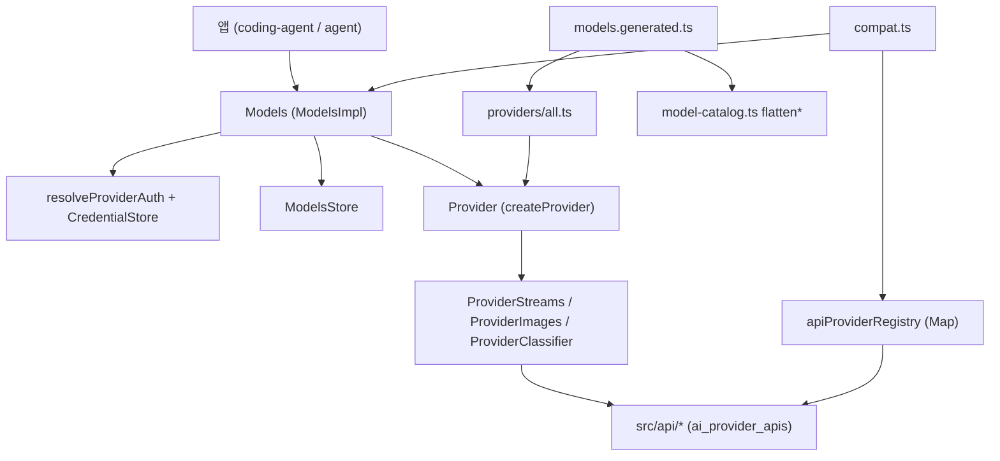
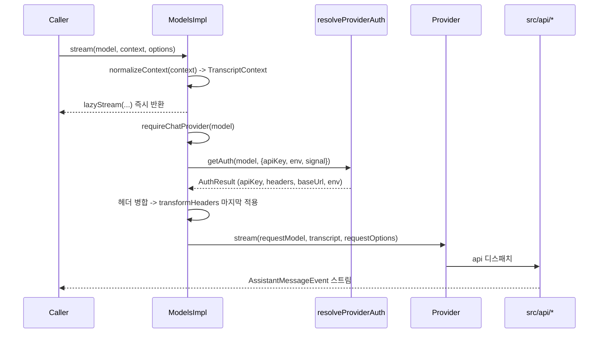
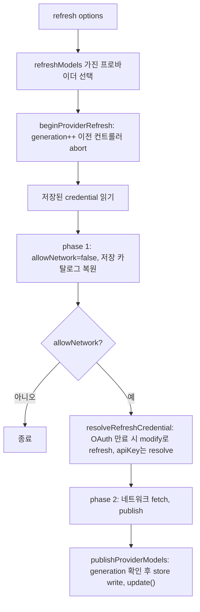

# ai_models_and_providers

`packages/ai`의 **모델·프로바이더 런타임 계층**이다. 모델 카탈로그(채팅/이미지/분류기), `Provider` 추상화, `Models` 컬렉션(인증 적용 + 요청 위임), 내장 프로바이더 등록, 테스트용 faux 프로바이더, 레거시 호환 진입점(`compat.ts`), 개발용 OAuth 로그인 CLI(`cli.ts`)를 포함한다.

실제 HTTP/SDK 호출은 이 모듈이 아니라 [ai_provider_apis](ai_provider_apis.md)가, 자격 증명 해석·OAuth는 [ai_auth](ai_auth.md)가, 이벤트 스트림 등 공통 유틸은 [ai_utils](ai_utils.md)가, 카탈로그 생성은 [ai_build_and_model_generation](ai_build_and_model_generation.md)이 담당한다. 상위 맥락은 [LLM_Provider_Abstraction_and_Auth](LLM_Provider_Abstraction_and_Auth.md)를 참고.

## 1. 구성 요소

| 파일 | 역할 |
|---|---|
| `packages/ai/src/types.ts` | 핵심 타입: `Api`, `Model`, `ImageModel`, `ClassifierModel`, `BaseModel`, `Context`/`TranscriptContext`, `AssistantMessage`, `AssistantMessageEvent`, `StreamOptions`, `ApiOptionsMap`, Classifier 질문/답변 타입, 각 API별 `*Compat` |
| `packages/ai/src/models.ts` | `Provider` 인터페이스, `Models`/`MutableModels`, `ModelsImpl`, `createModels`, `createProvider`, `hasApi`, `calculateCost`, `clampThinkingLevel` 등 |
| `packages/ai/src/models-store.ts` | `ModelsStore` 인터페이스, `InMemoryModelsStore` (원격 카탈로그 캐시: `etag`, `lastModified`, `checkedAt`) |
| `packages/ai/src/model-catalog.ts` | 생성된 카탈로그 그룹을 `flattenChatModelCatalog` / `flattenImageModelCatalog` / `flattenClassifierModelCatalog`로 타입별 평탄화 |
| `packages/ai/src/providers/all.ts` | 42개 내장 프로바이더 팩토리 호출(`builtinProviders`), `builtinModels`, `getBuiltinModel`/`getBuiltinImageModel`/`getBuiltinClassifierModel`, `getAllBuiltinModels` |
| `packages/ai/src/providers/faux.ts` | 테스트용 스크립트 응답 프로바이더 (`fauxProvider`, `fauxAssistantMessage`, `fauxThinking`, `fauxToolCall`) |
| `packages/ai/src/providers/radius-config.ts` | Radius 게이트웨이 설정 검증/모델 변환 (`isRadiusGatewayModel`, `loadRadiusGatewayConfig`) |
| `packages/ai/src/providers/images/register-builtins.ts` | `openrouter-images` 이미지 API를 레지스트리에 lazy 등록 |
| `packages/ai/src/image-models.ts`, `images.ts` | 레거시 이미지 모델 조회, 전역 `generateImages` |
| `packages/ai/src/compat.ts` | 구 전역 API 호환 (`stream`, `complete`, `registerApiProvider`, `registerFauxProvider`, `getApiProviders`) |
| `packages/ai/src/cli.ts` | `npx @earendil-works/pi-ai login|list` OAuth 로그인 개발용 CLI |

## 2. 아키텍처

핵심 설계: **Provider는 요청 동작을 소유하고, `Models`는 인증 해석 후 위임만 한다.** 모델은 `type`(`chat` 기본 / `image` / `classifier`)으로 구분되며 각각 다른 연산(`stream*`, `generateImages`, `classify`)에서만 허용된다(`assertChatModel` 등).

## 3. `Provider`와 `createProvider`

`Provider<TApi>`는 `id`, `name`, 필수 `auth`(`apiKey`/`oauth` 중 최소 하나), 동기 `getModels()`/`getAllModels?()`, 선택적 `refreshModels`, `filterModels`/`filterAllModels`, `stream`/`streamSimple`, `fetchDeferred`/`cancelDeferred`, `generateImages`, `classify`를 가진다.

`createProvider(input)`는 내장 프로바이더와 `models.json` 커스텀 프로바이더가 공통으로 쓰는 조립기다.
- `api`: 단일 `ProviderStreams` 또는 `model.api`로 디스패치하는 맵. 맵에 없는 api는 `ModelsError("stream")`를 스트림 오류로 반환.
- `images`, `classifiers`: `model.api` 키 맵. 구현이 하나도 없으면 생성 시 예외.
- `models`(정적 기준선) + `fetchModels`(동적 오버레이): `type`+`id`가 같으면 오버레이가 덮어씀. 알 수 없는 타입 모델은 `hasKnownModelType`으로 버림(신버전 저장 데이터 호환).
- `refreshModels`는 먼저 `context.stored`를 복원(오프라인 가능)한 뒤, 네트워크 허용 시 `fetchModels` 결과를 `publish({persist, update})`한다.

## 4. `ModelsImpl` 동작

### 4.1 요청 경로 (`stream` / `streamSimple` 등)

`applyAuth`의 규칙:
- 요청 옵션의 `apiKey`/`headers`가 필드별로 우선. 모델 `headers`는 `getAuth(model)`에서 병합.
- `mergeHeaders`는 대소문자 무시로 덮어쓰며, `null` 값은 기본 헤더 제거를 의미.
- `auth.baseUrl`이 있으면 `requestModel.baseUrl` 교체. `transformHeaders`는 Models 전용이며 프로바이더로 전달되지 않음.
- 인증이 없으면 `ModelsError("auth", "Provider is not configured: ...")`가 **스트림 오류**로 나온다.
- `generateImages`/`classify`는 **절대 reject하지 않고** 오류 결과(`imageErrorResult`/`classifierErrorResult`)를 반환.

### 4.2 모델 조회

- 비인증 조회: `getModels`, `getModel`, `getModelsOfType`, `getModelOfType`, `getAllModels` — 프로바이더가 throw해도 빈 목록(best-effort).
- 인증 기반: `checkAuth`, `getAvailable`, `getAvailableOfType`, `getAllAvailable` — 인증이 완료된 프로바이더만 포함하고 `filterModels`/`filterAllModels` 정책 적용.
- `hasApi(model, api)`: 동적 조회 모델을 `Model<TApi>`로 좁히는 타입 가드(비채팅 모델은 불일치).

### 4.3 refresh (동적 카탈로그)

동시성 보호: 프로바이더별 `refreshGenerations`와 `AbortController`로 이전 refresh를 무효화(`setProvider`/`deleteProvider`도 포함), `publicationChains`로 발행을 직렬화하고 abort/세대 불일치 시 `false`를 반환해 낡은 결과가 상태를 덮지 않게 한다. 오류는 reject 대신 `ModelsRefreshResult.errors`로 모은다.

### 4.4 login / logout

`login`은 프로바이더의 `oauth`/`apiKey`의 `login`을 실행하고 `credentials.modify`로 저장한다. abort 시 mutation이 시작 전이면 취소되고, 저장소 실패는 `ModelsError("auth")`로 감싼다. `logout`은 `credentials.delete`.

## 5. 비용·사고 수준 유틸 (`models.ts`)

- `calculateCost(model, usage)`: 입력 토큰(`input+cacheRead+cacheWrite`)이 `cost.tiers`의 `inputTokensAbove`를 넘는 가장 높은 구간 요율 적용. 1시간 캐시 쓰기(`cacheWrite1h`)는 input의 2배 요율.
- `getSupportedThinkingLevels`/`clampThinkingLevel`: `thinkingLevelMap`에서 `null`은 미지원, `xhigh`/`max`는 명시 매핑이 있어야 지원. 요청 수준이 불가하면 위쪽 → 아래쪽 순으로 가장 가까운 수준 선택.
- `modelsAreEqual`: type+id+provider 비교.

## 6. 카탈로그와 내장 프로바이더

- `models.generated.ts`(`MODELS`, `IMAGE_MODELS`, `CLASSIFIER_MODELS`)는 **직접 수정 금지**이며 `packages/ai/scripts/generate-models.ts`로 생성한다([ai_build_and_model_generation](ai_build_and_model_generation.md)).
- `builtinProviders()`는 Bedrock, Anthropic, OpenAI, Google/Vertex, Azure, Codex, GitHub Copilot, OpenRouter, Mistral, Radius, Typesafe 등 매 호출마다 새로 생성하고, `builtinModels(options)`는 이를 `createModels`에 `setProvider`로 등록한다.
- `getBuiltin*` 계열은 카탈로그의 정적 타입 조회이며 `getBuiltinModelDataGeneratedAt()`은 `data/.manifest.json`의 생성 시각을 제공한다.
- Radius: `loadRadiusGatewayConfig`가 `/v1/config`를 조회, `isRadiusGatewayModel`로 응답 모델을 검증해 `pi-messages` API 모델로 변환한다(기본 게이트웨이 `https://radius.pi.dev`).

## 7. Faux 프로바이더

`fauxProvider(options)`는 `setResponses`/`appendResponses`로 큐잉한 `AssistantMessage`(또는 팩토리)를 토큰 크기 단위로 쪼개 이벤트(`text_delta`, `thinking_delta`, `toolcall_delta` 등)로 재생한다.
- 큐 소진 시 `"No more faux responses queued"` 오류 메시지.
- `tokensPerSecond`로 지연, `signal` abort 시 `stopReason: "aborted"`.
- `sessionId`가 있으면 직전 프롬프트와의 공통 접두사로 `cacheRead`/`cacheWrite` 사용량을 추정.
- `deferred` 옵션으로 지연 응답 핸들(`pendingFetches`, `pollAfterMs`)과 `fetchDeferred`/`cancelDeferred` 시뮬레이션.
- 테스트 규칙: coding-agent의 `test/suite/harness.ts`와 함께 사용(실제 API 금지).

## 8. 호환 계층 `compat.ts`

`@earendil-works/pi-ai/compat`는 구 전역 API를 유지한다(coding-agent ModelManager 이전 시 삭제 예정).
- `apiProviderRegistry`(api id → 스트림 구현)와 `registerApiProvider`, `unregisterApiProviders(sourceId)`, `resetApiProviders`. `wrapStream`은 `model.api` 불일치 시 `Mismatched api` 예외.
- `registerBuiltInApiProviders`는 기존 오버라이드를 덮지 않고 10개 내장 API를 lazy 래퍼로 등록.
- `stream`/`streamSimple`: 내장 프로바이더가 담당하는 모델은 `compatModels`로, 아니면 레지스트리로 디스패치하며 `withEnvApiKey`가 `getEnvApiKey`로 환경 변수 키를 주입(`<authenticated>` 마커는 제외). `cloudflare-*`는 인증이 없으면 `Models` 경로로 우회.
- `getModel`/`getModels`/`getProviders`는 `getBuiltin*`의 deprecated 별칭, `registerFauxProvider`는 레지스트리용 faux.
- 이미지: `images.ts`의 `generateImages`는 `images-api-registry`에서 `model.api`로 디스패치(인증은 `options.apiKey` 명시 필요). `providers/images/register-builtins.ts`는 `openrouter-images` 모듈을 최초 호출 시 동적 import하고 로드 실패를 오류 `AssistantImages`로 변환.

## 9. 개발용 CLI (`cli.ts`)

`login [provider]`, `list`, `help`. `builtinProviders()` 중 `auth.oauth`가 있는 것만 대상. `AuthPrompt`(select/입력)와 `notify`(`auth_url`, `device_code`, `info`, `progress`) 이벤트를 콘솔로 처리하고, 결과 `OAuthCredential`을 현재 디렉터리 `auth.json`에 저장한다(설치 ID는 유지하지 않고 `randomUUID`를 `getDeviceId`로 사용). 실패 시 `Error:` 출력 후 `exit(1)`.

## 10. 타입 계약 요약

- 스트림 이벤트 프로토콜: `start` → (`*_start`/`*_delta`/`*_end`)* → `done` | `error`. `partial`은 공유 라이브 객체. 직접 `streamSimple()` 호출은 인증 누락 시 동기 throw 가능, 스트림 반환 후 오류는 `stopReason: "error"|"aborted"` 메시지로 인코딩.
- `TranscriptContext`는 브랜드 타입으로 `normalizeContext()`만 생성 가능하여, 원시 `Context`가 프로바이더에 도달하지 않음. 시스템 프롬프트·도구는 선두 `SystemMessage`로 접히고, 이후 시스템 메시지가 `sections`/`toolsAdded`/`toolsRemoved`로 갱신.
- `Model.compat`은 `Api`별로 조건 타입(`OpenAICompletionsCompat`, `OpenAIResponsesCompat`, `AnthropicMessagesCompat`, `BedrockCompat`, `MistralConversationsCompat`)이 결정.
- 분류기: `ClassifierQuestion`(choice/score/bool) → `ClassifierAnswer`(확률·신뢰도 포함).

## 11. 상위 소비자

[agent_runtime](agent_runtime.md)와 [model_and_auth_management](model_and_auth_management.md)(`ModelRegistry`, `ModelRuntime`)가 `Models`를 래핑해 사용하며, 대화 루프는 [Agent_Loop_and_Session_Core](Agent_Loop_and_Session_Core.md)에서 이 모듈의 `streamSimple`/`completeSimple`을 호출한다.

*검증 수준: 제공된 소스 코드 기준 코드 확인. 하위 API 구현 세부는 하위 문서 참조.*
